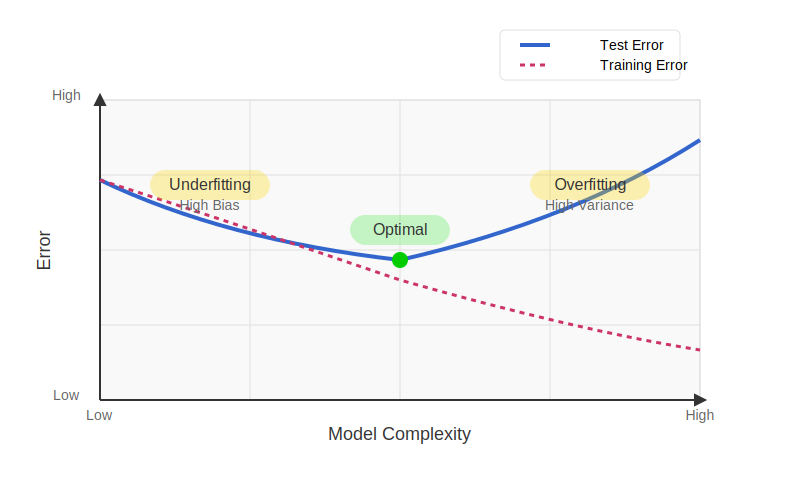
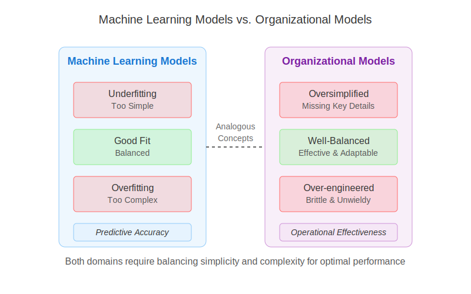
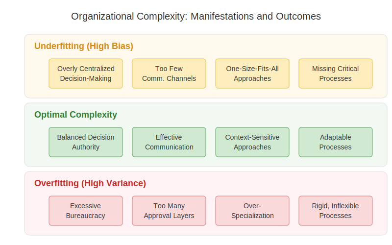

# 1. Introduction

## Table of Contents
- [1.1 Understanding Underfitting and Overfitting](#underfitting-and-overfitting)
- [1.2 Purpose and Scope](#purpose-and-scope)
- [1.3 Core Analogy](#core-analogy)
- [1.4 Manifestations in Practice](#manifestations-in-practice)

This work explores how the concepts of overfitting and underfitting, originally from machine learning and
mathematical modeling, can offer valuable insights into challenges faced in organizational structures and
software development processes. Drawing on my background in software engineering, I use these concepts as
an analytical lens to examine parallels across these domains.

By mapping the dynamics of machine learning models onto organizational and software systems, we can uncover
shared patterns and constraints. The central thesis is that both domains grapple with the same fundamental
tension: balancing simplicity and complexity. Insights from one field can often clarify or reframe challenges
in the other.

***

## 1.1 Understanding Underfitting and Overfitting

In the realm of machine learning and general modeling, the concepts of
[underfitting and overfitting](https://www.ibm.com/think/topics/overfitting-vs-underfitting) represent two
fundamental challenges in creating effective representations of data and predicting future outcomes.

**Underfitting** occurs when a model is too simplistic in its assumptions and structure, leading to a **high bias** and
low variance. This means the model makes strong, often incorrect assumptions about the underlying relationships in the
data, causing it to miss important patterns and resulting in poor performance on both the training data used to build
the model and unseen test data meant to evaluate its generalizability. Such models lack the complexity required to adapt
to the nuances of the data, leading to high error rates and an inability to make accurate predictions.

<figure>
  
  <figcaption>Figure 1.1: The U-shaped relationship between model complexity and error rates</figcaption>
</figure>
  

Conversely, **overfitting** arises when a model becomes excessively complex, learning not only the underlying patterns
in the training data but also the noise, random fluctuations, and specific details that are unique to that particular
dataset. This results in a model with **low bias** and high variance, performing exceptionally well on the training data
it has \"memorized\" but failing to generalize effectively to new, unseen data. These models become too tailored to the
specific intricacies of the training set, including its irrelevant information, making them brittle and unreliable for
real-world applications. The key challenge is to strike a balance, creating a model complex enough to capture essential
patterns without learning the noise.

## 1.2 Purpose and Scope

This series of chapters aims to apply these machine learning concepts as analogies to describe phenomena in software
development models (specifically **time estimation**, which functions as a predictive model forecasting duration,
effort, and cost) and **organizational structures** (which can be viewed as models representing communication patterns,
hierarchies, and responsibilities). Furthermore, it will explore the implications of these analogies across various
dimensions, including:

- Stakeholder preferences
- The influence of organizational size and type on modeling approaches
- Connections to related theoretical concepts like long-tail distributions and dissipative systems theory
- A context-specific case study in medical information systems, considering the idea of "strategic overfitting" and
  modular design

Furthermore, the recent and rapid integration of **Artificial Intelligence (AI) assistants and agents**
[into organizational workflows](https://www.wired.com/story/artificial-intelligence-work-organizational-strategy/)
presents a significant new factor influencing these dynamics. While the core analogies explored in this publication
remain relevant, AI introduces novel complexities and capabilities that challenge traditional models of work, communication,
and structure. The impact of AI will be touched upon contextually within relevant chapters, with a dedicated and
comprehensive exploration provided in Chapters 8 and 9.

Underpinning some of these explorations will be ideas related to [system dynamics](https://en.wikipedia.org/wiki/System_dynamics),
[feedback](https://en.wikipedia.org/wiki/Feedback), and adaptation, drawing inspiration from fields like [cybernetics](https://en.wikipedia.org/wiki/Cybernetics) to better
understand how these systems regulate themselves and interact with their environment.

## 1.3 Core Analogy

The fundamental idea behind the core analogy is that both machine learning models and models in software development and
organizational design are attempts to represent complex realities. Organizational structures, often depicted as charts
or processes, are simplified representations of complex social systems. Similarly, software time estimation functions as
a predictive model forecasting outcomes based on available information.

Just as a machine learning model needs to strike a balance between capturing the underlying signal and not fitting the
noise in data, software development models and organizational structures must balance simplicity and complexity to
effectively represent and operate within their respective domains. Approaches like **[Domain-Driven Design
(DDD)](https://learn.microsoft.com/en-us/archive/msdn-magazine/2009/february/best-practice-an-introduction-to-domain-driven-design)**,
particularly relevant in the software context explored in this report, offer specific strategies and patterns focused on
managing domain complexity to achieve this balance. Furthermore, the inherent relationship between an organization's
communication structure and the design of the systems it creates, often referred to as **[Conway's
Law](https://martinfowler.com/bliki/ConwaysLaw.html)**, provides a critical lens for understanding how organizational
models directly impact software architecture, a theme explored within this report.

<figure>  <figcaption>Figure 1.2: Analogous concepts between machine learning and organizational
models</figcaption> </figure>
  

***

## 1.4 Manifestations in Practice

<figure>  <figcaption>Figure 1.3: Real-world manifestations of
underfitting and overfitting in organizational contexts</figcaption> </figure>
   

Overly simplistic models (underfitting) might fail to account for critical details and variations. For example, an
underfitted organizational structure might lack necessary specialization or communication channels, leading to
inefficiencies. An underfitted time estimation model might overlook key factors like scope or risks, resulting in
inaccurate predictions.

Conversely, overly complex models (overfitting) could become unwieldy, difficult to manage, and brittle when faced with
new situations. An overfitted organizational structure might manifest as excessive bureaucracy, hindering agility. An
overfitted estimation model might rely too heavily on specific past project details, failing to generalize.

[Back to Table of Contents](../README.md) 
