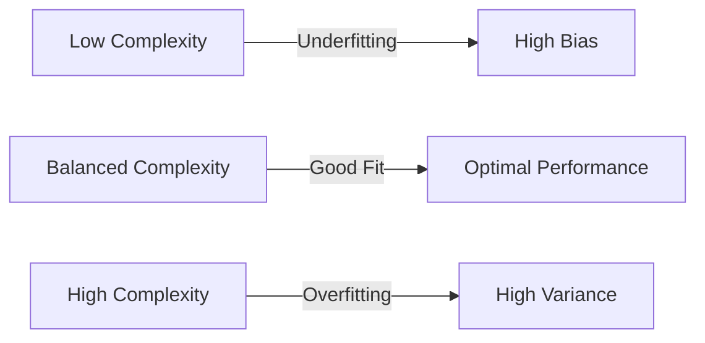
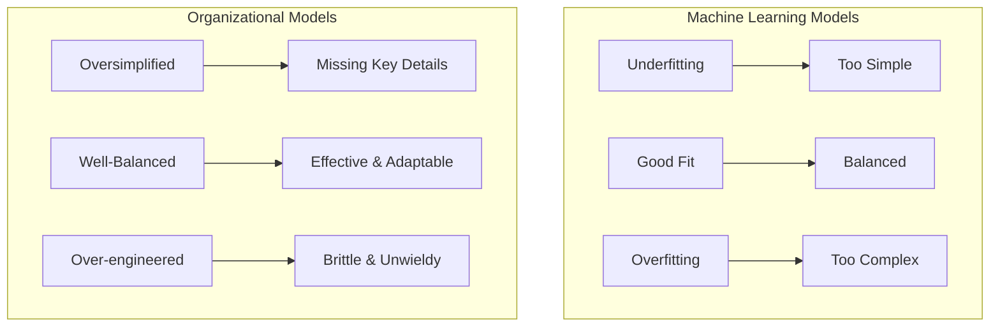
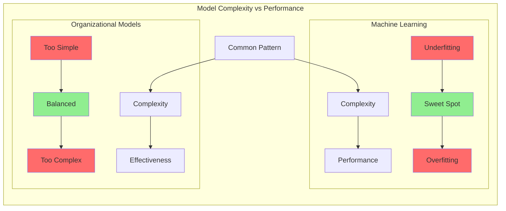

# 1. Introduction

In the realm of machine learning, the concepts of underfitting and overfitting are fundamental to building effective predictive models.
**Underfitting** occurs when a model is too simplistic, failing to capture the underlying patterns in the data, resulting in high bias and
poor performance even on the training data. Such models lack the complexity required to adapt to the nuances of the data.

Conversely, **overfitting** happens when a model is excessively complex, memorizing the training data, including its noise and outliers,
leading to low bias on the training data but poor generalization to new, unseen data, indicating high variance. These models become too
tailored to the specific training set and lose their ability to make accurate predictions on new, real-world data.

- [Overfitting vs. underfitting](https://www.ibm.com/think/topics/overfitting-vs-underfitting) [IBM Think]

## Purpose and Scope

This report aims to investigate the validity and evidence base for applying these machine learning concepts as analogies to describe phenomena
in software development models, specifically time estimation, and organizational structures. Furthermore, it will explore the implications of
these analogies across various dimensions, including:

- Stakeholder preferences
- The influence of organizational size and type on modeling approaches
- Connections to related theoretical concepts like long-tail distributions and dissipative systems theory
- A context-specific case study in medical information systems, considering the idea of "strategic overfitting" and modular design

## Core Analogy

The fundamental idea behind this analogy is that both machine learning models and models in software development and organizational design are
attempts to represent complex realities. Just as a machine learning model needs to strike a balance between capturing the underlying signal and
not fitting the noise in data, software development models and organizational structures must balance simplicity and complexity to effectively
represent and operate within their respective domains.

Overly simplistic models might fail to account for critical details and variations, leading to inaccuracies and poor performance, while overly complex
ones could become unwieldy, difficult to manage, and brittle when faced with new situations.

[Back to Table of Contents](../README.md) 
