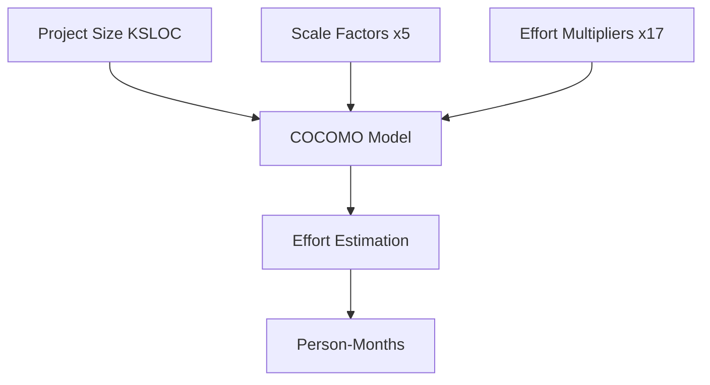
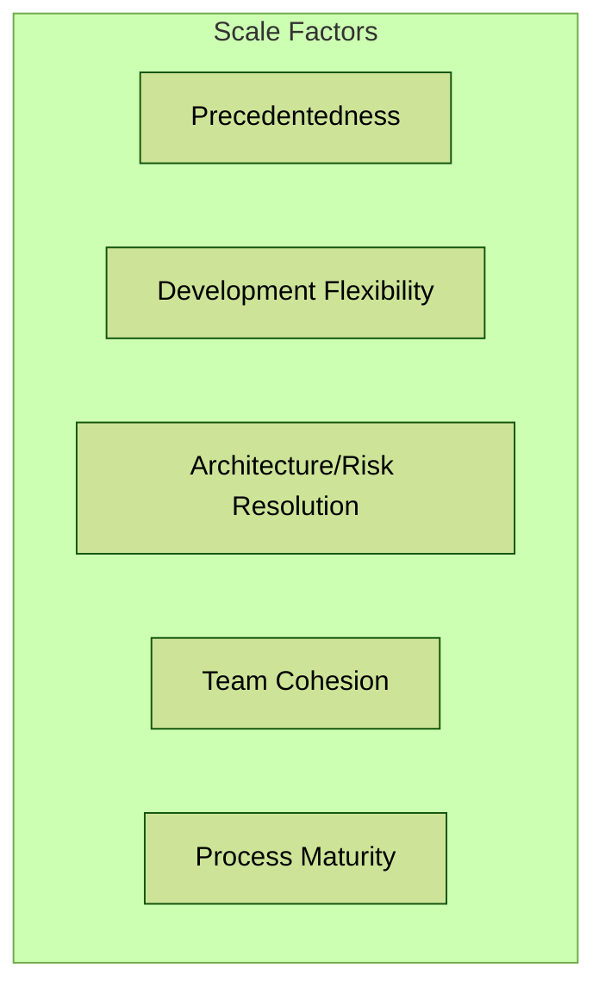
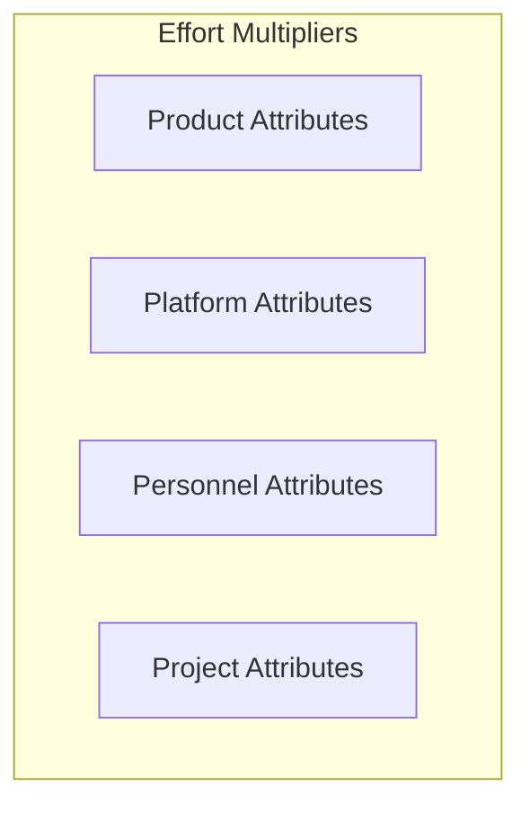
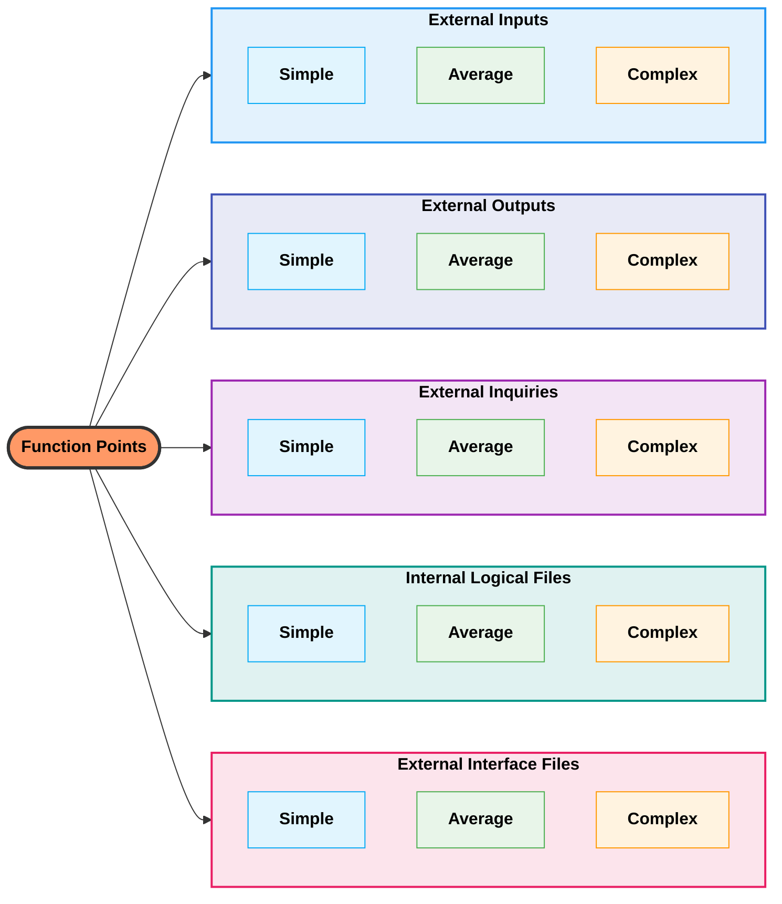
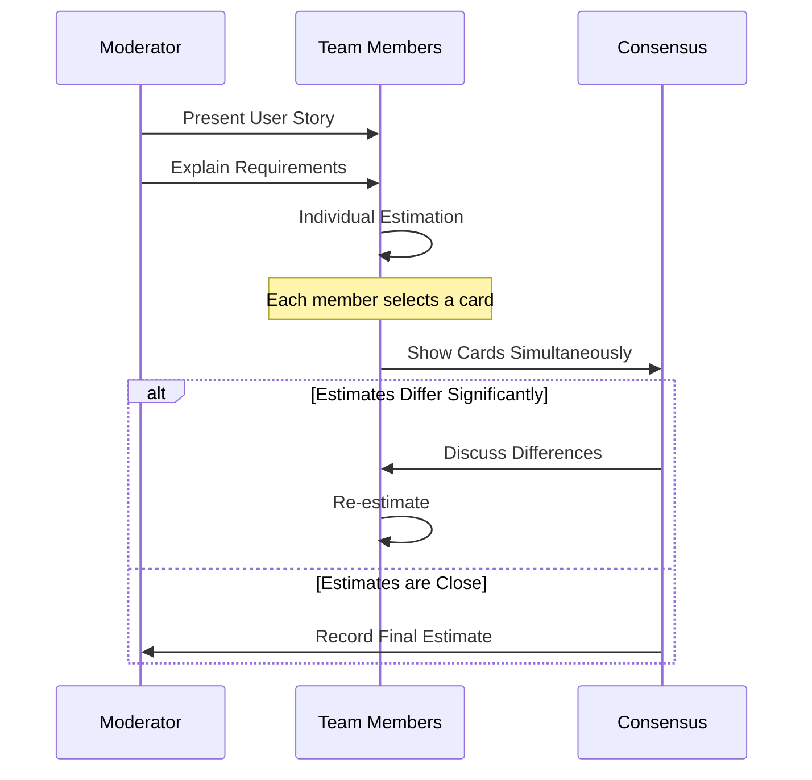
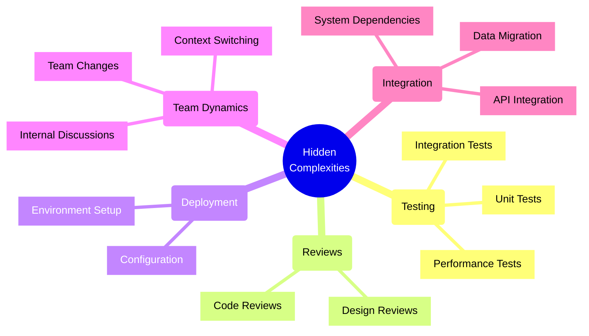
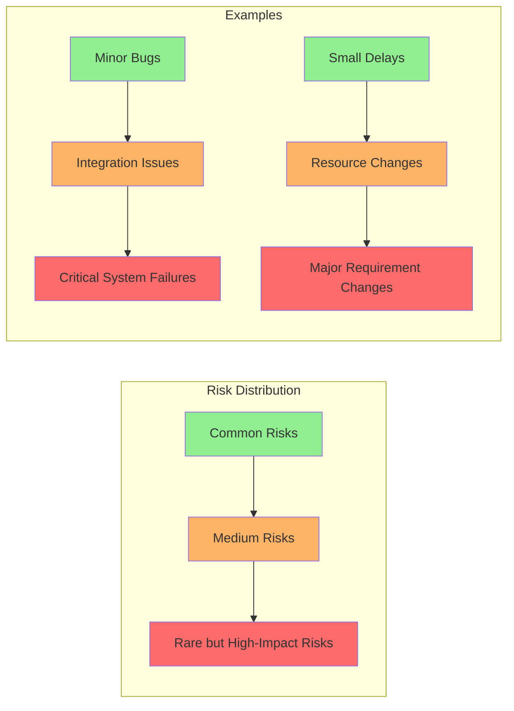

# 2. Underfitting and Overfitting in Software Time Estimation

## 2.1 Time Estimation as a Modeling Problem

Software time estimation operates as a predictive model that aims to forecast the duration and effort required to complete a software development project. Various estimation techniques, including the use of historical data from past projects, the application of expert judgment, and structured methods like Planning Poker and algorithmic models such as COCOMO, are employed to create this predictive model.

These methods take into account various inputs, such as the size and complexity of the software, the experience and skills of the development team, and the technological environment, to produce an estimate of the effort in person-hours or person-months and the duration of the project. However, these estimation models are inherently subject to various biases, uncertainties, and the dynamic nature of software development itself.

Factors like evolving requirements, unforeseen technical challenges, and the inherent difficulty in accurately predicting human effort contribute to the imperfection of these predictive models. Therefore, software time estimation can be understood as a complex modeling problem that attempts to predict a future outcome under conditions of uncertainty. This perspective highlights why estimation techniques are susceptible to both underfitting (oversimplification, missing key risks) and overfitting (overly reliant on specific past data that doesn't generalize).

## 2.2 Analysis of Common Software Time Estimation Models

### COCOMO (Constructive Cost Model)

[**COCOMO**](https://en.wikipedia.org/wiki/COCOMO) is a well-known [regression](https://en.wikipedia.org/wiki/Regression_analysis)-based algorithmic
technique used for estimating software costs. It employs the size of the project, typically measured in Kilo Source Lines of Code (KSLOC), along
with a set of cost drivers, including 5 scale factors and 17 effort multipliers, to estimate the total effort required in person-months.

A potential limitation of COCOMO is that the values of its parameter coefficients are often constant for similar types of projects.
This assumption of uniformity might lead to underfitting, as the model may fail to capture the significant variations that can
exist between different organizations or even between different projects within the same organization.

<!-- TODO: Add visualization of COCOMO estimation vs actual effort scatter plot -->

The difficulty in establishing a single, universally applicable parametric model suggests an inherent risk of oversimplification.
Research indicates that
[integrating COCOMO with Artificial Neural Networks (ANN)](https://www.researchgate.net/publication/386371108_ANN-based_software_cost_estimation_with_input_from_COCOMO_CANN_model)
can yield improved results, implying that COCOMO's standalone model might not fully account for the complex relationships between its parameters.

### Function Points (FPs)

[Function Points](https://en.wikipedia.org/wiki/Function_point) offer a measure of software size that is independent
of the programming language or implementation details. This method focuses on quantifying the functionality delivered
to the customer by considering five user function types:
- External inputs
- External outputs
- External inquiries
- Internal logical files
- External interface files

Each is categorized by complexity and adjusted using 14 general system characteristics.

While aiming for an objective measure, the process of defining and weighting these function points involves a degree of subjectivity. This subjectivity, coupled with the risk of developing overly complex models based on limited data or chance occurrences, raises the potential for overfitting. Criticisms of Function Points include its "black box" view of the system, its potential lack of suitability for modern technologies, oversimplified complexity classifications, and the subjective nature of weight assignments. These limitations suggest that estimations based on Function Points might become too specific to past projects or individual interpretations, potentially overfitting the data used to derive them and hindering generalization to new projects with different characteristics.

### Planning Poker

Planning Poker is a widely used consensus-based agile estimation technique that employs story points as relative units of effort or complexity. In this method, the development team discusses user stories or tasks, and each member anonymously votes using cards with values from a modified Fibonacci sequence.  The team then discusses any significant discrepancies in the estimates to reach a consensus.

While Planning Poker fosters team collaboration and shared understanding, its reliance on abstract units like story points, which are not directly tied to time or resources, can lead to underfitting. The process also carries the risk of "groupthink" or pressure to conform to certain estimates, potentially overlooking individual complexities or risks. Research indicates that accurately estimating hours using Planning Poker can be challenging, as it is more effective for relative comparisons. Teams sometimes defaulting to a single value for story points might also indicate an underestimation of the true effort involved. Furthermore, the influence of senior
team members or the desire to avoid conflict can lead to estimates that do not fully reflect the perceived difficulty of a task.

### Expert Judgment

Expert judgment involves leveraging the knowledge and experience of specialists to estimate project details. This approach is particularly useful when empirical data is scarce or for tackling complex, ill-defined problems.

However, expert judgment is highly susceptible to various cognitive biases, which can lead to both underfitting and overfitting:
- Optimism bias might cause experts to underestimate the effort required
- Anchoring bias could lead to estimates being unduly influenced by initial figures
- Overconfidence can result in experts overlooking potential challenges or the need for more detailed analysis, leading to overfitting.

Conversely, experts might rely too heavily on specific past experiences that are not entirely relevant to the current project, potentially leading to overfitting by incorporating unnecessary details or inflating estimates. Studies have shown a significant degree of inconsistency in expert judgment-based effort estimates, highlighting the unreliability of this method when used in isolation.

### 2.2.5 Artificial Intelligence in Estimation: Potential and Pitfalls

The integration of Artificial Intelligence (AI) presents both potential avenues and new complexities for software time estimation, linking directly to the challenges of model fitting discussed throughout this chapter. As explored conceptually in Chapter 8, AI tools, especially machine learning models, are often proposed as means to mitigate the *underfitting* seen in traditional methods. By analyzing large historical datasets (potentially including code metrics, team dynamics, and past performance), AI *aims* to identify complex patterns and dependencies that might be overlooked by simpler models or subjective human judgment.

However, applying AI to estimation introduces significant risks and potential new forms of model error:
*   **Overfitting to Biased Data:** If the historical data used to train AI models contains systemic biases (e.g., consistently optimistic past estimates, data skewed towards certain project types or team compositions), the AI model may simply learn and perpetuate these biases, effectively *overfitting* to a flawed representation of reality. This can lead to estimates that are consistently inaccurate in predictable ways.
*   **Underfitting due to Opacity:** The "black box" nature of some sophisticated AI models can hinder understanding and trust. If estimators cannot discern *why* an AI produced a certain figure, they may struggle to integrate it effectively with other factors or identify when the AI's context is inappropriate, potentially leading to *underfitting* the true project risks or even under-reliance on potentially useful AI insights.
*   **Uncertainty of Net Impact:** Critically, the actual net effect of current AI assistance on overall project duration remains highly uncertain. While AI might automate specific estimation tasks or provide novel insights, it also introduces new overheads related to data preparation, model training, prompt engineering, verification of AI outputs, and managing potential AI errors. Quantifying whether these tools consistently lead to faster or more reliable project completion in practice is an ongoing challenge.

Therefore, while AI offers intriguing possibilities for data analysis in estimation, its application requires rigorous attention to data quality, model transparency, bias mitigation, and a realistic assessment of its current capabilities and limitations within the broader context of project uncertainty.

## 2.3 Evidence for Underfitting in Classical Models

Classical software estimation models often exhibit a tendency towards underfitting by failing to fully capture the unique complexities and variability inherent in software projects. Many hidden complexities are frequently overlooked during the initial estimation phase, leading to an oversimplified view of the project lifecycle, including:

- Time required for thorough testing
- Code reviews
- Deployment
- Integration
- Context-switching between different tasks or projects
- Impact of team changes and internal controversies
- Increased uncertainty associated with novel work

The common practice of multiplying initial software estimates by a factor (e.g., by 3, as suggested in [[??]]) underscores the widespread recognition that initial estimates tend to be overly optimistic and often fall short of the actual time required.

### Long Tail of Software Project Risks

Furthermore, simplified estimation models often fail to account for the "[long tail](06-theoretical-concepts.md)" of software project risks. The "long tail" refers to the distribution of risks where a large number of less frequent but potentially high-impact events can occur alongside the more common risks.

<!-- TODO: Add visualization of long-tail distribution in software project risks -->

These might include:
- Rare technical glitches
- Unexpected dependencies on other teams or systems
- Significant changes in requirements late in the project

Estimation models that primarily focus on typical tasks and average scenarios often fail to incorporate contingencies for these "long-tail" risks, leading to underestimation of the overall project effort and potential for delays when these unforeseen events materialize.

[Back to Table of Contents](../README.md) 
