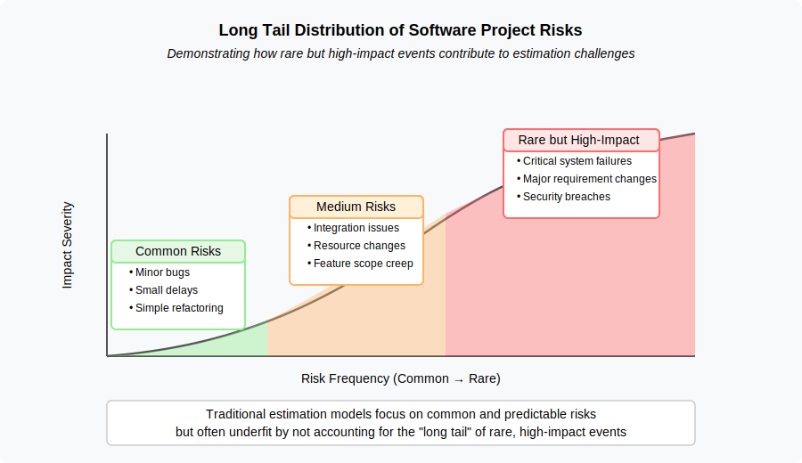

# 2. Underfitting and Overfitting in Software Time Estimation

## Table of Contents
- [2.1 Time Estimation as a Modeling Problem](#21-time-estimation-as-a-modeling-problem)
- [2.2 Analysis of Common Software Time Estimation Models](#22-analysis-of-common-software-time-estimation-models)
  - [COCOMO (Constructive Cost Model)](#cocomo-constructive-cost-model)
  - [Function Points (FPs)](#function-points-fps)
  - [Planning Poker](#planning-poker)
  - [Expert Judgment](#expert-judgment)
  - [Estimating AI-Assisted Development: New Uncertainties](#225-estimating-ai-assisted-development-new-uncertainties)
- [2.3 Evidence for Underfitting in Classical Models](#23-evidence-for-underfitting-in-classical-models)
  - [Long Tail of Software Project Risks](#long-tail-of-software-project-risks)

## 2.1 Time Estimation as a Modeling Problem

Software time estimation operates as a predictive model that aims to forecast the duration and effort required to complete a software development project. Various estimation techniques, including the use of historical data from past projects, the application of expert judgment, and structured methods like Planning Poker and algorithmic models such as COCOMO, are employed to create this predictive model.

These methods take into account various inputs, such as the size and complexity of the software, the experience and skills of the development team, and the technological environment, to produce an estimate of the effort in person-hours or person-months and the duration of the project. However, these estimation models are inherently subject to various biases, uncertainties, and the dynamic nature of software development itself.

Factors like evolving requirements, unforeseen technical challenges, and the inherent difficulty in accurately predicting human effort contribute to the imperfection of these predictive models. Therefore, software time estimation can be understood as a complex modeling problem that attempts to predict a future outcome under conditions of uncertainty. This perspective highlights why estimation techniques are susceptible to both underfitting (oversimplification, missing key risks) and overfitting (overly reliant on specific past data that doesn't generalize).

From an [information theory](https://www.britannica.com/science/information-theory) perspective, software estimation can be viewed as attempting to model a high-entropy system. As project complexity increases, so does the [entropy](06-theoretical-concepts.md#63-entropy-and-software-complexity) (uncertainty) within the system, making accurate prediction inherently more difficult. Estimation models that underfit effectively assume lower entropy than actually exists in the project, while overfit models mistake random noise in historical data for meaningful patterns.

<figure>  <figcaption>Figure 2.1: Factors influencing under and over estimation tendencies and their consequences</figcaption> </figure>

## 2.2 Analysis of Common Software Time Estimation Models

### COCOMO (Constructive Cost Model)

[**COCOMO**](https://en.wikipedia.org/wiki/COCOMO) is a well-known [regression](https://en.wikipedia.org/wiki/Regression_analysis)-based algorithmic
technique used for estimating software costs. It employs the size of the project, typically measured in Kilo Source Lines of Code (KSLOC), along
with a set of cost drivers, including 5 scale factors and 17 effort multipliers, to estimate the total effort required in person-months.

<figure>  <figcaption>Figure 2.2: COCOMO II Model Framework with inputs, processing, and outputs</figcaption> </figure>

A potential limitation of COCOMO is that the values of its parameter coefficients are often constant for similar types of projects.
This assumption of uniformity might lead to underfitting, as the model may fail to capture the significant variations that can
exist between different organizations or even between different projects within the same organization.

<!-- TODO: Add visualization of COCOMO estimation vs actual effort scatter plot -->

The difficulty in establishing a single, universally applicable parametric model suggests an inherent risk of oversimplification.
Research indicates that
[integrating COCOMO with Artificial Neural Networks](https://www.researchgate.net/publication/386371108_ANN-based_software_cost_estimation_with_input_from_COCOMO_CANN_model)
can yield improved results, implying that COCOMO's standalone model might not fully account for the complex relationships between its parameters.

### Function Points (FPs)

[Function Points](https://en.wikipedia.org/wiki/Function_point) offer a measure of software size that is independent
of the programming language or implementation details. This method focuses on quantifying the functionality delivered
to the customer by considering five user function types:
- External inputs
- External outputs
- External inquiries
- Internal logical files
- External interface files

Each is categorized by complexity and adjusted using 14 general system characteristics.

<figure>  <figcaption>Figure 2.3: Function Points Analysis Model with complexity weights</figcaption> </figure>

While aiming for an objective measure, the process of defining and weighting these function points involves a degree of subjectivity. This subjectivity, coupled with the risk of developing overly complex models based on limited data or chance occurrences, raises the potential for overfitting. Criticisms of Function Points include its "black box" view of the system, its potential lack of suitability for modern technologies, oversimplified complexity classifications, and the subjective nature of weight assignments. These limitations suggest that estimations based on Function Points might become too specific to past projects or individual interpretations, potentially overfitting the data used to derive them and hindering generalization to new projects with different characteristics.

### Planning Poker

[Planning Poker](https://en.wikipedia.org/wiki/Planning_poker) is a widely used consensus-based agile estimation technique that employs story points as relative units of effort or complexity. In this method, the development team discusses user stories or tasks, and each member anonymously votes using cards with values from a modified Fibonacci sequence. The team then discusses any significant discrepancies in the estimates to reach a consensus.

<figure>  <figcaption>Figure 2.7: Planning Poker process workflow showing interaction between participants</figcaption> </figure>

While Planning Poker fosters team collaboration and shared understanding, its reliance on abstract units like story points, which are not directly tied to time or resources, can lead to underfitting. The process also carries the risk of "groupthink" or pressure to conform to certain estimates, potentially overlooking individual complexities or risks. Research indicates that accurately estimating hours using Planning Poker can be challenging, as it is more effective for relative comparisons. Teams sometimes defaulting to a single value for story points might also indicate an underestimation of the true effort involved. Furthermore, the influence of senior
team members or the desire to avoid conflict can lead to estimates that do not fully reflect the perceived difficulty of a task.

### Expert Judgment

Expert judgment involves leveraging the knowledge and experience of specialists to estimate project details. This approach is particularly useful when empirical data is scarce or for tackling complex, ill-defined problems.

However, expert judgment is highly susceptible to various [cognitive biases](https://en.wikipedia.org/wiki/Cognitive_bias), which can lead to both underfitting and overfitting:
- [Optimism](https://en.wikipedia.org/wiki/Optimism_bias) bias might cause experts to underestimate the effort required
- [Anchoring](https://en.wikipedia.org/wiki/Anchoring_effect) bias could lead to estimates being unduly influenced by initial figures
- [Overconfidence](https://en.wikipedia.org/wiki/Overconfidence_effect) can result in experts overlooking potential challenges or the need for more detailed analysis, leading to overfitting.

Conversely, experts might rely too heavily on specific past experiences that are not entirely relevant to the current project, potentially leading to overfitting by incorporating unnecessary details or inflating estimates. Studies have shown a significant degree of inconsistency in expert judgment-based effort estimates, highlighting the unreliability of this method when used in isolation.

### 2.2.5 Estimating AI-Assisted Development: New Uncertainties

The rapid emergence of AI assistants in software development workflows (including code generation, refactoring, documentation, and testing) introduces significant new uncertainties to the time estimation process. These uncertainties directly affect both underfitting and overfitting in estimation models in several ways:

<figure>  <figcaption>Figure 2.4: Examples of challenges in estimating AI-assisted development work</figcaption> </figure>
  

**Productivity Variance Amplification:** AI tools can dramatically amplify the variance in developer productivity, depending on:
- How well a given task aligns with AI capabilities (some tasks see 2-5x productivity gains, others minimal improvement)
- Individual developers' proficiency with AI tools and prompt engineering
- The types of work most amenable to AI assistance (e.g., boilerplate generation vs. novel algorithm design)

This increased variance challenges both expert judgment and historical data-based estimations, as the fundamental relationships between task complexity and time required have been disrupted.

From an [entropy](06-theoretical-concepts.md#63-entropy-and-software-complexity) perspective, AI tools increase the overall system entropy by introducing new variables with uncertain impacts. The relationship between task complexity and completion time—previously somewhat predictable—becomes more probabilistic and less deterministic, making traditional estimation models less reliable.

<figure>  <figcaption>Figure 2.5: Productivity variance across task types when using AI assistance (illustrative, not using real metrics)</figcaption> </figure>
  

**Incomplete Experience Base:** Organizations lack sufficient historical data about AI-assisted workflows to create reliable estimation models. Traditional models trained on pre-AI data will inherently *underfit* the new reality by missing crucial interaction patterns between developers and AI tools. Conversely, early attempts to build new models based on limited AI-assisted experiences risk *overfitting* to specific tool capabilities or early adoption patterns that may not generalize.

**AI-Specific Optimism Bias:** AI tools introduce a new dimension of optimism bias in estimation:
- The tendency to overestimate productivity gains based on carefully curated demos or best-case scenarios
- "AI solutionism" - believing AI can solve complex problems with minimal human intervention
- Discounting learning curves and adaptation periods needed for effective AI tool usage
- Management pressure to reduce estimates based on general AI hype rather than measured team performance

This AI-specific optimism bias compounds traditional estimation biases and can lead to severe underestimation, especially for novel or complex tasks where AI tools have yet to demonstrate consistent productivity gains.

**Hidden Overhead Costs:** While AI promises productivity gains, it introduces new overhead activities that remain poorly quantified in most estimation approaches:
- Prompt engineering and refinement time
- Verification and quality control of AI-generated code
- Troubleshooting AI-specific errors and limitations
- Learning curves for effectively using AI tools

**New Classes of Errors and Challenges:** AI-assisted development introduces novel error types and challenges that impact estimation:
- "[Hallucinated](https://en.wikipedia.org/wiki/Hallucination_(artificial_intelligence)) functionality" - AI confidently generating code that appears correct but contains subtle logical errors
- Inconsistent code quality across similar tasks, creating unpredictable review and debugging loads
- Integration friction between AI-generated components and existing codebases
- New security vulnerabilities specific to AI-generated code patterns
- Additional time needed for explainability and knowledge transfer of AI-assisted solutions

These novel challenges typically remain unaccounted for in traditional estimation frameworks, as they have no pre-AI equivalents against which to calibrate estimates.

**Temporal Instability:** Unlike traditional estimation factors, AI capabilities are evolving rapidly, creating a moving target for estimation models. What takes a developer several hours with today's AI tools might be accomplished in minutes with next quarter's update, rendering estimations highly sensitive to release timing and specific capabilities.

Most existing estimation frameworks lack mechanisms to incorporate these AI-specific uncertainties. Organizations attempting to maintain traditional estimation approaches in AI-augmented environments may therefore experience a decline in estimation accuracy until new models that explicitly account for AI impact factors can be developed and calibrated. This represents a classic model adaptation challenge, where the data distribution has fundamentally shifted, requiring a corresponding shift in modeling approach.

## 2.3 Evidence for Underfitting in Classical Models

Classical software estimation models often exhibit a tendency towards underfitting by failing to fully capture the unique complexities and variability inherent in software projects. Many hidden complexities are frequently overlooked during the initial estimation phase, leading to an oversimplified view of the project lifecycle, including:

- Time required for thorough testing
- Code reviews
- Deployment
- Integration
- Context-switching between different tasks or projects
- Impact of team changes and internal controversies
- Increased uncertainty associated with novel work

<figure>  <figcaption>Figure 2.6: Hidden complexity factors that contribute to estimation errors</figcaption> </figure>
  

The common practice of multiplying initial software estimates by a factor (e.g., by 3, as suggested in [[??]]) underscores the widespread recognition that initial estimates tend to be overly optimistic and often fall short of the actual time required.

### Long Tail of Software Project Risks

Furthermore, simplified estimation models often fail to account for the "[long tail](06-theoretical-concepts.md)" of software project risks. The "long tail" refers to the distribution of risks where a large number of less frequent but potentially high-impact events can occur alongside the more common risks.

<figure>  <figcaption>Figure 2.8: Long tail distribution of software project risks from common to rare, high-impact events</figcaption> </figure>

These might include:
- Rare technical glitches
- Unexpected dependencies on other teams or systems
- Significant changes in requirements late in the project

Estimation models that primarily focus on typical tasks and average scenarios often fail to incorporate contingencies for these "long-tail" risks, leading to underestimation of the overall project effort and potential for delays when these unforeseen events materialize.

From an [information entropy](06-theoretical-concepts.md#63-entropy-and-software-complexity) standpoint, these rare but high-impact events represent high-entropy elements in the project risk distribution. Traditional estimation models focus on low-entropy (common, predictable) events while ignoring the significant contribution of high-entropy tail events to overall project uncertainty. This entropically incomplete view leads to systematic underestimation of total project complexity and effort requirements.

The concept of [negentropy](06-theoretical-concepts.md#negentropy-in-software-development) (negative entropy) provides a counterbalance—practices like comprehensive documentation, testing, and knowledge sharing act to reduce uncertainty and create more predictable outcomes in software projects. However, the time required for these critical negentropy-building activities themselves is often overlooked in estimation models, further contributing to the underfitting problem.

[Back to Table of Contents](../README.md) 
