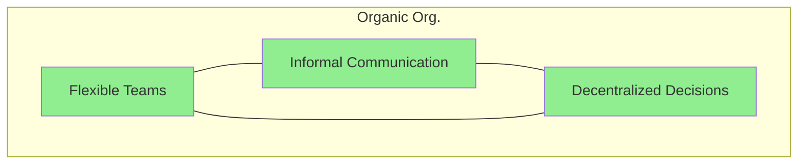
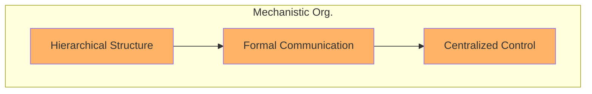
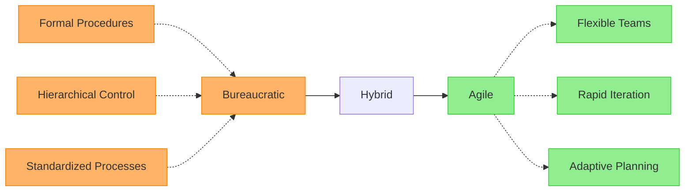

# 3. Underfitting and Overfitting in Organizational Models

## 3.1 Simplicity vs. Complexity in Organizational Structures and Management Models

Organizational structures and management models represent frameworks that define how organizations operate, make decisions, and coordinate their activities. These frameworks can range from relatively simple to highly complex, often reflecting the degree of standardization and specialization within the organization.

### Types of Organizational Structures

- [Organic vs mechanistic organizations](https://courses.lumenlearning.com/wm-organizationalbehavior/chapter/organic-versus-mechanistic-models/)

#### Organic Organizations
Characterized by:
- Low formality
- Low specialization
- Low standardization
- Decentralized decision-making
- Movement towards simplicity

#### Mechanistic Organizations
Features:
- Centralized decision-making
- Formal, standardized control systems
- Tendency towards complexity

#### [Matrix Organizations](https://asana.com/resources/matrix-organization)
Common in startups, featuring:
- More complex structure
- Dual reporting lines
- Cross-functional team collaborations

#### Hierarchical Organizations
- Variable complexity depending on management layers
- Common in larger organizations

### Management Models and Specialization

Management models navigate the balance between standardization and specialization

- [How Does Specialization Help Companies Achieve Economies of Scale?](https://www.investopedia.com/ask/answers/051115/how-does-specialization-help-companies-achieve-economies-scale.asp):

#### Bureaucratic Models
- Emphasis on standardization of work processes
- Hierarchical control
- Formal procedures

#### Agile Models
- Priority on flexibility
- Cross-functional collaboration
- Less rigid standardization

The choice between generalists in smaller organizations and specialists in larger ones reflects this spectrum:
- Generalists: Handle broader range of tasks
- Specialists: Focus on narrower areas of expertise [[83]](https://www.adaptconsultingcompany.com/2025/02/22/smaller-organizations-with-generalists-vs-larger-organizations-with-specialists/)

## 3.2 Evidence for Underfitting and Overfitting in Organizational Models

### Underfitting in Organizational Models

Overly simplistic and standardized organizational models can be characterized as "underfitting" when they fail to adequately address the necessary complexity of the organization's environment and tasks.

#### Benefits of Simplicity
- Enhanced responsiveness
- Improved efficiency
- Reduced bureaucracy

#### Risks of Oversimplification
- Lack of flexibility
- Reduced adaptability
- Difficulty handling:
  - Diverse situations
  - Unique customer requirements
  - Unexpected challenges

### Overfitting in Organizational Models

Excessively tailored and rigid organizational models can be seen as "overfitting" when they become too specific to a particular context, leading to:
- Poor generalizability
- Resistance to change

Just as excessive complexity in software can hinder understanding, maintenance, and scalability, an organizational model with too many layers, highly specialized roles, and inflexible processes might become:
- Costly to maintain
- Slow to adapt to new circumstances

### The Principle of Compensatory Misfits

The theory of "[compensatory misfits]((https://www.researchgate.net/publication/256060653_Misfits_in_Organization_Design_Information_Processing_as_a_Compensatory_Mechanism))" suggests that an underfitting structure in one area might be offset by an overfitting structure in another . However, fundamentally, a model that is too simple will fail to capture the intricate relationships and dynamics necessary for optimal performance in a complex world.

### Seeking Balance

The principle of seeking "simplicity on the far side of complexity" suggests that while some complexity is inherent, the goal should be to:
- Distill complexity into a manageable form
- Maintain adaptability
- Avoid impediments to organizational evolution

[Back to Table of Contents](../README.md) 
