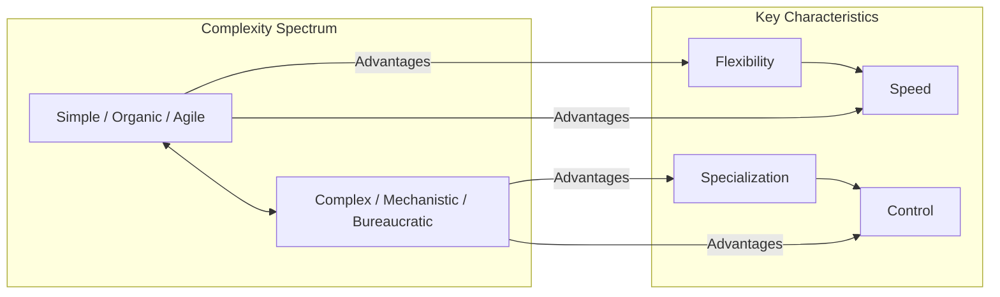

# 3. Underfitting and Overfitting in Organizational Models

While the concepts of organizational modeling, underfitting, and overfitting apply broadly, this chapter will particularly explore them through the lens of organizations focused on designing, developing, and maintaining software systems.

## 3.1 Organizational Structure as a Model

Organizational structure, with its framework of roles, responsibilities, and reporting lines, can be effectively viewed as a model representing the intended and actual communication patterns and hierarchies within an organization.

Formal organizational charts serve as explicit models, visually depicting the reporting relationships and functional groupings within a company. These charts are simplified representations of the often intricate web of interactions within an organization, abstracting away day-to-day complexities to provide clarity on formal authority and intended communication flows for management and employees alike.

However, the informal networks and actual communication flows that emerge within an organization also constitute an implicit model of how work truly gets done. These informal pathways, often cutting across formal departmental boundaries, represent the collaborative relationships and information exchanges that are essential for achieving organizational goals and might deviate significantly from the structure outlined in an official chart.

Ultimately, the organizational structure, whether formal or informal, acts as a set of rules and constraints that influence individual and collective behavior, shaping how decisions are made, information is shared, and work is coordinated within the organization. This framework, therefore, functions as a model for understanding and guiding organizational processes and dynamics, making it susceptible to underfitting (being too simple to capture reality) or overfitting (being too complex and rigid).

## 3.2 Simplicity vs. Complexity in Organizational Structures and Management Models

Designing effective organizational models involves navigating an inherent trade-off between simplicity and complexity, each offering distinct advantages and disadvantages. This trade-off is central to avoiding both underfitting (oversimplification) and overfitting (excessive complexity) the organizational model to its environment and tasks. Domain-Driven Design (DDD) offers valuable strategic tools to navigate this challenge, particularly through identifying the core, supporting, and generic subdomains of the business and establishing clear boundaries using Bounded Contexts. These concepts help focus effort on what's most critical and deliberately manage complexity rather than letting it emerge accidentally.

Organizational structures and management models represent frameworks that define how organizations operate, make decisions, and coordinate their activities. These frameworks can range from relatively simple (often associated with Organic or Agile models) to highly complex (often associated with Mechanistic or Bureaucratic models), frequently reflecting the degree of standardization, specialization, and hierarchy within the organization. A Bounded Context in DDD acts as an explicit boundary within which a particular subdomain model is consistent and well-understood, providing a mechanism to create necessary, deliberate partitions within the larger organizational or system landscape. This helps avoid both monolithic structures (underfitting the domain's complexity) and overly granular, chaotic fragmentation (overfitting with poorly defined boundaries).

### Simpler Structures (e.g., Organic, Flatter Hierarchies)

Simpler organizational structures, often characterized by fewer layers of management, broader spans of control, and less formalization, tend to be easier to understand and can foster greater agility and speed in decision-making.

**Advantages:**
- Enhanced responsiveness
- Improved efficiency
- Reduced bureaucracy
- Particularly beneficial for smaller organizations or those in rapidly changing environments requiring quick adaptation.

**Examples:**
- Startups often thrive with simpler, flatter structures allowing quick pivots and direct communication.
- Companies like Buurtzorg have shown that minimizing traditional management layers can lead to significant agility and growth.

**Potential Drawbacks:**
- Might lack the depth of specialization needed for highly intricate tasks.
- May struggle to handle large-scale operations requiring complex coordination mechanisms.

### More Complex Structures (e.g., Mechanistic, Hierarchical, Matrix)

In contrast, more complex organizational structures, often featuring multiple layers of hierarchy, narrower spans of control, high specialization, and a greater degree of formalization, can provide the necessary framework for managing intricate operations.

**Advantages:**
- Facilitate deep specialization within different functional areas.
- Provide clear control and coordination for large, diverse operations.
- Often necessary for large, established corporations with diverse product lines or global reach, allowing focused management (e.g., divisional structures).

**Examples:**
- Large corporations often adopt complex structures.
- Firm size often correlates with MIS centralization, suggesting a tendency towards complexity in certain aspects for larger organizations.
- [Matrix Organizations](https://asana.com/resources/matrix-organization), while sometimes used in startups, represent a complex model with dual reporting and cross-functional teams.

**Potential Drawbacks:**
- Can lead to bureaucracy and slower decision-making.
- Reduced ability to adapt quickly to changing market conditions.
- May hinder innovation if too rigid; less hierarchical, network-based models might be more appropriate for innovation-focused organizations.

### The Spectrum of Choice

Organizations must choose a position on this spectrum based on their size, environment, goals, and the nature of their work. This includes decisions about:

- **Organizational Structure Type:** (Organic, Mechanistic, Matrix, Hierarchical)
- **Management Model:** (Bureaucratic, Agile, Hybrid)
- **Degree of Specialization:** The balance between generalists (common in simpler/smaller orgs) and specialists (common in complex/larger orgs) [[article]](https://www.adaptconsultingcompany.com/2025/02/22/smaller-organizations-with-generalists-vs-larger-organizations-with-specialists/).

## 3.3 Evidence for Underfitting and Overfitting in Organizational Models

### Underfitting in Organizational Models

Overly simplistic and standardized organizational models can be characterized as "underfitting" when they fail to adequately address the necessary complexity of the organization's environment and tasks.

#### Benefits of Simplicity
- Enhanced responsiveness
- Improved efficiency
- Reduced bureaucracy

#### Risks of Oversimplification
- Lack of flexibility
- Reduced adaptability
- Difficulty handling:
  - Diverse situations
  - Unique customer requirements
  - Unexpected challenges

### Overfitting in Organizational Models

Excessively tailored and rigid organizational models can be seen as "overfitting" when they become too specific to a particular context, leading to:
- Poor generalizability
- Resistance to change

Just as excessive complexity in software can hinder understanding, maintenance, and scalability, an organizational model with too many layers, highly specialized roles, and inflexible processes might become:
- Costly to maintain
- Slow to adapt to new circumstances

### Seeking Balance

The principle of seeking "simplicity on the far side of complexity" suggests that while some complexity is inherent, the goal should be to:
- Distill complexity into a manageable form
- Maintain adaptability
- Avoid impediments to organizational evolution

## 3.4 Conway's Law and System Design

[Conway's Law](https://en.wikipedia.org/wiki/Conway%27s_law), first proposed by computer scientist Melvin Conway in the 1960s, posits a fundamental relationship between the structure of an organization and the design of the systems it produces, including software.

> Any organization that designs a system (defined broadly) will produce a design whose structure is a copy of the organization's communication structure. -- [Melvin Conway](https://www.melconway.com/Home/Conways_Law.html)

The core tenet of Conway's Law suggests that the way teams within an organization communicate and collaborate has a direct and significant impact on the architecture of the systems they build.

For instance, if a compiler is being developed by four distinct groups within an organization, Conway's Law predicts that the resulting compiler will likely be structured as a four-pass system, mirroring the organizational division.

> See also: [Martin Fowler on Conway's law](https://martinfowler.com/bliki/ConwaysLaw.html)

Beyond this specific example, a broader interpretation of Conway's Law suggests that the design of a software application or any system will reflect not just the communication pathways but also the overarching organizational structure, beliefs, culture, and even the underlying philosophy of the company that created it.

This law underscores how crucial effective communication and collaboration are for successful product development. A lack of proper communication during the development process can lead to fragmented or poorly integrated systems, ultimately impacting the quality and user experience of the final product.

Conway's Law directly reinforces the idea that organizational structure is a form of a model that significantly influences system architecture. The organizational structure, with its defined communication pathways, team boundaries, and hierarchical relationships, essentially acts as a template or a model that prefigures the likely structure of the technological output. When the organizational model (structure and communication flow) does not align with the desired architecture of the system being developed, or when domain boundaries are unclear (lacking well-defined Bounded Contexts), it can lead to various tensions, inefficiencies, and ultimately a tightly coupled, difficult-to-maintain system often referred to as a "Big Ball of Mud."

## 3.5 The Inverse Conway Maneuver

Building upon the principles of Conway's Law, the concept of the Inverse Conway Maneuver offers a proactive strategy for organizations to achieve desired system architectures by intentionally designing their team structures to mirror the intended design. A primary practical application of this maneuver is organizing teams around specific **Bounded Contexts** identified through strategic DDD.

Instead of allowing the existing organizational structure to dictate the architecture of the systems developed, the Inverse Conway Maneuver advocates for a deliberate approach where the organization's model (team structures and communication pathways) is shaped to facilitate the creation of a specific technical outcome. This maneuver recognizes that these organizational elements significantly influence the resulting system design and can be strategically manipulated to align with intended architectural goals, particularly by aligning teams with distinct parts of the business domain.

By strategically designing team structures around Bounded Contexts, organizations can proactively align their organizational models with intended system architectures. This often involves creating autonomous teams responsible for specific system components or modules reflecting a particular subdomain. Clear ownership encourages modular and decoupled architectures, as teams operate independently, develop a deep understanding and specialized **Ubiquitous Language** for their context, and focus on well-defined interfaces for interaction with other contexts. **Context Mapping**, another DDD tool, becomes essential for visualizing and managing the relationships *between* these team/system boundaries.

Furthermore, the Inverse Conway Maneuver emphasizes defining explicit communication pathways and interaction modes between teams aligned with Bounded Contexts. Intentionally structuring how teams collaborate helps foster the desired level of coupling between system components. For instance, tight integration needs can be supported by promoting close collaboration (e.g., a Partnership context map pattern), while decoupled architectures might use more formal, API-driven communication protocols between teams (e.g., an Anticorruption Layer or Open Host Service pattern).

In some cases, implementing the Inverse Conway Maneuver might necessitate reorganizing existing teams to break down silos, improve work/information flow, and remove organizational constraints that could lead to undesirable architectural patterns.

[Back to Table of Contents](../README.md) 
