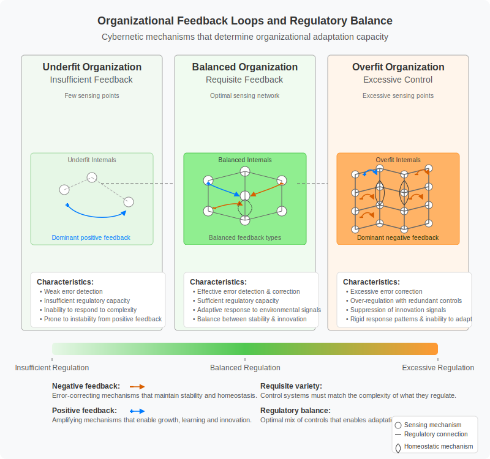

# 3. Underfitting and Overfitting in Organizational Models

## Table of Contents
- [3.1 Organizational Structure as a Model](#31-organizational-structure-as-a-model)
- [3.2 Simplicity vs. Complexity in Organizational Structures and Management
  Models](#32-simplicity-vs-complexity-in-organizational-structures-and-management-models)
  - [3.2.1 Simpler Structures (e.g., Organic, Flatter
    Hierarchies)](#321-simpler-structures-eg-organic-flatter-hierarchies)
  - [3.2.2 More Complex Structures (e.g., Mechanistic, Hierarchical,
    Matrix)](#322-more-complex-structures-eg-mechanistic-hierarchical-matrix)
  - [3.2.3 The Spectrum of Choice](#323-the-spectrum-of-choice)
- [3.3 Evidence for Underfitting and Overfitting in Organizational
  Models](#33-evidence-for-underfitting-and-overfitting-in-organizational-models)
  - [3.3.1 Underfitting in Organizational Models](#331-underfitting-in-organizational-models)
  - [3.3.2 Overfitting in Organizational Models](#332-overfitting-in-organizational-models)
  - [3.3.3 Seeking Balance](#333-seeking-balance)
  - [3.3.4 Sociotechnical Systems Theory as a Framework](#334-sociotechnical-systems-theory-as-a-framework)
  - [3.3.5 Entropy and Negentropy in Organizational
    Structures](#335-entropy-and-negentropy-in-organizational-structures)
  - [3.3.6 Dissipative Systems Theory and Organizational
    Adaptation](#336-dissipative-systems-theory-and-organizational-adaptation)
  - [3.3.7 Cybernetic Principles in Organizational Design](#337-cybernetic-principles-in-organizational-design)
- [3.4 Conway's Law and System Design](#34-conways-law-and-system-design)
- [3.5 The Inverse Conway Maneuver](#35-the-inverse-conway-maneuver)
  - [3.5.1 DDD Context Mapping for Organizational Design](#351-ddd-context-mapping-for-organizational-design)
- [3.6 Forward-Looking Considerations](#36-forward-looking-considerations)
  - [3.6.1 Human Orchestration of AI Teams](#361-human-orchestration-of-ai-teams)
  - [3.6.2 Evolutionary Trajectory of AI Integration](#362-evolutionary-trajectory-of-ai-integration)
  - [3.6.3 Adaptation Strategies for Human-AI Organizations](#363-adaptation-strategies-for-human-ai-organizations)

While the concepts of organizational modeling, underfitting, and overfitting apply broadly, this chapter will
particularly explore them through the lens of organizations focused on designing, developing, and maintaining software
systems.

## 3.1 Organizational Structure as a Model

Organizational structure, with its framework of roles, responsibilities, and reporting lines, can be effectively viewed
as a model representing the intended and actual communication patterns and hierarchies within an organization.

Formal organizational charts serve as explicit models, visually depicting the reporting relationships and functional
groupings within a company. These charts are simplified representations of the often intricate web of interactions
within an organization, abstracting away day-to-day complexities to provide clarity on formal authority and intended
communication flows for management and employees alike.

However, the informal networks and actual communication flows that emerge within an organization also constitute an
implicit model of how work truly gets done. These informal pathways, often cutting across formal departmental
boundaries, represent the collaborative relationships and information exchanges that are essential for achieving
organizational goals and might deviate significantly from the structure outlined in an official chart.

Ultimately, the organizational structure, whether formal or informal, acts as a set of rules and constraints that
influence individual and collective behavior, shaping how decisions are made, information is shared, and work is
coordinated within the organization. This framework, therefore, functions as a model for understanding and guiding
organizational processes and dynamics, making it susceptible to underfitting (being too simple to capture reality) or
overfitting (being too complex and rigid).

## 3.2 Simplicity vs. Complexity in Organizational Structures and Management Models

Designing effective organizational models involves navigating an inherent trade-off between simplicity and complexity,
each offering distinct advantages and disadvantages. This trade-off is central to avoiding both underfitting
(oversimplification) and overfitting (excessive complexity) the organizational model to its environment and tasks.
[Domain-Driven Design](https://www.domainlanguage.com/ddd/) (DDD) offers valuable strategic tools to navigate this
challenge, particularly through identifying the core, supporting, and generic subdomains of the business and
establishing clear boundaries using [Bounded Contexts](https://martinfowler.com/bliki/BoundedContext.html). These
concepts help focus effort on what's most critical and deliberately manage complexity rather than letting it emerge
accidentally.

It's important to note that DDD is primarily valuable for complex domains with intricate business rules and
relationships - it's not necessary or cost-effective for simpler situations. This chapter specifically focuses on the
strategic aspects of DDD (organizational boundaries and relationships) rather than tactical DDD patterns
(implementation-level design patterns), as strategic DDD directly influences organizational structure decisions.

Organizational structures and management models represent frameworks that define how organizations operate, make
decisions, and coordinate their activities. These frameworks can range from relatively simple (often associated with
Organic or Agile models) to highly complex (often associated with Mechanistic or Bureaucratic models), frequently
reflecting the degree of standardization, specialization, and hierarchy within the organization. A Bounded Context in
DDD acts as an explicit boundary within which a particular subdomain model is consistent and well-understood, providing
a mechanism to create necessary, deliberate partitions within the larger organizational or system landscape. This helps
avoid both monolithic structures (underfitting the domain's complexity) and overly granular, chaotic fragmentation
(overfitting with poorly defined boundaries).

### 3.2.1 Simpler Structures (e.g., Organic, Flatter Hierarchies)

Simpler organizational structures, often characterized by fewer layers of management, broader spans of control, and less
formalization, tend to be easier to understand and can foster greater agility and speed in decision-making.

**Advantages:**
- Enhanced responsiveness
- Improved efficiency
- Reduced bureaucracy
- Particularly beneficial for smaller organizations or those in rapidly changing environments requiring quick
  adaptation.

**Examples:**
- Startups often thrive with simpler, flatter structures allowing quick pivots and direct communication.
- Companies like Buurtzorg have shown that minimizing traditional management layers can lead to significant agility and
  growth.

**Potential Drawbacks:**
- Might lack the depth of specialization needed for highly intricate tasks.
- May struggle to handle large-scale operations requiring complex coordination mechanisms.

The rise of AI assistants and agents adds another layer to this discussion. As explored in Chapter 8, AI tools have the
potential to facilitate flatter hierarchies by automating coordination tasks and providing wider access to information,
potentially reducing the need for extensive middle management. Furthermore, AI might enable more dynamic, potentially
AI-mediated team formation based on skills and project needs, challenging traditional static team structures. However,
this also introduces new complexities in managing human-AI collaboration and requires careful consideration of the
organizational design implications.

### 3.2.2 More Complex Structures (e.g., Mechanistic, Hierarchical, Matrix)

In contrast, more complex organizational structures, often featuring multiple layers of hierarchy, narrower spans of
control, high specialization, and a greater degree of formalization, can provide the necessary framework for managing
intricate operations.

**Advantages:**
- Facilitate deep specialization within different functional areas.
- Provide clear control and coordination for large, diverse operations.
- Often necessary for large, established corporations with diverse product lines or global reach, allowing focused
  management (e.g., divisional structures).

**Examples:**
- Large corporations often adopt complex structures.
- Firm size often correlates with MIS centralization, suggesting a tendency towards complexity in certain aspects for
  larger organizations.
- [Matrix Organizations](https://asana.com/resources/matrix-organization), while sometimes used in startups, represent a
  complex model with dual reporting and cross-functional teams.

**Potential Drawbacks:**
- Can lead to bureaucracy and slower decision-making.
- Reduced ability to adapt quickly to changing market conditions.
- May hinder innovation if too rigid; less hierarchical, network-based models might be more appropriate for
  innovation-focused organizations.

### 3.2.3 The Spectrum of Choice

Organizations must choose a position on this spectrum based on their size, environment, goals, and the nature of their
work. This includes decisions about:

- **Organizational Structure Type:** (Organic, Mechanistic, Matrix, Hierarchical)
- **Management Model:** (Bureaucratic, Agile, Hybrid)
- **Degree of Specialization:** The balance between generalists (common in simpler/smaller orgs) and specialists (common
  in complex/larger orgs)
  [[article]](https://www.adaptconsultingcompany.com/2025/02/22/smaller-organizations-with-generalists-vs-larger-organizations-with-specialists/).

This complexity spectrum can be understood through the lens of information theory concepts like entropy (tendency toward
disorder and unpredictability) and negentropy (tendency toward order and structure), as discussed further in Section
3.3.5. Simpler organizational models tend to have higher entropy (adaptability but potential chaos), while more complex
models demonstrate higher negentropy (order but potential rigidity). The optimal position balances these opposing forces
according to organizational context.

## 3.3 Evidence for Underfitting and Overfitting in Organizational Models

### 3.3.1 Underfitting in Organizational Models

Overly simplistic and standardized organizational models can be characterized as "underfitting" when they fail to
adequately address the necessary complexity of the organization's environment and tasks.

#### Benefits of Simplicity
- Enhanced responsiveness
- Improved efficiency
- Reduced bureaucracy

#### Risks of Oversimplification
- Lack of flexibility
- Reduced adaptability
- Difficulty handling:
  - Diverse situations
  - Unique customer requirements
  - Unexpected challenges

### 3.3.2 Overfitting in Organizational Models

Excessively tailored and rigid organizational models can be seen as "overfitting" when they become too specific to a
particular context, leading to:
- Poor generalizability
- Resistance to change

Just as excessive complexity in software can hinder understanding, maintenance, and scalability, an organizational model
with too many layers, highly specialized roles, and inflexible processes might become:
- Costly to maintain
- Slow to adapt to new circumstances

### 3.3.3 Seeking Balance

The principle of seeking "simplicity on the far side of complexity" suggests that while some complexity is inherent, the
goal should be to:
- Distill complexity into a manageable form
- Maintain adaptability
- Avoid impediments to organizational evolution

### 3.3.4 Sociotechnical Systems Theory as a Framework

The concepts of balance, underfitting, and overfitting in organizational models are deeply rooted in sociotechnical
systems theory, which provides a valuable theoretical framework for understanding the interplay between people,
processes, technology, and structure.

Sociotechnical systems theory originated in the 1950s at the Tavistock Institute through research led by Trist and
Bamforth on coal mining operations. The theory emerged as a response to the dominant "technological imperative" of the
time, proposing instead a "new paradigm" that emphasized the joint optimization of both social and technical subsystems
within organizations.

At its core, the theory rejects technological determinism in favor of a balanced perspective where:

> "Organizations are made up of people that produce products or services using some technology, and that each affects
> the operation and appropriateness of the technology as well as the actions of the people who operate it." (Pasmore et
> al., 1982)

This perspective directly mirrors our discussion of organizational models and their tendency toward underfitting or
overfitting:

1. **Underfitting from a sociotechnical perspective** occurs when organizations oversimplify either their social or
technical dimensions, creating structures that fail to accommodate the necessary complexity of human interactions,
communication patterns, and collaborative requirements.

2. **Overfitting from a sociotechnical perspective** manifests when organizations create rigid, overspecialized
structures that optimize for specific social-technical configurations but lack adaptability to changing conditions.

Modern sociotechnical approaches consider organizations as comprising multiple interconnected elements across both
social and technical dimensions:

The matrix above illustrates how organizational systems integrate social and technical aspects across multiple elements
including people, processes, and technology. This interconnected view emphasizes that effective organizational
performance requires alignment across all sociotechnical dimensions, and that change in any element necessitates
consideration of effects throughout the entire system, similar to complex engineering systems.

This theoretical foundation directly informs our understanding of Conway's Law (see Section 3.4), which essentially
describes how organizational communication structures (social subsystem) shape technical architecture (technical
subsystem). Similarly, the Inverse Conway Maneuver (Section 3.5) can be understood as an intentional realignment of
social and technical subsystems to achieve more effective joint optimization.

Looking ahead to emerging human-AI integration (Section 3.6), sociotechnical systems theory offers a valuable lens for
understanding how these new technical capabilities will necessitate corresponding evolution in social structures, work
processes, and collaboration patterns. The theory's emphasis on joint optimization rather than technical primacy
provides a guiding principle for organizations navigating the integration of advanced AI capabilities.

### 3.3.5 Entropy and Negentropy in Organizational Structures

Another valuable theoretical framework for understanding the balance between simplicity and complexity in organizational
models comes from information theory and thermodynamics: the complementary concepts of entropy and negentropy (further
explored in Chapter 6).

As briefly introduced in Section 3.2.3, these concepts provide theoretical underpinning for the complexity spectrum of
organizational models and help explain why finding the appropriate balance is crucial for organizational effectiveness.

**Entropy** in organizational contexts represents the tendency toward disorder, unpredictability, and randomness.
High-entropy organizational structures are characterized by:
- Minimal formal constraints
- Emergent rather than designed communication patterns
- Highly adaptable but potentially chaotic processes
- Maximum flexibility but potential lack of coordination

**Negentropy** (negative entropy) represents the counterforce of order, structure, and predictability. High-negentropy
organizational structures feature:
- Clearly defined roles and responsibilities
- Standardized procedures and communication channels
- Established hierarchies and decision pathways
- Consistency but potential rigidity

The underfitting and overfitting spectrum discussed earlier can be reframed through this entropy lens:
1. **Underfitting organizational models** often suffer from excessive entropy—too much disorder and unpredictability,
leading to coordination failures and inefficiency despite adaptability.
2. **Overfitting organizational models** frequently exhibit excessive negentropy—too much rigidity and standardization,
creating brittleness and inability to adapt despite apparent efficiency.

Successful organizations maintain an appropriate entropy balance—enough structure to ensure coordination and efficiency,
but sufficient flexibility to adapt to changing conditions. This balance point is not static but shifts based on
organizational size, industry volatility, and strategic positioning.

This entropy framework helps explain why overly simplified "one-size-fits-all" organizational models fail when applied
across diverse contexts—they cannot accommodate the necessary entropy variations required by different environments and
challenges.

For a more comprehensive exploration of entropy concepts and their application to organizational systems, see Chapter 6,
which examines information entropy, negentropy, and related theoretical frameworks in greater depth.

### 3.3.6 Dissipative Systems Theory and Organizational Adaptation

Dissipative systems theory provides another powerful lens for understanding the balance between underfitting and
overfitting in organizational models. This theory, further explored in Chapter 6, addresses how complex systems maintain
their structure and function through continuous exchange of energy and information with their environment.

Building on the complexity spectrum discussed in Section 3.2, dissipative systems theory helps explain why organizations
must carefully navigate between simplicity and complexity. The theory provides a physics-based rationale for why neither
extreme on the spectrum—neither overly simplistic nor excessively complex organizational structures—can sustain
effectiveness over time.

A dissipative system, as described by Nobel laureate Ilya Prigogine, is characterized by:
- Operation far from thermodynamic equilibrium
- Continuous energy and matter exchange with the environment
- Self-organizing behavior that creates and maintains order

Organizations, viewed as dissipative systems, share these characteristics. They maintain their structure and function
through continuous exchange of resources, information, and energy with their environment. This perspective helps explain
why:

1. **Underfitting organizational models** (oversimplified structures) fail to establish sufficient mechanisms for
environmental interaction, energy absorption, and ordered dissipation. They lack the necessary complexity to:
   - Detect significant environmental patterns
   - Process and distribute information effectively
   - Establish stable internal structures that can persist despite environmental fluctuations

2. **Overfitting organizational models** (excessively rigid structures) fail through excessive structure that hampers
energy flow. They become too specialized by:
   - Creating overly rigid pathways for energy and information
   - Losing adaptability to environmental fluctuations
   - Becoming brittle in the face of unexpected external changes

From a dissipative systems perspective, effective organizations exist in a state of "dynamic stability" or what
Prigogine called "far-from-equilibrium" conditions. In this state, the organization:
- Maintains enough structure to preserve its identity and purpose
- Remains sufficiently adaptable to respond to environmental changes
- Develops feedback mechanisms that allow for continuous learning and evolution

This far-from-equilibrium state represents the optimal balance between underfitting and overfitting—creating just enough
structure to function effectively while maintaining the flexibility to adapt and evolve. The theory explains why
organizations need continuous energy input (in the form of resources, information, ideas) to maintain their complexity
and avoid degradation toward either oversimplified or overly rigid states.

Importantly, dissipative systems theory suggests that periods of instability and reorganization are natural and
necessary for organizational evolution. When environmental conditions change significantly, a temporary increase in
internal disorder (entropy) may be necessary before the system can reorganize into a new, more adapted stable state.
This provides a theoretical foundation for understanding organizational transformation processes and why disruption
often precedes innovation.

This dissipative systems perspective directly informs our discussions of Conway's Law (Section 3.4) and emerging AI
integration challenges (Section 3.6). Conway's Law can be viewed as describing how organizational communication
structures function as dissipative pathways that shape technical architectures. Similarly, the human-AI orchestration
challenges described later reflect the need for organizations to develop new dissipative structures that can effectively
exchange information and energy between human and AI components.

As we transition from these theoretical frameworks to more applied principles, Conway's Law offers a concrete
manifestation of how organizational structures shape technical outcomes—demonstrating in practice many of the
theoretical relationships described by sociotechnical systems theory, entropy/negentropy concepts, and dissipative
systems dynamics.

### 3.3.7 Cybernetic Principles in Organizational Design

Cybernetics—the study of control and communication in complex systems—offers another valuable theoretical framework for
understanding the underfitting/overfitting spectrum in organizational models. Originally developed by Norbert Wiener and
expanded upon by Ross Ashby, Stafford Beer, and others, cybernetics provides insights into how organizations maintain
stability while adapting to changing environments through regulatory mechanisms.

#### Feedback Loops and Organizational Regulation

At the heart of cybernetic thinking are feedback loops that enable system regulation. Organizations rely on two
fundamental types of feedback:

1. **Negative feedback loops** act as error-correcting mechanisms, detecting deviations from desired states and
initiating actions to return the system to equilibrium. These stabilizing mechanisms are essential for organizational
coherence and operational consistency.

2. **Positive feedback loops** amplify signals or changes, potentially leading to growth, innovation, or transformation.
While necessary for adaptation and evolution, unchecked positive feedback can lead to instability.

The effectiveness of an organization's feedback mechanisms directly determines its position on the
underfitting/overfitting spectrum:

- **Underfit organizations** tend to have weak or insufficient negative feedback loops, lacking the regulatory capacity
  to maintain coherent operations and consistent performance.
- **Overfit organizations** often implement excessive negative feedback with rigid control mechanisms that suppress the
  positive feedback needed for innovation and adaptation.

#### Ashby's Law of Requisite Variety

Perhaps the most powerful cybernetic principle for understanding organizational complexity is Ashby's Law of Requisite
Variety, which states that "only variety can absorb variety." In organizational terms, this means that a system's
internal complexity must match the complexity of the environment it operates within.

This principle provides direct theoretical grounding for determining appropriate organizational complexity:

- Organizations with **insufficient variety** (underfit) lack the internal complexity needed to respond to diverse
  environmental demands
- Organizations with **excessive variety** (overfit) maintain unnecessary complexity that creates coordination overhead
  without providing additional adaptive capacity

The concept of requisite variety offers a scientific basis for determining the minimally sufficient level of
organizational complexity—enough to handle environmental challenges without unnecessary overhead. This aligns with the
"simplicity on the far side of complexity" principle mentioned in Section 3.3.3.

#### Viable System Model as a Template for Balanced Complexity

Stafford Beer's Viable System Model (VSM) applies cybernetic principles to organizational design by defining the
necessary and sufficient functions for system viability. The VSM identifies five essential systems that every viable
organization must maintain:

1. **System 1 (Operations)**: Primary activities that deliver value
2. **System 2 (Coordination)**: Mechanisms that resolve conflicts between operational units
3. **System 3 (Control)**: Day-to-day management and optimization of current activities
4. **System 4 (Intelligence)**: Forward-looking adaptation to changing environments
5. **System 5 (Policy)**: Overall direction, identity, and purpose

Notably, the VSM specifies both the minimum complexity required (avoiding underfitting) and encourages focusing on
essential functions without unnecessary elaboration (avoiding overfitting). The model explicitly addresses the
complexity balance by providing:

- Sufficient coordination mechanisms to enable coherent action
- Recursive structures that handle complexity at appropriate levels
- Clear separation of operational and strategic functions

#### Cybernetics and Organizational Learning

Cybernetic principles reveal how organizations learn and adapt through what Argyris and Schön termed "single-loop" and
"double-loop" learning:

- **Single-loop learning** operates within existing frameworks, detecting and correcting errors without questioning
  underlying assumptions
- **Double-loop learning** examines and potentially revises the governing variables and assumptions themselves

Organizations vulnerable to underfitting often engage primarily in single-loop learning, making incremental adjustments
without questioning fundamental assumptions. Conversely, overfitting can result from excessive structural changes
without allowing sufficient time for single-loop learning to stabilize operations.

#### Integration with AI Systems

Cybernetic principles are particularly relevant as organizations integrate AI systems, which introduce new forms of
feedback loops and control mechanisms:

- AI systems can enhance organizational regulation by processing more information and detecting patterns that would
  elude human observation
- The human-AI interfaces themselves become critical regulatory boundaries requiring careful design
- The combination of human and AI regulatory mechanisms creates what Beer would call a "metasystem" with emergent
  properties

In Section 3.6, we explore how these cybernetic principles manifest in emerging models of human-AI collaboration, where
the balance between human judgment and AI-driven processes creates new regulatory challenges.

## 3.4 Conway's Law and System Design

Conway's Law can be understood as a specific manifestation of sociotechnical systems principles (see Section 3.3.4),
where the social subsystem (organizational communication structure) directly shapes the technical subsystem (system
architecture). This demonstrates a key sociotechnical insight: optimizing technical architecture in isolation from
organizational structure is likely to fail, as the social patterns of interaction inevitably influence technical
outcomes. The relationship between organizational structure and system design illustrates why joint optimization of
social and technical elements is essential.

From a cybernetic perspective (Section 3.3.7), Conway's Law describes how information flow and control mechanisms within
organizations create corresponding patterns in system architecture. The communication structures act as regulatory
pathways that constrain and enable certain technical designs. This reflects the cybernetic principle that control
systems shape the systems they regulate—the organizational communication patterns (control system) influence the
resulting technical architecture (regulated system). Viewing Conway's Law through this lens helps explain why
organizational structures that lack requisite variety often produce technical systems that similarly lack the complexity
needed to address diverse requirements.

[Conway's Law](https://en.wikipedia.org/wiki/Conway%27s_law), first proposed by computer scientist Melvin Conway in the
1960s, posits a fundamental relationship between the structure of an organization and the design of the systems it
produces, including software.

> Any organization that designs a system (defined broadly) will produce a design whose structure is a copy of the
> organization's communication structure. -- [Melvin Conway](https://www.melconway.com/Home/Conways_Law.html)

The core tenet of Conway's Law suggests that the way teams within an organization communicate and collaborate has a
direct and significant impact on the architecture of the systems they build.

For instance, if a compiler is being developed by four distinct groups within an organization, Conway's Law predicts
that the resulting compiler will likely be structured as a four-pass system, mirroring the organizational division.

> See also: [Martin Fowler on Conway's law](https://martinfowler.com/bliki/ConwaysLaw.html)

Beyond this specific example, a broader interpretation of Conway's Law suggests that the design of a software
application or any system will reflect not just the communication pathways but also the overarching organizational
structure, beliefs, culture, and even the underlying philosophy of the company that created it.

This law underscores how crucial effective communication and collaboration are for successful product development. A
lack of proper communication during the development process can lead to fragmented or poorly integrated systems,
ultimately impacting the quality and user experience of the final product.

Conway's Law directly reinforces the idea that organizational structure is a form of a model that significantly
influences system architecture. The organizational structure, with its defined communication pathways, team boundaries,
and hierarchical relationships, essentially acts as a template or a model that prefigures the likely structure of the
technological output. When the organizational model (structure and communication flow) does not align with the desired
architecture of the system being developed, or when domain boundaries are unclear (lacking well-defined Bounded
Contexts), it can lead to various tensions, inefficiencies, and ultimately a tightly coupled, difficult-to-maintain
system often referred to as a "Big Ball of Mud."

## 3.5 The Inverse Conway Maneuver

Building upon the principles of Conway's Law, the concept of the Inverse Conway Maneuver offers a proactive strategy for
organizations to achieve desired system architectures by intentionally designing their team structures to mirror the
intended design. A primary practical application of this maneuver is organizing teams around specific **Bounded
Contexts** identified through strategic DDD.

Instead of allowing the existing organizational structure to dictate the architecture of the systems developed, the
Inverse Conway Maneuver advocates for a deliberate approach where the organization's model (team structures and
communication pathways) is shaped to facilitate the creation of a specific technical outcome. This maneuver recognizes
that these organizational elements significantly influence the resulting system design and can be strategically
manipulated to align with intended architectural goals, particularly by aligning teams with distinct parts of the
business domain.

By strategically designing team structures around Bounded Contexts, organizations can proactively align their
organizational models with intended system architectures. This often involves creating autonomous teams responsible for
specific system components or modules reflecting a particular subdomain. Clear ownership encourages modular and
decoupled architectures, as teams operate independently, develop a deep understanding and specialized **[Ubiquitous
Language](https://www.agilealliance.org/glossary/ubiquitous-language/)** for their context, and focus on well-defined
interfaces for interaction with other contexts. **[Context
Mapping](https://www.oreilly.com/library/view/what-is-domain-driven/9781492057802/ch04.html)**, another DDD tool,
becomes essential for visualizing and managing the relationships *between* these team/system boundaries.

Furthermore, the Inverse Conway Maneuver emphasizes defining explicit communication pathways and interaction modes
between teams aligned with Bounded Contexts. Intentionally structuring how teams collaborate helps foster the desired
level of coupling between system components. For instance, tight integration needs can be supported by promoting close
collaboration (e.g., a Partnership context map pattern), while decoupled architectures might use more formal, API-driven
communication protocols between teams (e.g., an [Anticorruption
Layer](https://martinfowler.com/bliki/AnticorruptionLayer.html) or [Open Host
Service](https://ddd-practitioners.com/home/glossary/bounded-context/bounded-context-relationship/open-host-service/)
pattern).

In some cases, implementing the Inverse Conway Maneuver might necessitate reorganizing existing teams to break down
silos, improve work/information flow, and remove organizational constraints that could lead to undesirable architectural
patterns.

### 3.5.1 DDD Context Mapping for Organizational Design

Domain-Driven Design provides valuable patterns for defining relationships between different Bounded Contexts, which
directly translates to defining the relationships between teams in an organization. These relationship patterns help
define how teams should interact, what protective measures might be needed, and how to align team structures with system
architecture components.

The context map visualization above illustrates several key DDD concepts relevant to organizational design:

1. **Bounded Contexts**: Defined areas of responsibility with their own consistent model and ubiquitous language
   - Core Domain (highest business value, competitive advantage)
   - Supporting Subdomains (organization-specific but not core differentiator)
   - Generic Subdomains (commoditized functionality)

2. **Context Relationships**: Define how teams interact across boundaries
   - Partnership: Collaborative relationship with shared success criteria
   - Customer/Supplier: Directional relationship with upstream/downstream dependencies
   - Anticorruption Layer (ACL): Protection mechanism to isolate from external model changes

3. **Team Alignment**: Each Bounded Context is assigned to a specific team, creating clear ownership
   
4. **System Architecture Reflection**: Technical components mirror the domain organization

By intentionally designing these relationships and boundaries, organizations can create more effective team structures
that naturally produce well-architected systems while avoiding the communication bottlenecks and integration challenges
of misaligned organizational and technical boundaries.

## 3.6 Forward-Looking Considerations

*Note: This section presents emerging considerations rather than established practices.*

The emerging AI integration challenges discussed in this section particularly benefit from sociotechnical systems theory
(Section 3.3.4). The theory's emphasis on joint optimization of social and technical elements provides a framework for
understanding why traditional organizational structures may struggle with AI integration. As AI capabilities evolve,
organizations will need to adapt both their technical systems and social structures simultaneously, rather than focusing
solely on technical implementation. The challenges of human-AI coordination, contextual understanding, and temporal
flexibility all represent aspects where optimizing either technical capabilities or human processes in isolation will
lead to suboptimal outcomes.

As organizations adapt to changing environments, emerging AI capabilities are creating new organizational patterns that
challenge traditional thinking about simplicity versus complexity in organizational structures. These developments may
fundamentally shift how we balance organizational model complexity, both in the immediate term and over longer
evolutionary horizons.

### 3.6.1 Human Orchestration of AI Teams

A particularly significant emerging pattern is the ability of individual knowledge workers to orchestrate multiple
specialized AI assistants in parallel. This represents a fundamentally different coordination model than traditional
human-to-human collaboration.

This emerging pattern creates several important organizational implications:

**Novel Asymmetries in Productivity and Coordination**
- Individual knowledge workers can achieve what previously required entire teams
- AI agents don't experience context-switching costs that limit human multitasking
- Human attention becomes the primary constraint rather than team size
- Individuals can specialize in orchestration rather than domain expertise

**New Underfitting/Overfitting Risks**
- **Underfitting:** Organizational structures that fail to accommodate the increased throughput and complexity of
  human-AI teams risk creating bottlenecks and coordination failures
- **Overfitting:** Imposing traditional team-oriented processes and coordination mechanisms on human-AI teams may negate
  their productivity advantages
- Organizations must develop appropriately complex interfaces between human-AI teams and the broader organization

**Multi-level Alignment Challenges**
1. **Internal alignment:** Ensuring multiple AI agents working on different components maintain coherent design patterns
and compatible approaches
2. **Cross-team alignment:** Coordinating multiple human-AI teams working in parallel
3. **Strategic alignment:** Ensuring local optimizations by empowered human-AI teams serve broader organizational goals

**Cybernetic Amplification Through Human-AI Orchestration** From a cybernetic perspective, human-AI orchestration
represents a profound development in organizational variety management. When a knowledge worker coordinates multiple AI
assistants, they create what Beer would call a "variety amplifier"—a mechanism that enhances human regulatory capacity.
This arrangement allows the human orchestrator to effectively monitor and manage far more environmental complexity than
would otherwise be possible. The human-AI system creates new forms of:

- **Regulatory capacity**: The ability to process, filter, and respond to more signals from the environment
- **Requisite variety**: Enhanced ability to match the complexity of problems with appropriate response options
- **Homeostatic mechanisms**: New systems for maintaining stability while pursuing multiple parallel workstreams
- **Recursive control**: Multi-level regulation where humans govern AI systems that in turn regulate specific processes

This cybernetic enhancement transforms both what organizations can accomplish and how they must be structured.
Traditional organizational models developed for purely human teams often underfit this new reality, lacking the
flexibility to accommodate the enhanced regulatory capacity of human-AI teams. Conversely, attempts to create highly
formalized processes specifically for AI integration risk overfitting to current technologies rather than establishing
adaptable regulatory principles.

### 3.6.2 Evolutionary Trajectory of AI Integration

Looking beyond current capabilities, we can map the potential evolution of AI integration across multiple dimensions.
Each stage brings distinct implications for organizational complexity and design.

This timeline illustrates four key dimensions of AI integration that will progressively influence organizational
complexity:

**From Tools to Agents:** As AI evolves from productivity tools to semi-autonomous agents, organizations face a
complexity paradox. Initially, AI may allow for simpler organizational structures by automating coordination tasks.
However, as AI capabilities advance, new governance structures may be required to manage human-AI collaboration,
potentially adding organizational complexity.

**Contextual Understanding:** AI's growing ability to access and interpret organizational knowledge may enable knowledge
democratization, potentially flattening hierarchies (simplification). Yet organizations will need to establish new
knowledge management frameworks to leverage these capabilities effectively. Those that maintain overly simplistic
knowledge management models risk underutilizing AI capabilities.

**Tool Orchestration:** As AI systems progress from sequential automation to dynamic workflow reconfiguration,
traditional process-oriented organizational structures may require rethinking. Simple, rigid process definitions might
underfit the flexibility that AI orchestration enables, while overly complex adaptive systems might create
unpredictability and governance challenges.

This dimension is further evolving as AI systems begin to take on project coordination roles, managing complex workflows
with interdependencies across multiple specialized tools and AI assistants. Much like how project managers coordinate
human teams, these systems can plan and visualize parallel workstreams, schedule tasks with appropriate dependencies,
and allocate work to specialized AI tools based on their capabilities. This represents a significant advancement in
managing organizational complexity - the coordination overhead that would typically require dedicated human management
effort can increasingly be handled by AI systems that understand task relationships and optimal resource allocation
across time. As these capabilities develop, organizations may need to reconsider traditional project management
structures and processes.

**Temporal Flexibility:** The "always-on" nature of AI systems challenges conventional organizational time structures.
Organizations with overly simplistic temporal models may miss opportunities for asynchronous operation, while overly
complex scheduling and handoff mechanisms may introduce unnecessary coordination overhead. The "night-shift" capability
of AI systems, reminiscent of lights-out manufacturing, enables continuous operation beyond human working hours.

### 3.6.3 Adaptation Strategies for Human-AI Organizations

Organizations seeking to effectively integrate AI capabilities while maintaining appropriate complexity should consider
these adaptation strategies:

1. **Integration Interfaces:** Design specific organizational interfaces that enable human-AI teams to integrate with
traditional teams without imposing unnecessary process overhead

2. **Selective Complexity:** Rather than uniformly simple or complex organizational models, develop "complexity pockets"
where more elaborate structures are justified by the domain complexity or strategic importance

3. **Dynamic Granularity:** Create organizational structures that can temporarily increase or decrease in complexity as
needed, using AI to manage and modulate the appropriate level of structural detail based on environmental conditions

4. **Complexity Pattern Recognition:** Leverage AI's ability to recognize patterns in organizational behavior to
identify where existing structures are overfitting or underfitting

5. **Temporal Continuity Management:** Design organizational processes that can leverage 24/7 AI operation while
ensuring effective handoffs and information flow between human and AI working periods

These considerations suggest that effective organizational models in AI-augmented environments will likely neither be
uniformly simple nor complex, but rather embody "requisite complexity" - matching their structural sophistication to the
specific domains, tasks, and contexts they encompass, while avoiding both the rigidity of excessive simplicity and the
coordination costs of unnecessary complexity.

Cybernetics offers particularly valuable guidance for organizations navigating this transition. The principle of
requisite variety provides a scientific foundation for determining appropriate organizational complexity—not based on
abstract ideals of simplicity or comprehensiveness, but on matching internal regulatory capacity to environmental
demands. As organizations integrate AI systems, they gain powerful new capabilities for environmental sensing,
information processing, and response generation. Cybernetic principles suggest that this enhanced regulatory capacity
should be balanced with adaptive governance mechanisms that provide sufficient guidance without unnecessary constraints.
By establishing clear feedback loops, defining appropriate homeostatic boundaries, and consciously designing multi-level
control systems, organizations can develop the minimally sufficient complexity needed to leverage AI capabilities while
maintaining coherence, adaptability, and human agency. This cybernetic approach to organizational design represents not
just an engineering challenge but a fundamental reimagining of how human and artificial intelligence can combine to
create systems with emergent capabilities greater than either could achieve alone.

---

[Back to Table of Contents](../README.md) 
