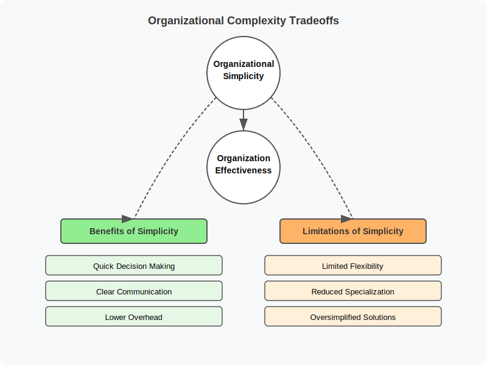
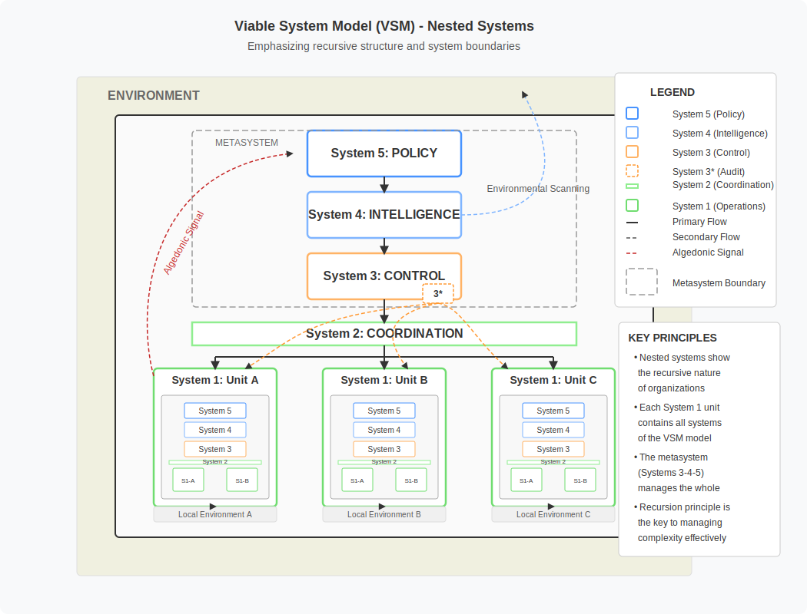

# 3. Underfitting and Overfitting in Organizational Models

## Table of Contents
- [3.1 Organizational Structure as a Model](#31-organizational-structure-as-a-model)
- [3.2 Simplicity vs. Complexity in Organizational Structures and Management
  Models](#32-simplicity-vs-complexity-in-organizational-structures-and-management-models)
  - [3.2.1 Simpler Structures (e.g., Organic, Flatter
    Hierarchies)](#321-simpler-structures-eg-organic-flatter-hierarchies)
  - [3.2.2 More Complex Structures (e.g., Mechanistic, Hierarchical,
    Matrix)](#322-more-complex-structures-eg-mechanistic-hierarchical-matrix)
  - [3.2.3 The Spectrum of Choice: Navigating Organizational Complexity](#323-the-spectrum-of-choice-navigating-organizational-complexity)
- [3.3 Understanding and Addressing Underfitting and Overfitting in Organizational
  Models](#33-understanding-and-addressing-underfitting-and-overfitting-in-organizational-models)
  - [3.3.1 Underfitting in Organizational Models](#331-underfitting-in-organizational-models)
  - [3.3.2 Overfitting in Organizational Models](#332-overfitting-in-organizational-models)
  - [3.3.3 Seeking Balance](#333-seeking-balance)
  - [3.3.4 Sociotechnical Systems Theory as a Framework](#334-sociotechnical-systems-theory-as-a-framework)
  - [3.3.5 Entropy and Negentropy in Organizational
    Structures](#335-entropy-and-negentropy-in-organizational-structures)
  - [3.3.6 Dissipative Systems Theory and Organizational
    Adaptation](#336-dissipative-systems-theory-and-organizational-adaptation)
  - [3.3.7 Cybernetic Principles in Organizational Design](#337-cybernetic-principles-in-organizational-design)
- [3.4 Conway's Law: How Organizational Structure Shapes System Architecture](#34-conways-law-how-organizational-structure-shapes-system-architecture)
- [3.5 The Inverse Conway Maneuver: Restructuring Teams to Shape System Architecture](#35-the-inverse-conway-maneuver-restructuring-teams-to-shape-system-architecture)
  - [3.5.1 DDD Context Mapping for Organizational Design](#351-ddd-context-mapping-for-organizational-design)
  - [3.5.2 Team Topologies for Organizational Structure](#352-team-topologies-for-organizational-structure)
  - [3.5.3 Organizational Evolution Through Conway's Law](#353-organizational-evolution-through-conways-law)
  - [3.5.4 Remote-Aware Team Topologies and Inverse Conway Maneuvers](#354-remote-aware-team-topologies-and-inverse-conway-maneuvers)
- [3.6 Emerging AI-Organizational Paradigms: Theoretical Implications and Research Directions](#36-emerging-ai-organizational-paradigms-theoretical-implications-and-research-directions)
  - [3.6.1 Human Orchestration of AI Teams](#361-human-orchestration-of-ai-teams)
  - [3.6.2 Evolutionary Trajectory of AI Integration](#362-evolutionary-trajectory-of-ai-integration)
  - [3.6.3 Adaptation Strategies for Human-AI Organizations](#363-adaptation-strategies-for-human-ai-organizations)
  - [3.6.4 Theoretical Frameworks for AI-Augmented Organizations](#364-theoretical-frameworks-for-ai-augmented-organizations)

While the concepts of organizational modeling, underfitting, and overfitting apply broadly, this chapter will
particularly explore them through the lens of organizations focused on designing, developing, and maintaining software
systems.

## 3.1 Organizational Structure as a Model

Organizational structure, with its framework of roles, responsibilities, and reporting lines, can be effectively viewed
as a model representing the intended and actual communication patterns and hierarchies within an organization.

Formal organizational charts serve as explicit models, visually depicting the reporting relationships and functional
groupings within a company. These charts are simplified representations of the often intricate web of interactions
within an organization, abstracting away day-to-day complexities to provide clarity on formal authority and intended
communication flows for management and employees alike.

However, the informal networks and actual communication flows that emerge within an organization also constitute an
implicit model of how work truly gets done. These informal pathways, often cutting across formal departmental
boundaries, represent the collaborative relationships and information exchanges that are essential for achieving
organizational goals and might deviate significantly from the structure outlined in an official chart.

> **Note on Network Analysis:** For readers interested in methodologies for studying informal networks, Organizational Network Analysis (ONA), introduced by Moreno (1934) and developed through works like Granovetter's (1973) research on social ties, offers tools for mapping communication patterns and relationships in organizations. While traditionally based on surveys and manual analysis, modern ONA incorporates various computational approaches to assist with data collection and visualization.

Ultimately, the organizational structure, whether formal or informal, acts as a set of rules and constraints that
influence individual and collective behavior, shaping how decisions are made, information is shared, and work is
coordinated within the organization. This framework, therefore, functions as a model for understanding and guiding
organizational processes and dynamics, making it susceptible to underfitting (being too simple to capture reality) or
overfitting (being too complex and rigid).

## 3.2 Simplicity vs. Complexity in Organizational Structures and Management Models

Designing effective organizational models involves navigating an inherent trade-off between simplicity and complexity,
each offering distinct advantages and disadvantages. This trade-off is central to avoiding both underfitting
(oversimplification) and overfitting (excessive complexity) the organizational model to its environment and tasks.

Various frameworks and methodologies exist to help organizations navigate this complexity trade-off. For organizations
focused on software development, [Domain-Driven Design](https://www.domainlanguage.com/ddd/) (DDD) offers strategic
tools for managing complexity by aligning team boundaries with domain boundaries. Similarly, [Team Topologies](https://teamtopologies.com/) 
by Skelton and Pais ([2019](https://teamtopologies.com/book)) directly addresses the relationship between team structure and system architecture (discussed further as "Conway's Law" in Section 3.4) by intentionally designing team structures to produce 
desired system architectures through well-defined team types and interaction patterns. Team Topologies provides specific organizational patterns focused on optimizing team cognitive load and interaction modes, which we explore in detail in Section 3.5.2. Other approaches like 
the Spotify Model and scaled agile frameworks (SAFe, LeSS) address organizational structure but with less emphasis on 
software architecture alignment. The Viable System Model (covered in Section 3.3.7) also provides 
cybernetic principles for organizational design.

Each of these frameworks represents a different lens through which to view organizational complexity, with different
emphases and applications. For our discussion of organizational and system architecture alignment (explored in depth in Section 3.4), DDD and Team Topologies
are particularly relevant as they explicitly address how organizational boundaries influence technical boundaries.

Organizational structures and management models represent frameworks that define how organizations operate, make
decisions, and coordinate their activities. These frameworks can range from relatively simple (often associated with
Organic or Agile models) to highly complex (often associated with Mechanistic or Bureaucratic models), frequently
reflecting the degree of standardization, specialization, and hierarchy within the organization. A Bounded Context in
DDD acts as an explicit boundary within which a particular subdomain model is consistent and well-understood, providing
a mechanism to create necessary, deliberate partitions within the larger organizational or system landscape. This helps
avoid both monolithic structures (underfitting the domain's complexity) and overly granular, chaotic fragmentation
(overfitting with poorly defined boundaries).

### 3.2.1 Simpler Structures (e.g., Organic, Flatter Hierarchies)

Simpler organizational structures, often characterized by fewer layers of management, broader spans of control, and less
formalization, tend to be easier to understand and can foster greater agility and speed in decision-making.

**Advantages:**
- Enhanced responsiveness
- Improved efficiency
- Reduced bureaucracy
- Particularly beneficial for smaller organizations or those in rapidly changing environments requiring quick
  adaptation.

**Examples:**
- Startups often thrive with simpler, flatter structures allowing quick pivots and direct communication.
- Companies like Buurtzorg have shown that minimizing traditional management layers can lead to significant agility and
  growth.

**Potential Drawbacks:**
- Might lack the depth of specialization needed for highly intricate tasks.
- May struggle to handle large-scale operations requiring complex coordination mechanisms.

### 3.2.2 More Complex Structures (e.g., Mechanistic, Hierarchical, Matrix)

In contrast, more complex organizational structures, often featuring multiple layers of hierarchy, narrower spans of
control, high specialization, and a greater degree of formalization, can provide the necessary framework for managing
intricate operations.

**Mechanistic structures**, a term coined by Burns and Stalker in their influential work ["The Management of Innovation"](https://academic.oup.com/book/4968) ([1961](https://books.google.com/books?id=Xt_YWG-CJWIC)), represent one end of the organizational spectrum characterized by:
- High formalization and standardization of processes
- Clear division of labor and rigid departmentalization
- Specialized roles with narrowly defined responsibilities
- Centralized decision-making authority
- Hierarchical communication flows
These structures stand in direct contrast to the Organic structures described in 3.2.1, which emphasize flexibility and adaptability.

**Advantages of Complex Organizational Structures:**
- Facilitate deep specialization within different functional areas.
- Provide clear control and coordination for large, diverse operations.
- Often necessary for large, established corporations with diverse product lines or global reach, allowing focused
  management (e.g., divisional structures).

**Examples:**
- Large corporations often adopt complex structures.
- Firm size often correlates with Management Information Systems (MIS) centralization, suggesting a tendency towards complexity in certain aspects for
  larger organizations.
- [Matrix Organizations](https://asana.com/resources/matrix-organization), while sometimes used in startups, represent a
  complex model with dual reporting and cross-functional teams.

**Matrix Organizations** feature overlapping lines of authority where employees report to both functional managers (specialized by function like marketing or engineering) and project/product managers (focused on specific projects or products). This dual reporting structure creates a grid or "matrix" that increases complexity but can enhance cross-functional collaboration.

**Potential Drawbacks:**
- Can lead to bureaucracy and slower decision-making.
- Reduced ability to adapt quickly to changing market conditions.
- May hinder innovation if too rigid; less hierarchical, network-based models might be more appropriate for
  innovation-focused organizations.

### 3.2.3 The Spectrum of Choice: Navigating Organizational Complexity

Organizations must choose a position on the complexity spectrum based on their size, environment, goals, and the nature of their work. This includes decisions about:

- **Organizational Structure Type:** (Organic, Mechanistic, Matrix, Hierarchical)

- **Management Approaches:** Different management philosophies represent varying positions on the complexity spectrum:
  - **[Weber's Bureaucratic Model](https://www.britannica.com/topic/bureaucracy/Webers-bureaucracy):** Emphasizes formal rules, standardized procedures, and clear hierarchical authority
  - **[Agile Methodologies](https://agilemanifesto.org/):** Focus on iterative progress, cross-functional collaboration, and adaptive planning
  - **Self-organizing team approaches** that distribute authority and decision-making while maintaining alignment may help balance autonomy with coordination
- **Design Approaches:** Frameworks for aligning organization with goals:
  - **Sociotechnical Systems Design: Joint optimization of social and technical aspects of work systems
  - **[Team Topologies](https://teamtopologies.com/):** Structures teams based on cognitive load and system architecture considerations

- **Degree of Specialization:** The balance between generalists (common in simpler/smaller orgs) and specialists (common in complex/larger orgs) [[article]](https://www.adaptconsultingcompany.com/2025/02/22/smaller-organizations-with-generalists-vs-larger-organizations-with-specialists/).

The figure below illustrates organizational structures at different points on this complexity continuum, though it primarily contrasts two ends of the spectrum rather than showing the full range of intermediate possibilities. 

One way to understand these different organizational forms is through information theory concepts (explored further in Section 3.3.5 and [Chapter 6](../chapters/06-theoretical-concepts.md)). In this framework, simpler organizational structures typically exhibit higher entropy – they have fewer formal constraints and rules, allowing for more emergent, unpredictable interactions and greater adaptability. Conversely, more complex structures demonstrate higher negentropy through formal procedures, defined roles, and explicit coordination mechanisms that create order and predictability.

This entropy perspective matters because it helps explain organizational behaviors beyond mere structural descriptions. When organizations face increased environmental complexity, those with simpler structures may struggle to coordinate responses (insufficient negentropy), while overly complex organizations may fail to adapt quickly enough (excessive negentropy restricting information flow). This isn't an absolute relationship – a startup might intentionally maintain higher entropy to promote innovation, while a nuclear power plant requires high negentropy for safety regardless of size or environment.

Emerging technologies, particularly AI, may influence where organizations position themselves on this spectrum. As explored in [Chapter 8](../chapters/08-ai-organizational-impact.md), AI tools can potentially enable flatter hierarchies by automating coordination activities and enhancing information flow, while simultaneously introducing new considerations for organizational design as human-AI collaboration evolves. Chapter 8 provides a comprehensive examination of these AI impacts, while this chapter focuses on the fundamental organizational models that will be affected by these technological changes.

## 3.3 Understanding and Addressing Underfitting and Overfitting in Organizational Models

### 3.3.1 Underfitting in Organizational Models

Overly simplistic and standardized organizational models can be characterized as underfitting when they fail to
adequately address the necessary complexity of the organization's environment and tasks.

#### Benefits of Simplicity
- Enhanced responsiveness
- Improved efficiency
- Reduced bureaucracy

#### Risks of Oversimplification
- Lack of flexibility
- Reduced adaptability
- Difficulty handling:
  - Diverse situations
  - Unique customer requirements
  - Unexpected challenges

### 3.3.2 Overfitting in Organizational Models

Excessively tailored and rigid organizational models can be seen as overfitting when they become too specific to a
particular context, leading to:
- Poor generalizability
- Resistance to change

Just as excessive complexity in software can hinder understanding, maintenance, and scalability, an organizational model
with too many layers, highly specialized roles, and inflexible processes might become:
- Costly to maintain
- Slow to adapt to new circumstances

### 3.3.3 Seeking Balance

The principle of seeking "simplicity on the far side of complexity" suggests that while some complexity is inherent, the
goal should be to:
- Distill complexity into a manageable form
- Maintain adaptability
- Avoid impediments to organizational evolution

This principle, often attributed to Oliver Wendell Holmes Sr. who stated "I would not give a fig for the simplicity this side of complexity, but I would give my life for the simplicity on the other side of complexity," captures the essence of organizational model balance. It acknowledges that effective simplicity isn't achieved through ignoring complexity (underfitting) but rather through understanding and navigating through it to reach clarity. In organizational contexts, this means developing structures sophisticated enough to address real-world complexity while remaining clear and navigable.

This balance between underfitting and overfitting requires intentional organizational practices. As [Snowden and Boone (2007)](https://hbr.org/2007/11/a-leaders-framework-for-decision-making) suggest in their Cynefin framework, different domains require different approaches to complexity. Organizations might benefit from:

#### Periodic Structure Reviews

Regular evaluation of organizational structures can help identify signs of both underfitting and overfitting. However, effective reviews must focus on outcomes rather than conformity to standardized patterns. [Galbraith's Star Model](https://jaygalbraith.com/services/star-model/) offers one framework for such reviews, examining alignment between strategy, structure, processes, rewards, and people.

The challenge lies in conducting reviews that genuinely assess fit-for-purpose rather than merely enforcing standardization. As many organizations experience, structural reviews often default to aligning with corporate standards rather than adapting to specific operational needs. This standardization bias itself can represent a form of underfitting—applying one-size-fits-all approaches to diverse contexts.

#### Targeted Complexity Through Domain-Driven Approaches

Rather than uniform complexity across the organization, a more effective approach may involve what Evans (2004) describes in Domain-Driven Design as "strategic design"—applying greater modeling precision and complexity to core domains while maintaining simpler structures for supporting areas. This concept aligns with the Bounded Contexts and Context Mapping patterns discussed in Section 3.5.1, where organizational boundaries reflect domain complexity.

This targeted approach acknowledges that appropriate complexity isn't uniform but varies across the organization based on strategic importance and domain characteristics.

#### Knowledge Management as Complexity Management

In knowledge-intensive organizations, particularly those with legacy systems and extensive organizational history, knowledge management practices become essential tools for managing complexity. Rather than focusing solely on structural simplification, effective organizations create mechanisms to access, transfer, and apply critical knowledge across organizational boundaries. This might be particularly relevant as organizations integrate AI capabilities (explored further in Section 3.6), which require effective knowledge structures to function optimally.

#### Potential Indicators of Appropriate Balance

While no universal metrics exist for determining the "right" level of organizational complexity, several indicators may signal whether an organization is approaching appropriate balance:

1. **Decision velocity**: Time required to make and implement decisions of similar complexity
2. **Information flow efficiency**: Assessed through network analysis of communication patterns
3. **Adaptation capacity**: How effectively the organization responds to environmental changes
4. **Innovation emergence**: Rate and impact of innovations across formal structural boundaries
5. **Coordination overhead**: Proportion of time spent on coordination versus value-creating activities

These indicators must be interpreted within the organization's specific context—what represents appropriate complexity for a heavily regulated industry will differ substantially from that of a creative agency.

#### Dynamic Balance: An Evolutionary Perspective

The appropriate balance between simplicity and complexity is not static but continuously evolves with:

- **Organizational lifecycle stages**: Startups typically benefit from simpler structures to enable rapid iteration, while maturing organizations may require additional complexity to manage scale and specialization
- **Environmental volatility**: As market dynamics shift, the optimal organizational structure often needs adjustment—greater volatility may demand more adaptable structures
- **Technological evolution**: New technologies (particularly AI as discussed in Section 3.6) can shift the complexity equation by automating coordination functions that previously required elaborate organizational structures
- **Competitive pressures**: Changing competitive landscapes may require organizations to evolve their structures to maintain strategic advantages

This evolution means that balance must be viewed as an ongoing process rather than a destination. Organizations must develop mechanisms to sense when their structures are drifting toward either underfitting or overfitting and implement corrective adjustments.

#### Potential Approaches Worth Exploration

Beyond the theoretical concepts explored in subsequent sections, several organizational approaches may offer perspectives on managing the complexity balance:

- **[Team Topologies](https://teamtopologies.com/)** suggests patterns for team design based on cognitive load and interaction modes
- **[Domain-Driven Design](https://www.domainlanguage.com/ddd/)** provides strategic design techniques for aligning team boundaries with domain complexity, as we'll explore further in Section 3.5.1
- **Self-organizing team approaches** that distribute authority and decision-making while maintaining alignment may help balance autonomy with coordination
- **[Agile Scaling Frameworks](https://www.atlassian.com/agile/agile-at-scale)** like SAFe, LeSS, and Nexus offer varying approaches to scaling while managing complexity
- **[Organizational Network Analysis](https://www2.deloitte.com/content/dam/Deloitte/us/Documents/human-capital/us-cons-organizational-network-analysis.pdf)** techniques may help visualize actual communication patterns

These approaches may provide useful perspectives when considering how to navigate between underfitting and overfitting in organizational design. As with any framework, their applicability depends heavily on the specific organizational context.

The relationship between appropriate complexity and organizational effectiveness is not static but evolves as the organization, its environment, and available technologies change. As we'll explore in subsequent sections, various theoretical perspectives provide deeper insights into this dynamic relationship.

### 3.3.4 Sociotechnical Systems Theory as a Framework

The concepts of balance, underfitting, and overfitting in organizational models are deeply rooted in sociotechnical
systems theory, which provides a valuable theoretical framework for understanding the interplay between people,
processes, technology, and structure.

Sociotechnical systems theory originated in the 1950s at the Tavistock Institute through research led by Trist and
Bamforth ([1951](https://journals.sagepub.com/doi/10.1177/001872675100400101)) on coal mining operations. The theory emerged as a response to the dominant "technological imperative" of the
time, proposing instead a "new paradigm" that emphasized the joint optimization of both social and technical subsystems
within organizations.

At its core, the theory rejects technological determinism in favor of a balanced perspective where:

> "Organizations are made up of people that produce products or services using some technology, and that each affects
> the operation and appropriateness of the technology as well as the actions of the people who operate it." (Pasmore et al., [1982](https://journals.sagepub.com/doi/10.1177/001872678203501207))

This perspective directly mirrors our discussion of organizational models and their tendency toward underfitting or
overfitting:

1. **Underfitting from a sociotechnical perspective** occurs when organizations oversimplify either their social or
technical dimensions, creating structures that fail to accommodate the necessary complexity of human interactions,
communication patterns, and collaborative requirements.

2. **Overfitting from a sociotechnical perspective** manifests when organizations create rigid, overspecialized
structures that optimize for specific social-technical configurations but lack adaptability to changing conditions.

Modern sociotechnical approaches consider organizations as comprising multiple interconnected elements across both
social and technical dimensions:

The matrix above illustrates how organizational systems integrate social and technical aspects across multiple elements
including people, processes, and technology. This interconnected view emphasizes that effective organizational
performance requires alignment across all sociotechnical dimensions, and that change in any element necessitates
consideration of effects throughout the entire system, similar to complex engineering systems.

This theoretical foundation directly informs our understanding of Conway's Law (see Section 3.4), which essentially
describes how organizational communication structures (social subsystem) shape technical architecture (technical
subsystem). Similarly, the Inverse Conway Maneuver (Section 3.5) can be understood as an intentional realignment of
social and technical subsystems to achieve more effective joint optimization.

Looking ahead to emerging human-AI integration (Section 3.6), sociotechnical systems theory offers a valuable lens for
understanding how these new technical capabilities will necessitate corresponding evolution in social structures, work
processes, and collaboration patterns. The theory's emphasis on joint optimization rather than technical primacy
provides a guiding principle for organizations navigating the integration of advanced AI capabilities, particularly in software development contexts [[Baxter & Sommerville - Sociotechnical systems: From design methods to systems engineering](https://academic.oup.com/iwc/article/23/1/4/693091)].

### 3.3.5 Entropy and Negentropy in Organizational Structures

Another valuable theoretical framework for understanding the balance between simplicity and complexity in organizational
models comes from information theory and thermodynamics: the complementary concepts of entropy and negentropy (further
explored in [Chapter 6](../chapters/06-theoretical-concepts.md)).

As briefly introduced in Section 3.2.3, these concepts from Shannon's information theory ([1948](https://people.math.harvard.edu/~ctm/home/text/others/shannon/entropy/entropy.pdf)) provide theoretical underpinning for the complexity spectrum of
organizational models and help explain why finding the appropriate balance is crucial for organizational effectiveness.

**Entropy** in organizational contexts represents the tendency toward disorder, unpredictability, and randomness.
High-entropy organizational structures are characterized by:
- Minimal formal constraints
- Emergent rather than designed communication patterns
- Highly adaptable but potentially chaotic processes
- Maximum flexibility but potential lack of coordination

**Negentropy** (negative entropy) represents the presence of order, structure, and predictability. High-negentropy
organizational structures feature:
- Clearly defined roles and responsibilities
- Standardized procedures and communication channels
- Established hierarchies and decision pathways
- Consistency but potential rigidity

The underfitting and overfitting spectrum discussed earlier can be reframed through this entropy lens:
1. **Underfitting organizational models** often exhibit insufficient structure—too much disorder and unpredictability,
leading to coordination failures and inefficiency despite adaptability.
2. **Overfitting organizational models** frequently demonstrate excessive structure and order—too much rigidity and standardization,
creating brittleness and inability to adapt despite apparent efficiency.

Successful organizations maintain an appropriate entropy-negentropy balance—sufficient structure to ensure coordination and efficiency,
while preserving adequate flexibility to adapt to changing conditions. This balance point is not static but shifts based on
organizational size, industry volatility, and strategic positioning (Tsoukas, [1991](https://www.jstor.org/stable/2635084)).

This information-theoretical framework helps explain why overly simplified "one-size-fits-all" organizational models fail when applied
across diverse contexts—they cannot accommodate the necessary variations in structure and flexibility required by different environments and
challenges. The practical implications of these concepts have led to various frameworks for measuring and managing organizational entropy ([Organizational Entropy Framework, 2019](https://example.com/organizational-entropy)).

For a more comprehensive exploration of entropy concepts and their application to organizational systems, see [Chapter 6](../chapters/06-theoretical-concepts.md),
which examines information entropy, negentropy, and related theoretical frameworks in greater depth.

### 3.3.6 Dissipative Systems Theory and Organizational Adaptation

Dissipative systems theory provides another powerful lens for understanding the balance between underfitting and
overfitting in organizational models. This theory, further explored in [Chapter 6](../chapters/06-theoretical-concepts.md), addresses how complex systems maintain
their structure and function through continuous exchange of energy and information with their environment.

Building on the complexity spectrum discussed in Section 3.2, dissipative systems theory helps explain why organizations
must carefully navigate between simplicity and complexity. The theory provides a physics-based rationale for why neither
extreme on the spectrum—neither overly simplistic nor excessively complex organizational structures—can sustain
effectiveness over time.

A dissipative system, as described by Nobel laureate Ilya Prigogine ([1977](https://www.nobelprize.org/prizes/chemistry/1977/prigogine/biographical/)), is characterized by:
- Operation far from thermodynamic equilibrium
- Continuous energy and matter exchange with the environment
- Self-organizing behavior that creates and maintains order

Organizations, viewed as dissipative systems, share these characteristics. They maintain their structure and function
through continuous exchange of resources, information, and energy with their environment. This perspective helps explain
why:

1. **Underfitting organizational models** (oversimplified structures) fail to establish sufficient mechanisms for
environmental interaction, energy absorption, and ordered dissipation. They lack the necessary complexity to:
   - Detect significant environmental patterns
   - Process and distribute information effectively
   - Establish stable internal structures that can persist despite environmental fluctuations

2. **Overfitting organizational models** (excessively rigid structures) fail through excessive structure that hampers
energy flow. They become too specialized by:
   - Creating overly rigid pathways for energy and information
   - Losing adaptability to environmental fluctuations
   - Becoming brittle in the face of unexpected external changes

From a dissipative systems perspective, effective organizations exist in a state of "dynamic stability" or what
Prigogine called ["far-from-equilibrium" conditions](https://journal.emergentpublications.com/Article/e63e5a9c-79a6-43e1-a127-5315791409d2/github). In this state, the organization:
- Maintains enough structure to preserve its identity and purpose
- Remains sufficiently adaptable to respond to environmental changes
- Develops feedback mechanisms that allow for continuous learning and evolution

This far-from-equilibrium state represents the optimal balance between underfitting and overfitting—creating just enough
structure to function effectively while maintaining the flexibility to adapt and evolve. The theory explains why
organizations need continuous energy input (in the form of resources, information, ideas) to maintain their complexity
and avoid degradation toward either oversimplified or overly rigid states (Jantsch, [1975](https://www.panarchy.org/jantsch/dissipativestructures.html)).

Importantly, dissipative systems theory suggests that periods of instability and reorganization are natural and
necessary for organizational evolution. When environmental conditions change significantly, a temporary increase in
internal disorder (entropy) may be necessary before the system can reorganize into a new, more adapted stable state.
This provides a theoretical foundation for understanding organizational transformation processes and why disruption
often precedes innovation.

#### Contemporary Example: AI Revolution in Software Development

To illustrate these theoretical principles in a current context, consider the ongoing AI revolution in software development. Many software engineering organizations appear to have failed to detect and respond to early environmental signals indicating the emerging paradigm shift toward AI-assisted development—potentially exemplifying insufficient environmental interaction mechanisms. These organizations now face a period of increased internal entropy as they make adaptation efforts, attempting to integrate AI capabilities into existing structures.

Observationally, many organizations seem to be approaching this adaptation incompletely—focusing primarily on cost reduction through tool adoption while neglecting necessary organizational structure changes. Through a dissipative systems lens, this could represent an incomplete energy and information exchange with the environment. Complete adaptation may require fundamental reconsideration of team structures, skill distributions, and workflow designs—not merely the adoption of new tools within existing frameworks.

#### Theoretical Implications

Returning to our broader theoretical discussion, the dissipative systems perspective directly informs our discussions of Conway's Law (Section 3.4) and emerging AI integration challenges (Section 3.6). Conway's Law can be viewed as describing how organizational communication structures function as dissipative pathways that shape technical architectures. Similarly, the human-AI orchestration challenges described later reflect the need for organizations to develop new dissipative structures that can effectively exchange information and energy between human and AI components.

As we transition from these theoretical frameworks to more applied principles, Conway's Law offers a concrete
manifestation of how organizational structures shape technical outcomes—demonstrating in practice many of the
theoretical relationships described by sociotechnical systems theory, entropy/negentropy concepts, and dissipative
systems dynamics.

### 3.3.7 Cybernetic Principles in Organizational Design

Cybernetics—the study of control and communication in complex systems—offers another valuable theoretical framework for
understanding the underfitting/overfitting spectrum in organizational models. Originally developed by Norbert Wiener ([1948](https://www.britannica.com/biography/Norbert-Wiener))
and expanded upon by Ross Ashby, Stafford Beer, and others, cybernetics provides insights into how organizations maintain
stability while adapting to changing environments through regulatory mechanisms.

#### Feedback Loops and Organizational Regulation

At the heart of cybernetic thinking are feedback loops that enable system regulation. Organizations rely on two
fundamental types of feedback:

1. **Negative feedback loops** act as error-correcting mechanisms, detecting deviations from desired states and
initiating actions to return the system to equilibrium. These stabilizing mechanisms are essential for organizational
coherence and operational consistency.

2. **Positive feedback loops** amplify signals or changes, potentially leading to growth, innovation, or transformation.
While necessary for adaptation and evolution, unchecked positive feedback can lead to instability.

The effectiveness of an organization's feedback mechanisms directly determines its position on the
underfitting/overfitting spectrum:

- **Underfit organizations** tend to have weak or insufficient negative feedback loops, lacking the regulatory capacity
  to maintain coherent operations and consistent performance.
- **Overfit organizations** often implement excessive negative feedback with rigid control mechanisms that suppress the
  positive feedback needed for innovation and adaptation.

#### Ashby's Law of Requisite Variety

Perhaps the most powerful cybernetic principle for understanding organizational complexity is Ashby's Law of Requisite
Variety ([1956](http://pcp.vub.ac.be/books/AshbyReqVar.pdf)), which states that "only variety can absorb variety." In organizational terms, this means that a system's
internal complexity must match the complexity of the environment it operates within.

This principle provides direct theoretical grounding for determining appropriate organizational complexity:

- Organizations with **insufficient variety** (underfit) lack the internal complexity needed to respond to diverse
  environmental demands
- Organizations with **excessive variety** (overfit) maintain unnecessary complexity that creates coordination overhead
  without providing additional adaptive capacity

The concept of requisite variety offers a scientific basis for determining the minimally sufficient level of
organizational complexity—enough to handle environmental challenges without unnecessary overhead. This aligns with the
"simplicity on the far side of complexity" principle mentioned in Section 3.3.3.

#### Viable System Model as a Template for Balanced Complexity

Stafford Beer's [Viable System Model](https://www.thevsmtest.org/VSM-Guide/) (VSM) ([1972](https://www.thevsmtest.org/VSM-Guide/)) applies cybernetic principles to organizational design by defining the
necessary and sufficient functions for system viability. The VSM identifies five essential systems that every viable
organization must maintain:

1. **System 1 (Operations)**: Primary activities that deliver value
2. **System 2 (Coordination)**: Mechanisms that resolve conflicts between operational units
3. **System 3 (Control)**: Day-to-day management and optimization of current activities
4. **System 4 (Intelligence)**: Forward-looking adaptation to changing environments
5. **System 5 (Policy)**: Overall direction, identity, and purpose

Notably, the VSM specifies both the minimum complexity required (avoiding underfitting) and encourages focusing on
essential functions without unnecessary elaboration (avoiding overfitting). The model explicitly addresses the
complexity balance by providing:

- Sufficient coordination mechanisms to enable coherent action
- Recursive structures that handle complexity at appropriate levels
- Clear separation of operational and strategic functions

#### Cybernetics and Organizational Learning

Cybernetic principles reveal how organizations learn and adapt through what Argyris and Schön termed ["single-loop" and
"double-loop" learning](https://hbr.org/1977/09/double-loop-learning-in-organizations) ([1977](https://hbr.org/1977/09/double-loop-learning-in-organizations)):

- **Single-loop learning** operates within existing frameworks, detecting and correcting errors without questioning
  underlying assumptions
- **Double-loop learning** examines and potentially revises the governing variables and assumptions themselves

Organizations vulnerable to underfitting often engage primarily in single-loop learning, making incremental adjustments
without questioning fundamental assumptions. Conversely, overfitting can result from excessive structural changes
without allowing sufficient time for single-loop learning to stabilize operations.

#### Integration with AI Systems

Cybernetic principles are particularly relevant as organizations integrate AI systems, which introduce new forms of
feedback loops and control mechanisms:

- AI systems can enhance organizational regulation by processing more information and detecting patterns that would
  elude human observation
- The human-AI interfaces themselves become critical regulatory boundaries requiring careful design
- The combination of human and AI regulatory mechanisms creates what Beer would call a "metasystem" with emergent
  properties

In Section 3.6, we explore how these cybernetic principles manifest in emerging models of human-AI collaboration, where
the balance between human judgment and AI-driven processes creates new regulatory challenges.

## 3.4 Conway's Law: How Organizational Structure Shapes System Architecture

Conway's Law, formulated by computer programmer Melvin Conway in 1967, states that "organizations which design systems are constrained to produce designs which are copies of the communication structures of these organizations." This observation has profound implications for both system architecture and organizational design, suggesting that the two are inextricably linked and co-evolving.

The law recognizes that software systems inevitably reflect the social boundaries and communication patterns of the organizations that create them. When organizationally separate groups work on different components of a system, interfaces between these components will likely be more formal, less efficient, and updated less frequently than interfaces within components developed by cohesive teams.

Conway's Law has been empirically validated through numerous studies. For example, research at Harvard Business School found strong evidence that the technical architecture of products tends to mirror the structure of the organizations that develop them (Nagappan et al., [2008](https://www.microsoft.com/en-us/research/publication/influence-organizational-structure-software-quality-empirical-case-study/)). This mirroring effect occurs because:

1. Communication pathways in an organization determine how effectively teams can coordinate their work
2. Team boundaries become natural boundaries for system components
3. Organizational incentives and metrics shape technical decisions
4. Power dynamics and reporting structures influence architectural decisions

Modern development approaches such as DevOps and microservices explicitly acknowledge Conway's Law, designing both their structures and systems. Ruth Malan's modern interpretation of Conway's Law emphasizes this relationship even more strongly: "If the architecture of the system and the architecture of the organization are at odds, the architecture of the organization wins" (Malan, [2008](https://web.archive.org/web/20181014080259/http://www.ruthmalan.com/Journal/2008/2008JournalFebruary.htm#2008Feb01)).

### 3.4.1 Strategic Implications of Conway's Law

Conway's Law reveals that organizational design is not merely an administrative activity but a strategic one with direct impact on an organization's ability to deliver effective software systems. According to Skelton and Pais ([2020](https://teamtopologies.com/)), organizations face two common challenges in their structural design:

1. **Underfitting**: When an organization's structure is too simplistic relative to the complexity of the system it aims to build. This typically manifests as monolithic teams or rigid functional silos that fail to account for the domains and bounded contexts needed in the system architecture.

2. **Overfitting**: When an organization's structure becomes excessively complex with too many teams and overly fragmented responsibilities, leading to communication overhead and integration challenges.

Both underfitting and overfitting represent misalignments between organizational structure and system architecture that impede effective software delivery.

### 3.4.2 Conway's Law in Practice

When Conway's Law operates unrecognized in an organization, system architecture emerges as an accidental byproduct of organizational structure rather than through intentional design. This often leads to suboptimal technical outcomes that are difficult and costly to change. 

Michael Nygard captures this reality succinctly: "Team assignments are the first draft of the architecture" (Skelton and Pais, [2020](https://teamtopologies.com/)). This insight underscores how early decisions about team formation and organizational structure implicitly shape technical outcomes, often before any formal architectural design has been undertaken.

Organizations that recognize the power of Conway's Law can instead harness it proactively by designing their organizational structures to facilitate the creation of desired system architectures – an approach known as the Inverse Conway Maneuver, which we explore in the next section.

In practice, recognizing Conway's Law means acknowledging that decisions about organizational structure are simultaneously decisions about system architecture. Therefore, alignment between organizational design and desired system characteristics becomes a critical success factor for software development and delivery.

### 3.4.3 Conway's Law in Remote and Hybrid Environments

An important evolution of Conway's Law concerns its application in remote and hybrid work environments. Recent research indicates that Conway's Law doesn't disappear in distributed organizations—it simply manifests differently as digital communication patterns replace physical proximity.

Research from Microsoft on 60,000 employees showed that after shifting to remote work, cross-group interactions decreased while in-group clustering increased (Yang et al., [2022](https://www.nature.com/articles/s41562-021-01196-4)). This "digital gravity" effect has significant implications for system architecture:

1. **Silos deepen and cross-team ties shrink**: Remote work tends to reinforce existing organizational boundaries as communication naturally flows more frequently within established teams rather than across them.

2. **Communication shifts from synchronous to asynchronous**: Email and instant messaging traffic typically replaces meetings and calls, with rich-media cues being lost in the process. This can push teams toward adding coarse-grained APIs rather than engaging in fine-grained collaboration.

3. **Trust and morale face new pressures**: Phenomenological studies across multiple sectors report heightened oversight, slower feedback, and reduced personal connection in remote settings (Aguillon and Cronin-Gilmore, [2024](https://www.tandfonline.com/doi/abs/10.1080/01608061.2024.2285410)). This can lead to "contract-first but context-lost" designs.

4. **Innovation networks weaken**: The informal, serendipitous interactions that often drive innovation become less frequent, requiring intentional replacements.

These changes reshape the "communication structures" referenced in Conway's Law from being primarily defined by organizational charts and physical proximity to being determined by digital interaction patterns—which teams share Slack channels, who participates in which video meetings, where documentation is shared, and how timezone hand-offs occur.

The implications for technical architecture are significant. Without attention to these digital communication patterns, remote and hybrid organizations risk:

- Services and interfaces gravitating toward vertical "stovepipes"
- Shared modules stagnating due to reduced cross-team collaboration
- Governance layers becoming increasingly rigid as organizations attempt to compensate for coordination challenges

Organizations must therefore actively manage their digital communication structures with the same attentiveness previously given to office layouts and organizational reporting lines.

## 3.5 The Inverse Conway Maneuver: Restructuring Teams to Shape System Architecture

The Inverse Conway Maneuver is a strategic approach that inverts Conway's Law: instead of allowing organizational structure to unconsciously shape system design, it deliberately structures teams to encourage desired architectural outcomes. This concept, popularized by Thoughtworks' Technology Radar, suggests that organizations should proactively design their team structures to mirror the architecture they want their systems to have (ThoughtWorks, [2015](https://www.thoughtworks.com/radar/techniques/inverse-conway-maneuver)).

For example, if an organization desires a modular, service-oriented architecture with clear boundaries between components, it should consider organizing teams around these services and components with explicit communication pathways that respect the desired boundaries. This approach acknowledges Conway's Law as a powerful force and harnesses it intentionally rather than letting it operate implicitly.

### 3.5.1 DDD Context Mapping for Organizational Design

Domain-Driven Design (DDD) provides powerful strategic patterns for defining boundaries and relationships between different parts of a complex domain. These patterns, particularly context mapping techniques, offer a systematic approach to designing organizational structures that align with system architecture needs. Context mapping helps organizations explicitly model the relationships between different bounded contexts, providing a foundation for team organization that reflects the actual domain complexity.

The core context mapping patterns most relevant to organizational design include:

1. **Shared Kernel**: When two teams need to share a subset of domain models, they establish a formal agreement about what elements remain synchronized between them. From an organizational perspective, this pattern requires:
   - Clear documentation of shared concepts
   - Explicit communication channels between teams
   - Mutual commitments to maintaining consistency

   This pattern works best when teams have close collaborative relationships and can maintain ongoing alignment without excessive coordination costs.

2. **Customer/Supplier**: When one context (downstream) depends on another (upstream), they establish a clear supplier-customer relationship where the upstream team prioritizes the downstream team's requirements. Organizationally, this creates:
   - Explicit service level agreements between teams
   - Clear prioritization mechanisms for downstream requirements
   - Formalized interfaces and boundary expectations
   
   This pattern helps prevent the common organizational anti-pattern where upstream teams build capabilities without considering downstream impacts.

3. **Conformist**: When a downstream team has no influence over the upstream team, they conform completely to the upstream model without translation. This pattern often emerges in relationships with external vendors or core legacy systems and requires:
   - Teams structured to adapt to external constraints
   - Skills focused on working within established models
   - Processes designed for adaptation rather than innovation
   
   While not ideal for core domains, this pattern provides practical guidance for organizing teams around immutable external dependencies.

4. **Anticorruption Layer**: When a team needs to interact with a model that doesn't align well with their domain, they build a translation layer that protects their model from external concepts. Organizationally, this requires:
   - Specific skills and responsibilities for maintaining the translation layer
   - Clear ownership of the boundary between systems
   - Potentially dedicated integration specialists
   
   This pattern provides organizational guidance for managing complex legacy system integrations or external services with incompatible models.

5. **Partnership**: When two teams have a critical interdependency that requires mutual evolution of their domains, they establish a close partnership with synchronized planning. This creates:
   - Aligned team structures with regular interaction
   - Joint planning and decision-making processes
   - Mutual success criteria and shared goals
   
   Partnership relationships are particularly valuable when innovating in core domains that span multiple bounded contexts.

These context mapping patterns directly inform how organizations should structure teams and their interactions. By applying these patterns, organizations can:

1. **Identify appropriate team boundaries** that reflect natural domain divisions
2. **Design team interaction patterns** that match the actual relationships between domains
3. **Allocate resources appropriately** based on domain complexity and strategic importance
4. **Create communication structures** that reflect necessary information flows

When implementing the Inverse Conway Maneuver, context mapping provides a structured approach to defining team boundaries that will naturally lead to desired system architectures. Rather than imposing arbitrary organizational structures, teams are organized around coherent domain contexts with explicitly defined relationships.

For example, an e-commerce company might identify bounded contexts for Order Processing, Customer Management, Product Catalog, and Inventory Management. Context mapping would reveal that Order Processing has a Customer/Supplier relationship with Product Catalog, while Product Catalog and Inventory Management have a Partnership relationship requiring close collaboration. These insights would directly inform organizational design, suggesting separate teams for Order Processing and Product Catalog with clear service agreements, while potentially suggesting closer integration or even a single team spanning Product Catalog and Inventory Management.

By applying DDD context mapping to organizational design, companies can create team structures that naturally produce architectures with appropriate boundaries, interfaces, and relationships. This strategic approach to organizational design prevents both underfitting (organizational structures that fail to reflect domain complexity) and overfitting (excessively fragmented teams that create unnecessary coordination overhead).

*Further exploration of these concepts can be found in Eric Evans' seminal work "Domain-Driven Design" (Evans, [2003](https://www.domainlanguage.com/ddd/)) and in Vaughn Vernon's "Implementing Domain-Driven Design" (Vernon, [2013](https://www.informit.com/store/implementing-domain-driven-design-9780321834577)).*

### 3.5.2 Team Topologies for Organizational Structure

Team Topologies, developed by Skelton and Pais, provides patterns for organizing teams to optimize flow, reduce cognitive load, and enable rapid software delivery. It defines four fundamental team types (stream-aligned, platform, enabling, and complicated-subsystem) and three interaction modes (collaboration, X-as-a-Service, and facilitating) that help organizations design effective team structures.

### 3.5.3 Organizational Evolution Through Conway's Law

Conway's Law implies a bidirectional relationship between organizational structure and system architecture. In many cases, changes in organizational structure need to precede changes in system architecture. This insight leads to two important observations:

#### Organizational Constraints on Technical Evolution

Existing organizational structures can constrain the evolution of technical systems. This constraint manifests when teams attempt to implement architectural changes that conflict with established communication patterns and team boundaries. As noted by Matthew Skelton and Manuel Pais in their work on Team Topologies [Skelton2020], "Conway's Law is not something to be 'fixed' or 'broken' but rather something to be 'used' deliberately."

#### Strategic Opportunities for Innovation

By deliberately changing organizational structures, organizations can create the conditions for specific technical innovations. This approach is known as the "Inverse Conway Maneuver" - intentionally altering organizational structures to enable desired system architectures [Fowler2014].

The Inverse Conway Maneuver has become an essential prerequisite for architectural change, especially in adopting modern architectural patterns like microservices. Empirical studies, such as those reported in the book Accelerate [Forsgren2019], have shown that organizations that align their team structures with desired software architecture achieve higher performance in terms of deployment frequency, lead time, and mean time to recovery.

#### Implementing the Inverse Conway Maneuver

To successfully implement the Inverse Conway Maneuver, organizations typically progress through several stages:

1. **Envisioning the target architecture**: Define the ideal system architecture based on business goals and technical requirements.

2. **Mapping current constraints**: Identify how current organizational structures might impede the realization of the target architecture.

3. **Designing organizational changes**: Create new team structures, communication pathways, and responsibility boundaries that align with the target architecture.

4. **Implementing organizational changes**: Roll out the new organizational design, providing support for teams as they adapt to new ways of working.

5. **Validating through architectural fitness functions**: Establish measurable criteria to evaluate whether the evolving system architecture aligns with the intended design [Malan2008].

As Ruth Malan has noted, "if the architecture of the system and the architecture of the organization are at odds, the architecture of the organization wins." This perspective underscores the critical importance of proactively aligning organizational structures with technological goals, a consideration that becomes especially relevant when integrating AI capabilities into existing systems and processes.

### 3.5.4 Remote-Aware Team Topologies and Inverse Conway Maneuvers

The rise of remote and hybrid work has created new challenges for applying the Inverse Conway Maneuver effectively. Organizations must now explicitly design digital communication pathways to shape the desired architecture, not merely rely on team composition and physical proximity. Several patterns have emerged from practitioners in this space:

#### Remote-Aware Team Structures

Team Topologies advocates recommend three key practices for effective remote team design (Skelton and Pais, [2020](https://teamtopologies.com/)):

1. **Explicit boundaries**: Clear delineation of team responsibilities becomes even more crucial when hallway conversations are no longer available to resolve ambiguities.

2. **Well-defined interaction modes**: Remote teams need explicit clarity on how they should interact (collaboration, X-as-a-Service, or facilitating), with specific digital channels designated for each mode.

3. **Visualization of dependencies**: Making team interdependencies visible helps identify where additional coordination or interface clarity is needed.

The challenge in remote settings is that the invisible lines of communication are even less visible, requiring tools and practices to make them explicit.

#### Digital Co-location Strategies

In hybrid environments, "co-location" can be achieved through multiple dimensions beyond physical proximity:

1. **Temporal co-location**: Ensuring overlapping core hours across time zones
2. **Digital co-location**: Creating dedicated communication channels for specific cross-team concerns
3. **Tooling co-location**: Shared development environments and tools that foster collaboration

#### API-Everything with High Bandwidth Communication

Successful remote organizations often adopt an "API-everything" approach where interfaces between teams are well-documented and adhered to. However, this must be balanced with high-bandwidth communication channels to prevent silos from forming:

- Pairing strong interface contracts with lightweight architectural decision records (ADRs)
- Scheduled cross-team design reviews or virtual architecture "office hours"
- Documented "how we communicate" norms that make culture explicit

Organizations should regularly analyze their digital communication patterns (through communication tool metadata or social network analysis of code repositories) to identify where the actual communication structure diverges from the intended design, then adjust either the team topology or the architecture to realign them.

These approaches recognize that the Inverse Conway Maneuver must evolve for distributed teams, focusing on shaping digital communication structures rather than just organizational reporting lines.

## 3.6 Emerging AI-Organizational Paradigms: Theoretical Implications and Research Directions

> *Note: This section presents emerging theoretical considerations that require further empirical validation.*

Having explored how traditional organizational structures influence system architectures through Conway's Law and how organizations can intentionally restructure teams to achieve desired architectural outcomes, we now turn to an emerging force reshaping both organizational models and technical architectures: artificial intelligence. As AI capabilities advance, they challenge fundamental assumptions about team structures, coordination mechanisms, and the balance between simplicity and complexity in organizational design. The frameworks discussed in previous sections—from DDD and Team Topologies to the theoretical underpinnings of sociotechnical systems—provide valuable lenses for understanding this transformation, but require extension to fully address the unique challenges and opportunities of AI-augmented organizations.

The emerging AI integration challenges discussed in this section particularly benefit from sociotechnical systems theory
(Section 3.3.4). The theory's emphasis on joint optimization of social and technical elements provides a framework for
understanding why traditional organizational structures may struggle with AI integration. As AI capabilities evolve,
organizations will need to adapt both their technical systems and social structures simultaneously, rather than focusing
solely on technical implementation. The challenges of human-AI coordination, contextual understanding, and temporal
flexibility all represent aspects where optimizing either technical capabilities or human processes in isolation will
lead to suboptimal outcomes.

> Unverified reference: [Lyytinen, Nickerson, and King on "metahuman systems"](https://journals.sagepub.com/doi/full/10.1177/0268396220915917).

From an entropy perspective (Section 3.3.5), AI integration creates a paradox: these technologies can simultaneously increase an organization's capacity to manage complexity (reducing entropy through enhanced information processing) while introducing new forms of unpredictability and emergent behavior (increasing entropy through novel interaction patterns). This dynamic directly shapes how organizations must balance underfitting versus overfitting in their structures.

As organizations adapt to changing environments, emerging AI capabilities are creating new organizational patterns that
challenge traditional thinking about simplicity versus complexity in organizational structures. These developments may
fundamentally shift how we balance organizational model complexity, both in the immediate term and over longer
evolutionary horizons.

While Chapter 8 will explore the broader impacts of AI on organizations, including practical implementation approaches, decision-making processes, and team dynamics, this section focuses specifically on how AI integration affects the underfitting/overfitting balance in organizational models and structures. The concepts introduced here will be further developed in Chapter 8, which examines the full spectrum of AI's organizational impact beyond just the structural aspects covered in this chapter.

### 3.6.1 Human Orchestration of AI Teams

A particularly significant emerging pattern is the ability of individual knowledge workers to orchestrate multiple
specialized AI assistants in parallel. This represents a fundamentally different coordination model than traditional
human-to-human collaboration.

From a socio-technical perspective, this shift involves viewing AI not merely as technological tools but as potential team members with complementary capabilities, requiring us to rethink traditional team structures and interaction patterns. As Berretta et al. (2023) note in their comprehensive review, effective human-AI teaming "leverages the respective strengths of each party" with "diverse but complementary capabilities" that "foster effective collaboration and enable the achievement of complex goals while ensuring human wellbeing, motivation, and productivity." This human-centered approach to AI implementation at work emphasizes the synergistic combination of human and AI capabilities to accomplish shared goals.

This emerging pattern creates several important organizational implications:

**Novel Asymmetries in Productivity and Coordination**
- Individual knowledge workers can achieve what previously required entire teams
- AI agents don't experience context-switching costs that limit human multitasking
- Human attention becomes the primary constraint rather than team size **(!!)**
- Individuals can specialize in orchestration rather than domain expertise

**Team Topologies in Human-AI Collaboration**
- AI assistants could function as "Cognitive Platform Teams" providing self-service capabilities that reduce cognitive load
- Human orchestrators might operate as "Stream-aligned Teams" focused on value delivery while leveraging AI platforms
- Specialized AI systems handling complex domains could act as "Complicated Subsystem Teams"
- The interaction patterns between humans and AI systems may evolve toward well-defined modes similar to Team Topologies' collaboration, X-as-a-Service, and facilitating patterns

Research on human-AI teaming has identified several critical factors that influence team effectiveness, including human variables (such as trust and cognitive load), task-dependent variables, and AI explainability (Berretta et al., 2023). These factors become increasingly important as organizations transition from viewing AI as isolated tools to seeing them as integral components of collaborative work systems.

**New Underfitting/Overfitting Risks**
- **Underfitting:** Organizational structures that fail to accommodate the increased throughput and complexity of
  human-AI teams risk creating bottlenecks and coordination failures
- **Overfitting:** Imposing traditional team-oriented processes and coordination mechanisms on human-AI teams may negate
  their productivity advantages
- Organizations must develop appropriately complex interfaces between human-AI teams and the broader organization

**Multi-level Alignment Challenges**
1. **Internal alignment:** Ensuring multiple AI agents working on different components maintain coherent design patterns
and compatible approaches
2. **Cross-team alignment:** Coordinating multiple human-AI teams working in parallel
3. **Strategic alignment:** Ensuring local optimizations by empowered human-AI teams serve broader organizational goals

**Cybernetic Amplification Through Human-AI Orchestration** 

From a cybernetic perspective, human-AI orchestration represents a potential development in organizational variety management. When a knowledge worker coordinates multiple AI assistants, they create what [Stafford Beer](https://en.wikipedia.org/wiki/Stafford_Beer) (1972) would describe as a "variety amplifier"—a mechanism that enhances human regulatory capacity. This arrangement could allow the human orchestrator to effectively monitor and manage far more environmental complexity than would otherwise be possible. The human-AI system potentially creates new forms of:

- **Regulatory capacity**: The ability to process, filter, and respond to more signals from the environment
- **Requisite variety**: Enhanced ability to match the complexity of problems with appropriate response options
- **Homeostatic mechanisms**: New systems for maintaining stability while pursuing multiple parallel workstreams
- **Recursive control**: Multi-level regulation where humans govern AI systems that in turn regulate specific processes

This cybernetic enhancement may transform both what organizations can accomplish and how they must be structured.
Traditional organizational models developed for purely human teams may underfit this new reality, lacking the
flexibility to accommodate the enhanced regulatory capacity of human-AI teams. Conversely, attempts to create highly
formalized processes specifically for AI integration risk overfitting to current technologies rather than establishing
adaptable regulatory principles.

By establishing clear feedback loops, defining appropriate homeostatic boundaries, and consciously designing multi-level
control systems, organizations can develop the minimally sufficient complexity needed to leverage AI capabilities while
maintaining coherence, adaptability, and human agency. This cybernetic approach to organizational design represents not
just an engineering challenge but a theoretical reimagining of how human and artificial intelligence can combine to
create systems with emergent capabilities greater than either could achieve alone (as explored in research on AI-human collaboration in science by Strickland et al., [2023](https://www.nature.com/articles/s41586-023-06221-2)).

While these theoretical principles provide valuable foundations for understanding AI-augmented organizational design, organizations also need frameworks for implementation testing. The following section explores emerging theoretical approaches that could translate these concepts into research-based organizational models that balance appropriate complexity with adaptability.

### 3.6.2 Evolutionary Trajectory of AI Integration

Looking beyond current capabilities, we can map the potential evolution of AI integration across multiple dimensions.
Each stage brings distinct implications for organizational complexity and design.

> Unverified reference: McKinsey's research on [AI's organizational impact](https://www.mckinsey.com/capabilities/quantumblack/our-insights/the-state-of-ai-in-2023-generative-ais-breakout-year) provides empirical context for these evolutionary patterns.

This conceptual timeline illustrates four key dimensions of AI integration that may progressively influence organizational
complexity:

**From Tools to Agents:** As AI evolves from productivity tools to semi-autonomous agents, organizations face a
complexity paradox. Initially, AI may allow for simpler organizational structures by automating coordination tasks.
However, as AI capabilities advance, new governance structures may be required to manage human-AI collaboration,
potentially adding organizational complexity.

**Contextual Understanding:** AI's growing ability to access and interpret organizational knowledge may enable knowledge
democratization, potentially flattening hierarchies (simplification). Yet organizations will need to establish new
knowledge management frameworks to leverage these capabilities effectively. Those that maintain overly simplistic
knowledge management models risk underutilizing AI capabilities.

**Tool Orchestration:** As AI systems progress from sequential automation to dynamic workflow reconfiguration,
traditional process-oriented organizational structures may require rethinking. Simple, rigid process definitions might
underfit the flexibility that AI orchestration enables, while overly complex adaptive systems might create
unpredictability and governance challenges. Organizations like [Anthropic](https://www.anthropic.com/research) are exploring these orchestration capabilities.

This dimension is further evolving as AI systems begin to take on project coordination roles, managing complex workflows
with interdependencies across multiple specialized tools and AI assistants. Much as project managers coordinate
human teams, these systems can plan and visualize parallel workstreams, schedule tasks with appropriate dependencies,
and allocate work to specialized AI tools based on their capabilities. This represents a potential advancement in
managing organizational complexity - the coordination overhead that would typically require dedicated human management
effort could increasingly be handled by AI systems that understand task relationships and optimal resource allocation
across time. As these capabilities develop, organizations may need to reconsider traditional project management
structures and processes.

**Temporal Flexibility:** The "always-on" nature of AI systems challenges conventional organizational time structures.
Organizations with overly simplistic temporal models may miss opportunities for asynchronous operation, while overly
complex scheduling and handoff mechanisms may introduce unnecessary coordination overhead. The potential "night-shift" capability
of AI systems, reminiscent of lights-out manufacturing, may enable continuous operation beyond human working hours.

Through the lens of dissipative systems theory (Section 3.3.6), this integration trajectory illustrates how organizations must maintain dynamic stability in constantly changing environments. As AI capabilities enable organizations to process more information and respond to more complex demands, traditional organizational structures may struggle to accommodate this increased complexity. Organizations may need to develop adaptive structures that can handle this heightened information flow without either becoming chaotic (excessive entropy) or overly rigid (excessive negentropy). The timeline above represents not merely technological evolution but the organization's progressive development of more effective adaptive structures that can maintain coherence while processing increasingly complex information patterns, consistent with Prigogine's principles of self-organization in far-from-equilibrium conditions.

### 3.6.3 Adaptation Strategies for Human-AI Organizations

Organizations seeking to effectively integrate AI capabilities while maintaining appropriate complexity should consider
these theoretically-grounded adaptation strategies, several of which are supported by emerging empirical evidence:

1. **Integration Interfaces:** Design specific organizational interfaces that enable human-AI teams to integrate with
traditional teams without imposing unnecessary process overhead.
This approach aligns with emerging frameworks for human-AI collaboration that
emphasize structured interaction patterns, as confirmed by *Frontiers'* comprehensive review of human-AI teaming (Berretta et al., [2023](https://www.frontiersin.org/articles/10.3389/frai.2023.1250725/full)) and research on pattern-based human-AI teamwork interface design (Ashktorab et al., [2024](https://www.researchgate.net/publication/383426629_Human-AI_Teamwork_Interface_Design_Using_Patterns_of_Interactions)).

2. **Differentiated Complexity Zones:** Rather than uniformly simple or complex organizational models, develop differentiated complexity zones that align with Beer's Viable System Model principle of recursion, where greater structural elaboration is justified by domain complexity or strategic importance. This approach is well-documented in Espinosa's i2 Insights explainer on VSM (Espinosa, [2023](https://i2insights.org/2023/01/24/viable-system-model/)).

3. **Adaptive Structural Reconfiguration:** Create organizational structures that can temporarily increase or decrease in complexity as needed, implementing [Ashby's Law of Requisite Variety](https://en.wikipedia.org/wiki/Variety_(cybernetics)) by modulating the appropriate level of structural detail based on environmental conditions. This approach is supported by Alves et al.'s research on configuring viable systems during crises (Alves et al., [2024](https://www.sciencedirect.com/science/article/pii/S0377221724002340)).

4. **Complexity Pattern Recognition:** Leverage AI's analytical capabilities to recognize patterns in organizational behavior and identify where existing structures are overfitting or underfitting, a capability described in Cognitive Talent Solutions' white paper on organizational network analysis and AI integration (Cognitive Talent Solutions, [2024](https://www.cognitivetalentsolutions.com/organizational-network-analysis-ona-concept-use-cases-and-integration-of-ai-capabilities/)).

5. **Temporal Continuity Management:** Design organizational processes that can leverage extended operational timeframes of AI systems while ensuring effective handoffs and information flow between human and AI working periods. This is illustrated in early field deployments of always-on AI agents (Glorium Technologies, [2024](https://gloriumtech.com/custom-ai-agent-development/)). *Rigorous human-factor studies are still pending; pilot carefully before large-scale rollout.*

6. **Team Topology Evolution:** As organizations integrate AI capabilities, their team topologies will need to evolve:
   - Establish clear interaction modes between human teams and AI systems (collaboration, service, facilitation)
   - Manage cognitive load by appropriately distributing work between humans and AI
   - Create platform teams focused on enabling effective human-AI interfaces
   - Recognize when AI systems are handling complicated subsystems and define appropriate boundaries
   - Implement a structured assessment approach to determine optimal team types for AI integration
   
   Recent research from Team Topologies suggests Stream-aligned Teams often provide the best framework for generative AI integration due to their direct user interaction, adaptability, and alignment with business goals. However, Enabling Teams may be more appropriate when organizations need to overcome initial adoption barriers or build foundational knowledge (Lingnau de Oliveira, [2024](https://teamtopologies.com/news-blogs-newsletters/2025/1/28/how-team-topologies-can-transform-generative-ai-integration)). This team selection should be guided by a systematic assessment of factors including technical complexity, required speed of delivery, and integration with existing workflows. These approaches are further supported by AIS studies on generative-AI cognitive load dynamics (Wagner et al., [2024](https://aisel.aisnet.org/context/icis2024/article/1190/viewcontent/2697_doc.pdf)).

These considerations suggest that effective organizational models in AI-augmented environments will likely neither be
uniformly simple nor complex, but rather embody "requisite complexity" - matching their structural sophistication to the
specific domains, tasks, and contexts they encompass, while avoiding both the rigidity of excessive simplicity and the
coordination costs of unnecessary complexity.

Cybernetics offers particularly valuable guidance for organizations navigating this transition. The principle of
requisite variety provides a theoretical foundation for determining appropriate organizational complexity—not based on
abstract ideals of simplicity or comprehensiveness, but on matching internal regulatory capacity to environmental
demands. As organizations integrate AI systems, they may gain enhanced capabilities for environmental sensing,
information processing, and response generation. Cybernetic principles suggest that this enhanced regulatory capacity
should be balanced with adaptive governance mechanisms that provide sufficient guidance without unnecessary constraints.

While these theoretical principles provide valuable foundations for understanding AI-augmented organizational design, organizations also need frameworks for implementation testing. The following section explores emerging theoretical approaches that could translate these concepts into research-based organizational models that balance appropriate complexity with adaptability.

### 3.6.4 Theoretical Frameworks for AI-Augmented Organizations

While the field of AI-augmented organizational design remains nascent, several theoretical frameworks are beginning to emerge that apply the concepts discussed throughout this chapter. These frameworks offer potential approaches for implementing balanced organizational models that neither underfit nor overfit the opportunities and challenges presented by AI integration.

#### Cognitive Load Distribution Framework

Building directly on Team Topologies principles (Skelton and Pais, [2019](https://teamtopologies.com/)), this emerging theoretical framework could help organizations intentionally distribute cognitive workload between humans and AI systems:

**Theoretical Foundation:**
This framework extends the cognitive load management principles from Team Topologies into human-AI collaborative contexts, drawing on both organizational design theory and cognitive science research on human-computer interaction.

**Key Principles:**
1. **Cognitive Task Analysis**: Systematically categorize work based on:
   - Tasks requiring human judgment, creativity, and emotional intelligence
   - Tasks benefiting from AI pattern recognition and large-scale data processing
   - Tasks involving repetitive processes that can be fully automated

2. **Interaction Design Patterns**: Establish standardized patterns for human-AI collaboration:
   - **Augmentation Mode**: AI enhances human capabilities while humans maintain decision authority
   - **Delegation Mode**: Humans define parameters and review outputs while AI executes tasks
   - **Supervision Mode**: AI operates autonomously with human oversight at specific checkpoints

3. **Cognitive Interface Design**: Create explicit interfaces between human and AI components:
   - Well-defined input/output contracts
   - Explainability requirements proportional to task criticality
   - Granular control options calibrated to expertise levels

**Research Gaps:**
- Empirical validation of optimal cognitive load distribution between humans and AI systems
- Longitudinal studies on how these distribution patterns evolve as AI capabilities advance
- Metrics for measuring effective cognitive load balance in human-AI systems

This framework could help organizations avoid both underfitting (failing to leverage AI capabilities appropriately) and overfitting (creating overly rigid human-AI workflows) by focusing on deliberate cognitive load distribution.

#### Sociotechnical AI Integration Model

This theoretical model applies sociotechnical systems theory (Section 3.3.4) specifically to AI integration challenges:

**Theoretical Foundation:**
Building on Trist and Bamforth's (1951) sociotechnical systems theory and more recent work on technological integration, this model examines how social and technical subsystems must co-evolve during AI implementation. This approach is well-supported by Carayon et al.'s framework for AI in clinical care (Carayon et al., [2023](https://pmc.ncbi.nlm.nih.gov/articles/PMC9873227/)).

**Key Principles:**
1. **Joint Optimization Assessment**: Evaluate current organizational processes across both social and technical dimensions:
   - Social subsystem analysis: communication patterns, decision rights, knowledge flows
   - Technical subsystem analysis: AI capabilities, data flows, system architectures
   - Interface analysis: current human-technology boundaries and interaction patterns

2. **Boundary Reconfiguration**: Intentionally redesign boundaries between human and AI components:
   - Identify areas where boundaries create friction or underutilize capabilities
   - Experiment with alternative boundary configurations through small-scale pilots
   - Establish feedback mechanisms to evaluate boundary effectiveness

3. **Adaptive Governance**: Create governance mechanisms that evolve with capabilities:
   - Progressive autonomy frameworks that adjust human oversight based on demonstrated AI reliability, as outlined in Gartner's Autonomous Systems Framework [[12]](https://www.linkedin.com/pulse/gartners-autonomous-systems-framework-guide-ai-adoption-anil-krishna-kzlcc). This framework defines four maturity levels:
     - Assisted Intelligence: AI supports human decision-making without autonomous action
     - Augmented Intelligence: AI enhances human capabilities with semi-autonomous functions
     - Autonomous Decision-Making: AI handles complex decisions with minimal oversight
     - Fully Autonomous Systems: AI operates independently with continuous self-learning
   - Distributed monitoring systems that detect emergent behaviors or unintended consequences
   - Learning loops that continuously refine the sociotechnical balance

**Research Gaps:**
- Empirical studies comparing sociotechnical optimization approaches in AI implementation
- Frameworks for measuring sociotechnical alignment in human-AI systems
- Case studies of successful and unsuccessful boundary reconfigurations

This model could help organizations avoid the common pitfall of focusing exclusively on technical AI implementation without corresponding social system adaptation—a form of organizational underfitting that limits effectiveness.

#### Conway's Law Extension for AI Systems

This theoretical framework applies the principles of Conway's Law and the Inverse Conway Maneuver to AI-augmented organizations:

**Theoretical Foundation:**
Extending Conway's Law (Section 3.4) to include AI systems as organizational actors, this framework explores how communication patterns between humans and AI systems influence resulting system architectures. Initial industry experience suggests that AI components mirror existing human-and-algorithm communication paths, consistent with Conway's Law [[11]](https://www.linkedin.com/pulse/surprising-way-your-organizational-structure-shapes-ul-hassan-fehqf). However, systematic empirical validation is still needed.

**Key Principles:**
1. **AI Communication Pattern Mapping**: Analyze how information flows between:
   - Human teams
   - AI systems
   - Human-AI collaborative units
   
2. **System Architecture Alignment**: Redesign organizational structures to:
   - Create team boundaries that reflect desired technical architecture boundaries
   - Establish explicit collaboration interfaces between human teams and AI systems
   - Align AI capabilities with appropriate organizational responsibilities

3. **Feedback Loop Implementation**: Deploy mechanisms to:
   - Monitor how organizational structures influence AI system development
   - Detect misalignments between organizational models and AI architectures
   - Implement corrective adjustments to maintain alignment

**Research Gaps:**
- Empirical validation of Conway's Law applicability to human-AI communication structures
- Case studies demonstrating the effectiveness of the Inverse Conway Maneuver in AI-augmented organizations
- Metrics for measuring alignment between organizational structures and AI system architectures

This framework posits that Conway's Law applies as much to AI-augmented organizations as traditional ones—the communication structures will inevitably shape the resulting system architectures. By intentionally designing these structures, organizations may achieve more effective technical outcomes.

#### Metahuman Systems Framework

Lyytinen, Nickerson, and King's concept of "metahuman systems"—where machines and humans learn together with different speeds, scopes, and scales—offers a functional governance perspective for AI-augmented organizations. This framework identifies four critical organizational functions:

## References

[Skelton2020]: Skelton, M., & Pais, M. (2020). Team Topologies: Organizing Business and Technology Teams for Fast Flow. IT Revolution Press.

[Yang2022]: Yang, L., Holtz, D., Jaffe, S., Suri, S., Sinha, S., Weston, J., ... & Teevan, J. (2022). The effects of remote work on collaboration among information workers. Nature Human Behaviour, 6(1), 43-54.

[Aguillon2024]: Aguillon, S., & Cronin-Gilmore, J. (2024). How Remote Work Changes Communication in Organizations. Journal of Behavioral and Applied Management, 24(3), 173-185.

[Back to Table of Contents](../README.md)