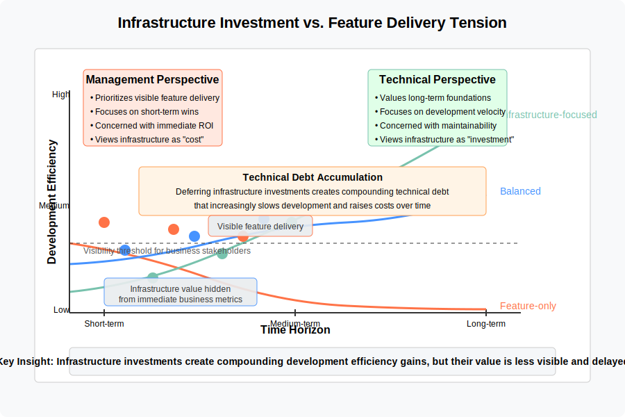

# 4. Stakeholder Dynamics: Competing Perspectives on Domain Complexity

## Table of Contents
- [4.1 Management vs. Technical Specialist Preferences](#41-management-vs-technical-specialist-preferences-through-the-lens-of-underfitting-and-overfitting)
- [4.2 Potential Conflicts and Tradeoffs](#42-potential-conflicts-and-tradeoffs)
- [4.3 Balancing Stakeholder Perspectives](#43-balancing-stakeholder-perspectives)
- [4.4 The Fitting Paradox: A Stakeholder-Driven Phenomenon](#44-the-fitting-paradox-a-stakeholder-driven-phenomenon)
- [4.5 Visualizing Stakeholder Dynamics Around Domain Complexity](#45-visualizing-stakeholder-dynamics-around-domain-complexity)
- [4.6 AI Integration and Stakeholder Dynamics](#46-ai-integration-and-stakeholder-dynamics)

This chapter examines stakeholder preferences specifically related to domain representation complexity—how thoroughly organizational models, systems, and approaches capture the essential complexity of the problems they aim to solve. While Chapter 3 focused on structural complexity (the elaborateness of organizational mechanisms, hierarchies, and processes), here we examine how different stakeholders perceive and value the complexity of domain models themselves. The interplay between these two dimensions—structural complexity and domain representation—creates the "Fitting Paradox" introduced in Section 3.3.8, where organizations can simultaneously exhibit structural overfitting while underfitting domain complexity.

## 4.1 Management vs. Technical Specialist Preferences Through the Lens of Underfitting and Overfitting

For the purpose of this chapter, 'model complexity' refers broadly to the intricacy of designs concerning organizational structures, processes, software systems, or the information they handle, viewed through the lens of the underfitting/overfitting spectrum. More formally, organizational complexity can be understood as the amount of differentiation or variety within the elements constituting an organization, such as the number of different professional specializations required (Dooley, 2002) [^14]. The tension of overfitting/underfitting often revolves around correctly identifying and addressing what Fred Brooks termed *essential complexity*—the inherent difficulty of the problem domain—versus managing *accidental complexity* introduced by our tools and methods[^10].

When developing organizational structures and software systems, a persistent pattern emerges in the preferences of different stakeholder groups regarding model complexity. This pattern can be understood through the underfitting and overfitting framework established in previous chapters. Different stakeholders often unconsciously position themselves at different points along this spectrum based on their roles, responsibilities, and perspectives.

Management stakeholders typically favor simpler models that risk underfitting the domain complexity, while technical specialists often advocate for more detailed approaches that might risk overfitting in some contexts. These divergent positions create a productive tension that, when properly managed, can help organizations find appropriate model complexity for their specific context.

### 4.1.1 Management Preference for Simpler Models: The Risk of Underfitting

Management stakeholders, including executives, directors, and program managers, typically prefer and advocate for simpler, more standardized domain models. It's important to note that this preference relates specifically to domain representation, not necessarily organizational structure—in fact, management may simultaneously create complex organizational structures (as discussed in Chapter 3) while preferring simplified domain models, illustrating the "Fitting Paradox." While management's preference for simpler domain models offers significant benefits, it can sometimes lead to underfitting—creating models that are too simplistic to adequately address the complexity of the domain.

This preference for simplicity is often driven by several key factors that align with management's organizational responsibilities:

#### Cost and Resource Efficiency
Simpler models are generally less expensive to implement and maintain, requiring fewer specialized skills and less dedicated support. This aligns with management's responsibility for budgetary control and resource allocation. Research by Burton and Obel (2018) has demonstrated that managers consistently prioritize resource efficiency in organizational design decisions, particularly when facing financial constraints or competitive pressure[^1].

#### Ease of Implementation
Less complex models can be deployed more quickly and with fewer disruptions to existing operations, supporting management's focus on consistent service delivery and business continuity.

#### Scalability
Simpler, more standardized models are often easier to scale across multiple teams, departments, or business units, facilitating management's goals for organizational growth and consistency. Indeed, standardization is a recognized strategy for managing the inherent complexities of large-scale operations, as observed (even) in fields like "Big Science" [^12]. However, standardization introduces its own set of trade-offs and potential rigidities.

#### Control and Governance
Less complex models typically offer clearer oversight mechanisms and more straightforward governance structures, aligning with management's accountability for organizational performance and compliance. Empirical studies have shown that organizational complexity increases monitoring costs and reduces perceived control for management stakeholders (Burton et al., 2020)[^2].

#### Adaptability
Simpler models may appear more adaptable to changing business needs, supporting management's focus on strategic agility and organizational responsiveness.

This drive towards simplification reflects established organizational strategies for coping with complexity. Organizations often attempt to manage environmental complexity by building barriers around their core operations, smoothing input/output transactions, and adopting rules and standardized processes (Thompson, 1967, as cited in Dooley, 2002) [^14]. While effective under stable conditions, these rationalizing approaches risk underfitting when the environment is highly dynamic or the underlying technology is inherently complex.

### 4.1.2 Technical Specialist Perspective: Balancing Necessary Complexity with Simplicity

Technical specialists—including software engineers, data scientists, domain experts, and system architects—often advocate for more detailed and specialized models, but their perspective is more nuanced than simply preferring complexity for its own sake. Experienced technical specialists typically value simplicity and elegance, following principles like "the simplest solution that works" and avoiding unnecessary complexity.

However, their deep domain knowledge and technical expertise make them acutely aware of essential complexity that cannot be abstracted away without significant consequences. Their advocacy for more detailed models typically stems from a desire to address necessary complexity rather than adding gratuitous complication:

#### Essential Domain Complexity
Technical specialists, often deeply familiar with the domain, focus on ensuring the model adequately captures the *essential complexity*[^10]—those aspects of the problem domain that cannot be simplified without compromising functionality. They aim to create models that include only the minimum necessary complexity to address the problem domain effectively, while avoiding accidental complexity that adds no value.

#### Appropriate Abstraction Levels
Experienced specialists seek the right level of abstraction—complex enough to handle the required functionality but no more complex than necessary. They often follow principles like YAGNI ("You Aren't Gonna Need It") to avoid speculative complexity while ensuring the model addresses known requirements.

#### Sustainable Technical Solutions
Rather than maximizing complexity, technical specialists aim to create solutions that accurately reflect domain realities while remaining maintainable and adaptable. They may resist oversimplification when it creates technical debt or will require costly rework later, impacting long-term system viability. This focus on sustainable solutions aligns with Brooks' emphasis on *conceptual integrity*[^11], ensuring the model remains coherent and understandable despite its necessary detail. Research by Ernst et al. (2015) found that technical specialists are significantly more likely than management to identify and prioritize addressing technical debt issues, particularly architectural debt that impacts long-term system viability[^3].

#### Empirical Approach to Edge Cases
While management might view edge case handling as unnecessary complexity, technical specialists often have empirical evidence about the frequency and impact of these edge cases. Their push for handling these cases is typically based on data rather than theoretical concerns.

#### Long-term System Health
Technical specialists' concern for more detailed models often stems from experience with the long-term consequences of oversimplification, having seen how underfitting can lead to fragile systems that cannot evolve to meet changing requirements. However, it's also worth noting Brooks' caution regarding the "second-system effect"[^11], where the desire to incorporate every learned lesson or future possibility can sometimes lead specialists to introduce unnecessary (accidental) complexity, risking a form of overfitting.

From an organizational theory perspective, the specialists' focus on necessary detail can be seen as an attempt to ensure the system possesses sufficient internal variety to cope with the complexity of its environment (Contingency Theory / Requisite Variety) or its underlying technology (Perrow, 1984, as cited in Dooley, 2002) [^14][^15]. They may intuitively recognize the interdependencies that create a "rugged landscape" (Kauffman, 1995, as cited in Dooley, 2002), where simplifying individual components without understanding their interactions leads to suboptimal overall performance [^14][^16].

### 4.1.3 Different Perspectives on Complexity Value

The divergent perspectives of management and technical specialists on model complexity are rooted in fundamentally different perceptions of the costs and benefits associated with increasing complexity. The following visualization illustrates these differing viewpoints:

This visualization reveals key insights into stakeholder dynamics:

* **Management perception**: Management typically sees costs rising linearly with complexity while perceiving diminishing returns in benefits beyond a certain point. Their optimal complexity point tends to be lower on the spectrum.

* **Technical specialists perception**: Technical specialists often perceive higher long-term costs for overly simplistic models and greater long-term benefits from appropriate complexity. Their perception of both cost and benefit curves leads to a higher optimal complexity point.

* **Different optimization goals**: Management's cost concerns typically focus on implementation and operational expenses, while technical specialists emphasize long-term maintainability and adaptability costs.

* **Balanced zone**: Between these different optimal points lies a potential "balanced zone" where organizations can find compromise that acknowledges both perspectives' valid concerns.

Understanding these differing perceptions is crucial for productive collaboration as they explain why different stakeholders advocate for different positions on the complexity spectrum based on their experience and role-based perspectives.

## 4.2 Potential Conflicts and Tradeoffs

The divergent preferences of management and technical specialists regarding model complexity can lead to several potential conflicts and tradeoffs that organizations must navigate. These tensions can be understood through the lens of stakeholder salience theory (Mitchell, Agle & Wood, 1997), which explains how power, legitimacy, and urgency influence stakeholder influence on organizational decisions[^4].

### Resource Allocation Tensions
Management's focus on cost efficiency may conflict with technical specialists' desire for adequate resources to develop more sophisticated models, potentially leading to tensions in budget and resource allocation discussions. According to Mitchell et al.'s stakeholder salience framework, management stakeholders typically possess higher degrees of power and legitimacy in resource allocation decisions, which can create an imbalance in addressing technical concerns around model complexity[^4].

### Timeline Pressures
The implementation speed advantages of simpler models preferred by management may clash with the time required to develop the more detailed models advocated by technical specialists, creating potential conflicts around project timelines and deadlines.

### Quality vs. Standardization
Management's preference for standardization across the organization may conflict with technical specialists' focus on quality and specific optimizations for particular use cases, leading to debates about whether standardization or specialization should be prioritized.

### The Infrastructure Investment Tension
A particularly significant tension in software development contexts emerges around investments in technical infrastructure versus immediate feature delivery. Technical specialists often advocate for investments in abstraction layers, developer tooling, and architectural foundations that have minimal immediate customer-visible impact but significant long-term development efficiency benefits.

This creates a fundamental tension where:

- **Technical specialists** push for:
  - Building abstraction layers that simplify future development
  - Creating internal developer tools and frameworks
  - Establishing technical foundations that enable long-term flexibility
  - Refactoring existing systems to improve maintainability
  - Designing for future extensibility rather than just current requirements

- **Management** often prioritizes:
  - Delivering tangible features with immediate business value
  - Concrete customer-visible improvements
  - Meeting short-term market or business needs
  - Solutions that address current problems without "over-engineering"

This tension is particularly challenging because infrastructure investments are largely invisible to business stakeholders yet have compounding returns over time. Technical debt accumulates when these investments are repeatedly deferred in favor of immediate feature delivery, creating a pattern where development becomes progressively slower and more expensive—a phenomenon that's difficult to attribute to specific past decisions.

Empirical research by Besker, Martini, and Bosch (2019) has quantified this phenomenon, finding that development teams typically spend 23-42% of their time addressing technical debt, with management stakeholders consistently underestimating this impact compared to technical specialists[^5].

The visualization below illustrates this tension between immediate feature delivery and long-term development efficiency, showing how different perspectives lead to different investment priorities:

### Long-term vs. Short-term Focus
Technical specialists might prioritize long-term system quality and maintainability, potentially at the cost of higher initial development time and resource investment, while management may focus more on short-term deliverables and quick wins, creating tensions in project planning and evaluation.

### Communication Challenges
The differing perspectives and technical vocabularies of management and technical specialists can lead to communication challenges, making it difficult to reach consensus on the appropriate level of model complexity.

### 4.2.1 Systemic Risk: Organizational Simplicity vs. Requisite Variety

The tension between management's preference for simpler organizational models and technical specialists' focus on essential domain complexity can lead to a significant systemic risk when viewed through the combined lenses of Conway's Law and Ashby's Law of Requisite Variety (as discussed in Chapters 3 and 6).

Conway's Law suggests that the architecture of a software system will inevitably mirror the communication structure of the organization that builds it. Therefore, management's pursuit of simpler organizational structures often translates directly into simpler, less complex technical architectures. This approach often aligns with what Burns and Stalker (1961) described as a *mechanistic* structure, characterized by hierarchy and specialization, typically suited for stable environments [^13].

However, Ashby's Law dictates that for a system to effectively regulate or manage a complex environment (the problem domain), the system itself must possess a sufficient level of internal variety (complexity) to match the variety of that environment. This principle of *requisite variety*, as discussed in organizational theory (Dooley, 2002, referencing Ashby), mandates that the complexity of the control system (the organization and its technical systems) must match the complexity of the system being controlled (the environment/domain) [^14]. Complex, dynamic environments often necessitate more adaptable, network-based structures—akin to Burns and Stalker's *organic* model—which frequently aligns with the needs perceived by technical specialists.

The critical synthesis emerges here: If an organization adopts a structure whose simplicity is *below* the level required by the inherent complexity of the problem domain (i.e., applying a mechanistic structure to a dynamic environment), Conway's Law implies the resulting technical system will also lack the necessary architectural complexity. By Ashby's Law (or the principle of requisite variety), such a system will be fundamentally incapable of adequately addressing the problem it is intended to solve – it is architecturally predisposed to underfitting due to organizational constraints reflecting a mismatch between structure and environment. This highlights how decisions about organizational design, driven by management preferences for simplicity, can inadvertently impose a ceiling on the technical system's ability to meet its functional requirements, creating a significant risk that requires careful balancing of stakeholder perspectives.

## 4.3 Balancing Stakeholder Perspectives

To effectively navigate the tensions between management and technical specialist preferences regarding model complexity, organizations can adopt several strategies informed by organizational design theory and stakeholder management research:

### 4.3.1 Structured Decision-Making Processes
Implementing clear, structured processes for evaluating the appropriate level of model complexity for different contexts can help balance stakeholder preferences. These processes might include formal assessments of business requirements, technical constraints, and the relative costs and benefits of different approaches. Burton and Obel's contingency framework for organizational design provides a structured approach to evaluating complexity tradeoffs based on environmental conditions, strategic orientation, and task characteristics[^6].

### 4.3.2 Shared Evaluation Criteria
Developing shared criteria for evaluating model complexity can help align stakeholder perspectives. These criteria might include factors such as implementation cost, maintenance requirements, scalability, performance, accuracy, and adaptability to future needs. By explicitly acknowledging the importance of both management and technical concerns, these shared criteria can facilitate more balanced decisions.

### 4.3.3 Staged Implementation Approaches
Adopting staged or incremental implementation approaches can help bridge the gap between stakeholder preferences. For example, starting with a simpler model that addresses core requirements while planning for future enhancements to address additional complexity can satisfy both immediate delivery needs and longer-term quality concerns.

### 4.3.4 Cross-Functional Collaboration
Promoting closer collaboration between management and technical specialists can help build mutual understanding and trust, facilitating more effective negotiation around model complexity. Cross-functional teams, shared planning sessions, and joint problem-solving activities can all support this collaboration.

Mitchell, Agle, and Wood's stakeholder salience framework suggests that organizational decisions are most balanced when all relevant stakeholders have appropriate levels of power, legitimacy, and urgency in the decision-making process[^4]. Organizations can apply this framework to ensure technical specialists have sufficient "voice" in complexity decisions, particularly when they have unique domain expertise that management may lack.

### 4.3.5 Organizational Learning and Adaptation
Treating decisions about model complexity as opportunities for organizational learning can help improve future decision-making. By explicitly reviewing the outcomes of previous decisions about model complexity, organizations can refine their approach based on actual experience rather than stakeholder preferences alone.

### 4.3.6 Complex Systems Safety Perspective on Stakeholder Tensions

The tension between management and technical specialists can be further understood through the lens of complex systems safety theory. Richard Cook's influential work "How Complex Systems Fail"[^9] provides insights that are directly relevant to the underfitting/overfitting tension discussed throughout this chapter. Several of Cook's principles illuminate why the management-technical specialist dynamic is not merely organizational politics, but reflects fundamental properties of complex systems:

#### Complex Systems Run in Degraded Mode
Cook observes that "complex systems run as broken systems"—they continue to function despite containing numerous latent failures and defects. This phenomenon explains why management and technical specialists often have different risk perceptions: 

- **Management perspective:** The system functions adequately with its current level of complexity, suggesting additional complexity is unnecessary overhead
- **Technical perspective:** The system functions *only because* technical specialists continually adapt to compensate for underlying inadequacies and latent failures

This dynamic often remains invisible until catastrophic failure occurs, at which point the technical debt and accumulated simplifications (underfitting) become apparent. Technical specialists' advocacy for appropriate complexity often stems from their direct experience with the system's degraded operation.

#### Change Introduces New Forms of Failure
Cook notes that "changes may actually create opportunities for new, low frequency but high consequence failures." This practical observation illuminates a key aspect of the management-technical specialist dynamic:

- Management stakeholders generally favor addressing known, frequent problems through simplification
- Technical specialists often warn against removing complexity that serves as protection against rare scenarios
- The value of this protective complexity remains invisible until a catastrophic failure occurs

This tension is most evident when organizations implement changes aimed at streamlining operations. While management might see only the benefits of simplification, technical specialists often recognize how simplifications can introduce new vulnerabilities or remove important safeguards against unusual circumstances.

For a deeper theoretical exploration of how this connects to long-tail risk distributions and systems theory, see Chapter 6. For our stakeholder analysis here, what's most important is recognizing that this dynamic creates opposing but valid perspectives:

- Management correctly observes that most day-to-day operations don't require the complexity technical specialists advocate for
- Technical specialists correctly identify that certain complexities, while rarely necessary, are critical for preventing catastrophic failures

This creates a persistent tension in organizations: pressure to simplify models for immediate efficiency versus maintaining sufficient complexity to defend against rare but potentially devastating failures.

#### Multiple Defense Layers and Failure Trajectories
According to Cook, "catastrophe requires multiple failures—single point failures are not enough." Complex systems develop multiple layers of defense against failure, and most potential failure pathways are blocked by these defenses. 

This perspective helps reframe the underfitting/overfitting tension:

- Management simplification efforts may inadvertently remove critical defense layers or redundancies. (This brings to mind Chesterton's fence metaphor: "Do not remove a fence until you know why it was put up in the first place." Systems often contain complexities whose purposes aren't immediately obvious but become apparent only after removal.)
- Technical specialists often advocate for complexity that maintains these defense layers based on their understanding of potential failure trajectories
- Both perspectives provide important safeguards: management against unnecessary complexity and technical specialists against dangerous oversimplification

Organizations that understand this dynamic can develop more nuanced approaches to complexity, preserving critical defense layers while eliminating truly unnecessary complexity.

#### People Continuously Create Safety
Perhaps most importantly, Cook emphasizes that "people continuously create safety" and that "human practitioners are the adaptable element of complex systems." This highlights a critical aspect of the complexity debate:

- Technical specialists often serve as the primary adaptive mechanism in complex systems, making real-time adjustments to compensate for model inadequacies
- Their push for appropriate complexity often stems from firsthand experience with the cognitive and practical burdens of working around oversimplified processes or systems
- Oversimplified models may function only because humans are constantly adapting to fill the gaps, creating invisible cognitive load and stress. (This aligns with Team Topologies' emphasis on cognitive load as a primary consideration in organizational design — excessive simplification often transfers cognitive burden to individuals rather than eliminating it.) This phenomenon, where attempts to reduce complexity in one area inadvertently generate new complexities or burdens elsewhere, has been termed "complexity displacement" in studies of large-scale scientific organizations [^12]. Recognizing this dynamic highlights how simplification efforts, while seemingly beneficial, can shift rather than solve complexity challenges.

This principle suggests that the most effective organizational approach involves recognizing the adaptive role of technical specialists while also acknowledging management's responsibility for overall system viability and efficiency.

By incorporating these systems safety perspectives, organizations can develop a more sophisticated approach to the underfitting/overfitting tradeoff. Rather than seeing management-technical specialist tensions as merely competing preferences, they can be understood as complementary forces helping the organization navigate the inherent challenges of complex systems. This perspective allows for more productive dialogue and better-informed decisions about appropriate model complexity.

## 4.4 The Fitting Paradox: A Stakeholder-Driven Phenomenon

The differing stakeholder perspectives examined throughout this chapter illuminate why organizations so frequently find themselves caught in the Fitting Paradox introduced in Section 3.3.8. Rather than revisiting the definition of the paradox itself, this section explores how stakeholder dynamics directly contribute to its emergence and how organizations can resolve it through stakeholder-focused strategies.

### 4.4.1 How Stakeholder Dynamics Drive the Paradox

The Fitting Paradox isn't merely a theoretical construct but emerges directly from the interaction of stakeholder perspectives and their relative organizational influence:

1. **Management stakeholders** tend to:
   - Create elaborate governance structures, reporting hierarchies, and control mechanisms (contributing to structural overfitting)
   - Simultaneously advocate for simplified, standardized domain models that minimize specialization and variation (promoting domain underfitting)
   - Focus on structural complexity as the primary "complexity" concern

2. **Technical specialists** often:
   - Push for rich domain representations that capture essential complexity (countering domain underfitting)
   - Have limited influence over organizational structures and processes (unable to prevent structural overfitting)
   - View domain representation as the primary "complexity" dimension worth investing in

When stakeholders debate "complexity," they're often talking past each other because they're focused on different dimensions:
- Management concerns typically relate to operational overhead, coordination costs, and bureaucratic inefficiency (structural complexity)
- Technical specialist concerns usually relate to oversimplification of domain concepts, business rules, and system capabilities (domain representation)

These parallel conversations create organizations where elaborate structural complexity coexists with oversimplified domain models — precisely the condition described by the Fitting Paradox. Without explicit awareness of these distinct dimensions, each group addresses a different aspect of the complexity problem while believing they're discussing the same issue.

### 4.4.2 Stakeholder-Focused Strategies for Resolving the Paradox

Resolving the Fitting Paradox requires approaches specifically designed to address the stakeholder dynamics that create it. Building on the theoretical foundations established in Chapter 3, these strategies focus on managing the dual dimensions of complexity:

**1. Bounded Complexity**

Using concepts from Domain-Driven Design (Section 3.5.1) to create well-defined boundaries that allow appropriate complexity within domains while simplifying interfaces between them:

- **Strategic domain classification:** Identify core domains (where competitive advantage lies), supporting domains, and generic subdomains to appropriately allocate complexity investments
- **Bounded contexts:** Establish explicit boundaries within which domain models remain consistent and well-understood
- **Context mapping:** Define clear relationships between different bounded contexts to manage complexity at the interfaces
- **Ubiquitous language:** Develop shared terminology that captures essential domain complexity in a way that's accessible to all stakeholders

This approach allows organizations to concentrate complexity where it delivers the most value while keeping interfaces between domains as simple as possible.

**2. Team Topologies**

Applying the principles discussed in Section 3.5.2 to create team structures that match the natural contours of the problem domain rather than arbitrary organizational divisions:

- **Stream-aligned teams:** Organize teams around value streams that match natural domain boundaries
- **Platform teams:** Create internal platforms that abstract away complexity through well-designed interfaces
- **Enabling teams:** Deploy specialists who can help other teams navigate essential domain complexity
- **Complicated subsystem teams:** For areas requiring deep specialization, create dedicated teams that encapsulate that complexity

These team structures help organizations manage cognitive load while allowing sufficient complexity where it's needed to address domain challenges.

**3. Sociotechnical Alignment**

Recognizing that social structures (teams, departments) and technical structures (systems, components) must co-evolve to maintain alignment with domain realities:

- **Joint optimization:** Design organizational and technical architectures together rather than in isolation
- **Conway's Law awareness:** Understand how communication structures inevitably shape system architectures
- **Inverse Conway Maneuver:** Intentionally structure teams to encourage the emergence of desired system architectures
- **Participatory design:** Involve both management and technical stakeholders in design decisions to ensure balanced representation of concerns

This alignment helps prevent the common scenario where organizational structures force technical architectures that underfit domain complexity.

**4. Minimal Viable Bureaucracy**

Developing the discipline to implement only the structural complexity absolutely necessary for coordination and compliance, while resisting the tendency to add processes that don't directly support domain understanding:

- **Process justification:** Require clear rationale for any structural complexity in terms of its contribution to domain understanding or essential coordination
- **Regular process pruning:** Periodically review and eliminate structural complexity that doesn't demonstrably support domain representation
- **Requisite variety alignment:** Apply Ashby's Law (Section 3.3.7) to ensure structural complexity matches—but doesn't exceed—what's needed to manage domain complexity
- **Complexity budgeting:** Treat structural complexity as a limited resource to be carefully allocated

This approach directly addresses the paradox by challenging the tendency to create elaborate structural mechanisms while simultaneously simplifying domain understanding.

**5. Stakeholder Engagement Strategies**

To bridge the stakeholder perspectives that create the paradox:

*For engaging management stakeholders:*
- Frame domain complexity needs in terms of business outcomes and risk mitigation
- Propose "complexity exchanges" where unnecessary structural complexity is reduced while essential domain complexity is preserved
- Demonstrate how rich domain models can actually simplify governance by embedding business rules directly

*For engaging technical specialists:*
- Acknowledge legitimate concerns about domain representation
- Invite participation in identifying structural complexity that could be eliminated
- Create safe channels for raising concerns about oversimplification without being labeled as "resistant to change"

*For middle management and project leaders:*
- Position these stakeholders as translators between different perspectives
- Equip them with tools to distinguish between the different dimensions of complexity
- Develop facilitation skills specific to complexity-related discussions

**6. Measurement and Evaluation**

To track progress in resolving the paradox:

- **Balanced complexity metrics:** Measure both operational efficiency (structural dimension) and domain effectiveness (representation dimension)
- **Stakeholder alignment surveys:** Regularly assess how well different stakeholders feel their complexity concerns are understood
- **Complexity-related incident tracking:** Monitor issues that arise from either structural overfitting or domain underfitting
- **Decision review processes:** Conduct retrospectives examining whether past decisions appropriately balanced both dimensions

## 4.5 Visualizing Stakeholder Dynamics Around Domain Complexity

To better understand the dynamics between different stakeholders and their perspectives on model complexity, the following visualizations illustrate key concepts.

### 4.5.1 Stakeholder Positions in the Complexity Matrix

This visualization places different stakeholders on a matrix defined by their perception of the value and cost of complexity. Management stakeholders typically appear in the "Low Value, High Cost" quadrant (simplicity advocates), while technical specialists often occupy the "High Value, Low Cost" quadrant (complexity champions). Middle management and other stakeholders fall between these extremes. The visualization helps illuminate how these different perceptions drive organizational tension and decision-making around model complexity.

This matrix approach is supported by research on stakeholder mapping techniques, particularly those derived from Mitchell et al.'s framework that address both the relative influence of stakeholders and their orientations toward specific organizational decisions[^7].

### 4.5.2 Key Tension Points Between Stakeholders

This visualization illustrates the specific areas where management and technical perspectives most frequently encounter friction. These include resource allocation (where management seeks cost minimization while technical teams need adequate resources for sustainable solutions), timeline pressure (market timing vs. technical quality), and edge case handling (core vs. comprehensive coverage -- most common scenarios vs edge cases). For each tension point, the visualization shows both perspectives and suggests resolution strategies that balance competing concerns.

### 4.5.3 Organizational Model Balance Factors

This visualization uses a scale metaphor to illustrate the balancing act in determining appropriate organizational complexity. On one side are factors favoring simpler structures (speed, cost efficiency, autonomy, flow) that risk underfitting, while the other side shows factors driving more complex structures (control, compliance, scaling needs, stability) that risk overfitting. The framework identifies environmental factors that may shift the balance for specific organizations, including market volatility, company size, innovation focus, and regulatory requirements. It also highlights how AI can potentially enable simplification while maintaining coordination capabilities. This balanced approach recognizes that each organization must find its own equilibrium point based on its unique context and requirements.

Burton and Obel's contingency-based approach to organizational design supports this balanced framework, emphasizing that optimal organizational complexity depends on both internal capabilities and external environmental factors[^8]. Their research demonstrates that effective organizations adjust their structural complexity based on the specific contingencies they face rather than following universal principles about simplicity or complexity. This observed organizational behavior, where structure adapts to context, reflects the theoretical principles explored earlier, such as Ashby's Law of Requisite Variety (requiring internal complexity to match external complexity, Section 6.3), the self-organizing nature of dissipative systems responding to environmental shifts (Section 6.2), and the core tenets of sociotechnical adaptation (Section 6.6).

## 4.6 AI Integration and Stakeholder Dynamics

*Note: This section presents emerging considerations rather than established practices. Organizations should adapt these insights to their specific context and risk tolerance.*

As organizations integrate AI capabilities, the relationship between organizational structure and human-AI collaboration will evolve. The following discussion points examine potential implications for organizational restructuring at different time horizons. These observations draw from early implementations and emerging trends, providing strategic considerations for forward-thinking practitioners rather than established theory.

### 4.6.1 Team Composition

**Context:** As AI capabilities mature, organizations face decisions about how to structure teams incorporating both human and artificial intelligence. This includes questions of whether to create specialized AI teams, embed AI capabilities within existing functional teams, or develop hybrid approaches.

**Time Horizon Considerations:**

*Near-term:*
- Organizations primarily create specialized AI teams focused on developing and deploying AI capabilities
- Technical specialists with AI expertise serve as bridges between development and functional teams

*Emerging:*
- Growing emphasis on embedding AI capabilities directly into functional teams
- Rise of hybrid roles combining domain expertise with AI literacy

*Long-term:*
- Potential evolution of team structures where AI systems become recognized team members with defined responsibilities
- Organizations may develop new frameworks for team formation that dynamically integrate human and AI capabilities

**Strategic Questions:** How should organizations balance specialized AI expertise with functional domain knowledge? What team structures best facilitate effective human-AI collaboration while maintaining clear accountability?

### 4.6.2 Responsibility Allocation

**Context:** The integration of AI into organizational processes raises important questions about the allocation of responsibilities between human and artificial intelligence. This includes considerations of appropriate task division, oversight mechanisms, and accountability frameworks.

**Time Horizon Considerations:**

*Near-term:*
- Responsibility allocation primarily follows augmentation models where AI assists humans who maintain decision authority
- Organizations focus on developing clear guidelines for appropriate AI use cases

*Emerging:*
- More nuanced responsibility allocation with some decisions delegated to AI systems with human oversight
- Development of more sophisticated frameworks for shared human-AI decision processes

*Long-term:*
- Potential emergence of complex responsibility networks between human and AI agents
- Organizations may need new governance frameworks addressing human-AI collaboration

**Strategic Questions:** How should responsibility be allocated between human and artificial intelligence to maximize both performance and appropriate accountability? What governance structures effectively manage increasingly sophisticated AI systems?

### 4.6.3 Communication Patterns

**Context:** The introduction of AI systems as information processors and potential decision participants necessitates reconsideration of organizational communication patterns. This includes both technical protocols for human-AI interaction and broader communication structures.

**Time Horizon Considerations:**

*Near-term:*
- Communication with AI systems primarily through dedicated interfaces separate from human communication channels
- Organizations focus on improving human-AI interfaces and interaction models

*Emerging:*
- Integration of AI systems into standard communication channels (email, messaging, meetings)
- Development of protocols for AI participation in collaborative processes

*Long-term:*
- Potential transformation of organizational communication networks incorporating both human and artificial agents
- Organizations may develop new communication structures optimized for multi-agent collaboration

**Strategic Questions:** How should communication structures evolve to effectively integrate AI capabilities? What communication patterns best support collaboration between human and artificial intelligence?

### 4.6.4 Skills Development

**Context:** As AI capabilities evolve, organizations face important questions about skill development for human team members. This includes both technical skills related to AI and broader capabilities for effective human-AI collaboration.

**Time Horizon Considerations:**

*Near-term:*
- Focus on developing specialized technical skills for AI development and implementation
- Organizations prioritize training for effective use of AI tools within existing workflows

*Emerging:*
- Growing emphasis on broader AI literacy across all organizational roles
- Development of collaboration skills specifically for human-AI interaction

*Long-term:*
- Potential emergence of new role categories centered on human-AI collaboration
- Organizations may develop career paths that specifically leverage human strengths complementary to AI capabilities

**Strategic Questions:** What skills will be most valuable for effective human-AI collaboration? How should organizations develop and recognize these skills?

### 4.6.5 Strategic Considerations for Practitioners

Organizations anticipating AI integration should consider:

1. Developing team structures that effectively integrate specialized AI expertise with domain knowledge
2. Creating responsibility frameworks that appropriately allocate tasks between human and artificial intelligence
3. Evolving communication structures to facilitate effective human-AI collaboration
4. Investing in skill development that prepares team members for productive work alongside AI systems

While these considerations remain forward-looking, proactive organizations can begin preparing for these potential developments through strategic planning, targeted experiments, and ongoing evaluation of emerging AI capabilities.

---

## References

[^1]: Burton, R. M., & Obel, B. (2018). The science of organizational design: fit between structure and coordination. Journal of Organization Design, 7(1), 1-13.

[^2]: Burton, R. M., Håkonsson, D. D., Nickerson, J. A., & Obel, B. (2020). Organizational design and dynamics: Coordination and control approaches. Cambridge University Press.

[^3]: Ernst, N. A., Bellomo, S., Ozkaya, I., Nord, R. L., & Gorton, I. (2015). Measure it? Manage it? Ignore it? Software practitioners and technical debt. In Proceedings of the 2015 10th Joint Meeting on Foundations of Software Engineering (pp. 50-60).

[^4]: Mitchell, R. K., Agle, B. R., & Wood, D. J. (1997). Toward a theory of stakeholder identification and salience: Defining the principle of who and what really counts. Academy of Management Review, 22(4), 853-886.

[^5]: Besker, T., Martini, A., & Bosch, J. (2019). Software developer productivity loss due to technical debt—A replication and extension study examining developers' development work. Journal of Systems and Software, 156, 41-61.

[^6]: Burton, R. M., Obel, B., & Håkonsson, D. D. (2015). Organizational design: A step-by-step approach. Cambridge University Press.

[^7]: Ackermann, F., & Eden, C. (2011). Strategic management of stakeholders: Theory and practice. Long Range Planning, 44(3), 179-196.

[^8]: Burton, R. M., & Obel, B. (2004). Strategic organizational diagnosis and design: The dynamics of fit. Springer Science & Business Media.

[^9]: Cook, R. I. (2000). How Complex Systems Fail. Cognitive Technologies Laboratory, University of Chicago. https://how.complexsystems.fail/

[^10]: Brooks Jr, F. P. (1987). No Silver Bullet: Essence and Accidents of Software Engineering. *Computer*, *20*(4), 10-19.

[^11]: Brooks Jr, F. P. (1995). *The Mythical Man-Month: Essays on Software Engineering, Anniversary Edition*. Addison-Wesley Professional.

[^12]: Merz, M., & Sorgner, H. (2022). Organizational complexity in big science: strategies and practices. *Synthese*, *200*(3), 211. https://doi.org/10.1007/s11229-022-03649-3

[^13]: Burns, T., & Stalker, G. M. (1961). *The Management of Innovation*. Tavistock.

[^14]: Dooley, K. J. (2002). Organizational Complexity. In M. Warner (Ed.), *International Encyclopedia of Business and Management* (pp. 5013-5022). Thompson Learning.

[^15]: Perrow, C. (1984). *Normal Accidents: Living with High-Risk Technologies*. Basic Books.

[^16]: Kauffman, S. A. (1995). *At Home in the Universe: The Search for Laws of Self-Organization and Complexity*. Oxford University Press.

[Back to Table of Contents](../README.md)
