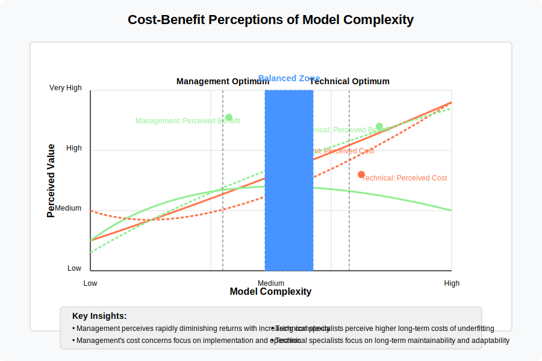
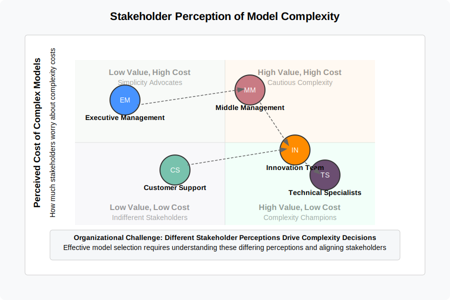
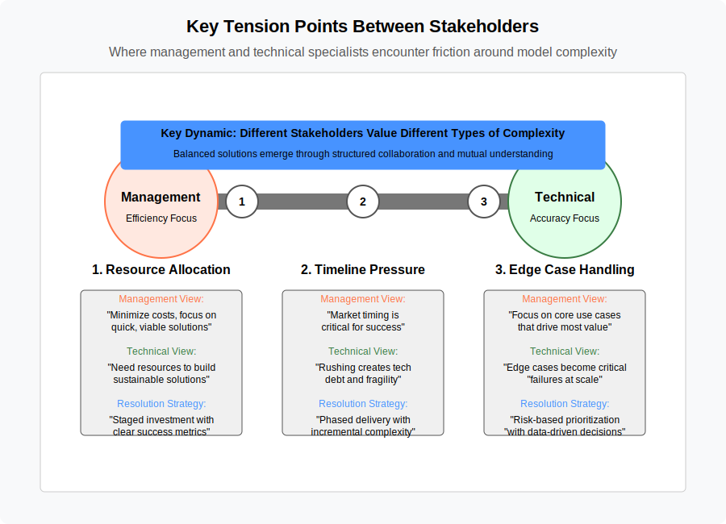
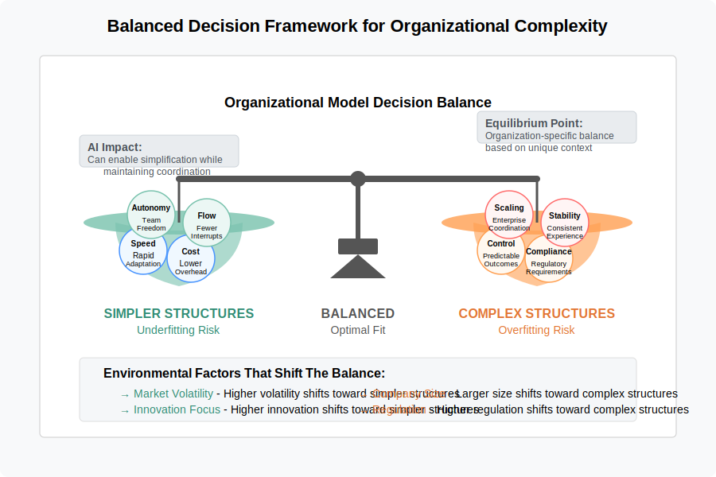

# 4. Stakeholder Preferences and Model Complexity

## 4.1 Management vs. Technical Specialist Preferences Through the Lens of Underfitting and Overfitting

When developing organizational structures and software systems, a persistent pattern emerges in the preferences of different stakeholder groups regarding model complexity. This pattern can be understood through the underfitting and overfitting framework established in previous chapters. Different stakeholders often unconsciously position themselves at different points along this spectrum based on their roles, responsibilities, and perspectives.

Management stakeholders typically favor simpler models that risk underfitting the domain complexity, while technical specialists often advocate for more detailed approaches that might risk overfitting in some contexts. These divergent positions create a productive tension that, when properly managed, can help organizations find appropriate model complexity for their specific context.

### 4.1.1 Management Preference for Simpler Models: The Risk of Underfitting

Management stakeholders, including executives, directors, and program managers, typically prefer and advocate for simpler, more standardized models. While this approach offers significant benefits, it can sometimes lead to underfitting—creating models that are too simplistic to adequately address the complexity of the domain.

This preference for simplicity is often driven by several key factors that align with management's organizational responsibilities:

#### Cost and Resource Efficiency
Simpler models are generally less expensive to implement and maintain, requiring fewer specialized skills and less dedicated support. This aligns with management's responsibility for budgetary control and resource allocation.

#### Ease of Implementation
Less complex models can be deployed more quickly and with fewer disruptions to existing operations, supporting management's focus on consistent service delivery and business continuity.

#### Scalability
Simpler, more standardized models are often easier to scale across multiple teams, departments, or business units, facilitating management's goals for organizational growth and consistency.

#### Control and Governance
Less complex models typically offer clearer oversight mechanisms and more straightforward governance structures, aligning with management's accountability for organizational performance and compliance.

#### Adaptability
Simpler models may appear more adaptable to changing business needs, supporting management's focus on strategic agility and organizational responsiveness.

### 4.1.2 Technical Specialist Perspective: Balancing Necessary Complexity with Simplicity

Technical specialists—including software engineers, data scientists, domain experts, and system architects—often advocate for more detailed and specialized models, but their perspective is more nuanced than simply preferring complexity for its own sake. Experienced technical specialists typically value simplicity and elegance, following principles like "the simplest solution that works" and avoiding unnecessary complexity.

However, their deep domain knowledge and technical expertise make them acutely aware of essential complexity that cannot be abstracted away without significant consequences. Their advocacy for more detailed models typically stems from a desire to address necessary complexity rather than adding gratuitous complication:

#### Essential Domain Complexity
Technical specialists recognize which aspects of domain complexity are essential to model accurately and which can be simplified without significant consequences. Their focus is on creating models that capture the minimum necessary complexity to address the problem domain effectively.

#### Appropriate Abstraction Levels
Experienced specialists seek the right level of abstraction—complex enough to handle the required functionality but no more complex than necessary. They often follow principles like YAGNI ("You Aren't Gonna Need It") to avoid speculative complexity while ensuring the model addresses known requirements.

#### Sustainable Technical Solutions
Rather than maximizing complexity, technical specialists aim to create solutions that accurately reflect domain realities while remaining maintainable and adaptable. They may resist oversimplification when it creates technical debt or will require costly rework later.

#### Empirical Approach to Edge Cases
While management might view edge case handling as unnecessary complexity, technical specialists often have empirical evidence about the frequency and impact of these edge cases. Their push for handling these cases is typically based on data rather than theoretical concerns.

#### Long-term System Health
Technical specialists' concern for more detailed models often stems from experience with the long-term consequences of oversimplification, having seen how underfitting can lead to fragile systems that cannot evolve to meet changing requirements.

### 4.1.3 Different Perspectives on Complexity Value

The divergent perspectives of management and technical specialists on model complexity are rooted in fundamentally different perceptions of the costs and benefits associated with increasing complexity. The following visualization illustrates these differing viewpoints:

This visualization reveals key insights into stakeholder dynamics:

* **Management perception**: Management typically sees costs rising linearly with complexity while perceiving diminishing returns in benefits beyond a certain point. Their optimal complexity point tends to be lower on the spectrum.

* **Technical specialists perception**: Technical specialists often perceive higher long-term costs for overly simplistic models and greater long-term benefits from appropriate complexity. Their perception of both cost and benefit curves leads to a higher optimal complexity point.

* **Different optimization goals**: Management's cost concerns typically focus on implementation and operational expenses, while technical specialists emphasize long-term maintainability and adaptability costs.

* **Balanced zone**: Between these different optimal points lies a potential "balanced zone" where organizations can find compromise that acknowledges both perspectives' valid concerns.

Understanding these differing perceptions is crucial for productive collaboration as they explain why different stakeholders advocate for different positions on the complexity spectrum based on their experience and role-based perspectives.

## 4.2 Potential Conflicts and Tradeoffs

The divergent preferences of management and technical specialists regarding model complexity can lead to several potential conflicts and tradeoffs that organizations must navigate:

### Resource Allocation Tensions
Management's focus on cost efficiency may conflict with technical specialists' desire for adequate resources to develop more sophisticated models, potentially leading to tensions in budget and resource allocation discussions.

### Timeline Pressures
The implementation speed advantages of simpler models preferred by management may clash with the time required to develop the more detailed models advocated by technical specialists, creating potential conflicts around project timelines and deadlines.

### Quality vs. Standardization
Management's preference for standardization across the organization may conflict with technical specialists' focus on quality and specific optimizations for particular use cases, leading to debates about whether standardization or specialization should be prioritized.

### Long-term vs. Short-term Focus
Technical specialists might prioritize long-term system quality and maintainability, potentially at the cost of higher initial development time and resource investment, while management may focus more on short-term deliverables and quick wins, creating tensions in project planning and evaluation.

### Communication Challenges
The differing perspectives and technical vocabularies of management and technical specialists can lead to communication challenges, making it difficult to reach consensus on the appropriate level of model complexity.

## 4.3 Balancing Stakeholder Perspectives

To effectively navigate the tensions between management and technical specialist preferences regarding model complexity, organizations can adopt several strategies:

### Structured Decision-Making Processes
Implementing clear, structured processes for evaluating the appropriate level of model complexity for different contexts can help balance stakeholder preferences. These processes might include formal assessments of business requirements, technical constraints, and the relative costs and benefits of different approaches.

### Shared Evaluation Criteria
Developing shared criteria for evaluating model complexity can help align stakeholder perspectives. These criteria might include factors such as implementation cost, maintenance requirements, scalability, performance, accuracy, and adaptability to future needs. By explicitly acknowledging the importance of both management and technical concerns, these shared criteria can facilitate more balanced decisions.

### Staged Implementation Approaches
Adopting staged or incremental implementation approaches can help bridge the gap between stakeholder preferences. For example, starting with a simpler model that addresses core requirements while planning for future enhancements to address additional complexity can satisfy both immediate delivery needs and longer-term quality concerns.

### Cross-Functional Collaboration
Promoting closer collaboration between management and technical specialists can help build mutual understanding and trust, facilitating more effective negotiation around model complexity. Cross-functional teams, shared planning sessions, and joint problem-solving activities can all support this collaboration.

### Organizational Learning and Adaptation
Treating decisions about model complexity as opportunities for organizational learning can help improve future decision-making. By explicitly reviewing the outcomes of previous decisions about model complexity, organizations can refine their approach based on actual experience rather than stakeholder preferences alone.

## 4.4 Visualizing Stakeholder Dynamics Around Model Complexity

To better understand the dynamics between different stakeholders and their perspectives on model complexity, the following visualizations illustrate key concepts.

### 4.4.1 Stakeholder Positions in the Complexity Matrix

This visualization places different stakeholders on a matrix defined by their perception of the value and cost of complexity. Management stakeholders typically appear in the "Low Value, High Cost" quadrant (simplicity advocates), while technical specialists often occupy the "High Value, Low Cost" quadrant (complexity champions). Middle management and other stakeholders fall between these extremes. The visualization helps illuminate how these different perceptions drive organizational tension and decision-making around model complexity.

### 4.4.2 Key Tension Points Between Stakeholders

This visualization illustrates the specific areas where management and technical perspectives most frequently encounter friction. These include resource allocation (where management seeks cost minimization while technical teams need adequate resources for sustainable solutions), timeline pressure (market timing vs. technical quality), and edge case handling (core vs. comprehensive coverage). For each tension point, the visualization shows both perspectives and suggests resolution strategies that balance competing concerns.

### 4.4.3 Organizational Model Balance Factors

This visualization uses a scale metaphor to illustrate the balancing act in determining appropriate organizational complexity. On one side are factors favoring simpler structures (speed, cost efficiency, autonomy, flow) that risk underfitting, while the other side shows factors driving more complex structures (control, compliance, scaling needs, stability) that risk overfitting. The framework identifies environmental factors that may shift the balance for specific organizations, including market volatility, company size, innovation focus, and regulatory requirements. It also highlights how AI can potentially enable simplification while maintaining coordination capabilities. This balanced approach recognizes that each organization must find its own equilibrium point based on its unique context and requirements.

## 4.5 Case Examples: Stakeholder Tensions in Practice

The following case examples illustrate how the underfitting/overfitting tension between stakeholder groups plays out in real organizational contexts, showing how each perspective can be valid depending on the specific situation.

### Small Software Agency: Finding the Right Model Granularity

A small software development agency faced challenging client negotiations regarding project complexity. Management sought to standardize development processes across client projects to improve resource allocation and predictability, proposing a fixed project model with standardized phases, deliverables, and pricing. 

Technical staff, conversely, emphasized that each client project had unique requirements deserving custom approaches. They warned that a standardized model would either underserve complex projects (underfitting) or impose unnecessary overhead on simpler ones (overfitting to an "average" that doesn't exist).

In this case, **both perspectives had merit**:
- Management correctly identified that completely custom approaches for each project created unsustainable overhead and resource allocation challenges
- Technical specialists correctly identified that certain project types had essential complexity that couldn't be addressed through a standard model without significant risks

**Resolution:** The agency developed a modular project framework with:
- A core process model applicable to all projects
- Optional specialized modules for specific project types or domains
- Clear criteria for when to apply specialized approaches

This hybrid approach satisfied management's need for standardization while addressing technical specialists' concerns about oversimplification.

### Manufacturing Company: Inventory Management Complexity

A manufacturing company's inventory management system revealed similar tensions. Management pursued a simplified inventory model treating all components similarly for streamlined processes and reporting. 

Engineering and production teams highlighted that different component categories required specialized handling due to:
- Varied shelf lives and storage requirements
- Different quality control procedures
- Distinct supply chain characteristics

In this case, **technical specialists correctly identified necessary complexity**:
- Data analysis revealed that categorized inventory management reduced waste by 27%
- Quality issues decreased significantly with specialized handling procedures
- The cost of simplification would have exceeded the administrative savings

**Resolution:** The company implemented a tiered inventory model with:
- Standard processes for routine components
- Specialized workflows for critical categories
- Data aggregation maintaining simplified reporting for management

This approach balanced standardization benefits with the necessary complexity for operational effectiveness.

### Financial Services Firm: Customer Segmentation

A financial services firm debated the appropriate complexity for its customer segmentation model. The marketing department proposed a detailed 12-segment model based on sophisticated behavioral analytics and machine learning, arguing that this granularity would enable highly personalized offerings and communications.

Senior management advocated for a simpler 4-segment approach based primarily on asset levels and product usage, arguing that the more complex model would be difficult to operationalize across the organization.

In this case, **management correctly identified unnecessary complexity**:
- Implementation analysis showed most systems could only act on 4-5 segments effectively
- Staff training costs for the 12-segment model would be prohibitive
- A/B testing revealed only marginal improvement in conversion rates for the more complex model

**Resolution:** The firm adopted a hybrid approach:
- Implemented the 4-segment model for organization-wide use
- Authorized the more granular analysis for specific high-value marketing campaigns
- Established a roadmap for gradually increasing segmentation sophistication as operational capabilities matured

This approach avoided overfitting while creating a path toward greater sophistication where it could deliver measurable value.

---

## 4.5 FORWARD-LOOKING CONSIDERATIONS

*Note: This section presents emerging considerations rather than established practices. Organizations should adapt these insights to their specific context and risk tolerance.*

As organizations integrate AI capabilities, the relationship between organizational structure and human-AI collaboration will evolve. The following discussion points examine potential implications for organizational restructuring at different time horizons. These observations draw from early implementations and emerging trends, providing strategic considerations for forward-thinking practitioners rather than established theory.

### 4.5.1 Team Composition

**Context:** As AI capabilities mature, organizations face decisions about how to structure teams incorporating both human and artificial intelligence. This includes questions of whether to create specialized AI teams, embed AI capabilities within existing functional teams, or develop hybrid approaches.

**Time Horizon Considerations:**

*Near-term:*
- Organizations primarily create specialized AI teams focused on developing and deploying AI capabilities
- Technical specialists with AI expertise serve as bridges between development and functional teams

*Emerging:*
- Growing emphasis on embedding AI capabilities directly into functional teams
- Rise of hybrid roles combining domain expertise with AI literacy

*Long-term:*
- Potential evolution of team structures where AI systems become recognized team members with defined responsibilities
- Organizations may develop new frameworks for team formation that dynamically integrate human and AI capabilities

**Strategic Questions:** How should organizations balance specialized AI expertise with functional domain knowledge? What team structures best facilitate effective human-AI collaboration while maintaining clear accountability?

### 4.5.2 Responsibility Allocation

**Context:** The integration of AI into organizational processes raises important questions about the allocation of responsibilities between human and artificial intelligence. This includes considerations of appropriate task division, oversight mechanisms, and accountability frameworks.

**Time Horizon Considerations:**

*Near-term:*
- Responsibility allocation primarily follows augmentation models where AI assists humans who maintain decision authority
- Organizations focus on developing clear guidelines for appropriate AI use cases

*Emerging:*
- More nuanced responsibility allocation with some decisions delegated to AI systems with human oversight
- Development of more sophisticated frameworks for shared human-AI decision processes

*Long-term:*
- Potential emergence of complex responsibility networks between human and AI agents
- Organizations may need new governance frameworks addressing human-AI collaboration

**Strategic Questions:** How should responsibility be allocated between human and artificial intelligence to maximize both performance and appropriate accountability? What governance structures effectively manage increasingly sophisticated AI systems?

### 4.5.3 Communication Patterns

**Context:** The introduction of AI systems as information processors and potential decision participants necessitates reconsideration of organizational communication patterns. This includes both technical protocols for human-AI interaction and broader communication structures.

**Time Horizon Considerations:**

*Near-term:*
- Communication with AI systems primarily through dedicated interfaces separate from human communication channels
- Organizations focus on improving human-AI interfaces and interaction models

*Emerging:*
- Integration of AI systems into standard communication channels (email, messaging, meetings)
- Development of protocols for AI participation in collaborative processes

*Long-term:*
- Potential transformation of organizational communication networks incorporating both human and artificial agents
- Organizations may develop new communication structures optimized for multi-agent collaboration

**Strategic Questions:** How should communication structures evolve to effectively integrate AI capabilities? What communication patterns best support collaboration between human and artificial intelligence?

### 4.5.4 Skills Development

**Context:** As AI capabilities evolve, organizations face important questions about skill development for human team members. This includes both technical skills related to AI and broader capabilities for effective human-AI collaboration.

**Time Horizon Considerations:**

*Near-term:*
- Focus on developing specialized technical skills for AI development and implementation
- Organizations prioritize training for effective use of AI tools within existing workflows

*Emerging:*
- Growing emphasis on broader AI literacy across all organizational roles
- Development of collaboration skills specifically for human-AI interaction

*Long-term:*
- Potential emergence of new role categories centered on human-AI collaboration
- Organizations may develop career paths that specifically leverage human strengths complementary to AI capabilities

**Strategic Questions:** What skills will be most valuable for effective human-AI collaboration? How should organizations develop and recognize these skills?

### 4.5.5 Strategic Considerations for Practitioners

Organizations anticipating AI integration should consider:

1. Developing team structures that effectively integrate specialized AI expertise with domain knowledge
2. Creating responsibility frameworks that appropriately allocate tasks between human and artificial intelligence
3. Evolving communication structures to facilitate effective human-AI collaboration
4. Investing in skill development that prepares team members for productive work alongside AI systems

While these considerations remain forward-looking, proactive organizations can begin preparing for these potential developments through strategic planning, targeted experiments, and ongoing evaluation of emerging AI capabilities.

---

[Back to Table of Contents](../README.md)
