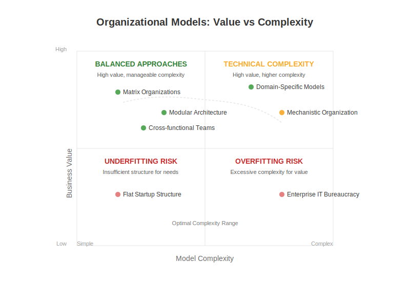

# 4. Stakeholder Preferences and Model Complexity

## 4.1 Management Preferences

Management often exhibits a preference for simpler and more scalable models in software development and organizational design. This inclination is driven by several key factors:

### Key Drivers
- Cost efficiency
- Ease of implementation across large teams
- Better perceived control
- Simpler understanding of processes

### Focus on Scalability
Scalable business models are highly valued by management because they:
- Allow for growth without significant structural changes
- Enable increased revenue without proportional cost increases
- Facilitate expansion across the organization

### Risk of Underfitting
The emphasis on repeatability and standardized processes in scalable models can lead to:
- Oversimplified approaches
- Potential underfitting of specific project complexities
- Reduced effectiveness for specialized teams.

> See also: [Scalable business models - how to use them for business growth](https://serengetitech.com/business/scalable-business-models-how-to-use-them-for-business-growth/) -- a consulting company frames scalability as the capacity to let revenue out‑run costs, arguing that this requires clear leadership, repeatable processes, modular tech and strict cash‑flow discipline; that promise of growth without structural upheaval explains why managers gravitate toward “scalable” models in both software and organization design.

## 4.2 Technical Specialists Preferences

In contrast to management, technical specialists often prefer more detailed and precise models that reflect the intricacies of their domain. 
Their focus on accuracy and the ability to account for specific technical challenges and nuances drives this preference.
For instance, in fields like building information modeling or artificial intelligence evaluation, technical experts emphasize
the importance of detailed representations and precise criteria. This desire for specificity can sometimes lead to the development
of models that might appear overly complex or "overfit" from a management perspective, as they incorporate a high level of detail
that might not be immediately apparent or deemed necessary by those with a broader, less technical focus.

## 4.3 Potential Conflicts and Trade-offs

The divergent preferences between management and technical specialists regarding model complexity often create organizational tensions.

While management might prioritize simpler, scalable models for budgetary and strategic reasons, technical teams often advocate for more detailed models to ensure accuracy and address the specific challenges of their work.

Navigating these conflicting preferences requires organizations to establish clear communication channels and processes for understanding the trade-offs involved in choosing the level of model complexity. 

Tools like the [Value vs Complexity Matrix](https://fibery.io/blog/product-management/value-complexity-matrix/) can help in assessing the benefits of model detail against the effort required to implement it. 

Ultimately, a balance must be struck that considers both the strategic objectives of the organization and the technical requirements of the work being done, often involving compromises on both sides to achieve a model that is both effective and manageable

[Back to Table of Contents](../README.md)
