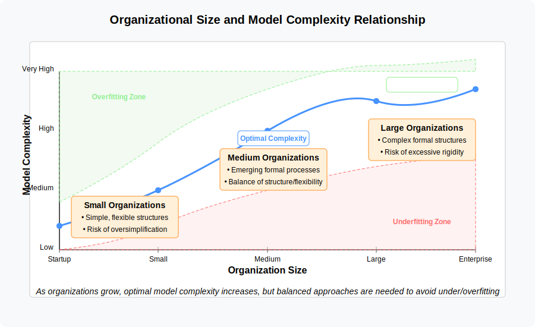
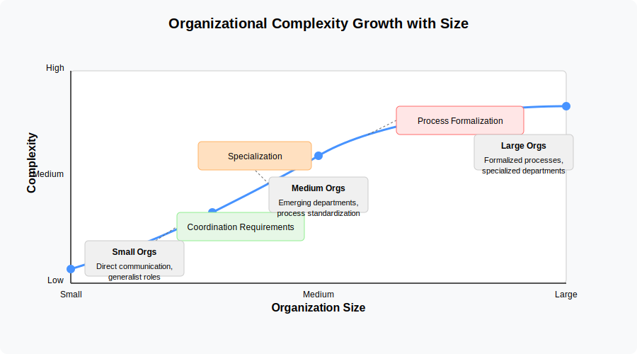
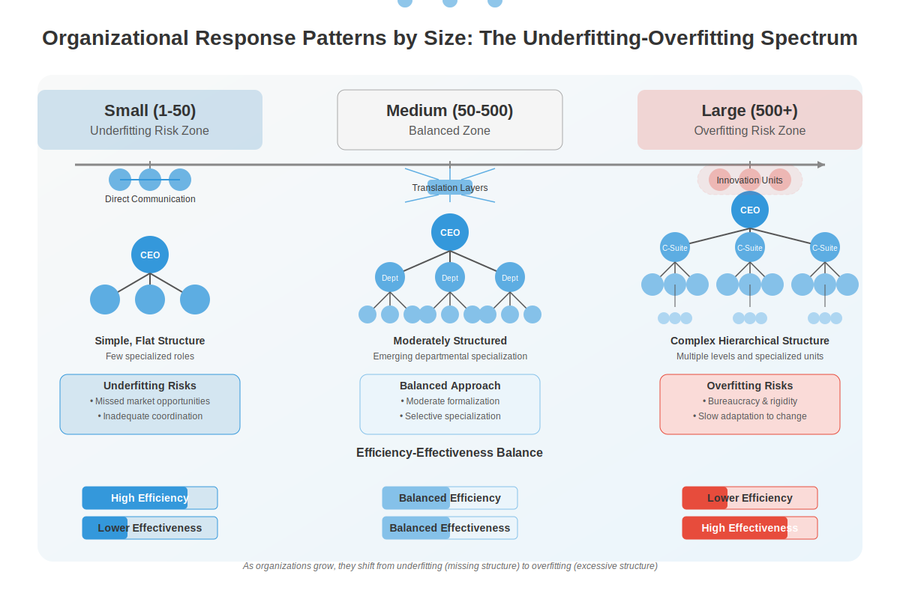

# 5. Organization Size and Approach to Complexity

## 5.1 The Relationship Between Organizational Size and Model Complexity

The relationship between the size of an organization and the appropriate complexity of its operating model is neither linear nor trivial. As organizations grow, the demands on their operational frameworks multiply exponentially, creating a tension between efficiency and effectiveness.

In this context, **efficiency** refers to doing things in the most resource-saving way possible — minimizing time, effort, or cost. **Effectiveness**, on the other hand, means achieving the desired outcomes or goals, even if it requires more resources. As organizations grow, they often face a trade-off: highly efficient processes may not always be the most effective at handling complex or changing situations, and vice versa.

### 5.1.2 Complexity Growth with Size

Small organizations typically benefit from simpler, more flexible operating models that prioritize agility and rapid iteration over process formalization.

As organizations grow in size, they naturally encounter greater operational and structural complexity. This complexity stems from several factors:

- **Increased specialization**: Larger organizations typically develop more specialized roles and departments to address specific business functions
- **Greater coordination needs**: With more people and units, the coordination requirements grow exponentially
- **Market complexity**: Larger organizations often serve more diverse markets, necessitating differentiated approaches
- **Higher stakeholder diversity**: More stakeholders with varying, sometimes conflicting expectations must be managed
- **Process formalization**: Growth generally requires more formalized processes to maintain consistency

In response to this growing complexity, organizations develop increasingly sophisticated models and frameworks to manage their operations. This progression follows a general pattern where operational realities drive increased structural complexity.

### 5.1.2 Organizational Response Patterns

Organizations of different sizes tend to exhibit distinctive patterns in how they approach model complexity:

#### Small Organizations (1-50 employees)
- **Typical approach**: Favor simplicity and flexibility
- **Model characteristics**: Flat structures, generalist roles, informal coordination
- **Risk profile**: More prone to underfitting by applying overly simple models to problems that may require more nuanced handling
- **Adaptation mechanism**: Rely on direct communication and tacit knowledge to handle complexity not captured in formal models
- **Efficiency/Effectiveness Note**: This focus on efficiency — doing more with less — often leads small organizations to favor simple, flexible models. While this maximizes resource use, it can result in underfitting: the organization's models may be too simplistic to address emerging complexities, sacrificing effectiveness for efficiency.

#### Medium Organizations (50-500 employees)
- **Typical approach**: Begin formalizing structures while maintaining adaptability
- **Model characteristics**: Emerging departmentalization, initial process standardization
- **Risk profile**: Experience tension between underfitting and overfitting as they develop more sophisticated models
- **Adaptation mechanism**: Develop middle management layers that act as "translators" between high-level strategic models and day-to-day operations. For example, a middle manager might take a company-wide initiative to "improve customer satisfaction" and translate it into specific process changes, training programs, and metrics for their team while adapting it to their team's unique challenges and capabilities. This translation layer helps prevent both overfitting (by customizing broad directives to local needs) and underfitting (by ensuring high-level strategies are implemented with appropriate detail)
- **Efficiency/Effectiveness Note**: As organizations grow, they must balance efficiency and effectiveness. Medium-sized organizations often experience tension between maintaining efficient, streamlined processes and introducing more effective, structured approaches. This balancing act can lead to both underfitting (if efficiency is overemphasized) and overfitting (if effectiveness is pursued through excessive formalization).

#### Large Organizations (500+ employees)
- **Typical approach**: Implement comprehensive formal models and frameworks
- **Model characteristics**: Hierarchical structures, specialized departments, formalized processes
- **Risk profile**: More prone to overfitting by creating excessively detailed models that may be rigid or disconnected from changing realities
- **Adaptation mechanism**: Establish specialized units for adaptation and innovation outside standard processes, while maintaining middle management's translation role. For example, a large technology company might create an "innovation lab" that operates with startup-like agility to prototype new ideas, while middle managers help integrate successful innovations back into the main organization by adapting them to their teams' specific contexts and capabilities. Another example is when large organizations establish "digital transformation offices" that develop new technological approaches, with middle management acting as crucial bridges to ensure these initiatives are appropriately tailored to different business units' needs
- **Efficiency/Effectiveness Note**: Large organizations tend to prioritize effectiveness — ensuring that processes and structures can handle a wide range of scenarios and risks. However, this drive for effectiveness can lead to overfitting: models become so complex and resource-intensive that efficiency suffers, making the organization less agile and more costly to operate.

## 5.2 Empirical Evidence from Organizational Research

Research from organizational science provides substantial evidence for the relationship between organization size and approach to complexity:

### 5.2.1 Blau's Studies on Bureaucratization

Peter Blau's research on organizational structure (Blau, 1970; Blau & Schoenherr, 1971) demonstrated that as organizations grow, they tend to develop more elaborate administrative hierarchies and greater formalization. His studies, which examined diverse organizations ranging from government agencies to manufacturing firms, found that structural differentiation — both vertical (hierarchical layers) and horizontal (departmentalization) — increases with organizational size, though at a decreasing rate.

> Blau, P. M. (1970). A formal theory of differentiation in organizations. American Sociological Review, 35(2), 201-218.
> Blau, P. M., & Schoenherr, R. A. (1971). The Structure of Organizations. Basic Books.

This pattern suggests that larger organizations develop more complex models to manage their operations, potentially leading to higher risks of overfitting as structures become more elaborate than operational needs may require.

### 5.2.2 Contingency Theory and Organizational Size

Research in contingency theory — which proposes that there is no single best way to organize and that different environments require different organizational approaches — particularly work by scholars like Henry Mintzberg, indicates that effective organizational design depends on aligning structural complexity with contextual factors, with size being a critical determinant. Mintzberg's configurations framework suggests that as organizations grow, they tend to progress from simple structures to more complex forms like machine bureaucracies (characterized by highly standardized work processes, formalized procedures, and clear hierarchies of authority) or divisionalized forms.

This progression reflects an increasing formalization of organizational models that corresponds with growth, with the risk that larger organizations may develop structural configurations that are more rigid than dynamic environments warrant.

### 5.2.3 Studies on Digital Transformation and Size

More recent research on digital transformation indicates that organizational size significantly influences approach to technology adoption and integration. Larger organizations typically develop more comprehensive digital transformation frameworks but may struggle with implementation flexibility. Smaller organizations often take more incremental, less formalized approaches but may lack the necessary structural sophistication for complex technological integration.

This pattern illustrates how size influences not only structural models but also the frameworks organizations develop for managing technological change, with corresponding risks of under- or overfitting.

## 5.3 Case Studies: Size and Model Complexity

### 5.3.1 Zappos' Holacracy Experiment: Ambition and Challenge in Organizational Restructuring

Zappos' experiment with holacracy under CEO Tony Hsieh provides an insightful case of radical organizational restructuring in a well-known company. In 2013, Hsieh began implementing holacracy — a system that replaces traditional hierarchy with self-organizing "circles" where employees take on roles according to their skills and preferences, rather than fixed job titles and reporting lines.

The implementation of holacracy at Zappos was ambitious but also challenging. Approximately 14% of employees (including 20% of the technology department) chose to leave the company when offered severance packages during the transition. The case demonstrates the real-world difficulties of implementing radical organizational changes, even in companies with strong, adaptive cultures. Over time, Zappos' approach evolved away from pure holacracy toward a more market-based system, reflecting the need to adapt structural innovations to practical realities.

This case is particularly valuable because it highlights both the ambition of structural innovation and the practical challenges of implementation, including employee adaptation, cultural fit, and the evolution of organizational models in response to experience.

**Efficiency/Effectiveness Note:** Zappos' holacracy experiment sought to increase effectiveness by fostering adaptability and distributed decision-making. However, the transition also revealed efficiency challenges and the importance of cultural alignment, illustrating that even innovative models require careful adaptation to organizational context.

**References:**
- "Tony Hsieh at Zappos: Structure, Culture and Change" (2016), INSEAD case study: https://publishing.insead.edu/case/tony-hsieh-zappos-structure-culture-and-change
- "For Zappos' Tony Hsieh, 'Holacracy' Is the Right Fit" (2016), Knowledge at Wharton: https://knowledge.wharton.upenn.edu/article/zappos-tony-hsieh-holacracy-right-fit/
- "Zappos CEO Tony Hsieh's Biggest Management Experiment Is Evolving Again" (2020), Inc.com: https://www.inc.com/cameron-albert-deitch/zappos-tony-hsieh-holacracy-market-system.html
- "Tony Hsieh at Zappos: Structure, Culture and Radical Change", The Case Centre: https://www.thecasecentre.org/caseSpotlight/2018/Zappos

### 5.3.2 NASA's Matrix Organization: Managing Complexity in Large-Scale Projects

NASA pioneered the matrix organizational structure in the 1960s during the Apollo program. As a large organization managing complex projects with multiple stakeholders, NASA developed this approach to balance functional expertise with project needs. Their matrix structure helped them manage the extreme complexity of space missions while maintaining specialized technical knowledge.

NASA's implementation created what has been described as "a hierarchy of purpose" rather than just people, allowing for both specialization and coordination across different centers and contractors. The matrix structure enabled project managers to draw on the expertise of functional departments while maintaining accountability for mission outcomes. This dual-reporting system was essential for handling the unprecedented complexity of putting humans on the moon.

The NASA case demonstrates how large organizations can develop sophisticated structures to manage extremely complex projects while balancing technical specialization with cross-functional coordination. The matrix approach, while powerful, also introduced challenges such as potential conflicts between project and functional managers, requiring clear communication and strong leadership to resolve.

**Efficiency/Effectiveness Note:** NASA's matrix structure prioritized effectiveness — ensuring that the organization could coordinate vast technical expertise and resources to achieve ambitious goals. While this increased structural complexity, it was necessary to manage the scale and risk of the Apollo missions, illustrating how large organizations may need to accept greater complexity to achieve effectiveness in highly demanding environments.

**References:**
- "The Future of Management: The NASA Paradigm" from the Space Resources collection: https://nss.org/settlement/nasa/spaceresvol4/future.html
- "Matrix Organization and Organizational Networks" (diagrams and analysis): https://www.laetusinpraesens.org/docs70s/71next/nextxb.php
- "Do Shocks Change Organizations? The Case of NASA" (Journal of Public Administration Research and Theory): https://academic.oup.com/jpart/article/22/3/395/1045831
- "The Matrix Organization" (Project Management Institute): https://www.pmi.org/learning/library/matrix-organization-structure-reason-evolution-1837

### 5.3.3 Haier's RenDanHeYi Model: Radical Decentralization in a Large Organization

Haier, the world's largest appliance manufacturer, provides an example of how a large organization can implement radical decentralization to maintain agility and entrepreneurial spirit. Under the leadership of CEO Zhang Ruimin, Haier transformed from a traditional hierarchical structure into the RenDanHeYi model, which is characterized by the creation of thousands of autonomous microenterprises.

This organizational innovation dismantled traditional bureaucracy by removing approximately 12,000 middle managers and reorganizing employees into microenterprises that function as independent businesses with direct customer relationships. Each microenterprise is responsible for its own profit and loss, hiring decisions, and compensation structures. The model is designed to foster a high degree of autonomy, accountability, and market responsiveness, while still enabling coordination through shared platforms and internal contracting mechanisms.

The Haier case illustrates how even very large organizations migth be able to maintain entrepreneurial characteristics and adaptability through structural design that balances autonomy with coordination, attracted both academic and managerial interest as a pioneering approach to organizational design in the digital age.

**Efficiency/Effectiveness Note:** Haier's RenDanHeYi model seeks to optimize both efficiency and effectiveness by empowering microenterprises to act with entrepreneurial speed and customer focus, while leveraging the scale and resources of the broader organization. This approach demonstrates how large organizations can avoid both underfitting and overfitting by continuously adapting their structures to support innovation and responsiveness.

**References:**
- "Management Innovation Made in China: Haier's Rendanheyi" (2018), California Management Review: https://www.researchgate.net/publication/326725496_Management_Innovation_Made_in_China_Haier's_Rendanheyi
- "Shattering the status quo: A conversation with Haier's Zhang Ruimin" (2021), McKinsey Quarterly: https://www.mckinsey.com/capabilities/people-and-organizational-performance/our-insights/shattering-the-status-quo-a-conversation-with-haiers-zhang-ruimin
- "How Haier works" (2024), IMD: https://www.imd.org/ibyimd/leadership/how-haier-works-how-culture-has-shaped-the-worlds-leading-home-appliance-maker/
- "Studying Org Designs of Haier's RDHY and Bayer's DSO" (2025): https://www.orgtopologies.com/post/studying-org-designs-of-haier-s-rdhy-and-bayer-s-dso

## 5.4 Strategies for Appropriate Model Scaling

Organizations can use several strategies to develop appropriate model complexity as they grow:

### 5.4.1 Incremental Formalization

Rather than implementing comprehensive structural changes, organizations can gradually formalize elements of their operations as complexity requires. This might involve:
- Documenting processes that have proven effective through practice
- Adding structural elements to address specific coordination challenges
- Implementing systems to manage particular information flows
- Formalizing roles based on emerging specialization needs

This incremental approach helps avoid premature overfitting by allowing the organization to develop complexity in response to demonstrated needs rather than anticipatory design.

### 5.4.2 Regular Model Assessment

Organizations can establish regular review processes to evaluate whether their structural models remain appropriate for their current size and operational needs. These assessments might consider:
- Whether current formalization levels support or hinder key outcomes
- Where communication or decision bottlenecks indicate model inadequacy
- How effectively the organization responds to new challenges or opportunities
- Whether the current structure appropriately balances stability and adaptability

These reviews provide a mechanism for organizational learning about model fit and can trigger appropriate adjustments when misalignment is detected.

### 5.4.3 Differentiated Formalization

Organizations can differentiate formalization levels across functions based on stability, predictability, and innovation needs. For example:
- Core operational processes might warrant greater standardization
- Innovation activities might benefit from more flexible structures
- Customer-facing functions might require adaptability for responsiveness
- Compliance functions might need higher formalization for reliability

This differentiated approach recognizes that appropriate model complexity may vary across organizational subsystems, allowing for tailored formalization rather than uniform application.

### 5.4.4 Minimum Viable Bureaucracy

Organizations can adopt a "minimum viable bureaucracy" approach that deliberately limits structural complexity to what is essential for effective coordination. This involves:
- Critically evaluating each proposed structural addition or process requirement
- Testing simplified approaches before implementing more complex solutions
- Regularly pruning unnecessary processes or reporting relationships
- Designing for coordination effectiveness rather than control

This approach creates a counterbalance to the natural tendency toward increasing formalization, helping maintain appropriate model complexity across growth stages.

## 5.5 FORWARD-LOOKING CONSIDERATIONS

*Note: This section presents emerging considerations rather than established practices. Organizations should adapt these insights to their specific context and risk tolerance.*

As organizations navigate complexities of growth while integrating AI capabilities, several emerging considerations will influence their approach to finding appropriate model complexity. These observations draw from current organizational developments and technology trends, providing strategic considerations rather than established theory.

### 5.5.1 AI-Enabled Structural Flexibility

**Context:** Advanced AI systems may enable organizations to maintain simpler formal structures while managing greater complexity through intelligent coordination systems rather than hierarchical management layers.

**Time Horizon Considerations:**

*Near-term:*
- Organizations begin using AI tools to enhance coordination within existing structures
- Limited impact on formal organizational design, with AI primarily supporting existing processes

*Emerging:*
- Development of AI systems specifically designed for organizational coordination
- Reduction in middle management coordination roles in organizations with strong AI capabilities

*Long-term:*
- Potential emergence of "flatter but smarter" organizational models where sophisticated AI systems enable simpler formal structures despite organizational size
- Organizations may develop hybrid human-AI coordination models that significantly alter traditional size-complexity relationships

**Strategic Questions:** How might AI capabilities change the relationship between organizational size and necessary structural complexity? What coordination functions currently requiring management layers might be effectively handled through AI systems?

### 5.5.2 Dynamic Organizational Boundaries

**Context:** AI capabilities may enable more fluid organizational boundaries, allowing organizations to dynamically reconfigure their effective size and complexity in response to changing needs.

**Time Horizon Considerations:**

*Near-term:*
- Organizations increasingly use technology to support temporary collaborations and project-based structures
- Growing use of advanced talent platforms to expand and contract organizational capabilities

*Emerging:*
- Development of AI-enabled organizational orchestration systems that facilitate rapid reconfiguration
- Increasing use of hybrid models blending stable core structures with dynamic peripheral arrangements

*Long-term:*
- Potential emergence of "breathing organizations" that can substantially change their effective size and structure in response to environmental conditions
- The concept of organizational size itself may become more fluid as boundaries between internal and external resources blur

**Strategic Questions:** How might AI enable more dynamic organizational boundaries? What implications would more fluid organizational boundaries have for model complexity requirements?

### 5.5.3 Networked Intelligence Distribution

**Context:** Distributed AI capabilities may change how organizations manage complexity across their size spectrum, potentially altering the traditional relationship between size and formalization.

**Time Horizon Considerations:**

*Near-term:*
- Organizations begin implementing localized AI tools to manage complexity at department levels
- Limited integration between different AI capabilities across the organization

*Emerging:*
- Development of networked AI systems that enable coordinated intelligence distribution
- Growing capability to manage complexity through distributed intelligence rather than hierarchical structures

*Long-term:*
- Potential emergence of organizational models where complexity is managed through intelligence distribution rather than structural formalization
- Organizations may develop new coordination mechanisms based on networked intelligence rather than reporting relationships

**Strategic Questions:** How might distributed AI capabilities change the way organizations manage complexity as they grow? What new organizational structures might emerge when intelligence can be effectively distributed throughout the organization?

### 5.5.4 Strategic Considerations for Practitioners

Organizations navigating growth while preparing for AI integration should consider:

1. Evaluating which aspects of structural complexity currently serve coordination needs versus control needs
2. Identifying coordination functions that might be effectively supported by emerging AI capabilities
3. Experimenting with more flexible structural arrangements supported by enhanced coordination technologies
4. Developing frameworks for assessing appropriate model complexity that account for the impact of AI capabilities

While these considerations remain forward-looking, forward-thinking organizations can begin preparing for these potential developments by adopting more flexible approaches to structural design and remaining attentive to the evolving relationship between size, complexity, and technology.

## 5.6 Parallel Human-AI Teams

*Note: This section presents emerging considerations rather than established practices. Organizations should adapt these insights to their specific context and risk tolerance.*

As organizations integrate AI capabilities, traditional team structures and coordination mechanisms are likely to evolve in significant ways. The following discussion points examine potential implications for team dynamics at different time horizons. These observations draw from early implementations and emerging trends, providing strategic considerations for forward-thinking practitioners rather than established theory.

### 5.6.1 Specialization and Integration

**Context:** As AI capabilities mature, organizations face questions about how to structure work when multiple specialized AI agents collaborate with humans on complex tasks. This includes considerations of task decomposition, information flow, and integration of work outputs.

**Time Horizon Considerations:**

*Near-term:*
- Organizations primarily use individual AI systems for specific, isolated tasks
- Humans manually integrate outputs from different AI and human contributors
- Teams develop ad hoc approaches to coordinating human-AI workflows

*Emerging:*
- More sophisticated coordination of multiple specialized AI agents on related tasks
- Development of formalized handoff protocols between human and AI contributors
- Growing emphasis on integration layer technologies to connect AI and human work

*Long-term:*
- Potential emergence of complex hybrid teams with multiple specialized AI systems and humans working in concert
- Organizations may develop new frameworks for task decomposition that optimally leverage both human and AI capabilities
- Evolution of new team structures that dynamically allocate work across human and AI contributors

**Strategic Questions:** How should work be structured when multiple specialized AI agents collaborate with humans? What frameworks best support the integration of outputs from diverse human and AI contributors?

### 5.6.2 Coordination Mechanisms

**Context:** The integration of AI agents into team structures necessitates reconsideration of traditional coordination mechanisms. This includes both technical protocols for AI-AI coordination and broader frameworks for human-AI collaboration.

**Time Horizon Considerations:**

*Near-term:*
- Adaptation of existing project management frameworks to include AI contributors
- Human mediation of most AI-AI and human-AI interactions
- Limited direct collaboration between different AI systems

*Emerging:*
- Development of specialized coordination mechanisms for human-AI collaboration
- Standardization of APIs and protocols for AI-AI interaction
- Evolution of hybrid coordination approaches combining human judgment with AI capabilities

*Long-term:*
- Potential emergence of fundamentally new coordination frameworks for multi-agent teams
- Organizations may develop sophisticated orchestration systems that dynamically manage human-AI collaboration
- Evolution of new organizational roles focused specifically on human-AI team coordination

**Strategic Questions:** What coordination mechanisms best facilitate effective collaboration in hybrid human-AI teams? How might organizations manage coordination across teams with diverse AI and human contributors?

### 5.6.3 Authority Structures

**Context:** The integration of increasingly capable AI agents into teams raises important questions about authority, decision rights, and leadership in hybrid human-AI contexts.

**Time Horizon Considerations:**

*Near-term:*
- Clear human authority over AI systems across all organizational contexts
- Human leaders retain all significant decision rights
- AI systems serve purely advisory roles with explicit human oversight

*Emerging:*
- More nuanced authority structures with specific decision types delegated to AI systems
- Evolution of "supervisory" human roles with responsibility for multiple AI systems
- Development of clearer frameworks for when AI recommendations should be followed or questioned

*Long-term:*
- Potential emergence of sophisticated authority frameworks balancing AI and human decision rights
- Organizations may develop new leadership models for hybrid human-AI teams
- Evolution of new governance structures for contexts where AI systems demonstrate high capability

**Strategic Questions:** How might authority structures evolve when AI agents can provide expert guidance? What frameworks best balance appropriate human oversight with effective leveraging of AI capabilities?

### 5.6.4 Evaluation and Performance

**Context:** The integration of AI agents into teams creates significant challenges for traditional performance management approaches, requiring new frameworks for evaluating both individual and team effectiveness.

**Time Horizon Considerations:**

*Near-term:*
- Adaptation of existing performance frameworks to address human-AI collaboration
- Separate evaluation of human and AI performance using different metrics
- Limited consideration of team-level metrics specifically for hybrid teams

*Emerging:*
- Development of integrated metrics addressing both human and AI contributions
- Growing focus on evaluating the quality of human-AI collaboration itself
- Evolution of new approaches to continuous improvement in hybrid teams

*Long-term:*
- Potential emergence of sophisticated frameworks specifically designed for evaluating hybrid team performance
- Organizations may develop entirely new metrics for human-AI collaborative effectiveness
- Evolution of more dynamic performance management approaches enabled by AI-supported continuous monitoring

**Strategic Questions:** How should organizations evaluate performance in human-AI collaborative environments? What metrics best capture the value created through effective human-AI teamwork?

### 5.6.5 Strategic Considerations for Practitioners

Organizations anticipating the evolution of team structures with AI integration should consider:

1. Developing task allocation frameworks that optimally leverage the complementary strengths of human and AI contributors
2. Creating coordination mechanisms specifically designed for effective human-AI collaboration
3. Establishing clear but evolving authority structures appropriate to current AI capabilities
4. Implementing performance frameworks that evaluate both individual contributions and collaborative effectiveness

While these considerations remain forward-looking, proactive organizations can begin preparing for these potential developments through strategic planning, targeted experiments, and ongoing evaluation of emerging team structures and dynamics.

## Summary Table: Organization Size, Efficiency/Effectiveness, and Model Fit

| Organization Size | Efficiency Focus | Effectiveness Focus | Typical Risk      | Model Fit Challenge         |
|-------------------|-----------------|--------------------|-------------------|----------------------------|
| Small             | High            | Low                | Underfitting      | Too simple for complexity  |
| Medium            | Balanced        | Balanced           | Both (Tension)    | Finding the right balance  |
| Large             | Lower           | High               | Overfitting       | Too complex, less agile    |

*Table: This table summarizes how organizations of different sizes tend to prioritize efficiency and effectiveness, and how this relates to the risks of underfitting or overfitting their operating models.*

## Concluding Note: Efficiency, Effectiveness, and Model Fit

Throughout organizational growth, the interplay between efficiency and effectiveness shapes the risk of underfitting or overfitting. Small organizations may sacrifice effectiveness for efficiency, while large organizations may do the opposite. Recognizing and managing this trade-off is key to developing appropriately complex models that support both operational excellence and adaptability.

---

[Back to Table of Contents](../README.md)
