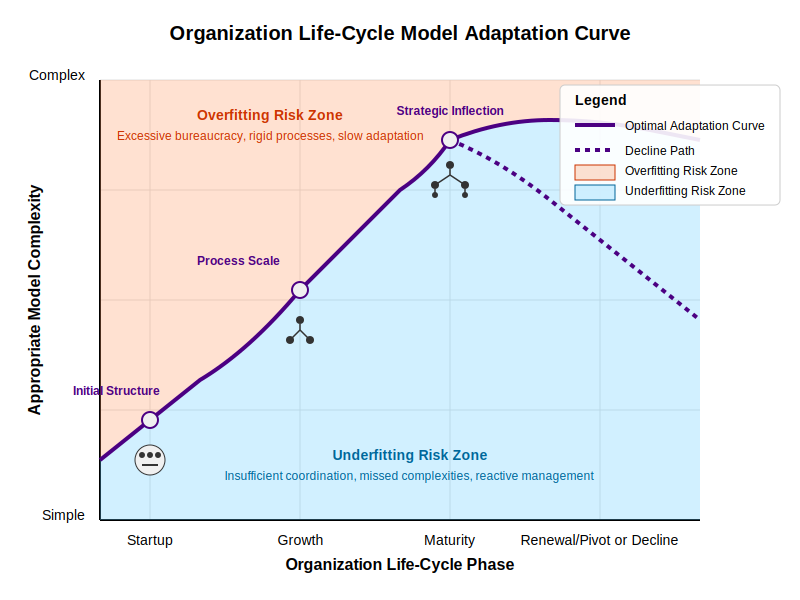
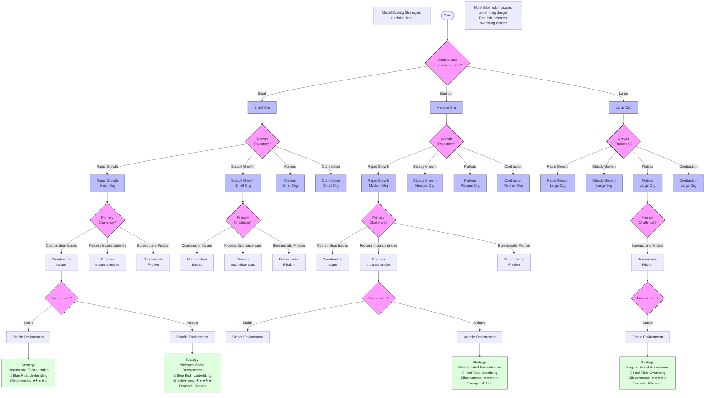
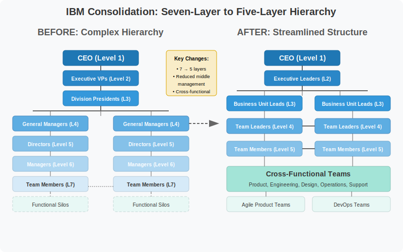
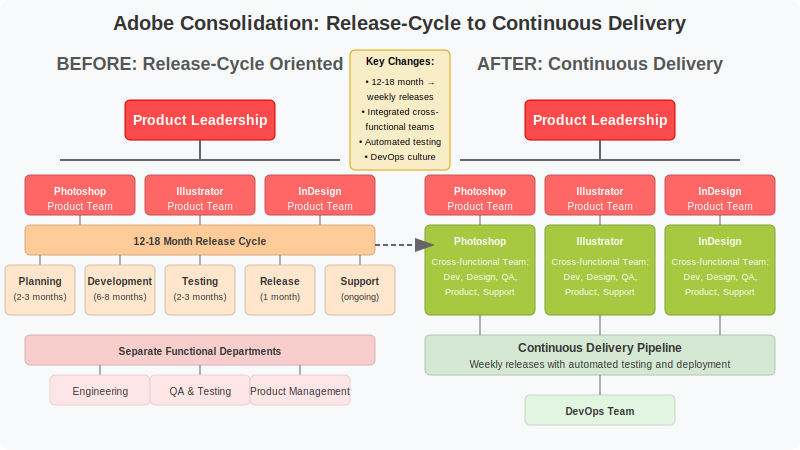
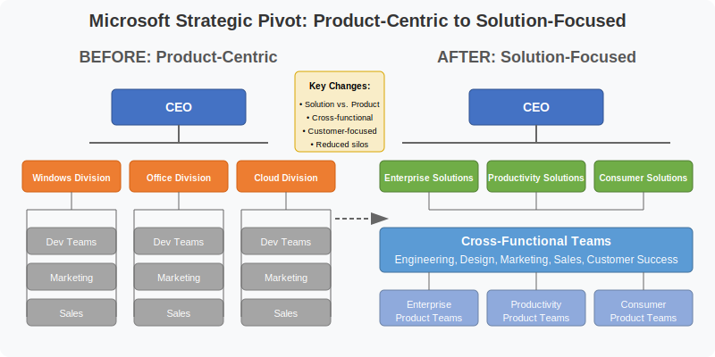
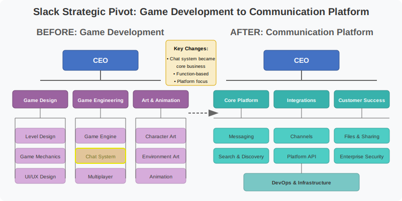

# 5. Organizational Size, Life-Cycle Phases, and Model Adaptation

## Table of Contents
- [5.1 The Relationship Between Organizational Size, Life-Cycle Phase, and Model Adaptation](#51-the-relationship-between-organizational-size-life-cycle-phase-and-model-adaptation)
  - [5.1.1 Efficiency vs. Effectiveness](#511-efficiency-vs-effectiveness)
  - [5.1.2 Complexity Growth with Size](#512-complexity-growth-with-size)
  - [5.1.3 Organizational Response Patterns](#513-organizational-response-patterns)
- [5.2 Empirical Evidence from Organizational Research](#52-empirical-evidence-from-organizational-research)
  - [5.2.1 Blau's Studies on Bureaucratization](#521-blaus-studies-on-bureaucratization)
  - [5.2.2 Contingency Theory and Organizational Size](#522-contingency-theory-and-organizational-size)
  - [5.2.3 Studies on Digital Transformation and Size](#523-studies-on-digital-transformation-and-size)
- [5.3 Case Studies: Organizational Size and Growth Patterns](#53-case-studies-organizational-size-and-growth-patterns)
  - [5.3.1 Zappos' Holacracy Experiment](#531-zappos-holacracy-experiment-ambition-and-challenge-in-organizational-restructuring)
  - [5.3.2 NASA's Matrix Organization](#532-nasas-matrix-organization-managing-complexity-in-large-scale-projects)
  - [5.3.3 Haier's RenDanHeYi Model](#533-haiers-rendanheyi-model-radical-decentralization-in-a-large-organization)
- [5.4 Strategies for Appropriate Model Scaling](#54-strategies-for-appropriate-model-scaling)
  - [5.4.1 Incremental Formalization](#541-incremental-formalization)
  - [5.4.2 Regular Model Assessment](#542-regular-model-assessment)
  - [5.4.3 Differentiated Formalization](#543-differentiated-formalization)
  - [5.4.4 Minimum Viable Bureaucracy](#544-minimum-viable-bureaucracy)
- [5.5 Model Complexity in Downsizing, Consolidation, Pivoting, and Stagnation](#55-model-complexity-in-downsizing-consolidation-pivoting-and-stagnation)
  - [5.5.1 Downsizing and Consolidation](#551-downsizing-and-consolidation)
  - [5.5.2 Stagnation and Pivoting](#552-stagnation-and-pivoting)
  - [5.5.3 Case Example: Simplification After Contraction](#553-case-example-simplification-after-contraction)
  - [5.5.4 Forward-Looking Considerations](#554-forward-looking-considerations)
- [5.6 Case Studies: Model Fit Beyond Growth](#56-case-studies-model-fit-beyond-growth)
  - [5.6.1 IBM's Transformation Under Lou Gerstner](#561-ibms-transformation-under-lou-gerstner-and-beyond-mixed-results-from-structural-changes)
  - [5.6.2 Adobe's Transition to Cloud Subscription Model](#562-adobes-transition-to-cloud-subscription-model-consolidation-around-new-business-model)
  - [5.6.3 Microsoft's Transformation Under Satya Nadella](#563-microsofts-transformation-under-satya-nadella-structural-change-enabling-strategic-pivot)
  - [5.6.4 Slack's Transformation](#564-slacks-transformation-from-game-development-to-communication-platform)
- [5.7 Parallel Human-AI Teams](#57-parallel-human-ai-teams)
  - [5.7.1 Specialization and Integration](#571-specialization-and-integration)
  - [5.7.2 Coordination Mechanisms](#572-coordination-mechanisms)
  - [5.7.3 Authority Structures](#573-authority-structures)
  - [5.7.4 Evaluation and Performance](#574-evaluation-and-performance)
  - [5.7.5 Strategic Considerations for Practitioners](#575-strategic-considerations-for-practitioners)

## 5.1 The Relationship Between Organizational Size, Life-Cycle Phase, and Model Adaptation

The relationship between an organization's size, its life-cycle phase, and the appropriate complexity of its operating model is neither linear nor trivial. As organizations grow, contract, pivot, or stagnate, the demands on their operational frameworks change significantly, creating a dynamic tension between efficiency and effectiveness. Organizations must continuously adapt their operating models to maintain appropriate fit through these transitions.

### 5.1.1 Efficiency vs. Effectiveness

In this context, **efficiency** refers to doing things in the most resource-saving way possible — minimizing time, effort, or cost. **Effectiveness**, on the other hand, means achieving the desired outcomes or goals, even if it requires more resources. Throughout an organization's life cycle, the balance between efficiency and effectiveness shifts, influencing the appropriate complexity of operating models. Small organizations often prioritize efficiency with simpler models, while large organizations typically emphasize effectiveness through more sophisticated frameworks. During phases of contraction or pivoting, organizations face distinct challenges in recalibrating these models to maintain appropriate fit.

> **Note on Public Sector Models:** This efficiency-effectiveness tension is particularly acute in government organizations, where a disproportionate focus on efficiency can undermine effectiveness. While private sector organizations primarily answer to shareholders seeking return on investment, public organizations must serve broader societal goals that often resist straightforward measurement. Recent government reform initiatives often emphasize private-sector-style efficiency, yet public service delivery fundamentally requires effectiveness – achieving outcomes for citizens even when doing so is not the most "efficient" use of resources. This represents a critical distinction when modeling public versus private operating frameworks, as government agencies operate in domains where markets cannot or should not dominate and where multiple competing values beyond efficiency must be balanced.
> 
> Interestingly, government also plays a second critical role as an **enabler of innovation** in various industries. As discussed by Sahni and Singhal (2023) in "US government productivity: The roles government plays," governments can catalyze industry-level productivity improvements through market creation, subsidies, and price signals. This enabling function also applies in technology that is of particular interest to this publication -- AI-assisted software development, where government can serve as both adopter and accelerator. By establishing procurement standards, funding research, creating demonstration projects, and developing ethical guidelines, government organizations can reduce adoption barriers across the software industry while addressing legitimate public concerns. This dual nature—simultaneously pursuing internal efficiency while enabling broader ecosystem effectiveness—creates unique modeling challenges for public sector organizations, requiring frameworks that balance immediate operational metrics with longer-term innovation catalysis that may resist traditional measurement approaches.

As organizations progress through different life-cycle phases—from startup to growth, maturity, and potential decline or renewal—the appropriate complexity of their operating models must adapt accordingly. The visualization below illustrates how model complexity might evolve across these phases, highlighting the risks of both insufficient complexity (underfitting) and excessive complexity (overfitting) at each stage. Organizations must continuously calibrate their structural approaches to maintain the optimal balance between simplicity and sophistication as they navigate transitions in size and strategic focus.

### 5.1.2 Complexity Growth with Size

Small organizations typically benefit from simpler, more flexible operating models that prioritize agility and rapid iteration over process formalization.

As organizations grow in size, they naturally encounter greater operational and structural complexity. This complexity stems from several factors:

- **Increased specialization**: Larger organizations typically develop more specialized roles and departments to address specific business functions
- **Greater coordination needs**: With more people and units, the coordination requirements grow non-linearly (Brooks, 1995). Brooks' Law states that "adding manpower to a late software project makes it later" due to increased communication overhead. This occurs because each new person added to a project increases the number of potential communication channels exponentially, creating coordination challenges that can outweigh productivity gains.
- **Market complexity**: Larger organizations often serve more diverse markets, necessitating differentiated approaches
- **Higher stakeholder diversity**: More stakeholders with varying, sometimes conflicting expectations must be managed
- **Process formalization**: Growth generally requires more formalized processes to maintain consistency

In response to this growing complexity, organizations develop increasingly sophisticated models and frameworks to manage their operations. This progression follows a general pattern where operational realities drive increased structural complexity.

### 5.1.3 Organizational Response Patterns

Organizations of different sizes tend to exhibit distinctive patterns in how they approach model complexity, each facing characteristic risks along the underfitting-overfitting spectrum. As organizations grow, they typically shift from simple, efficient models that may underfit complex realities to more sophisticated approaches that risk overfitting through excessive formalization. This progression represents a fundamental tension in organizational design: ensuring sufficient structural complexity to address operational needs while avoiding unnecessary bureaucracy that can impede adaptation.

The visualization below illustrates this spectrum of organizational responses by size, highlighting the characteristic approaches, risks, and adaptation mechanisms at each stage. Moving from small to large organizations, we see a progressive shift in focus from efficiency to effectiveness, with corresponding changes in structural approach and distinctive model fit challenges.

#### Small Organizations (1-50 employees)
- **Typical approach**: Favor simplicity and flexibility
- **Model characteristics**: Flat structures, generalist roles, informal coordination
- **Risk profile**: More prone to underfitting by applying overly simple models to problems that may require more nuanced handling
- **Adaptation mechanism**: Rely on direct communication and tacit knowledge to handle complexity not captured in formal models
- **Efficiency/Effectiveness Note**: This focus on efficiency — doing more with less — often leads small organizations to favor simple, flexible models. While this maximizes resource use, it can result in underfitting: the organization's models may be too simplistic to address emerging complexities, sacrificing effectiveness for efficiency.

#### Medium Organizations (50-500 employees)
- **Typical approach**: Begin formalizing structures while maintaining adaptability
- **Model characteristics**: Emerging departmentalization, initial process standardization
- **Risk profile**: Experience tension between underfitting and overfitting as they develop more sophisticated models
- **Adaptation mechanism**: Develop middle management layers that act as "translators" between high-level strategic models and day-to-day operations. For example, a middle manager might take a company-wide initiative to "improve customer satisfaction" and translate it into specific process changes, training programs, and metrics for their team while adapting it to their team's unique challenges and capabilities. This translation layer helps prevent both overfitting (by customizing broad directives to local needs) and underfitting (by ensuring high-level strategies are implemented with appropriate detail)
- **Efficiency/Effectiveness Note**: As organizations grow, they must balance efficiency and effectiveness. Medium-sized organizations often experience tension between maintaining efficient, streamlined processes and introducing more effective, structured approaches. This balancing act can lead to both underfitting (if efficiency is overemphasized) and overfitting (if effectiveness is pursued through excessive formalization).

#### Large Organizations (500+ employees)
- **Typical approach**: Implement comprehensive formal models and frameworks
- **Model characteristics**: Hierarchical structures, specialized departments, formalized processes
- **Risk profile**: More prone to overfitting by creating excessively detailed models that may be rigid or disconnected from changing realities
- **Adaptation mechanism**: Establish specialized units for adaptation and innovation outside standard processes, while maintaining middle management's translation role. For example, a large technology company might create an "innovation lab" that operates with startup-like agility to prototype new ideas, while middle managers help integrate successful innovations back into the main organization by adapting them to their teams' specific contexts and capabilities. Another example is when large organizations establish "digital transformation offices" that develop new technological approaches, with middle management acting as crucial bridges to ensure these initiatives are appropriately tailored to different business units' needs
- **Efficiency/Effectiveness Note**: Large organizations tend to prioritize effectiveness — ensuring that processes and structures can handle a wide range of scenarios and risks. However, this drive for effectiveness can lead to overfitting: models become so complex and resource-intensive that efficiency suffers, making the organization less agile and more costly to operate.

## 5.2 Empirical Evidence from Organizational Research

Research from organizational science provides substantial evidence for the relationship between organization size and approach to complexity:

### 5.2.1 Blau's Studies on Bureaucratization

Peter Blau's research on organizational structure (Blau, 1970; Blau & Schoenherr, 1971) demonstrated that as organizations grow, they tend to develop more elaborate administrative hierarchies and greater formalization. His studies, which examined diverse organizations ranging from government agencies to manufacturing firms, found that structural differentiation — both vertical (hierarchical layers) and horizontal (departmentalization) — increases with organizational size, though at a decreasing rate (Blau, 1970).

### 5.2.2 Contingency Theory and Organizational Size

Research in contingency theory — which proposes that there is no single best way to organize and that different environments require different organizational approaches — particularly work by scholars like Henry Mintzberg (Mintzberg, 1980), indicates that effective organizational design depends on aligning structural complexity with contextual factors, with size being a critical determinant. Mintzberg's configurations framework suggests that as organizations grow, they tend to progress from simple structures to more complex forms like machine bureaucracies (characterized by highly standardized work processes, formalized procedures, and clear hierarchies of authority) or divisionalized forms.

This perspective is further supported by foundational work in organizational theory, including Chandler's analysis of the relationship between strategy and structure (Chandler, 1962), and Lawrence & Lorsch's research on managing differentiation and integration in organizations (Lawrence & Lorsch, 1967).

### 5.2.3 Studies on Digital Transformation and Size

More recent research on digital transformation indicates that organizational size significantly influences approach to technology adoption and integration. Larger organizations typically develop more comprehensive digital transformation frameworks but may struggle with implementation flexibility. Smaller organizations often take more incremental, less formalized approaches but may lack the necessary structural sophistication for complex technological integration. This pattern is well-documented in digital transformation research, which finds that larger organizations often require more formalized frameworks and governance structures to manage technology adoption, while smaller organizations tend to rely on informal, incremental approaches (Westerman, Bonnet, & McAfee, 2014; MIT Sloan Management Review, 2014).

This pattern illustrates how size influences not only structural models but also the frameworks organizations develop for managing technological change, with corresponding risks of under- or overfitting.

As organizations move beyond digital transformation toward the integration of advanced AI capabilities, these size-related patterns are likely to persist and even intensify. Large organizations may develop comprehensive AI governance frameworks, specialized roles (such as AI product managers or ethics officers), and formalized MLOps pipelines, which can increase both the sophistication and rigidity of their operations. In contrast, smaller organizations may experiment more rapidly with AI tools for automation and prototyping, but may lack the resources for robust oversight or integration at scale. For software engineering teams, this shift means that the structure, processes, and even the nature of engineering work may evolve differently depending on organizational size. AI agents may increasingly participate in or automate activities such as code review, testing, and deployment, further shaping how complexity is managed within organizations of varying sizes (Davenport & Mittal, 2022; Zao-Sanders, 2024; Narain et al., 2025).

## 5.3 Case Studies: Organizational Size and Growth Patterns

### 5.3.1 Zappos' Holacracy Experiment: Ambition and Challenge in Organizational Restructuring

Zappos' experiment with holacracy under CEO Tony Hsieh provides an insightful case of radical organizational restructuring in a well-known company. In 2013, Hsieh began implementing holacracy — a system that replaces traditional hierarchy with self-organizing "circles" where employees take on roles according to their skills and preferences, rather than fixed job titles and reporting lines.

The implementation of holacracy at Zappos was ambitious but also challenging. Approximately 14% of employees (including 20% of the technology department) chose to leave the company when offered severance packages during the transition. The case demonstrates the real-world difficulties of implementing radical organizational changes, even in companies with strong, adaptive cultures. Over time, Zappos' approach evolved away from pure holacracy toward a more market-based system, reflecting the need to adapt structural innovations to practical realities.

This case is particularly valuable because it highlights both the ambition of structural innovation and the practical challenges of implementation, including employee adaptation, cultural fit, and the evolution of organizational models in response to experience.

**Key Insight:** Zappos' experiment demonstrated that radical structural innovation requires careful cultural alignment and practical implementation considerations, regardless of the theoretical appeal.

**References:**
- "Tony Hsieh at Zappos: Structure, Culture and Change" (2016), INSEAD case study: https://publishing.insead.edu/case/tony-hsieh-zappos-structure-culture-and-change
- "For Zappos' Tony Hsieh, 'Holacracy' Is the Right Fit" (2016), Knowledge at Wharton: https://knowledge.wharton.upenn.edu/article/zappos-tony-hsieh-holacracy-right-fit/
- "Zappos CEO Tony Hsieh's Biggest Management Experiment Is Evolving Again" (2020), Inc.com: https://www.inc.com/cameron-albert-deitch/zappos-tony-hsieh-holacracy-market-system.html
- "Tony Hsieh at Zappos: Structure, Culture and Radical Change", The Case Centre: https://www.thecasecentre.org/caseSpotlight/2018/Zappos

### 5.3.2 NASA's Matrix Organization: Managing Complexity in Large-Scale Projects

NASA pioneered the matrix organizational structure in the 1960s during the Apollo program. As a large organization managing complex projects with multiple stakeholders, NASA developed this approach to balance functional expertise with project needs. Their matrix structure helped them manage the extreme complexity of space missions while maintaining specialized technical knowledge.

NASA's implementation created what has been described as "a hierarchy of purpose" rather than just people, allowing for both specialization and coordination across different centers and contractors. The matrix structure enabled project managers to draw on the expertise of functional departments while maintaining accountability for mission outcomes. This dual-reporting system was essential for handling the unprecedented complexity of putting humans on the moon.

The NASA case demonstrates how large organizations can develop sophisticated structures to manage extremely complex projects while balancing technical specialization with cross-functional coordination. The matrix approach, while powerful, also introduced challenges such as potential conflicts between project and functional managers, requiring clear communication and strong leadership to resolve.

*However, it is worth noting that later attempts within NASA to adopt a "faster, better, cheaper" (FBC) approach under Administrator Daniel Goldin drew considerable attention and analysis. This initiative, which aimed to increase mission frequency and reduce costs, involved a shift in management philosophy and practice. While it had some successes, the FBC era was also marked by significant mission failures. Scholarly assessments, such as McCurdy (2001), have detailed both the innovations and the inherent difficulties of the FBC model, including the challenges of simultaneously optimizing cost, schedule, and reliability. Critiques, like that of Colvard (2001), argued that an excessive focus on efficiency, mimicking business models, at the expense of robust oversight and technical support, could undermine mission effectiveness crucial for an organization with NASA's unique public responsibilities.*

**Key Insight:** NASA's matrix approach demonstrated how large organizations can develop sophisticated structures to manage complexity while balancing technical specialization with mission-critical coordination.

**References:**
- "The Future of Management: The NASA Paradigm" from the Space Resources collection: https://nss.org/settlement/nasa/spaceresvol4/future.html
- "Matrix Organization and Organizational Networks" (diagrams and analysis): https://www.laetusinpraesens.org/docs70s/71next/nextxb.php
- "Do Shocks Change Organizations? The Case of NASA" (Journal of Public Administration Research and Theory): https://academic.oup.com/jpart/article/22/3/395/1045831
- "The Matrix Organization" (Project Management Institute): https://www.pmi.org/learning/library/matrix-organization-structure-reason-evolution-1837

### 5.3.3 Haier's RenDanHeYi Model: Radical Decentralization in a Large Organization

Haier, the world's largest appliance manufacturer, provides an example of how a large organization can implement radical decentralization to maintain agility and entrepreneurial spirit. Under the leadership of CEO Zhang Ruimin, Haier transformed from a traditional hierarchical structure into the RenDanHeYi model, which is characterized by the creation of thousands of autonomous microenterprises.

This organizational innovation dismantled traditional bureaucracy by removing approximately 12,000 middle managers and reorganizing employees into microenterprises that function as independent businesses with direct customer relationships. Each microenterprise is responsible for its own profit and loss, hiring decisions, and compensation structures. The model is designed to foster a high degree of autonomy, accountability, and market responsiveness, while still enabling coordination through shared platforms and internal contracting mechanisms.

The Haier case illustrates how even very large organizations migth be able to maintain entrepreneurial characteristics and adaptability through structural design that balances autonomy with coordination, attracted both academic and managerial interest as a pioneering approach to organizational design in the digital age.

**Key Insight:** Haier's model shows how even large organizations can maintain entrepreneurial characteristics through structural designs that balance autonomy with coordination at scale.

**References:**
- "Management Innovation Made in China: Haier's Rendanheyi" (2018), California Management Review: https://www.researchgate.net/publication/326725496_Management_Innovation_Made_in_China_Haier's_Rendanheyi
- "Shattering the status quo: A conversation with Haier's Zhang Ruimin" (2021), McKinsey Quarterly: https://www.mckinsey.com/capabilities/people-and-organizational-performance/our-insights/shattering-the-status-quo-a-conversation-with-haiers-zhang-ruimin
- "How Haier works" (2024), IMD: https://www.imd.org/ibyimd/leadership/how-haier-works-how-culture-has-shaped-the-worlds-leading-home-appliance-maker/
- "Studying Org Designs of Haier's RDHY and Bayer's DSO" (2025): https://www.orgtopologies.com/post/studying-org-designs-of-haier-s-rdhy-and-bayer-s-dso

## 5.4 Strategies for Appropriate Model Scaling

Selecting the right approach to model scaling requires a structured decision-making process that considers an organization's current size, growth trajectory, environmental conditions, and existing structural characteristics. The decision tree below provides a practical framework for organizations to determine which scaling strategy might be most appropriate for their specific context, helping them navigate the common pitfalls of under- or over-engineering their operational models.

  <object type="image/svg+xml" data="../images/model-scaling-top.svg" class="svg-content">
    Your browser does not support SVG embedding. Please see the static image above.
  </object>

  
Alternative Mermaid Diagram (click to expand)

  

Organizations can use several strategies to develop appropriate model complexity as they grow:

### 5.4.1 Incremental Formalization

Rather than implementing comprehensive structural changes, organizations can gradually formalize elements of their operations as complexity requires. This might involve:
- Documenting processes that have proven effective through practice
- Adding structural elements to address specific coordination challenges
- Implementing systems to manage particular information flows
- Formalizing roles based on emerging specialization needs

This incremental approach helps avoid premature overfitting by allowing the organization to develop complexity in response to demonstrated needs rather than anticipatory design.

- Regularly reassess model fit not only during growth, but also in times of contraction or stagnation, to ensure structures remain appropriate for current realities.

### 5.4.2 Regular Model Assessment

Organizations can establish regular review processes to evaluate whether their structural models remain appropriate for their current size and operational needs. These assessments might consider:
- Whether current formalization levels support or hinder key outcomes
- Where communication or decision bottlenecks indicate model inadequacy
- How effectively the organization responds to new challenges or opportunities
- Whether the current structure appropriately balances stability and adaptability

These reviews provide a mechanism for organizational learning about model fit and can trigger appropriate adjustments when misalignment is detected.

### 5.4.3 Differentiated Formalization

Organizations can differentiate formalization levels across functions based on stability, predictability, and innovation needs. For example:
- Core operational processes might warrant greater standardization
- Innovation activities might benefit from more flexible structures
- Customer-facing functions might require adaptability for responsiveness
- Compliance functions might need higher formalization for reliability

This differentiated approach recognizes that appropriate model complexity may vary across organizational subsystems, allowing for tailored formalization rather than uniform application.

### 5.4.4 Minimum Viable Bureaucracy

Organizations can adopt a "minimum viable bureaucracy" approach that deliberately limits structural complexity to what is essential for effective coordination. This involves:
- Critically evaluating each proposed structural addition or process requirement
- Testing simplified approaches before implementing more complex solutions
- Regularly pruning unnecessary processes or reporting relationships
- Designing for coordination effectiveness rather than control

This approach creates a counterbalance to the natural tendency toward increasing formalization, helping maintain appropriate model complexity across growth stages.

## 5.5 Model Complexity in Downsizing, Consolidation, Pivoting, and Stagnation

While much organizational research and practice focuses on growth, many organizations experience periods of downsizing, consolidation, pivoting, or stagnation. These phases present unique challenges for maintaining appropriate model complexity and adapting structures to fit new realities. Consolidation — merging departments, streamlining roles, or centralizing functions — is a common response to contraction, especially in governmental and public sector organizations facing fiscal pressures. Alternatively, some organizations may choose to pivot, fundamentally changing their strategic direction or business model to adapt to new circumstances rather than simply shrinking.

### 5.5.1 Downsizing and Consolidation

When organizations shrink — whether due to market pressures, strategic realignment, or crisis—they often find that previously effective models become overfitted: processes, hierarchies, and formalization levels that made sense at a larger scale may now hinder agility, increase costs, or create bottlenecks. In governmental organizations, these dynamics are often intensified by legal, regulatory, and cultural factors that can make simplification and adaptation more complex.

**Key challenges:**
- **Legacy Overfitting:** Retaining excessive bureaucracy or specialized roles that are no longer justified by the organization's size.
- **Cultural Inertia:** Difficulty in letting go of established processes or structures, even when they are no longer effective.
- **Adaptation Mechanisms:** The need to "prune" complexity, simplify reporting lines, and re-empower generalists.

**Strategies:**
- Conduct regular audits to identify and eliminate unnecessary processes or roles.
- Revisit decision rights and decentralize where possible to restore flexibility.
- Encourage a culture of simplification and continuous improvement.
- Consider strategic pivots — shifting focus to new markets, products, or services — as an alternative to contraction, which may require rethinking model complexity and structure.

### 5.5.2 Stagnation and Pivoting

Periods of stagnation — where growth plateaus or the environment becomes more challenging — can also create model fit issues. Organizations may find themselves with models that are either too complex (overfitting) or too simple (underfitting) for their current context. In some cases, organizations may choose to pivot, fundamentally changing their business model, product focus, or market orientation to break out of stagnation and realign their structure with new strategic goals.

**Key challenges:**
- **Complacency:** Failing to adapt models to new challenges, leading to underfitting.
- **Resource Constraints:** Pressure to cut costs may lead to over-simplification and loss of critical capabilities.
- **Innovation Stagnation:** Rigid structures may stifle the experimentation needed to break out of stagnation.
- **Pivot Execution Risk:** Rapid or poorly planned pivots may result in misalignment between structure and new strategy.

**Strategies:**
- Use stagnation as an opportunity to reassess model fit and experiment with new approaches.
- Balance efficiency drives with targeted investments in innovation or capability-building.
- Foster open communication to surface bottlenecks and adaptation needs.
- When pivoting, ensure that structural changes are aligned with the new strategic direction and that the organization is prepared for rapid adaptation.

### 5.5.3 Case Example: Simplification After Contraction

A mid-sized technology company, after a major market downturn, reduced its workforce by 30%. By flattening its hierarchy, streamlining decision-making, and empowering cross-functional teams, the company restored agility and improved morale, ultimately returning to growth with a simpler, more adaptive structure.

### 5.5.4 Forward-Looking Considerations

As organizations increasingly integrate AI, downsizing and stagnation may also involve rethinking which coordination and decision functions can be automated or simplified, and how to maintain adaptability with fewer resources. In both public and private organizations, the adoption of AI may be framed either as a means to extend organizational capacity or as a tool for workforce reduction. The implications for model complexity and adaptation will depend on which path is pursued — a topic explored in greater depth in later chapters. For now, AI should be considered as a future factor in shaping organizational adaptation, rather than a central theme of this chapter.

Looking ahead, it is important to recognize that organizational forms and boundaries will continue to evolve in response to a range of technological, economic, and social factors. While AI is a particularly important driver of change and will be discussed in detail in the following sections, other forces — such as globalization, remote work, and new business models—also contribute to the ongoing transformation of how organizations manage size, complexity, and adaptation.

## 5.6 Case Studies: Model Fit Beyond Growth

**TODO: Review**: The case studies below illustrate how organizations adapt their structural models during periods of consolidation or strategic pivoting. While growth-focused transformations often involve adding complexity, these examples demonstrate how organizations can recalibrate their models without necessarily changing size—sometimes requiring simplification, other times requiring targeted restructuring. The visualization below illustrates typical structural changes during pivots and consolidations, highlighting how organizations realign their components to support new strategic directions or adapt to changed circumstances.

### 5.6.1 IBM's Transformation Under Lou Gerstner and Beyond: Mixed Results from Structural Changes

IBM's transformation in the early 1990s under CEO Lou Gerstner initially demonstrated promising results in recalibrating an overfitted organizational structure. By the early 1990s, IBM had developed into a complex bureaucracy with seven management layers between front-line employees and executive leadership. This elaborate structure exhibited characteristic signs of overfitting: slow decision-making, inability to adapt to market changes, and declining customer satisfaction.

The initial restructuring included:
- Reducing management layers from seven to five
- Creating cross-functional teams focused on key customer journeys
- Simplifying approval processes based on risk assessment
- Developing more flexible resource allocation mechanisms

However, IBM's subsequent performance has been mixed, suggesting the challenges of maintaining appropriate organizational complexity in a rapidly evolving technology landscape. While the company successfully pivoted to services under Gerstner, it has struggled to maintain consistent growth and market leadership in emerging areas like cloud computing and AI, despite multiple reorganization attempts. Recent years have seen IBM spin off its managed infrastructure business (Kyndryl) and acquire Red Hat for $34 billion, reflecting ongoing efforts to find the right organizational structure and market focus.

**Key Insight:** IBM's case reveals that structural changes alone provide only temporary advantages without ongoing adaptation to market changes.

### 5.6.2 Adobe's Transition to Cloud Subscription Model: Consolidation Around New Business Model

Adobe's shift from packaged software to subscription-based services represents a case study in consolidation without growth. In 2013, Adobe announced that it would discontinue its Creative Suite packaged software in favor of the Creative Cloud subscription model, requiring significant organizational restructuring while maintaining similar organizational size.

This transition required Adobe to reorganize multiple aspects of its operations:
- Development teams shifted from major release cycles (18-24 months) to continuous delivery
- Customer support restructured for ongoing relationships rather than one-time purchases
- Financial systems reoriented around recurring revenue rather than large periodic sales
- Marketing approaches adapted to emphasize subscription value rather than upgrade benefits

The consolidation effort involved finding a balance between maintaining existing customer relationships and establishing new operational models. Adobe needed to streamline processes while developing new capabilities, presenting classic challenges of managing appropriate complexity during organizational transformation.

**Key Insight:** Adobe successfully realigned its structure around a new business model while maintaining organizational size, demonstrating the importance of process recalibration during strategic shifts.

### 5.6.3 Microsoft's Transformation Under Satya Nadella: Structural Change Enabling Strategic Pivot

Microsoft's pivot from a Windows-centric company to a cloud and services provider under CEO Satya Nadella presents a case of restructuring a large organization without changing its overall size. This transformation demonstrates the use of organizational redesign to enable strategic repositioning.

Nadella observed that Microsoft's organizational structure reflected its historical product divisions rather than customer needs or emerging market opportunities. By reorganizing into more customer-centric divisions and removing organizational barriers between previously siloed teams, Microsoft improved its ability to deliver integrated solutions while pivoting toward cloud services.

Key elements of Microsoft's structural transformation included:
- Reorganizing from product-centric divisions to solution areas aligned with customer needs
- Dismantling the "Windows-first" culture that had prioritized the operating system over other opportunities
- Implementing more collaborative decision-making processes to reduce internal competition
- Creating cross-functional teams focused on emerging opportunities like cloud services

This transformation illustrates the "Inverse Conway Maneuver" discussed in Chapter 3, where organizational structure was deliberately changed to enable the creation of more integrated products and services. The case shows how a large organization can pivot by recalibrating its organizational complexity to match new strategic priorities.

**Key Insight:** Microsoft's restructuring enabled its pivot to cloud services by realigning organizational boundaries with new strategic priorities while maintaining scale.

### 5.6.4 Slack's Transformation: From Game Development to Communication Platform

Slack's evolution from game development studio to communication platform provider offers an instructive case of pivoting through organizational restructuring. The company began as Tiny Speck, developing an online game called Glitch. When the game proved unsuccessful in 2012, the company faced a critical decision point regarding its future direction.

Rather than pursuing new gaming concepts, the company pivoted to focus on the internal communication tool they had built for their development team. This pivot required comprehensive reorganization:
- Engineering teams redirected from game development to platform infrastructure
- Design focus shifted from gaming experiences to workplace productivity
- Marketing and sales functions developed for B2B rather than consumer markets
- Product management realigned around enterprise needs rather than consumer engagement

What makes this case particularly relevant is how the company maintained approximately the same size during this transition while completely transforming its product direction and organizational structure. Slack's reconfiguration demonstrates how software organizations can realign structural elements to support fundamentally different products and markets without necessarily scaling headcount.

The restructuring enabled the development of an organization optimized for its new direction rather than one carrying legacy structures from its previous incarnation. By essentially rebuilding the organization around the new product focus, Slack avoided the common challenge of organizational structures misaligned with current strategic priorities.

**Key Insight:** Slack's comprehensive reconfiguration around its new product focus enabled a successful pivot while avoiding the inefficiencies of partial structural adaptations.

## 5.7 Parallel Human-AI Teams

*Note: This section presents a research agenda with emerging considerations rather than established practices. Many forward-looking statements in this section are necessarily speculative given the nascent state of human-AI teams in organizations. Where possible, we reference early empirical studies, but readers should recognize that this represents an evolving area where organizational theory is still developing. Organizations should adapt these insights to their specific context and risk tolerance.*

As organizations integrate AI capabilities, traditional team structures and coordination mechanisms are likely to evolve in significant ways. This evolution will unfold across distinct time horizons, each characterized by different patterns of human-AI collaboration, coordination approaches, and authority structures. The visualization below illustrates this temporal progression, showing how organizational structures for human-AI teams are likely to develop from relatively simple, human-centered configurations in the near term toward more sophisticated and integrated frameworks over time.

The evolution spans three key time horizons: near-term (current or imminent state), emerging, and long-term. At each stage, organizations face different challenges in structuring work, coordinating activities, establishing authority relationships, and evaluating performance in hybrid human-AI environments. This temporal perspective helps organizations not only respond to immediate integration needs but also prepare for more sophisticated human-AI collaboration patterns as both technological capabilities and organizational practices mature.

### 5.7.1 Specialization and Integration

**Context:** As AI capabilities mature, organizations face questions about how to structure work when multiple specialized AI agents collaborate with humans on complex tasks. This includes considerations of task decomposition, information flow, and integration of work outputs.

**Time Horizon Considerations:**

*Near-term:*
- Organizations primarily use individual AI systems for specific, isolated tasks
- Humans manually integrate outputs from different AI and human contributors
- Teams develop ad hoc approaches to coordinating human-AI workflows

*Emerging:*
- More sophisticated coordination of multiple specialized AI agents on related tasks
- Development of formalized handoff protocols between human and AI contributors
- Growing emphasis on integration layer technologies to connect AI and human work

*Long-term:*
- Potential emergence of complex hybrid teams with multiple specialized AI systems and humans working in concert
- Organizations may develop new frameworks for task decomposition that optimally leverage both human and AI capabilities
- Evolution of new team structures that dynamically allocate work across human and AI contributors

**Strategic Questions:** How should work be structured when multiple specialized AI agents collaborate with humans? What frameworks best support the integration of outputs from diverse human and AI contributors?

### 5.7.2 Coordination Mechanisms

**Context:** The integration of AI agents into team structures necessitates reconsideration of traditional coordination mechanisms. This includes both technical protocols for AI-AI coordination and broader frameworks for human-AI collaboration.

**Time Horizon Considerations:**

*Near-term:*
- Adaptation of existing project management frameworks to include AI contributors
- Human mediation of most AI-AI and human-AI interactions
- Limited direct collaboration between different AI systems

*Emerging:*
- Development of specialized coordination mechanisms for human-AI collaboration
- Standardization of APIs and protocols for AI-AI interaction
- Evolution of hybrid coordination approaches combining human judgment with AI capabilities

*Long-term:*
- Potential emergence of fundamentally new coordination frameworks for multi-agent teams
- Organizations may develop sophisticated orchestration systems that dynamically manage human-AI collaboration
- Evolution of new organizational roles focused specifically on human-AI team coordination

**Strategic Questions:** What coordination mechanisms best facilitate effective collaboration in hybrid human-AI teams? How might organizations manage coordination across teams with diverse AI and human contributors?

### 5.7.3 Authority Structures

**Context:** The integration of increasingly capable AI agents into teams raises important questions about authority, decision rights, and leadership in hybrid human-AI contexts.

**Time Horizon Considerations:**

*Near-term:*
- Clear human authority over AI systems across all organizational contexts
- Human leaders retain all significant decision rights
- AI systems serve purely advisory roles with explicit human oversight

*Emerging:*
- More nuanced authority structures with specific decision types delegated to AI systems
- Evolution of "supervisory" human roles with responsibility for multiple AI systems
- Development of clearer frameworks for when AI recommendations should be followed or questioned

*Long-term:*
- Potential emergence of sophisticated authority frameworks balancing AI and human decision rights
- Organizations may develop new leadership models for hybrid human-AI teams
- Evolution of new governance structures for contexts where AI systems demonstrate high capability

**Strategic Questions:** How might authority structures evolve when AI agents can provide expert guidance? What frameworks best balance appropriate human oversight with effective leveraging of AI capabilities?

### 5.7.4 Evaluation and Performance

**Context:** The integration of AI agents into teams creates significant challenges for traditional performance management approaches, requiring new frameworks for evaluating both individual and team effectiveness.

**Time Horizon Considerations:**

*Near-term:*
- Adaptation of existing performance frameworks to address human-AI collaboration
- Separate evaluation of human and AI performance using different metrics
- Limited consideration of team-level metrics specifically for hybrid teams

*Emerging:*
- Development of integrated metrics addressing both human and AI contributions
- Growing focus on evaluating the quality of human-AI collaboration itself
- Evolution of new approaches to continuous improvement in hybrid teams

*Long-term:*
- Potential emergence of sophisticated frameworks specifically designed for evaluating hybrid team performance
- Organizations may develop entirely new metrics for human-AI collaborative effectiveness
- Evolution of more dynamic performance management approaches enabled by AI-supported continuous monitoring

**Strategic Questions:** How should organizations evaluate performance in human-AI collaborative environments? What metrics best capture the value created through effective human-AI teamwork?

### 5.7.5 Strategic Considerations for Practitioners

Organizations anticipating the evolution of team structures with AI integration should consider:

1. Developing task allocation frameworks that optimally leverage the complementary strengths of human and AI contributors
2. Creating coordination mechanisms specifically designed for effective human-AI collaboration
3. Establishing clear but evolving authority structures appropriate to current AI capabilities
4. Implementing performance frameworks that evaluate both individual contributions and collaborative effectiveness

While these considerations remain forward-looking, proactive organizations can begin preparing for these potential developments through strategic planning, targeted experiments, and ongoing evaluation of emerging team structures and dynamics.

## Summary Table: Organization Size, Efficiency/Effectiveness, and Model Fit

| Organization Size/Phase | Efficiency Focus | Effectiveness Focus | Typical Risk      | Model Fit Challenge         |
|-------------------------|-----------------|--------------------|-------------------|----------------------------|
| Small                   | High            | Low                | Underfitting      | Too simple for complexity  |
| Medium                  | Balanced        | Balanced           | Both (Tension)    | Finding the right balance  |
| Large                   | Lower           | High               | Overfitting       | Too complex, less agile    |
| Contracting/Stagnant    | Variable        | Variable           | Legacy overfitting or loss of capability | Pruning or revitalizing model fit |
| Consolidation           | High            | Variable           | Loss of flexibility or innovation | Over-pruning, rigidity     |
| Pivot                   | Variable        | High               | Misalignment, execution risk     | Rapid adaptation needed    |

*Table: This table summarizes how organizations of different sizes and phases tend to prioritize efficiency and effectiveness, and how this relates to the risks of underfitting or overfitting their operating models. Consolidation refers to merging or streamlining units to improve efficiency; pivot refers to a significant change in strategy or business model.*

## Glossary

**Consolidation:** The process of merging or streamlining organizational units to improve efficiency or adapt to reduced size.

**Pivot:** A significant change in organizational strategy or business model, often in response to external pressures or new opportunities.

## Concluding Note: Efficiency, Effectiveness, and Model Adaptation Through Life-Cycle Phases

Throughout an organization's life cycle, the interplay between efficiency and effectiveness shapes the risk of underfitting or overfitting. Small organizations may prioritize efficiency with simpler models, while large organizations often emphasize effectiveness through more complex frameworks. As organizations experience different phases—whether growth, contraction, stagnation, or pivoting—they face unique challenges in adapting their operating models to maintain appropriate fit.

Recognizing these dynamics enables organizations to develop more deliberate approaches to model adaptation, ensuring that their structures and processes remain appropriately scaled for their current size and phase. The ability to recalibrate models as circumstances change is increasingly important in rapidly evolving environments, particularly as AI capabilities further transform organizational workflows and structures.

---

[Back to Table of Contents](../README.md)

## General References

### Cited References

Blau, P. M. (1970). A Formal Theory of Differentiation in Organizations. American Sociological Review, 35(2), 201-218.

Chandler, A. D. (1962). Strategy and Structure: Chapters in the History of the American Industrial Enterprise. MIT Press.

Colvard, J. (2001). "Effectiveness vs. efficiency." Government Executive. https://www.govexec.com/magazine/magazine-management/2001/04/effectiveness-vs-efficiency/8737/

Davenport, T. H., & Mittal, N. (2022). "How Generative AI Is Changing Creative Work." Harvard Business Review. https://hbr.org/2022/11/how-generative-ai-is-changing-creative-work

Lawrence, P. R., & Lorsch, J. W. (1967). Organization and Environment: Managing Differentiation and Integration. Harvard Business School Press.

Mintzberg, H. (1980). Structure in 5's: A Synthesis of the Research on Organization Design. Management Science, 26(3), 322-341.

Narain, K., Ghosh, B., Wilson, H. J., & Shukla, P. (2025). "3 Ways AI Is Changing How Companies Work." Harvard Business Review. https://hbr.org/2025/01/3-ways-ai-is-changing-how-companies-work

Ramanna, K. (2024). "Governments Should Be Effective, Not Efficient." Harvard Business Review. https://hbr.org/2024/12/governments-should-be-effective-not-efficient

Sahni, N., & Singhal, S. (2023). "US government productivity: The roles government plays." McKinsey. https://www.mckinsey.com/industries/public-sector/our-insights/us-government-productivity-the-roles-government-plays

"The Nine Elements of Digital Transformation." MIT Sloan Management Review. https://sloanreview.mit.edu/article/the-nine-elements-of-digital-transformation/

Westerman, G., Bonnet, D., & McAfee, A. (2014). Leading Digital: Turning Technology into Business Transformation. Harvard Business Review Press.

Zao-Sanders, M. (2024). "How AI Can Change the Way Your Company Gets Work Done." Harvard Business Review. https://hbr.org/2024/07/how-ai-can-change-the-way-your-company-gets-work-done

Brooks, F. P. (1995). The Mythical Man-Month: Essays on Software Engineering, Anniversary Edition. Addison-Wesley Professional.

McCurdy, H. E. (2001). *Faster, Better, Cheaper: Low-Cost Innovation in the U.S. Space Program*. Johns Hopkins University Press.

### Foundational Works

Aldrich, H. E. (1979). *Organizations and Environments*. Prentice-Hall.

Hannan, M. T., & Freeman, J. (1984). Structural Inertia and Organizational Change. *American Sociological Review, 49*(2), 149–164.

Kimberly, J. R. (1976). Organizational Size and the Structuralist Perspective: A Review, Critique, and Proposal. *Administrative Science Quarterly, 21*(4), 571–597.

Malone, T. W., & Crowston, K. (1994). "The interdisciplinary study of coordination." ACM Computing Surveys, 26(1), 87-119.

Pfeffer, J., & Salancik, G. R. (1978). *The External Control of Organizations: A Resource Dependence Perspective*. Harper & Row.