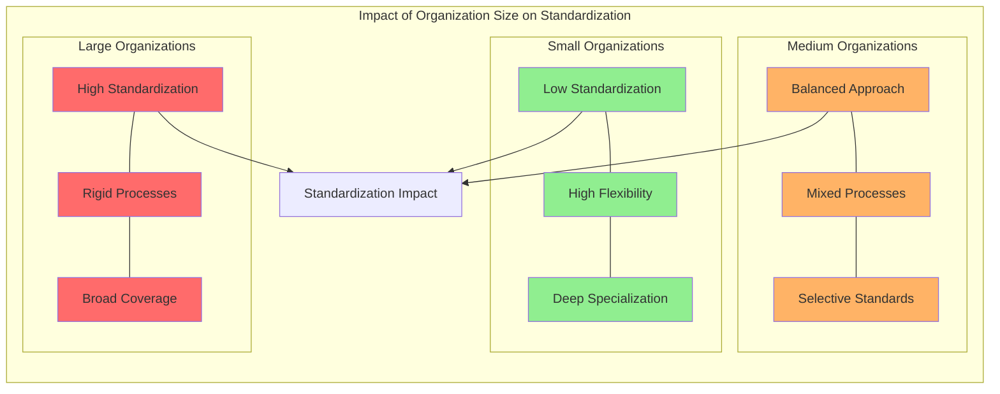
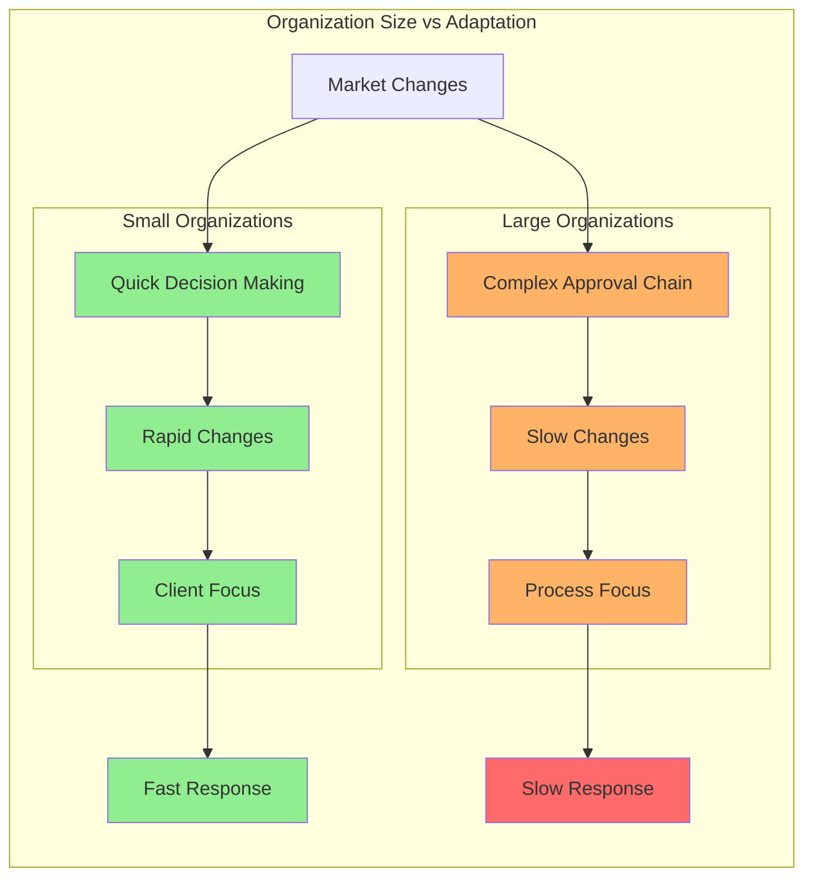
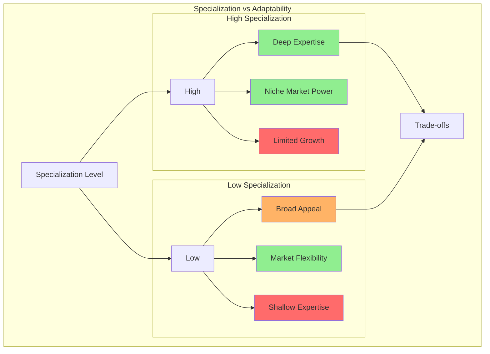
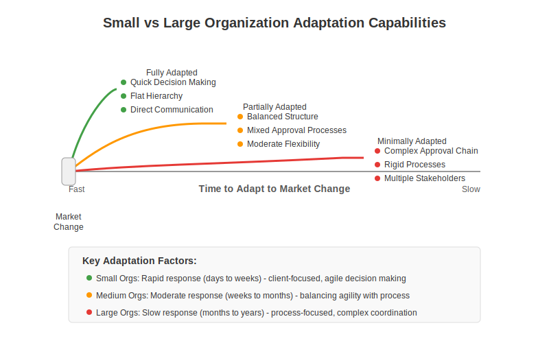
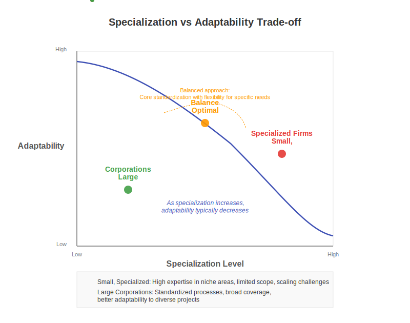

# 5. Influence of Organizational Size and Type on Modeling Approaches

## 5.1 Large Corporations

Large corporations often adopt standardized modeling approaches for processes, structures, and estimation to ensure consistency and manage operations across numerous departments and projects.

### Standardization Trends
- High utilization of automated software estimation tools
- Emphasis on consistent processes
- Focus on scalable methodologies

### Challenges with Standardization
The need for standardization can lead to:
- Adoption of simpler, more generalized models
- Potential underfitting of specific team needs
- Oversimplification of complex technical work

### Impact on Technical Work
The bureaucratic and hierarchical nature of large organizations often results in:
- Standardized processes that may not account for technical nuances
- Dissatisfaction among technical experts
- Tension between efficiency and specialization
- Models rooted in individual expertise

### Trade-offs
Benefits:
- Scalability
- Consistent control
- Easier management

Drawbacks:
- Reduced accuracy
- Less responsiveness to specific needs
- Technical staff frustration
- Oversimplified complexity

## 5.2 Small, Specialized Firms

Smaller, specialized firms, often operating in niche markets, might exhibit tendencies towards "overfitting" in their models and processes.

### Characteristics
- High agility and flexibility
- Quick adaptation to client needs
- Specialized domain focus

### Organizational Structure
- Prevalence of generalists
- Deep expertise in specific areas
- Models rooted in individual expertise

### Advantages and Risks

#### Advantages
- Strong competitive advantage in niche areas
- Highly customized solutions
- Deep domain expertise

#### Risks
- Models too narrowly focused
- Limited scalability
- Difficulty adapting to:
  - Broader market changes
  - New types of projects
  - Different technological requirements

### Example Scenario
A small firm with a highly optimized process for specific software development might face challenges when:
- Taking on different types of projects
- Scaling operations
- Adapting to new methodologies
- Expanding their service offerings

### Long-term Implications
The "overfitting" to a narrow area of expertise can:
- Limit growth potential
- Reduce adaptability
- Create dependencies on specific markets or technologies
- Hinder long-term sustainability

## 5.3 DDD and Managing Complexity at Scale

As organizations grow, communication overhead and the complexity of their business domains and software systems increase substantially. This scaling challenge often drives standardization (discussed in 5.1), but also reveals the limits of overly simple models.

Domain-Driven Design (DDD) provides effective strategies for managing this increased complexity. **Bounded Contexts** are crucial for partitioning complex domains into manageable subdomains. Each Bounded Context defines a boundary within which a specific model and **Ubiquitous Language** apply. This partitioning supports focused teams, reduces cognitive load, and enables parallel development.

**Context Mapping** explicitly defines and manages the relationships between these Bounded Contexts. Understanding these interactions (e.g., Partnerships, Shared Kernels, Anticorruption Layers) is vital for architectural integrity as systems scale, preventing tightly-coupled monoliths ("Big Ball of Mud").

Smaller organizations often manage simpler domains implicitly, perhaps within a single Bounded Context. The need for explicit strategic DDD patterns typically emerges with organizational and system scaling.

Thus, while standardization is a common response to growth, DDD's strategic design offers a more nuanced way to manage complexity by aligning teams and systems with the business domain, particularly in larger organizations.

## 5.4 Finding the Right Balance

### Key Considerations
Organizations must balance:
- Standardization needs
- Specialization requirements
- Growth objectives
- Market adaptability

The introduction of AI adds another dimension to finding this balance. As detailed in Chapter 8, AI tools could potentially enable larger organizations to manage complexity with more nuance than traditional standardized models allow, perhaps mitigating some underfitting risks by providing deeper insights into specific contexts. Conversely, AI might help smaller, specialized firms generalize their knowledge or manage expansion more effectively, potentially counteracting tendencies towards overfitting to a narrow niche. However, the strategic choices around AI adoption itself (e.g., centralized vs. decentralized models, discussed in Section 8.3.4) may also correlate with organizational size and existing structures, adding further complexity to the modeling challenge.

### Recommendations
1. Maintain core standardization while allowing for specialized variations
2. Create flexible frameworks that can accommodate both general and specific needs
3. Regular review and adjustment of models based on:
   - Organizational growth
   - Market changes
   - Technical requirements
   - Team feedback

[Back to Table of Contents](../README.md)
