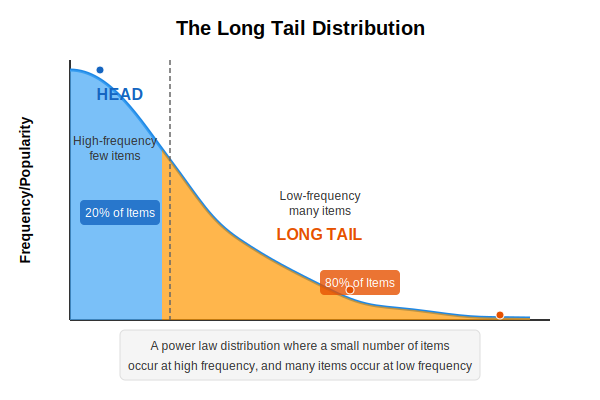
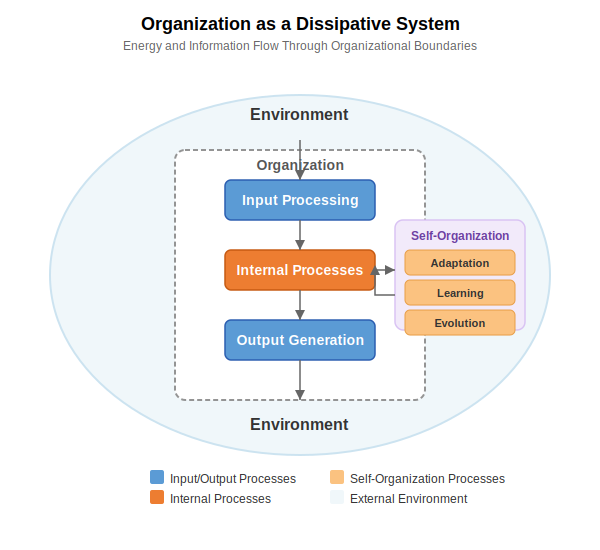
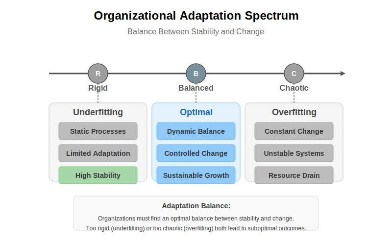
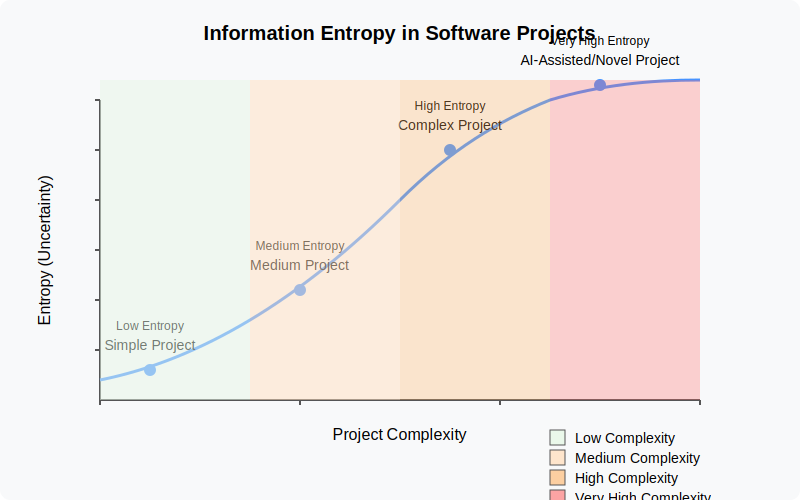
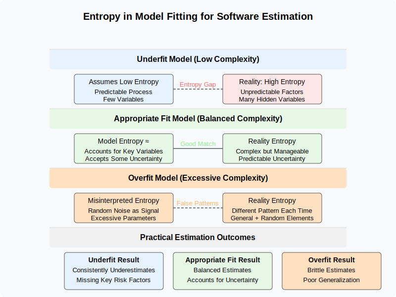
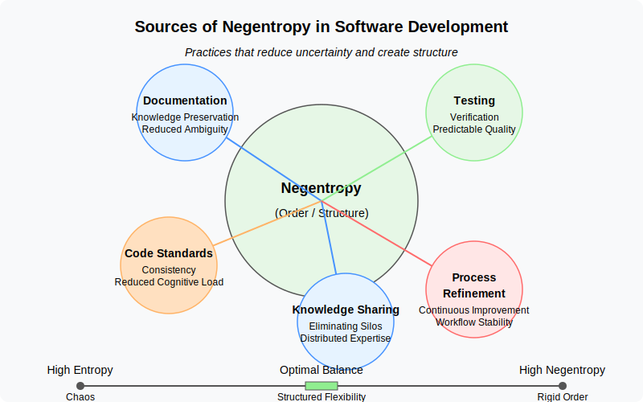
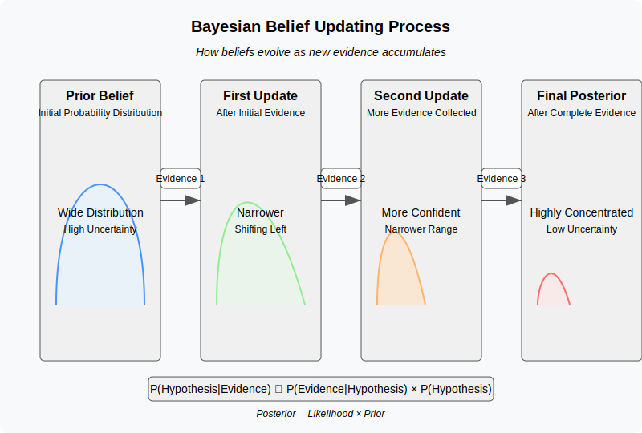
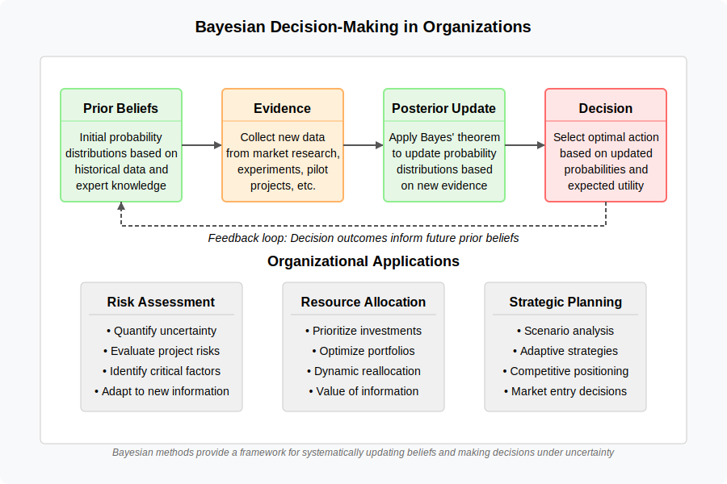

# 6. Related Theoretical Concepts

## Table of Contents

- [6.1 Software Project Risks and Long Tail Distributions](#61-software-project-risks-and-long-tail-distributions)
  - [Common vs. Long-tail Risks](#common-vs-long-tail-risks)
  - [Impact on Estimation Models](#impact-on-estimation-models)
  - [Analogy to Underfitting](#analogy-to-underfitting)
- [6.2 Dissipative Systems Theory and Organizational Dynamics](#62-dissipative-systems-theory-and-organizational-dynamics)
  - [Core Concepts](#core-concepts)
  - [Organizational Parallels](#organizational-parallels)
  - [Self-Organization and Complexity](#self-organization-and-complexity)
  - [Bifurcation Points and Phase Transitions](#bifurcation-points-and-phase-transitions)
  - [Implications for Organizational Models](#implications-for-organizational-models)
  - [Balance Through Dissipative Systems Principles](#balance-through-dissipative-systems-principles)
  - [Edge of Chaos and Criticality](#edge-of-chaos-and-criticality)
  - [Avoiding Extremes](#avoiding-extremes)
- [6.3 Cybernetics and Control Systems](#63-cybernetics-and-control-systems)
  - [Cybernetics and Organizational Control](#cybernetics-and-organizational-control)
  - [Cybernetic Models of Organizational Learning](#cybernetic-models-of-organizational-learning)
  - [The Viable System Model in Depth](#the-viable-system-model-in-depth)
  - [Cybernetic Principles in AI-Human Systems](#cybernetic-principles-in-ai-human-systems)
  - [Requisite Variety and Complexity Management](#requisite-variety-and-complexity-management)
- [6.4 Entropy and Software Complexity](#64-entropy-and-software-complexity)
  - [Information Entropy in Software Development](#information-entropy-in-software-development)
  - [Entropy as a Framework for Estimation Challenges](#entropy-as-a-framework-for-estimation-challenges)
  - [Entropy and Model Fitting](#entropy-and-model-fitting)
  - [Entropy and the Long Tail](#entropy-and-the-long-tail)
  - [Negentropy in Software Development](#negentropy-in-software-development)
  - [Practical Implications](#practical-implications)
- [6.5 Bayesian Statistics and Uncertainty Management](#65-bayesian-statistics-and-uncertainty-management)
  - [Bayesian Probability as a Framework for Belief Updating](#bayesian-probability-as-a-framework-for-belief-updating)
  - [Relationship Between Bayesian Methods and Entropy](#relationship-between-bayesian-methods-and-entropy)
  - [Bayesian Decision Theory](#bayesian-decision-theory)
  - [Applications to Organizational and Project Management](#applications-to-organizational-and-project-management)
- [6.6 Sociotechnical Systems Theory](#66-sociotechnical-systems-theory)
  - [Understanding the Sociotechnical System as an Integrated Whole](#understanding-the-sociotechnical-system-as-an-integrated-whole)
  - [Historical Evolution of Sociotechnical Thinking](#historical-evolution-of-sociotechnical-thinking)
  - [Implications for Organizational Models](#implications-for-organizational-models)
  - [Application to AI-Integrated Organizations](#application-to-ai-integrated-organizations)
  - [Conway's Law and Communication Structures](#conways-law-and-communication-structures)
- [6.7 Integration of Theoretical Perspectives](#67-integration-of-theoretical-perspectives)

## 6.1 Software Project Risks and Long Tail Distributions

The challenges in software project estimation are often exacerbated by the presence of a "[long
tail](https://en.wikipedia.org/wiki/Long_tail)" distribution of risks. This concept, borrowed from statistics, describes
a scenario where a large number of low-probability events can collectively have a significant impact.

### Common vs. Long-tail Risks

In software development, risks typically follow a distinctive pattern:

- **Common risks** are well-understood, frequently encountered challenges that most projects face, such as:
  - Scope creep
  - Staff turnover 
  - Technical debt
  - Communication issues
  - Resource constraints

- **Long-tail risks** are less frequent but potentially high-impact events that occur with lower probability but can severely disrupt projects, such as:
  - Critical security vulnerabilities discovered late in development
  - Unexpected regulatory changes
  - Sudden market shifts requiring significant pivots
  - Third-party dependencies becoming unavailable
  - Novel technical challenges with no established solutions

The distribution of these risks is not uniform—the common risks are predictable and often accounted for in planning, while long-tail risks form an extended "tail" of possibilities that are individually unlikely but collectively significant.

### Impact on Estimation Models 

Simplified estimation models often fail to account for long-tail risks in several ways:

- **Focus on average scenarios**: Traditional models typically consider "nominal" cases and common risks, ignoring the potential impact of rare events.

- **Overlooking rare but high-impact events**: When estimation methods use historical data, they naturally emphasize frequently observed patterns while underrepresenting exceptional circumstances.

- **Underestimating contingency needs**: Without accounting for the collective probability of long-tail events, contingency buffers are often inadequate to handle the actual variability encountered in projects.

- **Insufficient risk categorization**: Many estimation approaches lump risks together rather than distinguishing between common risks (which can be managed with standard practices) and long-tail risks (which require different mitigation strategies).

These limitations make most traditional estimation models prone to systematic underestimation of both project duration and complexity.

### Analogy to Underfitting 

Just as an underfit machine learning model fails to capture the full variability of the
data, an estimation model that doesn't consider the wide range of potential, albeit less likely, risks will likely
underestimate the total effort and duration required to complete the project successfully. When these "long-tail" events
occur, the project is often significantly delayed and over budget, highlighting the inadequacy of the initial, underfit
estimation.

## 6.2 Dissipative Systems Theory and Organizational Dynamics

[Dissipative systems theory](https://en.wikipedia.org/wiki/Dissipative_system) offers a valuable framework for
understanding organizational dynamics, stability, adaptation, and complexity management.

### Core Concepts

A dissipative system is characterized by:
- [Open system](https://en.wikipedia.org/wiki/Open_system_(systems_theory)) properties
- Energy and matter exchange with environment
- Operation far from  [thermodynamic equilibrium](https://www.britannica.com/science/thermodynamic-equilibrium)

### Organizational Parallels

Organizations mirror dissipative systems through:
- Constant environmental interaction
- Input/output exchanges
- Dynamic equilibrium maintenance

> See also: Erich Jantsch, [The Theory of Dissipative Structures
> (1975)](https://www.panarchy.org/jantsch/dissipativestructures.html). Jantsch's essay applies [Ilya
> Prigogine](https://www.nobelprize.org/prizes/chemistry/1977/prigogine/facts/)'s "dissipative‑structure" physics to
> social and cultural evolution. In his view, human systems—cities, offices, nations—behave like far‑from‑equilibrium
> physical systems that spontaneously reorganize when hit by sufficiently strong fluctuations. This reframes "progress"
> as a cycle of instability → mutation → temporary order.

### Self-Organization and Complexity

The theory suggests that:
- Order and complexity emerge through self-organization
- Systems must maintain state far from equilibrium
- Balance between stability and adaptation is crucial

### Bifurcation Points and Phase Transitions

Dissipative systems often exhibit bifurcation points—critical thresholds where small changes in environmental conditions
trigger dramatic reorganization of the system structure.

These phase transitions relate to underfitting and overfitting:

- A system that never reaches bifurcation points may be underfit—unable to qualitatively change its structure when
  environmental conditions demand it
- A system that undergoes constant bifurcations without stabilizing may be overfit—too sensitive to minor environmental
  fluctuations

The ability to selectively trigger and navigate bifurcations represents a sophisticated adaptation mechanism that helps
maintain appropriate complexity across changing conditions.

### Implications for Organizational Models

#### Underfitting Risks Organizations that become too rigid and standardized may:
- Fail to adapt to dynamic changes
- Experience instability
- Face potential decline

#### Overfitting Risks Organizations that are excessively complex and tightly coupled might:
- Lack flexibility
- Struggle with unexpected disruptions
- Become too specialized for their environment

> See also: ["A unified open systems model for explaining organisational
> change"](https://core.ac.uk/download/pdf/36992804.pdf). The paper proposes a model that fuses two classic perspectives
> on organisational change: the traditional open‑systems/homeostatic view that explains gradual, adaptive shifts, and
> the dissipative/non‑equilibrium view (borrowed from Prigogine) that explains rare, disruptive transformations. By
> stitching the two together the authors argue we can describe the full cycle of organisational evolution—from small
> process tweaks to culture‑level upheavals—within the same conceptual frame.

### Balance Through Dissipative Systems Principles

Successful organizations need to:
1. Maintain appropriate complexity levels
2. Function efficiently while remaining adaptable
3. Engage in continuous:
   - Environmental interaction
   - Self-organization
   - Adjustment

This perspective aligns closely with principles from **cybernetics**, the study of control and communication in systems
(both artificial and natural). Concepts like **feedback loops** (where system outputs influence future actions),
**control mechanisms** (processes that steer the system), and **adaptation** (adjusting based on feedback) are
fundamental to how dissipative systems, including organizations, maintain their dynamic state far from equilibrium. 

### Edge of Chaos and Criticality

The "edge of chaos" concept in complexity science describes the transition zone between order and disorder where systems
exhibit their greatest complexity, adaptability, and computational capability.

This concept connects to the underfitting/overfitting spectrum:

- **Ordered regime** (potential overfitting): Excessive structure and constraints limit adaptability
- **Chaotic regime** (potential underfitting): Insufficient structure prevents coherent function
- **Critical regime** (appropriate fitting): Balanced complexity enables both stability and adaptation

Systems positioned at this critical point between order and chaos can maintain enough structure to function coherently
while remaining flexible enough to adapt to changes—a hallmark of appropriately fitted models.

Modern research suggests that many biological and social systems naturally evolve toward this critical state, suggesting
there may be fundamental principles driving systems toward appropriate complexity levels over time.

### Avoiding Extremes

Organizations must navigate between:
- Oversimplification (underfitting)
- Excessive specialization (overfitting)

While maintaining:
- Operational efficiency
- Adaptive capacity
- Long-term sustainability

## 6.3 Cybernetics and Control Systems

Cybernetics, pioneered by Norbert Wiener in the 1940s, is the interdisciplinary study of regulatory systems—their
structures, constraints, and possibilities. While dissipative systems theory focuses on energy flows and
self-organization, cybernetics examines control, communication, feedback, and goal-directed behavior in complex systems.

The term "cybernetics" derives from the Greek word for "governance" or "steering," emphasizing its focus on how systems
regulate themselves and maintain stability while adapting to changing conditions. This theoretical framework has
profound implications for understanding organizational design and management.

### Cybernetics and Organizational Control

Cybernetics provides a crucial theoretical foundation for understanding how organizations regulate themselves and adapt
to changing conditions. Developed by Norbert Wiener and others in the 1940s, cybernetics offers a cross-disciplinary
approach to studying regulatory systems—their structures, constraints, and possibilities.

Key cybernetic principles applicable to organizational systems include:

1. **Feedback Loops**: Organizations maintain stability through both:
   - **Negative feedback**: Error-correcting mechanisms that counteract deviations from desired states
   - **Positive feedback**: Self-reinforcing processes that amplify certain signals, potentially leading to growth or
     transformation

2. **Requisite Variety**: Ashby's Law of Requisite Variety states that "only variety can absorb variety," meaning a
control system must have at least as much variety (possible states) as the system it controls. For organizations, this
suggests that internal complexity must match environmental complexity—directly addressing the underfitting/overfitting
balance.

3. **Viable System Model (VSM)**: Developed by Stafford Beer, the VSM defines the necessary and sufficient
organizational functions for system viability, including operations, coordination, control, intelligence, and policy.
This model specifies the minimum complexity required for organizational survival.

4. **First and Second-Order Cybernetics**: 
   - First-order cybernetics focuses on observed systems with external control
   - Second-order cybernetics considers observing systems, including self-observation and recursion

Management cybernetics, pioneered by Stafford Beer, applies these principles specifically to organizational design and
management, offering frameworks for creating organizations that balance stability with adaptability.

An effective organization uses feedback to learn and adapt. The integration of AI, as discussed further in Chapter 8,
can significantly enhance these cybernetic functions by providing more sophisticated monitoring, faster data analysis,
and automated feedback mechanisms. However, it also introduces new challenges for control and adaptation, particularly
concerning the transparency of AI-driven feedback and the management of complex human-AI interactions within these
loops. Underfitting, in this context, can represent weak or ignored feedback loops (human or AI-driven) leading to poor
adaptation, while overfitting might represent overly rigid control mechanisms (potentially exacerbated by poorly
designed AI) that stifle necessary adjustments based on environmental feedback.

### Cybernetic Models of Organizational Learning

Cybernetics provides a theoretical foundation for understanding organizational learning as an information processing and
adaptation system. Several key cybernetic learning models have influenced organizational theory:

1. **Single and Double-Loop Learning**: Developed by Argyris and Schön but fundamentally cybernetic in nature, these
models distinguish between:
   - **Single-loop learning**: Error correction within existing frameworks (first-order cybernetics)
   - **Double-loop learning**: Revision of governing variables and assumptions (second-order cybernetics)

2. **Triple-Loop Learning**: Extending the model further, triple-loop learning involves reflecting on how organizations
learn and developing meta-learning capabilities. This represents a third-order cybernetic approach where systems develop
self-reflexive awareness about their learning processes.

3. **Viable System Model (VSM) Learning Mechanisms**: In Beer's VSM, organizational learning occurs through specific
subsystems:
   - System 3: Monitors internal operations and optimizes resource allocation
   - System 4: Environmental scanning and future planning
   - System 5: Policy and identity formulation that balances present operations with future needs

These learning mechanisms directly address the underfitting/overfitting balance by enabling organizations to:
- Detect when their models are underfit (insufficient complexity to address environmental challenges)
- Identify when operations have become overfit (excessive complexity creating rigidity)
- Adjust their information processing and structural complexity accordingly

### The Viable System Model in Depth

Stafford Beer's Viable System Model (VSM) warrants deeper examination as it represents one of the most comprehensive
applications of cybernetic principles to organizational design. The VSM defines five essential systems required for
organizational viability:

<figure> 
  
  <figcaption>Figure 6.3: The five systems of Beer's Viable System Model</figcaption> 
</figure>

1. **System 1: Operations** - The primary activities that deliver value. In a business, these might be production units,
service delivery teams, or product divisions. Each System 1 unit is itself a viable system containing all five systems
at a lower recursion level.

2. **System 2: Coordination** - Anti-oscillatory subsystems that ensure coordination between System 1 units. These
include schedules, standards, protocols, and other mechanisms that prevent harmful oscillations or conflicts between
operational units.

3. **System 3: Control and Optimization** - Internal regulation that optimizes the interaction of System 1 units. This
includes resource allocation, performance monitoring, and internal audit functions (System 3*). System 3 represents the
"inside-and-now" management focus.

4. **System 4: Intelligence** - Environmental scanning, research and development, strategic planning, and future
modeling. System 4 represents the "outside-and-future" management focus and must maintain adequate variety to match
environmental complexity.

5. **System 5: Policy** - Ultimate authority, identity, and purpose. System 5 balances the demands between System 3
(present operations) and System 4 (future adaptation), establishing the essential character and norms of the
organization.

The VSM's recursive nature, where each operational unit contains all five systems at lower scales, provides a
theoretical framework for how complexity should be distributed across organizational levels. This recursive property
directly addresses the challenge of appropriate complexity management—allowing local adaptability while maintaining
system-wide coherence.

In terms of the underfitting/overfitting framework:
- **Underfitting occurs when** System 4 has insufficient variety to match environmental complexity or when System 3
  cannot effectively coordinate System 1 activities
- **Overfitting manifests when** System 3 imposes excessive control on System 1 units, when System 2 creates overly
  rigid coordination mechanisms, or when System 5 fails to balance present operations with future needs

### Cybernetic Principles in AI-Human Systems

As organizations increasingly integrate AI capabilities, cybernetic theory provides essential frameworks for
understanding how these hybrid systems function. Three critical cybernetic principles apply specifically to AI-human
integration:

1. **Variety Engineering**: AI systems can:
   - **Amplify human variety**: Extending human capabilities to handle greater environmental complexity
   - **Attenuate environmental variety**: Filtering and processing information to make it manageable for human
     decision-makers
   
   The challenge is designing AI systems that perform both functions without introducing harmful simplifications
   (underfitting) or overwhelming complexity (overfitting).

2. **Control and Autonomy Balance**: Cybernetic principles suggest effective AI-human systems require:
   - **Local autonomy**: AI and human components having freedom within constraints to adapt to local conditions
   - **Global coherence**: Maintaining system-wide integration and consistency
   
   This represents the "autonomy within cohesion" principle from VSM applied to human-AI assemblages.

3. **Feedback System Design**: Human-AI systems must establish effective feedback loops featuring:
   - **Multiple feedback pathways**: Avoiding single points of failure in communication
   - **Varying time horizons**: Combining fast, automatic feedback with slower, deliberative processes
   - **Cross-validation mechanisms**: Ensuring feedback represents reality rather than measurement artifacts
   
   Poor feedback design can lead to both underfitting (insufficient information flow) and overfitting (overreaction to
   noise).

These principles provide a theoretical foundation for the practical AI integration approaches discussed in Chapters 8
and 9.

### Requisite Variety and Complexity Management

Ashby's Law of Requisite Variety states that "only variety can absorb variety," meaning that a regulatory system must
have at least as much variety (possible states) as the system it seeks to regulate. This fundamental cybernetic
principle has profound implications for organizational design and complexity management:

1. **Variety Matching Requirements**: For effective adaptation, organizations must:
   - Develop sufficient internal complexity to match environmental challenges
   - Distribute this complexity appropriately across organizational levels
   - Avoid unnecessary complexity that doesn't correspond to environmental demands

2. **Variety Engineering Strategies**: Organizations can manage the variety equation through:
   - **Variety amplification**: Increasing internal regulatory capacity
   - **Variety attenuation**: Filtering environmental complexity to focus on relevant aspects
   - **Variety transduction**: Transforming variety from one form to another

3. **Complexity Costs**: Maintaining variety has energetic and coordination costs, creating a fundamental trade-off
between:
   - The benefits of additional regulatory capacity
   - The costs of maintaining and coordinating more complex systems

This trade-off directly parallels the underfitting/overfitting spectrum, where:
- **Underfitting** results from insufficient variety to address environmental challenges
- **Overfitting** stems from maintaining excessive internal variety without corresponding environmental demands

Requisite variety provides a scientific basis for determining appropriate organizational complexity—not minimizing or
maximizing complexity, but matching it precisely to environmental needs.

## 6.4 Entropy and Software Complexity

### Information Entropy in Software Development

[Information entropy](https://en.wikipedia.org/wiki/Entropy_(information_theory)), a concept introduced by Claude
Shannon, quantifies uncertainty or unpredictability within a system. In software development contexts, entropy can be
understood as a measure of the unpredictability inherent in projects:

- Higher entropy = Greater uncertainty = Less predictable outcomes
- Lower entropy = More certainty = More predictable outcomes

### Entropy as a Framework for Estimation Challenges

Entropy provides a theoretical foundation for understanding why software estimation is fundamentally challenging:

1. **Complexity Increases Entropy**: As software systems grow in complexity (more components, interactions,
dependencies), entropy naturally increases. Each additional variable introduces new possible states and outcomes.

2. **Knowledge Gaps and Entropy**: Incomplete information about requirements, technical constraints, or team
capabilities directly increases the entropy of the estimation model.

3. **Quantifiable Uncertainty**: Entropy offers a mathematical framework for quantifying the uncertainty in different
project types and stages, potentially allowing for more precise risk assessment.

### Entropy and Model Fitting

The concepts of underfitting and overfitting can be reframed through entropy:

- **Underfitting Through Entropy Lens**: Underfit models fail to capture the true entropy of the system by assuming lower entropy (more predictability) than actually exists, oversimplifying by ignoring significant sources of uncertainty, and creating a false sense of predictability by reducing apparent complexity.

- **Overfitting Through Entropy Lens**: Overfit models misinterpret the sources of entropy by mistaking random noise for signal, creating artificial patterns from limited historical data, and failing to generalize because they're tuned to specific entropy patterns from past projects.

### Entropy and the Long Tail

The long tail distribution of software risks directly connects to entropy theory. The unpredictable, rare events in the tail represent high-entropy elements, while traditional estimation focuses on low-entropy (common, predictable) events. Comprehensive models must account for the full entropy spectrum.

### Negentropy in Software Development

[Negentropy](https://en.wikipedia.org/wiki/Negentropy) (negative entropy) represents the counterforce to entropy—the
creation of order, structure, and certainty within complex systems. While entropy measures disorder and
unpredictability, negentropy quantifies a system's degree of organization and ability to produce reliable outcomes.

In software development, negentropy manifests through practices that reduce uncertainty and create structure:

<figure>  <figcaption>Figure 6.4: Sources of negentropy in software
development processes</figcaption> </figure>

#### Key Sources of Negentropy

1. **Technical Documentation**: Comprehensive documentation turns implicit knowledge into explicit knowledge, reducing
uncertainty for current and future developers.

2. **Test Coverage**: Robust testing reduces uncertainty about whether code changes will introduce bugs, creating
confidence in modifications.

3. **Code Standards and Patterns**: Consistent patterns and standards reduce cognitive load and decision entropy by
establishing clear defaults.

4. **Knowledge Sharing**: Regular knowledge transfer sessions prevent information silos that increase organizational
entropy.

5. **Process Refinement**: Iterative improvement of development processes reduces variability in outcomes.

#### The Negentropy-Entropy Balance and Model Fitting

The balance between negentropy (order) and entropy (uncertainty) directly parallels the underfitting-overfitting spectrum:
- Too little negentropy (high disorder) → Chaos, unpredictability → Parallel to underfitting
- Optimal negentropy balance → Productive creativity within structure → Well-calibrated models
- Too much negentropy (rigid order) → Bureaucracy, inflexibility → Parallel to overfitting

In the context of software estimation, negentropy-building activities (documentation, testing, standardization) can significantly improve model accuracy by reducing variability in development processes and creating more consistent, predictable workflows. However, the *process* of creating this order must itself be accounted for in time estimates. Organizations sometimes underestimate projects because they ignore the time required for these critical uncertainty-reducing activities.

### Practical Implications

Understanding entropy in software development enables more realistic assessment of estimation limitations, better quantification of uncertainty in different project types, improved risk models that account for inherent unpredictability, and development of estimation techniques that explicitly incorporate uncertainty measures.

This entropy framework provides a theoretical basis for many practical observations throughout this book, from the challenges of time estimation (Chapter 2) to the optimization of organizational models (Chapters 7 and 8).

## 6.5 Bayesian Statistics and Uncertainty Management

### Bayesian Probability as a Framework for Belief Updating

[Bayesian statistics](https://en.wikipedia.org/wiki/Bayesian_statistics) provides a mathematical framework for updating
beliefs in light of new evidence. Unlike frequentist statistics, which treats probability as the long-run frequency of
events, Bayesian probability represents degrees of belief that can be revised as new information becomes available.

The foundation of Bayesian reasoning is [Bayes' theorem](https://en.wikipedia.org/wiki/Bayes%27_theorem) (explained
simply in [this Khan Academy
video](https://www.khanacademy.org/math/statistics-probability/probability-library/conditional-probability-bayes/v/bayes-theorem-visualized)):

$$P(H|E) = \frac{P(E|H) \cdot P(H)}{P(E)}$$

Where:
- $P(H|E)$ is the posterior probability (updated belief after observing evidence)
- $P(E|H)$ is the likelihood (probability of the evidence given the hypothesis)
- $P(H)$ is the prior probability (initial belief before evidence)
- $P(E)$ is the marginal likelihood (total probability of observing the evidence)

<figure>  <figcaption>Figure 6.5: Bayesian belief updating process with multiple
iterations of evidence</figcaption> </figure>

#### Key Bayesian Concepts Explained

- **Priors and Informative Priors**: A "prior" is your initial belief before seeing new evidence. An "[informative
  prior](https://en.wikipedia.org/wiki/Prior_probability#Informative_priors)" incorporates existing knowledge rather
  than starting with a blank slate. For example, when estimating a software project's duration, an informative prior
  might incorporate knowledge about team performance, similar past projects, or even qualitative factors like team
  morale and technology familiarity. This is how Bayesian methods can integrate "soft" factors into quantitative models.

- **Complex Dependencies Between Variables**: Traditional statistical methods often assume variables are independent.
  Bayesian networks (also called [probabilistic graphical models](https://en.wikipedia.org/wiki/Graphical_model)) can
  represent situations where multiple factors influence each other - for instance, how changes in requirements might
  affect both testing time and integration complexity in interconnected ways.

- **Marginal Likelihood and Complexity Penalization**: The [marginal
  likelihood](https://en.wikipedia.org/wiki/Marginal_likelihood) (sometimes called "evidence") naturally balances model
  fit against complexity. More complex models (with more parameters) can fit existing data better but might not
  generalize well. The marginal likelihood automatically penalizes unnecessary complexity, helping prevent overfitting
  without requiring manual parameter tuning.

- **Hierarchical Modeling**: [Hierarchical (or multilevel) models](https://en.wikipedia.org/wiki/Multilevel_model) allow
  information to be shared across similar but not identical situations. For example, different software projects might
  have their own unique characteristics but still share common patterns. Hierarchical modeling allows learning from the
  entire portfolio of projects while still capturing the uniqueness of each one. These models create a middle path
  between complete pooling of data (potential underfitting by ignoring group differences) and no pooling (potential
  overfitting by treating each group independently).

### Relationship Between Bayesian Methods and Entropy

Bayesian statistics and information entropy are deeply connected theoretical frameworks:

1. **Quantification of Uncertainty**: Both frameworks provide mathematical approaches to quantify uncertainty, with
entropy measuring the amount of uncertainty in a probability distribution and Bayesian methods providing tools to update
these distributions.

2. **Information as Uncertainty Reduction**: In both frameworks, information serves to reduce uncertainty—entropy
decreases as information increases, while Bayesian posteriors become more concentrated (less uncertain) as evidence
accumulates.

3. **Maximum Entropy Principle**: When formulating priors with limited information, the [principle of maximum
entropy](https://en.wikipedia.org/wiki/Principle_of_maximum_entropy) suggests choosing the distribution with highest
entropy that satisfies the known constraints—creating a natural bridge between these concepts.

### Bayesian Decision Theory

Bayesian methods extend beyond probability updating to provide a framework for optimal decision-making under uncertainty
through [Bayesian decision theory](https://en.wikipedia.org/wiki/Bayesian_decision_theory):

1. **Expected Utility Maximization**: Decisions are evaluated based on their expected utility, calculated by weighting
possible outcomes by their posterior probabilities.

2. **Value of Information**: Bayesian frameworks can quantify the expected value of additional information before making
decisions, allowing for rational choices about when to gather more data versus when to proceed with current knowledge.

3. **Explicit Treatment of Risk**: By working with full probability distributions rather than point estimates, Bayesian
approaches naturally incorporate risk assessment into decision processes.

### Applications to Organizational and Project Management

In organizational contexts, Bayesian thinking provides powerful tools for managing uncertainty:

1. **Incremental Learning**: Organizations can formalize institutional learning by treating past experiences as priors
and updating these beliefs with new project data.

2. **Managing Unknown Unknowns**: Bayesian methods can incorporate parameter uncertainty (known unknowns) and model
uncertainty (unknown unknowns) through hierarchical models and model averaging.

3. **Avoiding Cognitive Biases**: Formal Bayesian updating can help counter anchoring, confirmation bias, and
overconfidence by requiring explicit quantification of beliefs and systematic updating procedures.

4. **Adaptive Planning**: Rather than creating fixed plans based on initial estimates, Bayesian approaches support
adaptive planning that evolves as new information becomes available.

The practical application of these concepts to software time estimation is explored in [Chapter
2](02-software-time-estimation.md#bayesian-approaches-to-estimation), where we examine how Bayesian methods can help
address both underfitting and overfitting in estimation models.

## 6.6 Sociotechnical Systems Theory

### Understanding the Sociotechnical System as an Integrated Whole

Organizations exist as complex sociotechnical systems where human, process, and technological elements interact
continuously. To achieve optimal performance, these layers must be viewed as an integrated whole rather than isolated
components.

The sociotechnical integration matrix above illustrates how different organizational elements interact across the social
and technical dimensions, highlighting the interconnected nature of modern enterprises.

### Historical Evolution of Sociotechnical Thinking

Sociotechnical systems theory emerged in the 1950s from research at the Tavistock Institute, which found that
technological innovations alone were insufficient for performance improvement without considering the social systems in
which they operated. This shift recognized that optimizing either technical or social aspects in isolation often led to
suboptimal outcomes, presaging our modern understanding of the underfitting/overfitting dilemma.

Early research focused on primary industries (e.g., coal mining), but the principles apply broadly across sectors and
organizational types, especially as digital technologies become increasingly embedded in organizational structures. The
theory provides a foundation for understanding how the relationship between people, processes, and technology creates
emergent properties that cannot be understood by studying components in isolation.

### Implications for Organizational Models

The sociotechnical perspective offers several insights relevant to organizational modeling:

1. **Joint Optimization**: Models must jointly optimize both social and technical elements rather than maximizing either
in isolation. This perspective helps avoid both underfitting (oversimplified models that ignore social dynamics) and
overfitting (excessively technical models that don't account for human factors).

2. **Boundary Management**: Effective organizations manage the boundaries between social and technical elements
carefully, creating interfaces that facilitate interaction while maintaining appropriate separation.

3. **Adaptive Capacity**: Sociotechnical systems require adaptive capacity that allows for continuous reconfiguration as
conditions change. This adaptability parallels the concepts from dissipative systems theory discussed earlier.

4. **Emergent Properties**: The interaction between social and technical elements creates emergent properties that
cannot be predicted by examining the components in isolation. This emergence is particularly relevant to understanding
complexity in organizational models.

### Application to AI-Integrated Organizations

As AI capabilities become more central to organizational functions, sociotechnical systems theory becomes increasingly
relevant. AI technologies interact with social systems in complex ways, potentially creating both reinforcing and
balancing feedback loops.

Key considerations include:

- **Role Redefinition**: How AI integration reshapes human roles and responsibilities 
- **Skill Evolution**: The changing landscape of skills needed in AI-augmented workplaces
- **Process Reconfiguration**: How workflows and processes adapt to incorporate AI capabilities
- **Governance Structures**: New mechanisms for maintaining oversight of AI-human systems

The sociotechnical perspective provides a theoretical basis for many of the observations in Chapters 8 and 9 regarding
AI's impact on organizational structures and human skill requirements. It emphasizes that effective integration requires
attention to both the technical capabilities of AI systems and the social contexts in which they operate.

### Conway's Law and Communication Structures

Conway's Law represents a powerful application of sociotechnical systems theory to software development organizations. The law, articulated by Melvin Conway in 1967, observes that "organizations which design systems are constrained to produce designs which are copies of the communication structures of these organizations" (Skelton & Pais, 2020). While initially introduced in Chapter 3, Conway's Law warrants additional examination through the lens of decision-making structures and communication boundaries.

A particularly counterintuitive insight from research on communication structures is that "fast flow requires restricting communication between teams" (Skelton & Pais, 2020). This principle challenges the common assumption that more communication invariably leads to better outcomes, suggesting instead that strategic boundaries between teams can enhance rather than impede organizational effectiveness.

The decision of where to establish communication channels and where to maintain boundaries represents a critical strategic choice. Skelton and Pais (2020) distinguish between areas requiring discovery and expertise—where team collaboration is essential—and areas focused on execution, where excessive communication may become unnecessary overhead. This distinction provides a framework for designing more effective decision-making processes:

1. **Discovery-focused domains**: These areas benefit from rich, multidirectional communication that facilitates exploration and knowledge-sharing. Decision processes in these domains should prioritize inclusive discussion, diverse perspectives, and collaborative problem-solving.

2. **Execution-focused domains**: These areas benefit from clear boundaries and streamlined communication. Decision processes should emphasize clarity, efficiency, and autonomy within predefined parameters.

Understanding this distinction allows organizations to design decision-making structures that align with the nature of the work being performed, avoiding both the waste of excessive coordination in execution-focused domains and the limitations of insufficient collaboration in discovery-focused domains.

#### Conway's Law and Decision-Making Authority

Conway's Law also informs how decision-making authority should be distributed throughout an organization. Since "organization design and software design are, in practice, two sides of the same coin" (Skelton & Pais, 2020), decisions about one inevitably affect the other. This interdependence has important implications for who should be involved in various types of decisions.

Skelton and Pais (2020) argue that it is "very ineffective (perhaps irresponsible) for organizations that build software systems to decide on the shape, responsibilities, and boundaries of teams without input from technical leaders." This principle extends beyond software development to any complex system where technical and organizational elements are intertwined.

The rationale for this approach is that technical leaders understand fundamental design concepts—such as interfaces, abstraction, encapsulation, and modularity—that are as relevant to organizational design as they are to technical systems. Excluding these perspectives from organizational decisions creates a risk of structural misalignment that undermines both organizational and technical effectiveness.

This insight suggests that decision-making authority for organizational structure should be shared between technical and business leadership, rather than siloed within traditional hierarchies. Such collaborative decision-making models may require new governance structures and processes that facilitate effective integration of diverse perspectives.

#### Strategic Implications of Conway's Law

At a strategic level, Conway's Law transforms organization design from an operational function into a competitive advantage. By intentionally designing organizational structures to promote desired architectural patterns, leaders can make strategic decisions about the kinds of solutions their organizations are most likely to discover and implement.

This approach reverses the traditional sequence, where business strategy drives system architecture, which in turn informs organizational structure. Instead, it recognizes that organizational structure shapes the solution space an organization can effectively explore, suggesting that structural decisions should be considered as part of strategy formulation rather than merely as implementation details.

For decision-makers, this means that choices about organizational boundaries, team composition, and communication patterns are not merely administrative matters but strategic decisions with far-reaching implications for an organization's capabilities and competitive positioning. As Skelton and Pais (2020) note, "By considering the impact of Conway's law when designing software architectures and/or reorganizing team structures, you will be able to take advantage of the isomorphic force at play, which converges the software architecture and the team design."

This strategic perspective on Conway's Law aligns with the underfitting/overfitting framework by recognizing that organizational structure is a key determinant of an organization's ability to manage complexity effectively. Decision-makers should therefore consider structural implications when evaluating whether a particular approach risks underfitting (through excessive simplification) or overfitting (through unnecessary complexity).

#### Remote Work and the Evolution of Conway's Law

The shift to remote and hybrid work environments has prompted a theoretical reconsideration of Conway's Law. Traditional interpretations focused primarily on formal organizational structures and physical proximity as the primary determinants of communication patterns. However, empirical research on distributed teams suggests that digital communication structures now play an equally significant—if not more dominant—role in shaping these patterns.

Recent studies of remote work impacts reveal several key theoretical insights:

1. **Digital Gravity Supersedes Physical Proximity**: In remote environments, the "pull" of digital spaces (like Slack channels, email distribution lists, and collaborative documents) exerts more influence on communication patterns than traditional organizational boundaries. This creates what can be termed "digital gravity wells" that reshape communication along lines that may not align with formal structures (Fowler, 2022).

2. **Network Effects in Distributed Communication**: As documented in a Microsoft study of 60,000 employees during the shift to remote work, communication networks tend to become more static and clustered in remote settings (Yang et al., 2022). This network effect has theoretical implications for how information flows through organizations and how technical architectures subsequently form.

3. **Asynchronous Bias and Decision Records**: The shift from synchronous to asynchronous communication creates a theoretical bias toward more documented, contract-based interactions between teams. This aligns with findings from the DORA State of DevOps Report (DevOps Research and Assessment, 2022), which notes that highly effective remote teams rely more heavily on documentation, particularly in loosely-coupled systems.

4. **Trust Dynamics in Distributed Decision-Making**: The phenomenological study by Aguillon and Cronin-Gilmore (2024) revealed that remote work can strain trust between team members, with implications for how effectively they collaborate on technical decisions. This introduces a new variable into Conway's Law—the degree to which trust enables or constrains cross-boundary architectural decisions.

These evolving theoretical perspectives suggest that Conway's Law remains valid in remote and hybrid environments, but its application requires a more nuanced understanding of how digital communication structures form and evolve. Organizations must now consider not only who reports to whom in the formal hierarchy but also who communicates with whom across digital channels—and how those patterns ultimately shape their technical architectures.

## 6.7 Integration of Theoretical Perspectives

The theoretical concepts explored in this chapter—long tail distributions, dissipative systems, entropy, Bayesian
statistics, and sociotechnical systems—provide complementary lenses for understanding the challenges of organizational
modeling. While each perspective emphasizes different aspects, together they illuminate the fundamental tensions
organizations face when developing models that are both adaptable and structured.

These theories collectively suggest that effective organizational models must:
1. Account for rare but impactful events (long tail)
2. Maintain dynamic equilibrium through continuous adaptation (dissipative systems)
3. Manage uncertainty while creating appropriate structure (entropy/negentropy)
4. Update beliefs and practices as new evidence emerges (Bayesian thinking)
5. Integrate social and technical elements as an interconnected whole (sociotechnical systems)

In the subsequent chapters, we will examine how these theoretical perspectives manifest in specific organizational
contexts, from medium-sized enterprises to healthcare systems to AI-augmented organizations.

## References

Aguillon, S., & Cronin-Gilmore, J. (2024). How Remote Work Changes Communication in Organizations. Journal of Behavioral and Applied Management, 24(3), 173-185.

DevOps Research and Assessment. (2022). 2022 Accelerate State of DevOps Report. DORA. https://dora.dev/research/2022/dora-report/2022-dora-accelerate-state-of-devops-report.pdf

Fowler, M. (2022, October 20). Conway's Law. martinfowler.com. https://martinfowler.com/bliki/ConwaysLaw.html

Skelton, M., & Pais, M. (2020). Team Topologies: Organizing Business and Technology Teams for Fast Flow. IT Revolution Press.

Yang, L., Holtz, D., Jaffe, S., Suri, S., Sinha, S., Weston, J., ... & Teevan, J. (2022). The effects of remote work on collaboration among information workers. Nature Human Behaviour, 6(1), 43-54.

[Back to Table of Contents](../README.md)
