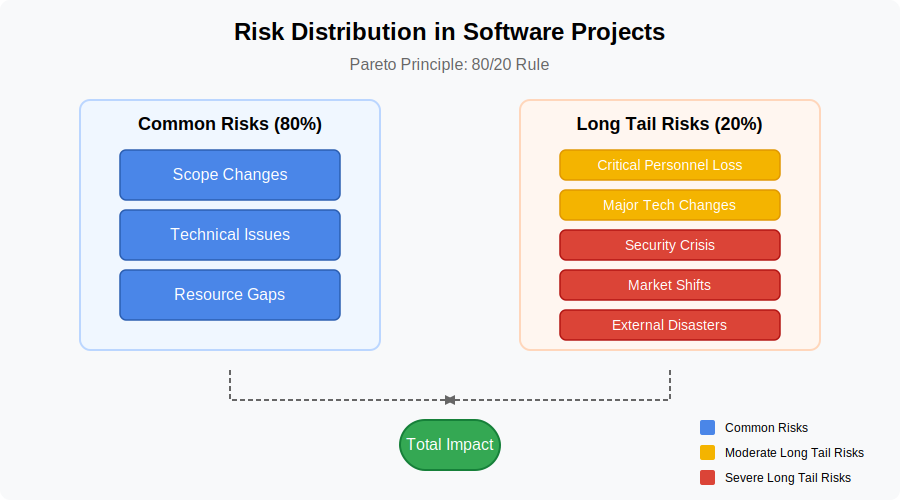
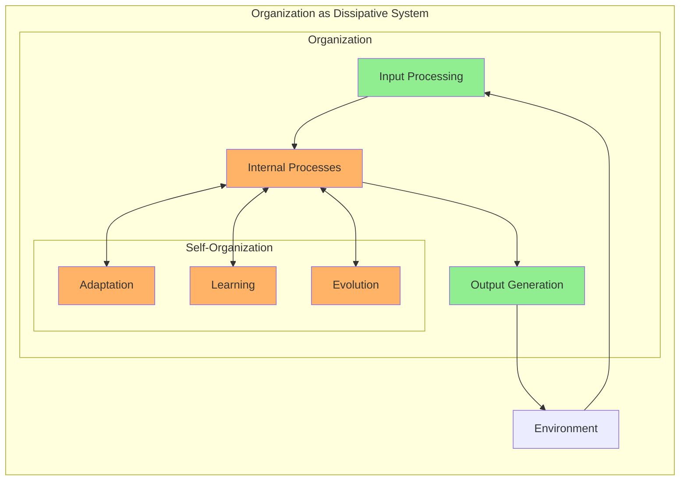
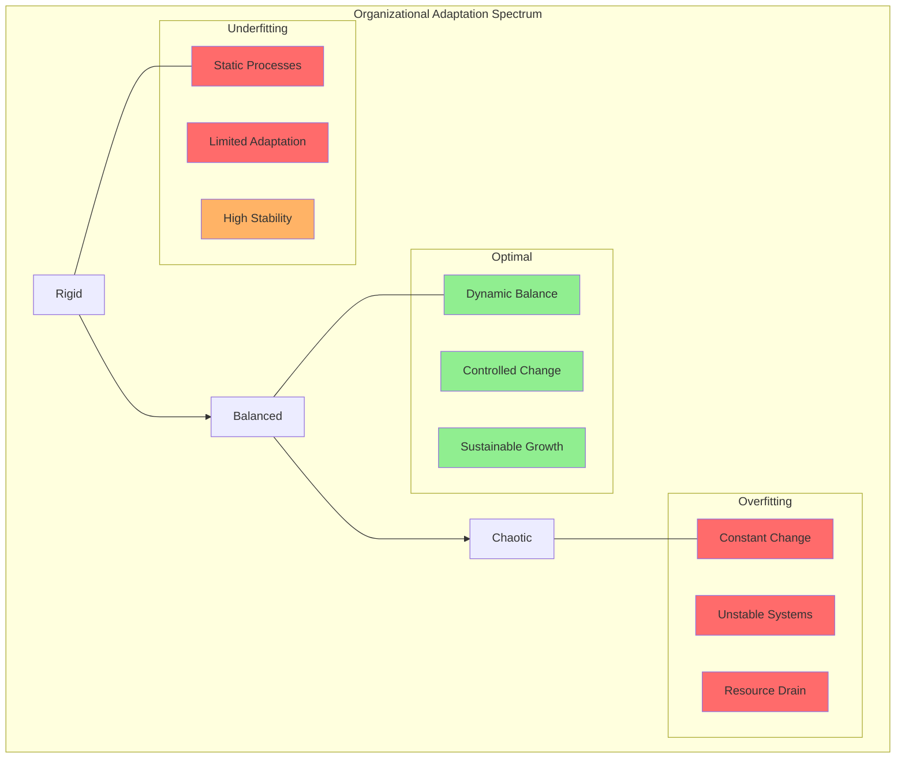

# 6. Related Theoretical Concepts

## 6.1 Software Project Risks and Long Tail Distributions

The challenges in software project estimation are often exacerbated by the presence of a "[long tail](https://en.wikipedia.org/wiki/Long_tail)" distribution of risks. This concept, borrowed from statistics, describes a scenario where a large number of low-probability events can collectively have a significant impact.

### Common vs. Long-tail Risks

### Impact on Estimation Models
Simplified estimation models often fail by:
- Focusing on average scenarios
- Overlooking rare but high-impact events
- Underestimating contingency needs

### Analogy to Underfitting
Just as an underfit machine learning model fails to capture the full variability of the data, an estimation model that doesn't consider the wide range of potential, albeit less likely, risks will likely underestimate the total effort and duration required to complete the project successfully. When these "long-tail" events occur, the project is often significantly delayed and over budget, highlighting the inadequacy of the initial, underfit estimation.

## 6.2 Dissipative Systems Theory and Organizational Dynamics

[Dissipative systems theory](https://en.wikipedia.org/wiki/Dissipative_system) offers a valuable framework for understanding organizational dynamics, stability, adaptation, and complexity management.

### Core Concepts
A dissipative system is characterized by:
- Open system properties
- Energy and matter exchange with environment
- Operation far from thermodynamic equilibrium

### Organizational Parallels
Organizations mirror dissipative systems through:
- Constant environmental interaction
- Input/output exchanges
- Dynamic equilibrium maintenance

*See also: Erich Jantsch, [The Theory of Dissipative Structures (1975)](https://www.panarchy.org/jantsch/dissipativestructures.html)*

### Self-Organization and Complexity
The theory suggests that:
- Order and complexity emerge through self-organization
- Systems must maintain state far from equilibrium
- Balance between stability and adaptation is crucial

### Implications for Organizational Models

- ["A unified open systems model for explaining organisational change"](https://core.ac.uk/download/pdf/36992804.pdf)

#### Underfitting Risks
Organizations that become too rigid and standardized may:
- Fail to adapt to dynamic changes
- Experience instability
- Face potential decline

#### Overfitting Risks
Organizations that are excessively complex and tightly coupled might:
- Lack flexibility
- Struggle with unexpected disruptions
- Become too specialized for their environment

### Balance Through Dissipative Systems Principles
Successful organizations need to:
1. Maintain appropriate complexity levels
2. Function efficiently while remaining adaptable
3. Engage in continuous:
   - Environmental interaction
   - Self-organization
   - Adjustment

### Avoiding Extremes
Organizations must navigate between:
- Oversimplification (underfitting)
- Excessive specialization (overfitting)
While maintaining:
- Operational efficiency
- Adaptive capacity
- Long-term sustainability

## 6.3 Theoretical Integration

The combination of long-tail risk theory and dissipative systems theory provides:
- Comprehensive framework for understanding organizational complexity
- Insights into balancing stability and adaptation
- Guidelines for avoiding both underfitting and overfitting in organizational models

### Practical Applications
Organizations can use these theoretical frameworks to:
1. Design more resilient structures
2. Develop better risk management strategies
3. Create adaptive yet stable processes
4. Balance standardization with flexibility

[Back to Table of Contents](../README.md)
