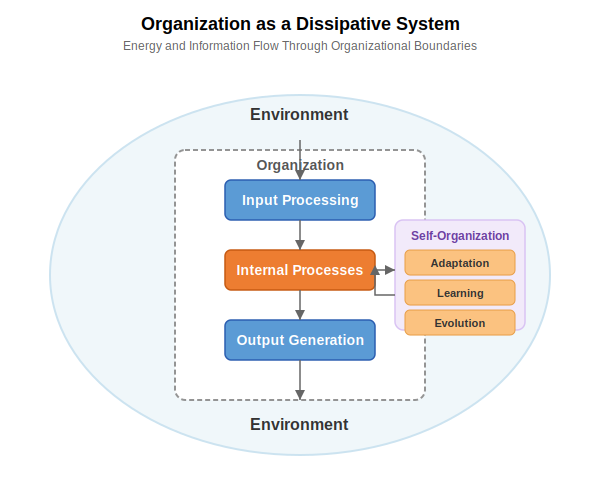

# 6. Related Theoretical Concepts

## 6.1 Software Project Risks and Long Tail Distributions

The challenges in software project estimation are often exacerbated by the presence of a "[long tail](https://en.wikipedia.org/wiki/Long_tail)" distribution of risks. This concept, borrowed from statistics, describes a scenario where a large number of low-probability events can collectively have a significant impact.

### Common vs. Long-tail Risks

### Impact on Estimation Models
Simplified estimation models often fail by:
- Focusing on average scenarios
- Overlooking rare but high-impact events
- Underestimating contingency needs

### Analogy to Underfitting
Just as an underfit machine learning model fails to capture the full variability of the data, an estimation model that doesn't consider the wide range of potential, albeit less likely, risks will likely underestimate the total effort and duration required to complete the project successfully. When these "long-tail" events occur, the project is often significantly delayed and over budget, highlighting the inadequacy of the initial, underfit estimation.

## 6.2 Dissipative Systems Theory and Organizational Dynamics

[Dissipative systems theory](https://en.wikipedia.org/wiki/Dissipative_system) offers a valuable framework for understanding organizational dynamics, stability, adaptation, and complexity management.

### Core Concepts
A dissipative system is characterized by:
- [Open system](https://en.wikipedia.org/wiki/Open_system_(systems_theory)) properties
- Energy and matter exchange with environment
- Operation far from  [thermodynamic equilibrium](https://www.britannica.com/science/thermodynamic-equilibrium)

### Organizational Parallels
Organizations mirror dissipative systems through:
- Constant environmental interaction
- Input/output exchanges
- Dynamic equilibrium maintenance

> See also: Erich Jantsch, [The Theory of Dissipative Structures (1975)](https://www.panarchy.org/jantsch/dissipativestructures.html). Jantsch's essay applies [Ilya Prigogine](https://www.nobelprize.org/prizes/chemistry/1977/prigogine/facts/)'s "dissipative‑structure" physics to social and cultural evolution. In his view, human systems—cities, offices, nations—behave like far‑from‑equilibrium physical systems that spontaneously reorganize when hit by sufficiently strong fluctuations. This reframes "progress" as a cycle of instability → mutation → temporary order.

### Self-Organization and Complexity
The theory suggests that:
- Order and complexity emerge through self-organization
- Systems must maintain state far from equilibrium
- Balance between stability and adaptation is crucial

### Implications for Organizational Models

#### Underfitting Risks
Organizations that become too rigid and standardized may:
- Fail to adapt to dynamic changes
- Experience instability
- Face potential decline

#### Overfitting Risks
Organizations that are excessively complex and tightly coupled might:
- Lack flexibility
- Struggle with unexpected disruptions
- Become too specialized for their environment

> See also: ["A unified open systems model for explaining organisational change"](https://core.ac.uk/download/pdf/36992804.pdf). The paper proposes a model that fuses two classic perspectives on organisational change: the traditional open‑systems/homeostatic view that explains gradual, adaptive shifts, and the dissipative/non‑equilibrium view (borrowed from Prigogine) that explains rare, disruptive transformations. By stitching the two together the authors argue we can describe the full cycle of organisational evolution—from small process tweaks to culture‑level upheavals—within the same conceptual frame.

### Balance Through Dissipative Systems Principles
Successful organizations need to:
1. Maintain appropriate complexity levels
2. Function efficiently while remaining adaptable
3. Engage in continuous:
   - Environmental interaction
   - Self-organization
   - Adjustment

This perspective aligns closely with principles from **cybernetics**, the study of control and communication in systems (both artificial and natural). Concepts like **feedback loops** (where system outputs influence future actions), **control mechanisms** (processes that steer the system), and **adaptation** (adjusting based on feedback) are fundamental to how dissipative systems, including organizations, maintain their dynamic state far from equilibrium. An effective organization uses feedback to learn and adapt. The integration of AI, as discussed further in Chapter 8, can significantly enhance these cybernetic functions by providing more sophisticated monitoring, faster data analysis, and automated feedback mechanisms. However, it also introduces new challenges for control and adaptation, particularly concerning the transparency of AI-driven feedback and the management of complex human-AI interactions within these loops. Underfitting, in this context, can represent weak or ignored feedback loops (human or AI-driven) leading to poor adaptation, while overfitting might represent overly rigid control mechanisms (potentially exacerbated by poorly designed AI) that stifle necessary adjustments based on environmental feedback.

### Avoiding Extremes
Organizations must navigate between:
- Oversimplification (underfitting)
- Excessive specialization (overfitting)

While maintaining:
- Operational efficiency
- Adaptive capacity
- Long-term sustainability

## 6.3 Entropy and Software Complexity

### Information Entropy in Software Development

[Information entropy](https://en.wikipedia.org/wiki/Entropy_(information_theory)), a concept introduced by Claude Shannon, quantifies uncertainty or unpredictability within a system. In software development contexts, entropy can be understood as a measure of the unpredictability inherent in projects:

- Higher entropy = Greater uncertainty = Less predictable outcomes
- Lower entropy = More certainty = More predictable outcomes

### Entropy as a Framework for Estimation Challenges

Entropy provides a theoretical foundation for understanding why software estimation is fundamentally challenging:

1. **Complexity Increases Entropy**: As software systems grow in complexity (more components, interactions, dependencies), entropy naturally increases. Each additional variable introduces new possible states and outcomes.

2. **Knowledge Gaps and Entropy**: Incomplete information about requirements, technical constraints, or team capabilities directly increases the entropy of the estimation model.

3. **Quantifiable Uncertainty**: Entropy offers a mathematical framework for quantifying the uncertainty in different project types and stages, potentially allowing for more precise risk assessment.

### Entropy and Model Fitting

The concepts of underfitting and overfitting can be reframed through entropy:

#### Underfitting Through Entropy Lens
Underfit models fail to capture the true entropy of the system:
- They assume lower entropy (more predictability) than actually exists
- They oversimplify by ignoring significant sources of uncertainty
- They create a false sense of predictability by reducing apparent complexity

#### Overfitting Through Entropy Lens
Overfit models misinterpret the sources of entropy:
- They mistake random noise for signal
- They create artificial patterns from limited historical data
- They fail to generalize because they're tuned to specific entropy patterns from past projects

### Entropy and the Long Tail

The long tail distribution of software risks directly connects to entropy theory:
- The unpredictable, rare events in the tail represent high-entropy elements
- Traditional estimation focuses on low-entropy (common, predictable) events
- Comprehensive models must account for the full entropy spectrum

### Entropy in Organizational Systems

Organizations as dissipative systems must manage entropy:
- They require energy input to maintain order (counter increasing entropy)
- They must balance between rigid structure (low entropy but brittle) and chaos (high entropy but adaptable)
- AI-assisted development introduces new entropy variables into organizational systems

### Negentropy in Software Development

[Negentropy](https://en.wikipedia.org/wiki/Negentropy) (negative entropy) represents the counterforce to entropy—the creation of order, structure, and certainty within complex systems. While entropy measures disorder and unpredictability, negentropy quantifies a system's degree of organization and ability to produce reliable outcomes.

In software development, negentropy manifests through practices that reduce uncertainty and create structure:

<figure>  <figcaption>Figure 6.4: Sources of negentropy in software development processes</figcaption> </figure>

#### Key Sources of Negentropy

1. **Technical Documentation**: Comprehensive documentation turns implicit knowledge into explicit knowledge, reducing uncertainty for current and future developers.

2. **Test Coverage**: Robust testing reduces uncertainty about whether code changes will introduce bugs, creating confidence in modifications.

3. **Code Standards and Patterns**: Consistent patterns and standards reduce cognitive load and decision entropy by establishing clear defaults.

4. **Knowledge Sharing**: Regular knowledge transfer sessions prevent information silos that increase organizational entropy.

5. **Process Refinement**: Iterative improvement of development processes reduces variability in outcomes.

#### The Negentropy-Creativity Balance

While negentropy brings order and predictability, excessive focus on structure can stifle creativity and innovation. The most effective software organizations maintain what might be called "entropic flexibility"—enough structure to maintain coherence, but enough freedom to allow novel solutions.

This dynamic balance parallels the underfitting-overfitting spectrum:
- Too little negentropy (high disorder) → Chaos, unpredictability → Parallel to underfitting
- Optimal negentropy balance → Productive creativity within structure → Well-calibrated models
- Too much negentropy (rigid order) → Bureaucracy, inflexibility → Parallel to overfitting

#### Negentropy and Estimation

In the context of software estimation, negentropy-building activities can significantly improve model accuracy by:
- Reducing variability in development processes
- Creating more consistent, predictable workflows
- Establishing clear boundaries for uncertainty
- Building institutional knowledge that informs future estimates

However, there is an important caveat: the *process* of creating negentropy (documentation, testing, etc.) must itself be accounted for in time estimates. Organizations sometimes underestimate projects because they ignore the time required for these critical uncertainty-reducing activities.

### Practical Implications

Understanding entropy in software development enables:
1. More realistic assessment of estimation limitations
2. Better quantification of uncertainty in different project types
3. Improved risk models that account for inherent unpredictability
4. Development of estimation techniques that explicitly incorporate uncertainty measures

This entropy framework provides a theoretical basis for many practical observations throughout this book, from the challenges of time estimation (Chapter 2) to the optimization of organizational models (Chapters 7 and 8).

[Back to Table of Contents](../README.md)
