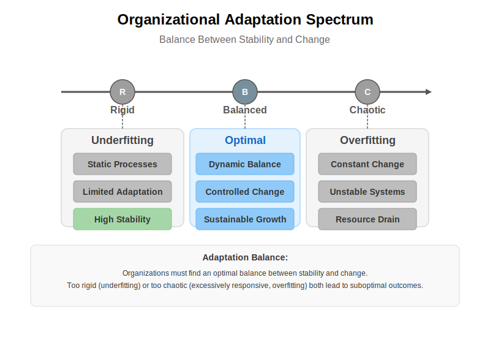
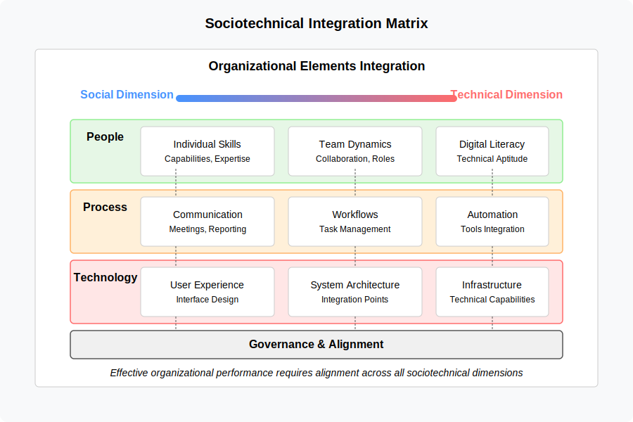

# 6. Related Theoretical Concepts

## 6.1 Software Project Risks and Long Tail Distributions

The challenges in software project estimation are often exacerbated by the presence of a "[long tail](https://en.wikipedia.org/wiki/Long_tail)" distribution of risks. This concept, borrowed from statistics, describes a scenario where a large number of low-probability events can collectively have a significant impact.

### Common vs. Long-tail Risks

### Impact on Estimation Models
Simplified estimation models often fail by:
- Focusing on average scenarios
- Overlooking rare but high-impact events
- Underestimating contingency needs

### Analogy to Underfitting
Just as an underfit machine learning model fails to capture the full variability of the data, an estimation model that doesn't consider the wide range of potential, albeit less likely, risks will likely underestimate the total effort and duration required to complete the project successfully. When these "long-tail" events occur, the project is often significantly delayed and over budget, highlighting the inadequacy of the initial, underfit estimation.

## 6.2 Dissipative Systems Theory and Organizational Dynamics

[Dissipative systems theory](https://en.wikipedia.org/wiki/Dissipative_system) offers a valuable framework for understanding organizational dynamics, stability, adaptation, and complexity management.

### Core Concepts
A dissipative system is characterized by:
- [Open system](https://en.wikipedia.org/wiki/Open_system_(systems_theory)) properties
- Energy and matter exchange with environment
- Operation far from  [thermodynamic equilibrium](https://www.britannica.com/science/thermodynamic-equilibrium)

### Organizational Parallels
Organizations mirror dissipative systems through:
- Constant environmental interaction
- Input/output exchanges
- Dynamic equilibrium maintenance

> See also: Erich Jantsch, [The Theory of Dissipative Structures (1975)](https://www.panarchy.org/jantsch/dissipativestructures.html). Jantsch's essay applies [Ilya Prigogine](https://www.nobelprize.org/prizes/chemistry/1977/prigogine/facts/)'s "dissipative‑structure" physics to social and cultural evolution. In his view, human systems—cities, offices, nations—behave like far‑from‑equilibrium physical systems that spontaneously reorganize when hit by sufficiently strong fluctuations. This reframes "progress" as a cycle of instability → mutation → temporary order.

### Self-Organization and Complexity
The theory suggests that:
- Order and complexity emerge through self-organization
- Systems must maintain state far from equilibrium
- Balance between stability and adaptation is crucial

### Bifurcation Points and Phase Transitions

Dissipative systems often exhibit bifurcation points—critical thresholds where small changes in environmental conditions trigger dramatic reorganization of the system structure.

These phase transitions relate to underfitting and overfitting:

- A system that never reaches bifurcation points may be underfit—unable to qualitatively change its structure when environmental conditions demand it
- A system that undergoes constant bifurcations without stabilizing may be overfit—too sensitive to minor environmental fluctuations

The ability to selectively trigger and navigate bifurcations represents a sophisticated adaptation mechanism that helps maintain appropriate complexity across changing conditions.

### Implications for Organizational Models

#### Underfitting Risks
Organizations that become too rigid and standardized may:
- Fail to adapt to dynamic changes
- Experience instability
- Face potential decline

#### Overfitting Risks
Organizations that are excessively complex and tightly coupled might:
- Lack flexibility
- Struggle with unexpected disruptions
- Become too specialized for their environment

> See also: ["A unified open systems model for explaining organisational change"](https://core.ac.uk/download/pdf/36992804.pdf). The paper proposes a model that fuses two classic perspectives on organisational change: the traditional open‑systems/homeostatic view that explains gradual, adaptive shifts, and the dissipative/non‑equilibrium view (borrowed from Prigogine) that explains rare, disruptive transformations. By stitching the two together the authors argue we can describe the full cycle of organisational evolution—from small process tweaks to culture‑level upheavals—within the same conceptual frame.

### Balance Through Dissipative Systems Principles
Successful organizations need to:
1. Maintain appropriate complexity levels
2. Function efficiently while remaining adaptable
3. Engage in continuous:
   - Environmental interaction
   - Self-organization
   - Adjustment

This perspective aligns closely with principles from **cybernetics**, the study of control and communication in systems (both artificial and natural). Concepts like **feedback loops** (where system outputs influence future actions), **control mechanisms** (processes that steer the system), and **adaptation** (adjusting based on feedback) are fundamental to how dissipative systems, including organizations, maintain their dynamic state far from equilibrium. 

#### Cybernetics and Organizational Control

Cybernetics provides a crucial theoretical foundation for understanding how organizations regulate themselves and adapt to changing conditions. Developed by Norbert Wiener and others in the 1940s, cybernetics offers a cross-disciplinary approach to studying regulatory systems—their structures, constraints, and possibilities.

Key cybernetic principles applicable to organizational systems include:

1. **Feedback Loops**: Organizations maintain stability through both:
   - **Negative feedback**: Error-correcting mechanisms that counteract deviations from desired states
   - **Positive feedback**: Self-reinforcing processes that amplify certain signals, potentially leading to growth or transformation

2. **Requisite Variety**: Ashby's Law of Requisite Variety states that "only variety can absorb variety," meaning a control system must have at least as much variety (possible states) as the system it controls. For organizations, this suggests that internal complexity must match environmental complexity—directly addressing the underfitting/overfitting balance.

3. **Viable System Model (VSM)**: Developed by Stafford Beer, the VSM defines the necessary and sufficient organizational functions for system viability, including operations, coordination, control, intelligence, and policy. This model specifies the minimum complexity required for organizational survival.

4. **First and Second-Order Cybernetics**: 
   - First-order cybernetics focuses on observed systems with external control
   - Second-order cybernetics considers observing systems, including self-observation and recursion

Management cybernetics, pioneered by Stafford Beer, applies these principles specifically to organizational design and management, offering frameworks for creating organizations that balance stability with adaptability.

An effective organization uses feedback to learn and adapt. The integration of AI, as discussed further in Chapter 8, can significantly enhance these cybernetic functions by providing more sophisticated monitoring, faster data analysis, and automated feedback mechanisms. However, it also introduces new challenges for control and adaptation, particularly concerning the transparency of AI-driven feedback and the management of complex human-AI interactions within these loops. Underfitting, in this context, can represent weak or ignored feedback loops (human or AI-driven) leading to poor adaptation, while overfitting might represent overly rigid control mechanisms (potentially exacerbated by poorly designed AI) that stifle necessary adjustments based on environmental feedback.

### Edge of Chaos and Criticality

The "edge of chaos" concept in complexity science describes the transition zone between order and disorder where systems exhibit their greatest complexity, adaptability, and computational capability.

This concept connects to the underfitting/overfitting spectrum:

- **Ordered regime** (potential overfitting): Excessive structure and constraints limit adaptability
- **Chaotic regime** (potential underfitting): Insufficient structure prevents coherent function
- **Critical regime** (appropriate fitting): Balanced complexity enables both stability and adaptation

Systems positioned at this critical point between order and chaos can maintain enough structure to function coherently while remaining flexible enough to adapt to changes—a hallmark of appropriately fitted models.

Modern research suggests that many biological and social systems naturally evolve toward this critical state, suggesting there may be fundamental principles driving systems toward appropriate complexity levels over time.

### Avoiding Extremes
Organizations must navigate between:
- Oversimplification (underfitting)
- Excessive specialization (overfitting)

While maintaining:
- Operational efficiency
- Adaptive capacity
- Long-term sustainability

## 6.3 Entropy and Software Complexity

### Information Entropy in Software Development

[Information entropy](https://en.wikipedia.org/wiki/Entropy_(information_theory)), a concept introduced by Claude Shannon, quantifies uncertainty or unpredictability within a system. In software development contexts, entropy can be understood as a measure of the unpredictability inherent in projects:

- Higher entropy = Greater uncertainty = Less predictable outcomes
- Lower entropy = More certainty = More predictable outcomes

### Entropy as a Framework for Estimation Challenges

Entropy provides a theoretical foundation for understanding why software estimation is fundamentally challenging:

1. **Complexity Increases Entropy**: As software systems grow in complexity (more components, interactions, dependencies), entropy naturally increases. Each additional variable introduces new possible states and outcomes.

2. **Knowledge Gaps and Entropy**: Incomplete information about requirements, technical constraints, or team capabilities directly increases the entropy of the estimation model.

3. **Quantifiable Uncertainty**: Entropy offers a mathematical framework for quantifying the uncertainty in different project types and stages, potentially allowing for more precise risk assessment.

### Entropy and Model Fitting

The concepts of underfitting and overfitting can be reframed through entropy:

#### Underfitting Through Entropy Lens
Underfit models fail to capture the true entropy of the system:
- They assume lower entropy (more predictability) than actually exists
- They oversimplify by ignoring significant sources of uncertainty
- They create a false sense of predictability by reducing apparent complexity

#### Overfitting Through Entropy Lens
Overfit models misinterpret the sources of entropy:
- They mistake random noise for signal
- They create artificial patterns from limited historical data
- They fail to generalize because they're tuned to specific entropy patterns from past projects

### Entropy and the Long Tail

The long tail distribution of software risks directly connects to entropy theory:
- The unpredictable, rare events in the tail represent high-entropy elements
- Traditional estimation focuses on low-entropy (common, predictable) events
- Comprehensive models must account for the full entropy spectrum

### Entropy in Organizational Systems

Organizations as dissipative systems must manage entropy:
- They require energy input to maintain order (counter increasing entropy)
- They must balance between rigid structure (low entropy but brittle) and chaos (high entropy but adaptable)
- AI-assisted development introduces new entropy variables into organizational systems

### Negentropy in Software Development

[Negentropy](https://en.wikipedia.org/wiki/Negentropy) (negative entropy) represents the counterforce to entropy—the creation of order, structure, and certainty within complex systems. While entropy measures disorder and unpredictability, negentropy quantifies a system's degree of organization and ability to produce reliable outcomes.

In software development, negentropy manifests through practices that reduce uncertainty and create structure:

<figure>  <figcaption>Figure 6.4: Sources of negentropy in software development processes</figcaption> </figure>

#### Key Sources of Negentropy

1. **Technical Documentation**: Comprehensive documentation turns implicit knowledge into explicit knowledge, reducing uncertainty for current and future developers.

2. **Test Coverage**: Robust testing reduces uncertainty about whether code changes will introduce bugs, creating confidence in modifications.

3. **Code Standards and Patterns**: Consistent patterns and standards reduce cognitive load and decision entropy by establishing clear defaults.

4. **Knowledge Sharing**: Regular knowledge transfer sessions prevent information silos that increase organizational entropy.

5. **Process Refinement**: Iterative improvement of development processes reduces variability in outcomes.

#### The Negentropy-Creativity Balance

While negentropy brings order and predictability, excessive focus on structure can stifle creativity and innovation. The most effective software organizations maintain what might be called "entropic flexibility"—enough structure to maintain coherence, but enough freedom to allow novel solutions.

This dynamic balance parallels the underfitting-overfitting spectrum:
- Too little negentropy (high disorder) → Chaos, unpredictability → Parallel to underfitting
- Optimal negentropy balance → Productive creativity within structure → Well-calibrated models
- Too much negentropy (rigid order) → Bureaucracy, inflexibility → Parallel to overfitting

#### Negentropy and Estimation

In the context of software estimation, negentropy-building activities can significantly improve model accuracy by:
- Reducing variability in development processes
- Creating more consistent, predictable workflows
- Establishing clear boundaries for uncertainty
- Building institutional knowledge that informs future estimates

However, there is an important caveat: the *process* of creating negentropy (documentation, testing, etc.) must itself be accounted for in time estimates. Organizations sometimes underestimate projects because they ignore the time required for these critical uncertainty-reducing activities.

### Practical Implications

Understanding entropy in software development enables:
1. More realistic assessment of estimation limitations
2. Better quantification of uncertainty in different project types
3. Improved risk models that account for inherent unpredictability
4. Development of estimation techniques that explicitly incorporate uncertainty measures

This entropy framework provides a theoretical basis for many practical observations throughout this book, from the challenges of time estimation (Chapter 2) to the optimization of organizational models (Chapters 7 and 8).

## 6.4 Bayesian Statistics and Uncertainty Management

### Bayesian Probability as a Framework for Belief Updating

[Bayesian statistics](https://en.wikipedia.org/wiki/Bayesian_statistics) provides a mathematical framework for updating beliefs in light of new evidence. Unlike frequentist statistics, which treats probability as the long-run frequency of events, Bayesian probability represents degrees of belief that can be revised as new information becomes available.

The foundation of Bayesian reasoning is [Bayes' theorem](https://en.wikipedia.org/wiki/Bayes%27_theorem) (explained simply in [this Khan Academy video](https://www.khanacademy.org/math/statistics-probability/probability-library/conditional-probability-bayes/v/bayes-theorem-visualized)):

$$P(H|E) = \frac{P(E|H) \cdot P(H)}{P(E)}$$

Where:
- $P(H|E)$ is the posterior probability (updated belief after observing evidence)
- $P(E|H)$ is the likelihood (probability of the evidence given the hypothesis)
- $P(H)$ is the prior probability (initial belief before evidence)
- $P(E)$ is the marginal likelihood (total probability of observing the evidence)

<figure>  <figcaption>Figure 6.5: Bayesian belief updating process with multiple iterations of evidence</figcaption> </figure>

#### Key Bayesian Concepts Explained

- **Priors and Informative Priors**: A "prior" is your initial belief before seeing new evidence. An "[informative prior](https://en.wikipedia.org/wiki/Prior_probability#Informative_priors)" incorporates existing knowledge rather than starting with a blank slate. For example, when estimating a software project's duration, an informative prior might incorporate knowledge about team performance, similar past projects, or even qualitative factors like team morale and technology familiarity. This is how Bayesian methods can integrate "soft" factors into quantitative models.

- **Complex Dependencies Between Variables**: Traditional statistical methods often assume variables are independent. Bayesian networks (also called [probabilistic graphical models](https://en.wikipedia.org/wiki/Graphical_model)) can represent situations where multiple factors influence each other - for instance, how changes in requirements might affect both testing time and integration complexity in interconnected ways.

- **Marginal Likelihood and Complexity Penalization**: The [marginal likelihood](https://en.wikipedia.org/wiki/Marginal_likelihood) (sometimes called "evidence") naturally balances model fit against complexity. More complex models (with more parameters) can fit existing data better but might not generalize well. The marginal likelihood automatically penalizes unnecessary complexity, helping prevent overfitting without requiring manual parameter tuning.

- **Hierarchical Modeling**: [Hierarchical (or multilevel) models](https://en.wikipedia.org/wiki/Multilevel_model) allow information to be shared across similar but not identical situations. For example, different software projects might have their own unique characteristics but still share common patterns. Hierarchical modeling allows learning from the entire portfolio of projects while still capturing the uniqueness of each one. These models create a middle path between complete pooling of data (potential underfitting by ignoring group differences) and no pooling (potential overfitting by treating each group independently).

### Relationship Between Bayesian Methods and Entropy

Bayesian statistics and information entropy are deeply connected theoretical frameworks:

1. **Quantification of Uncertainty**: Both frameworks provide mathematical approaches to quantify uncertainty, with entropy measuring the amount of uncertainty in a probability distribution and Bayesian methods providing tools to update these distributions.

2. **Information as Uncertainty Reduction**: In both frameworks, information serves to reduce uncertainty—entropy decreases as information increases, while Bayesian posteriors become more concentrated (less uncertain) as evidence accumulates.

3. **Maximum Entropy Principle**: When formulating priors with limited information, the [principle of maximum entropy](https://en.wikipedia.org/wiki/Principle_of_maximum_entropy) suggests choosing the distribution with highest entropy that satisfies the known constraints—creating a natural bridge between these concepts.

### Bayesian Decision Theory

Bayesian methods extend beyond probability updating to provide a framework for optimal decision-making under uncertainty through [Bayesian decision theory](https://en.wikipedia.org/wiki/Bayesian_decision_theory):

1. **Expected Utility Maximization**: Decisions are evaluated based on their expected utility, calculated by weighting possible outcomes by their posterior probabilities.

2. **Value of Information**: Bayesian frameworks can quantify the expected value of additional information before making decisions, allowing for rational choices about when to gather more data versus when to proceed with current knowledge.

3. **Explicit Treatment of Risk**: By working with full probability distributions rather than point estimates, Bayesian approaches naturally incorporate risk assessment into decision processes.

### Applications to Organizational and Project Management

In organizational contexts, Bayesian thinking provides powerful tools for managing uncertainty:

1. **Incremental Learning**: Organizations can formalize institutional learning by treating past experiences as priors and updating these beliefs with new project data.

2. **Managing Unknown Unknowns**: Bayesian methods can incorporate parameter uncertainty (known unknowns) and model uncertainty (unknown unknowns) through hierarchical models and model averaging.

3. **Avoiding Cognitive Biases**: Formal Bayesian updating can help counter anchoring, confirmation bias, and overconfidence by requiring explicit quantification of beliefs and systematic updating procedures.

4. **Adaptive Planning**: Rather than creating fixed plans based on initial estimates, Bayesian approaches support adaptive planning that evolves as new information becomes available.

The practical application of these concepts to software time estimation is explored in [Chapter 2](02-software-time-estimation.md#bayesian-approaches-to-estimation), where we examine how Bayesian methods can help address both underfitting and overfitting in estimation models.

## 6.5 Sociotechnical Systems Theory

### 6.5.1 Understanding the Sociotechnical System as an Integrated Whole

Organizations exist as complex sociotechnical systems where human, process, and technological elements interact continuously. To achieve optimal performance, these layers must be viewed as an integrated whole rather than isolated components.

The sociotechnical integration matrix above illustrates how different organizational elements interact across the social and technical dimensions, highlighting the interconnected nature of modern enterprises.

### 6.5.2 Historical Evolution of Sociotechnical Thinking

Sociotechnical systems theory emerged in the 1950s from research at the Tavistock Institute, which found that technological innovations alone were insufficient for performance improvement without considering the social systems in which they operated. This shift recognized that optimizing either technical or social aspects in isolation often led to suboptimal outcomes, presaging our modern understanding of the underfitting/overfitting dilemma.

Early research focused on primary industries (e.g., coal mining), but the principles apply broadly across sectors and organizational types, especially as digital technologies become increasingly embedded in organizational structures. The theory provides a foundation for understanding how the relationship between people, processes, and technology creates emergent properties that cannot be understood by studying components in isolation.

### 6.5.3 Implications for Organizational Models

The sociotechnical perspective offers several insights relevant to organizational modeling:

1. **Joint Optimization**: Models must jointly optimize both social and technical elements rather than maximizing either in isolation. This perspective helps avoid both underfitting (oversimplified models that ignore social dynamics) and overfitting (excessively technical models that don't account for human factors).

2. **Boundary Management**: Effective organizations manage the boundaries between social and technical elements carefully, creating interfaces that facilitate interaction while maintaining appropriate separation.

3. **Adaptive Capacity**: Sociotechnical systems require adaptive capacity that allows for continuous reconfiguration as conditions change. This adaptability parallels the concepts from dissipative systems theory discussed earlier.

4. **Emergent Properties**: The interaction between social and technical elements creates emergent properties that cannot be predicted by examining the components in isolation. This emergence is particularly relevant to understanding complexity in organizational models.

### 6.5.4 Application to AI-Integrated Organizations

As AI capabilities become more central to organizational functions, sociotechnical systems theory becomes increasingly relevant. AI technologies interact with social systems in complex ways, potentially creating both reinforcing and balancing feedback loops.

Key considerations include:

- **Role Redefinition**: How AI integration reshapes human roles and responsibilities 
- **Skill Evolution**: The changing landscape of skills needed in AI-augmented workplaces
- **Process Reconfiguration**: How workflows and processes adapt to incorporate AI capabilities
- **Governance Structures**: New mechanisms for maintaining oversight of AI-human systems

The sociotechnical perspective provides a theoretical basis for many of the observations in Chapters 8 and 9 regarding AI's impact on organizational structures and human skill requirements. It emphasizes that effective integration requires attention to both the technical capabilities of AI systems and the social contexts in which they operate.

## 6.6 Integration of Theoretical Perspectives

The theoretical concepts explored in this chapter—long tail distributions, dissipative systems, entropy, Bayesian statistics, and sociotechnical systems—provide complementary lenses for understanding the challenges of organizational modeling. While each perspective emphasizes different aspects, together they illuminate the fundamental tensions organizations face when developing models that are both adaptable and structured.

These theories collectively suggest that effective organizational models must:
1. Account for rare but impactful events (long tail)
2. Maintain dynamic equilibrium through continuous adaptation (dissipative systems)
3. Manage uncertainty while creating appropriate structure (entropy/negentropy)
4. Update beliefs and practices as new evidence emerges (Bayesian thinking)
5. Integrate social and technical elements as an interconnected whole (sociotechnical systems)

In the subsequent chapters, we will examine how these theoretical perspectives manifest in specific organizational contexts, from medium-sized enterprises to healthcare systems to AI-augmented organizations.

[Back to Table of Contents](../README.md)
