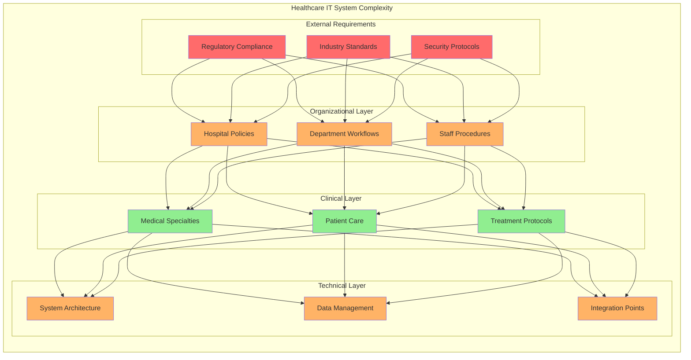
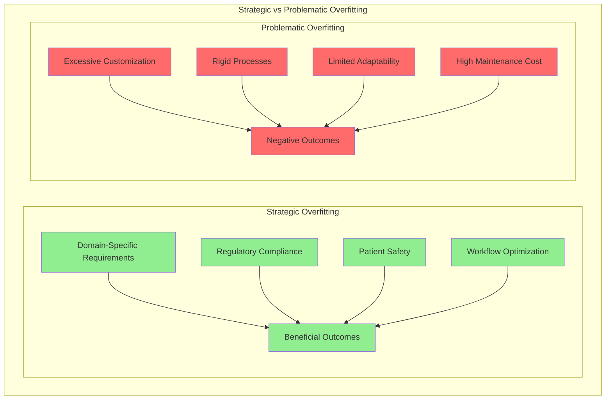
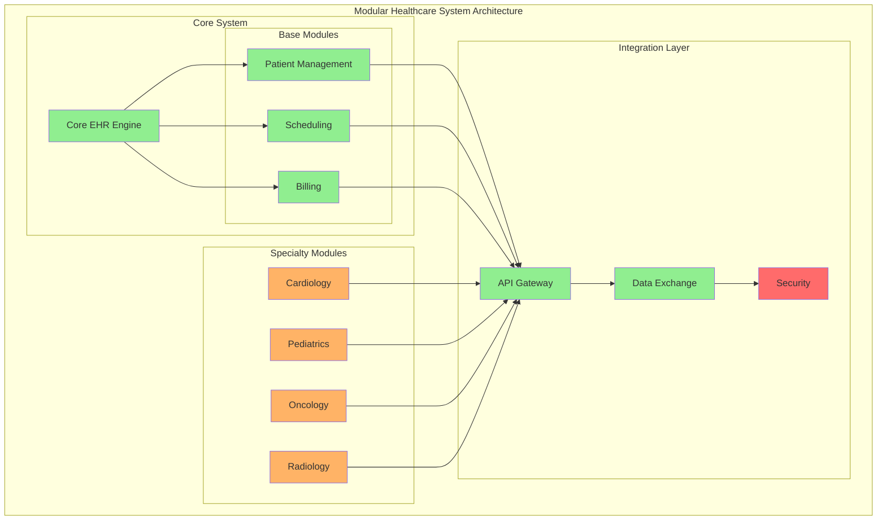
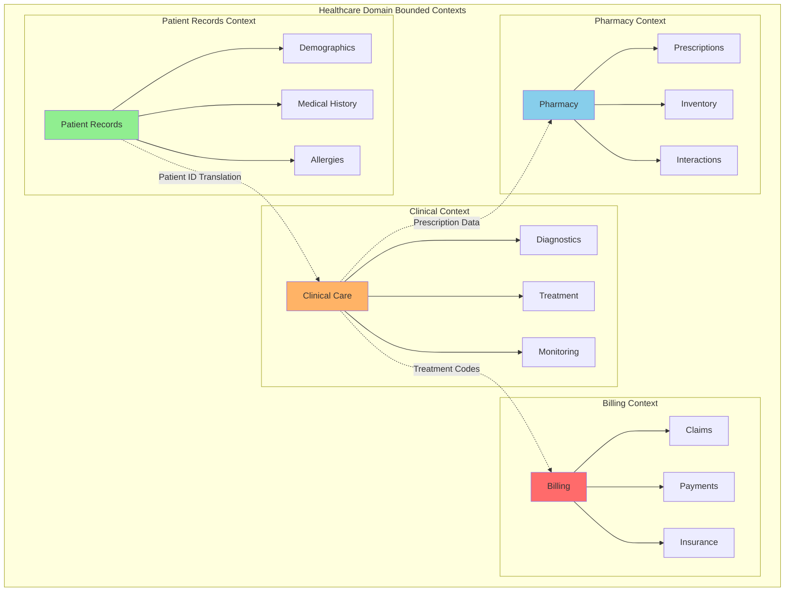
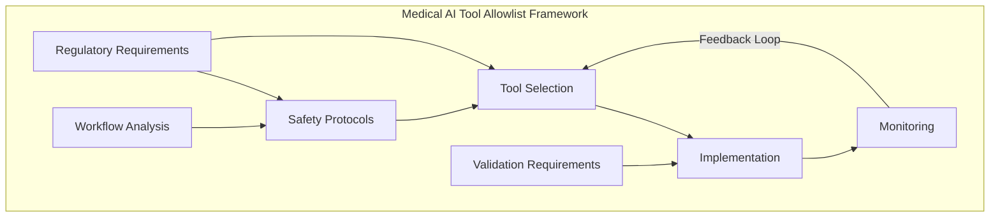
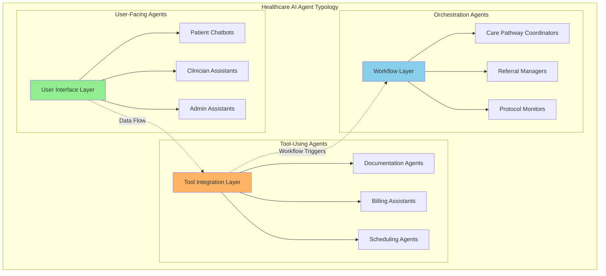
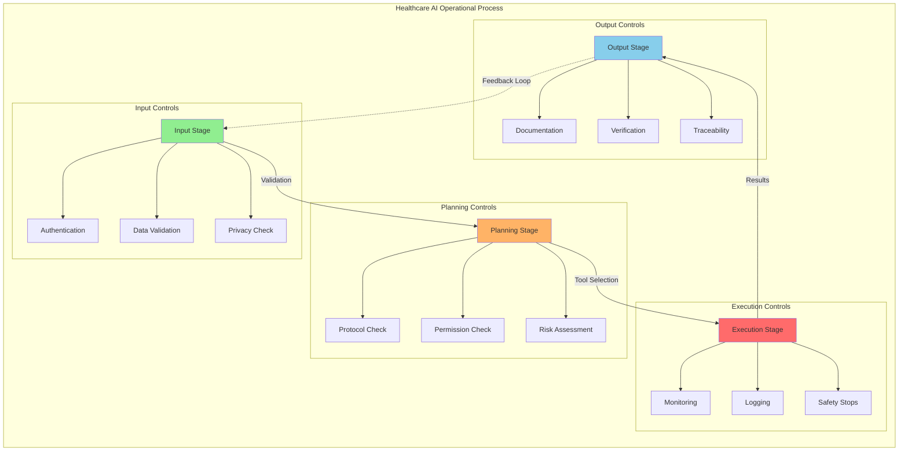

# 7. Healthcare Information Systems: The Case for Strategic Overfitting

## 7.1 Introduction: The Customization Paradox in Healthcare

The development and implementation of information systems in highly regulated and specialized environments like healthcare present unique challenges that often necessitate a high degree of customization.

### Core Challenges
The healthcare industry faces inherent tensions between:
- Standardization requirements
- Specific workflow needs
- Patient safety measures
- Regulatory compliance

### Limitations of Generic Solutions
Off-the-shelf solutions often prove inadequate due to:
- Complex regulatory requirements
- Diverse medical specialties' needs
- Stringent patient safety standards
- Varying organizational workflows



### Custom EHR Benefits
Electronic Health Record (EHR) software can be tailored to:
- Meet unique organizational needs
- Improve workflow efficiency
- Enhance data security
- Adapt to regulatory changes

### Specialization Requirements
Different medical practices require:
- Specialized tools
- Custom templates
- Specific data management protocols
- Unique workflow optimizations



## 7.2 Modular Design as a Solution

### Strategic Overfitting Concept
In healthcare IT, "strategic overfitting" represents:
- Necessary high degree of customization
- Specific clinical needs accommodation
- Regulatory compliance requirements
- Domain-specific optimizations
  


### Contrast with Traditional Overfitting
Unlike traditional overfitting concerns:
- Healthcare customization is often necessary
- Specificity serves critical purposes
- Generalization may be less important than accuracy

### Modular Design Solutions

#### Key Benefits
Modular design helps manage complexity through:
- Independent, reusable modules
- Standardized interfaces
- Flexible integration capabilities

#### Implementation Areas
Modularity applies to:
1. Software Components
   - Specialty-specific add-ons
   - Custom workflow modules
   - Integration interfaces

2. Physical Spaces
   - Operating room customization
   - Patient room adaptation
   - Clinical workspace optimization

### Balance Through Modularity

#### Achieving Specificity While Maintaining Maintainability
Modular approach enables:
- Customization for different specialties
- Workflow optimization
- System integration
- Updates and maintenance

#### Key Trade-offs
Managing the balance between:
- Deep customization benefits
- Maintenance complexity
- System scalability
- Long-term viability



## 7.3 Implementation Considerations

### Success Factors
1. Understanding specific clinical needs
2. Regulatory compliance integration
3. Workflow optimization
4. Security implementation
5. System integration capabilities

### Risk Management
- Thorough testing protocols
- Validation procedures
- Error prevention mechanisms
- Data integrity measures

### Long-term Sustainability
Focus on:
- Maintainable customization
- Scalable architecture
- Adaptable frameworks
- Future expansion capability

## 7.4 Analyzing the Case Through a DDD Lens

The challenges and solutions presented in the medical information systems case study align strongly with core concepts from Domain-Driven Design (DDD).

Applying a DDD perspective involves identifying distinct **Bounded Contexts** within the complex healthcare domain. The following diagram illustrates the key bounded contexts and their relationships:



Each of these contexts requires its own specific model and terminology. The critical importance of a **Ubiquitous Language** within each Bounded Context cannot be overstated in a high-stakes domain like healthcare.

The concept of "strategic overfitting" discussed earlier can be viewed through the lens of needing highly specialized models within specific Bounded Contexts. Modular design, presented as a solution, directly corresponds to the DDD practice of isolating these contexts and defining clear interfaces (potentially using Context Mapping patterns like Anticorruption Layers or Open Host Services) to manage their interactions.

Designing the system, and potentially structuring development teams around these identified Bounded Contexts (applying the Inverse Conway Maneuver discussed in Chapter 3), provides a robust strategy for managing the inherent complexity, ensuring focus, and facilitating clearer communication within the intricate healthcare domain.

## 7.5 Strategic Overfitting Lessons from Traditional Medical Systems

This balance between necessary overfitting and harmful rigidity represents the "strategic" aspect of this approach—intentionally creating constraints that enhance rather than limit system effectiveness in regulated environments like healthcare.

The healthcare case study offers several broader lessons that extend beyond medical contexts:

1. **Domain-Specific Specialization**: The success of healthcare systems depends on intentional specialization to meet regulatory, clinical, and operational requirements. This strategic overfitting creates systems that are more effective precisely because they are tailored to their context.

2. **Modular Design with Clear Boundaries**: While specialization is necessary, healthcare IT demonstrates how modular architectures with well-defined interfaces enable sustainable evolution despite high degrees of specialization.

3. **Balancing Adaptability and Constraints**: Successful healthcare systems find equilibrium between necessary constraints (overfitting) and adaptive capacity (avoiding harmful rigidity).

4. **Regulatory Alignment Through Intentional Design**: Rather than viewing regulations as obstacles, effective healthcare IT incorporates regulatory requirements as design parameters that shape system architecture.

These principles established in traditional healthcare IT provide a foundation for understanding how similar approaches apply to emerging technologies, including AI integration in clinical environments.

## 7.6 AI Integration in Medical Systems: Strategic Constraints as Enabling Factors

Medical contexts present a compelling example where strategic constraints—intentionally limiting certain capabilities while enabling others—can enhance both safety and effectiveness in AI implementation. The concept of tool allowlists in AI systems mirrors the strategic overfitting approach discussed for traditional healthcare IT:

| Tool Allowlist Characteristic | Strategic Overfitting Concept |
|-----------------|----------------------------|
| Domain-specific function selection | Intentional specialization for context |
| Workflow-aligned capabilities | Function boundaries reflecting domain needs |
| Graduated access levels | Calibrated constraints based on risk |
| Safety-oriented restrictions | Protective boundaries that enable trusted use |



In radiology departments, for example, AI systems implement tight constraints on image analysis capabilities and reporting workflows to ensure diagnostic accuracy. These constraints represent a sophisticated application of strategic overfitting—the AI is intentionally limited in certain ways to make it more effective and trustworthy in its specific context.

### 7.6.1 Balancing Constraints and Capabilities

As with traditional healthcare IT, AI implementation requires finding the right balance between underfitting (excessive generality) and overfitting (excessive rigidity):

**Underfitting Risks in Medical AI**:
- Generic capabilities failing to address specific clinical needs
- Insufficient guardrails for sensitive operations
- Inadequate domain-specific training resulting in low accuracy
- Missing healthcare-specific security controls

**Overfitting Risks in Medical AI**:
- Excessive restrictions limiting legitimate clinical utility
- Inflexible workflows unable to accommodate clinical variation
- Over-customization reducing maintainability
- Inability to incorporate emerging best practices

Successful medical AI implementations find the appropriate balance through careful domain analysis, stakeholder engagement, and incremental implementation—principles directly aligned with Domain-Driven Design approaches.

### 7.6.2 Implementation Patterns

Several patterns have emerged for effective AI integration in healthcare, reflecting the strategic overfitting approach:

1. **Domain Expert Partnership**: Medical AI systems work most effectively when implemented as partnerships with domain experts rather than autonomous agents. This pattern establishes clear boundaries between AI capabilities and human expertise.

2. **Contextual Guardrails**: Rather than implementing uniform restrictions, effective medical AI employs context-sensitive guardrails that adapt based on the clinical scenario, user role, and potential risk.

3. **Explicit Reasoning Transparency**: Medical AI systems prioritize explainability, providing clear rationales for recommendations and maintaining transparency about limitations—a direct application of DDD's focus on making implicit domain knowledge explicit.

4. **Bounded Autonomy**: Following DDD's bounded context principle, medical AI systems operate with clearly defined scopes of autonomy, with explicit handoffs to human judgment for decisions outside these boundaries.

These patterns demonstrate how the strategic overfitting approach from traditional healthcare IT extends to AI implementation, creating systems that respect the domain's complexity while providing valuable capabilities.

### 7.6.3 Evaluation Frameworks for Medical AI Systems

Healthcare organizations have developed sophisticated approaches to evaluating AI systems, with rigorous attention to accuracy, reliability, and safety. These evaluation frameworks represent another application of strategic overfitting—establishing domain-specific assessment criteria ensures systems are appropriately specialized for their application context.

**Structured Evaluation Methodology**

Effective evaluation frameworks typically include:

1. **Reference Standards**: Comparing outputs against gold-standard clinical references
2. **Human Expert Validation**: Assessing performance against experienced clinician judgments 
3. **Edge Case Testing**: Deliberately testing uncommon but critical scenarios
4. **Longitudinal Performance**: Monitoring system performance over time

Morgan Stanley's approach to financial systems evaluation offers an instructive parallel for healthcare organizations. Their evaluation methodology begins with validation against reference standards, followed by expert evaluation, ultimately creating "confidence to start rolling the use cases into production" (OpenAI, 2024b). This methodical approach exemplifies the strategic overfitting concept applied to evaluation—establishing rigorous, domain-specific frameworks rather than generic acceptance criteria.

### 7.6.4 Implementation Prioritization in Healthcare AI

Effective AI integration in healthcare requires thoughtful prioritization of potential applications. Healthcare organizations should balance impact potential against implementation complexity to maximize value while managing resource constraints.

For a comprehensive framework on AI implementation prioritization, readers should refer to Chapter 9, Section 9.4.6, which details the Impact/Effort Framework and general prioritization approaches.

In healthcare contexts, this prioritization approach takes on specific characteristics aligned with strategic overfitting principles:

Medical institutions can apply this prioritization framework to identify optimal starting points for AI integration:

**High ROI Focus (High Impact/Low Effort)**
- Documentation workflow enhancements that reduce clinician administrative burden
- Automated routing for routine inquiries to appropriate departments
- Knowledge access tools that improve clinical information retrieval

**Transformational (High Impact/High Effort)**
- Clinical decision support integrated with electronic health records
- Advanced analytics for population health management
- Comprehensive patient monitoring systems that integrate multiple data streams

This healthcare-specific application of the prioritization framework complements the strategic overfitting concept by ensuring that AI implementations are both appropriately specialized for medical contexts and pragmatically sequenced for organizational adoption.

### 7.6.5 Tool Risk Assessment for Medical AI Systems

A critical aspect of strategic overfitting in medical AI involves carefully evaluating the risk profiles of different AI capabilities. OpenAI (2024a) recommends a structured approach to tool risk assessment, which is particularly relevant in healthcare contexts where patient safety and regulatory compliance are paramount.

Tool risk assessments typically evaluate AI capabilities across several dimensions:

1. **Access Type**: What systems or data can the tool access?
2. **Reversibility**: Can actions be easily undone?
3. **Required Permissions**: What authorization levels are needed?
4. **Potential Impact**: What harm could result from misuse?
5. **Financial Implications**: What monetary risks exist?

These assessments can be formalized into risk rating frameworks that inform the implementation of appropriate guardrails:

| Risk Level | Definition | Example in Healthcare | Required Guardrails |
|------------|------------|----------------------|---------------------|
| Low | Limited access, easily reversible, minimal harm potential | Information retrieval from approved medical knowledge bases | Basic validation, usage logging |
| Medium | Some sensitive access, partially reversible, moderate harm potential | Draft documentation with automated clinical coding | Human review before finalization, clear edit history |
| High | Sensitive data access, difficult to reverse, significant harm potential | Patient treatment recommendations | Multi-factor authentication, mandatory expert review, extensive logging |
| Critical | Direct clinical impact, irreversible, severe harm potential | Autonomous medication dosing calculations | Strict usage limitations, comprehensive guardrails, multiple approval layers |

This structured approach to risk assessment exemplifies how strategic overfitting principles can be applied to AI implementation in healthcare—creating intentional constraints calibrated to the specific risk profile rather than applying uniform restrictions across all functions.

### 7.6.6 Agent Typologies in Healthcare

The effective integration of AI agents in healthcare requires understanding different agent archetypes and their appropriate applications. The following diagram illustrates the hierarchy and relationships between different agent types:



**User-facing agents** in healthcare function as interfaces between clinical systems and users. These include:
- Patient-facing chatbots for appointment scheduling and basic triage
- Clinician assistants that help with documentation and information retrieval
- Administrative support agents that handle routine inquiries

**Tool-using agents** perform specific functions using access to systems and tools:
- Clinical documentation agents that draft notes from encounter recordings
- Billing and coding assistants that suggest appropriate codes based on documentation
- Resource scheduling agents that optimize staff and facility utilization

**Orchestration agents** coordinate workflows across multiple systems:
- Care pathway coordinators that track patient progression through treatment protocols
- Referral management agents that facilitate transfers between providers
- Research protocol adherence monitors that ensure study compliance

Understanding these typologies allows healthcare organizations to develop appropriate governance frameworks aligned with DDD principles, establishing bounded contexts for each agent type with clear responsibilities and interfaces.

### 7.6.7 Operational Process for AI Agents in Healthcare

The implementation of AI agents in healthcare follows a structured operational process that reflects strategic overfitting principles. The following diagram illustrates this process and its control points:



McKinsey (2025) outlines a four-step process that applies effectively to healthcare contexts:

1. **Input Stage**: The agent receives information from users or systems, including patient data, clinical questions, or administrative requests. This stage requires careful authentication and data validation aligned with healthcare privacy requirements.

2. **Planning Stage**: The agent develops an approach to address the request, determining required tools, information sources, and workflows. In healthcare, this planning must respect clinical protocols and organizational procedures.

3. **Execution Stage**: The agent carries out the plan, accessing appropriate tools and systems based on permissions and capabilities. Healthcare implementations typically implement graduated autonomy based on risk assessment.

4. **Output Stage**: The agent provides results to users or systems, with appropriate documentation and explanation. Healthcare contexts demand particular attention to traceability and accountability in this stage.

This operational framework demonstrates how strategic overfitting principles apply to AI agent implementation in healthcare—creating structured processes with intentional constraints aligned with domain requirements.

### 7.6.8 Trust Building in Medical AI Systems

The successful adoption of AI agents in healthcare depends critically on trust. McKinsey (2025) notes that "building trust is the first step to scaling AI agent systems"—a principle particularly relevant in healthcare contexts where patient safety and clinical effectiveness are paramount.

Key trust-building approaches include:

1. **Transparent Capabilities**: Clearly communicating what AI agents can and cannot do, with explicit acknowledgment of limitations
2. **Reliability Demonstration**: Providing evidence of consistent performance in relevant clinical contexts
3. **Error Handling Protocols**: Establishing clear procedures for addressing mistakes or limitations
4. **Clinician Control**: Maintaining appropriate human oversight and decision authority
5. **Privacy Protection**: Implementing robust safeguards for sensitive health information

These trust-building measures represent another application of strategic overfitting—deliberately designing constraints and transparency mechanisms that enhance system effectiveness in the specific context of healthcare.

### 7.6.9 Structured Prompting Techniques for Medical Applications

Healthcare organizations are increasingly adopting structured prompting techniques that encode domain knowledge and clinical best practices. These approaches represent a sophisticated application of strategic overfitting—deliberately constraining AI interactions to enhance safety and effectiveness in medical contexts.

Google's guidance on prompt engineering (2025) outlines several techniques particularly valuable in healthcare:

**Chain of Thought Prompting in Clinical Reasoning**

Chain of Thought (CoT) prompting guides the AI through a stepwise clinical reasoning process that mirrors physician decision-making:

```
Given the following patient presentation:
- 62-year-old male
- Acute onset chest pain radiating to left arm
- Diaphoresis and nausea
- History of hypertension and hyperlipidemia

Please work through the following steps:
1. List the most likely differential diagnoses
2. Identify the crucial diagnostic tests needed immediately
3. Outline initial management steps while awaiting test results
4. Explain your clinical reasoning at each decision point
```

This structured approach constrains the AI to follow established clinical reasoning pathways, improving safety and relevance.

**Self-Consistency for Differential Diagnosis**

Self-consistency techniques generate multiple reasoning paths to verify clinical conclusions:

```
Generate three independent differential diagnoses for:
- 45-year-old female
- Two-week history of fatigue, weight loss
- Mild fever in evenings
- Recent travel to Southeast Asia

For each differential diagnosis:
1. List the condition and its likelihood
2. Explain your reasoning
3. Identify confirming and excluding factors
```

By comparing multiple reasoning pathways, this technique enhances diagnostic reliability and helps identify potential cognitive biases.

**Step-Back Prompting for Complex Cases**

Step-back prompting encourages the AI to consider the broader clinical context before pursuing specific details:

```
Before analyzing the specific laboratory values in this complex case of suspected autoimmune disorder, step back and consider:
1. What are the major categories of autoimmune disorders that could present with these systemic symptoms?
2. What are the key pathophysiological mechanisms I should consider?
3. How might the patient's demographic factors influence my diagnostic approach?

Now, with this broader context in mind, analyze the specific laboratory findings and suggest the most likely diagnosis.
```

This approach prevents premature narrowing of diagnostic considerations and encourages more comprehensive clinical reasoning.

Each of these techniques represents a form of strategic overfitting—intentionally constraining AI capabilities to align with clinical best practices and safety requirements.

## 7.7 Practical Applications of Domain-Driven AI in Healthcare

The application of domain-driven design principles to AI integration in healthcare yields several practical implementation patterns that balance the need for specialization with broader organizational goals.

## 7.8 Chapter Summary

This chapter has explored the application of strategic overfitting principles in healthcare information systems, demonstrating how domain-specific customization within a modular framework offers significant benefits in complex regulatory environments.

We began by examining the core challenges in healthcare IT—balancing regulatory compliance, clinical workflow support, and interoperability requirements. Electronic health records exemplify the need for strategic overfitting, where systems must be sufficiently specialized to serve their context while maintaining enough flexibility for evolution.

Through the lens of Domain-Driven Design, we analyzed how bounded contexts, ubiquitous language, and strategic design patterns can create more effective healthcare systems. The modular design approach presented offers a practical methodology for implementing these principles, focusing on domain specificity, contextual modularity, and balanced overfitting.

The implementation considerations, including stakeholder engagement, risk management, and sustainability planning, provide a roadmap for effectively applying these concepts in real-world healthcare environments. The lessons learned emphasize the importance of intentional specialization, modular architecture, and long-term planning.

In examining AI integration in healthcare, we demonstrated how the same strategic overfitting principles extend naturally to artificial intelligence applications. From tool allowlists to risk assessment frameworks, evaluation methodologies to structured prompting techniques, the chapter established continuity between traditional architectural approaches and modern AI implementation patterns.

The practical applications section illustrated how these principles manifest in real-world healthcare AI implementations, from clinical decision support systems to population health management platforms. Throughout these examples, the core themes of domain specificity, modularity with context, and balanced overfitting remain consistent.

This continuity of principles—from traditional healthcare IT to advanced AI applications—underscores the enduring value of strategic overfitting as an approach to healthcare information system design and implementation. By embracing domain complexity rather than attempting to abstract it away, we create systems that more effectively serve their specific contexts while maintaining necessary adaptability for ongoing evolution.

## References

Cherny, B. (2025, April 18). Claude Code: Best practices for agentic coding. Anthropic. https://www.anthropic.com/engineering/claude-code-best-practices

OpenAI. (2024a). A practical guide to building agents. https://cdn.openai.com/business-guides-and-resources/a-practical-guide-to-building-agents.pdf

OpenAI. (2024b). AI in the enterprise: Lessons from seven frontier companies. https://cdn.openai.com/enterprise-docs/ai-in-the-enterprise.pdf

OpenAI. (2024c). Identifying and scaling AI use cases: How early adopters focus their AI efforts. https://cdn.openai.com/enterprise-docs/identifying-and-scaling-ai-use-cases.pdf

McKinsey. (2025, March 25). What is an AI agent? McKinsey & Company. https://www.mckinsey.com/featured-insights/mckinsey-explainers/what-is-an-ai-agent

Google. (2025). Prompt Engineering. https://cloud.google.com/vertex-ai/generative-ai/docs/learn/prompts

[Back to Table of Contents](../README.md)
