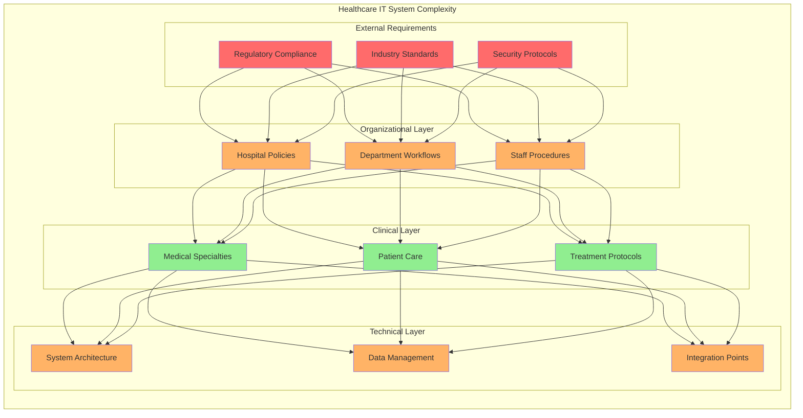
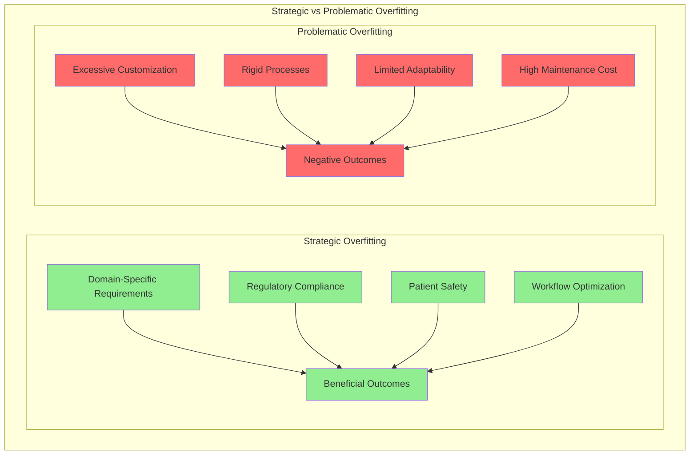
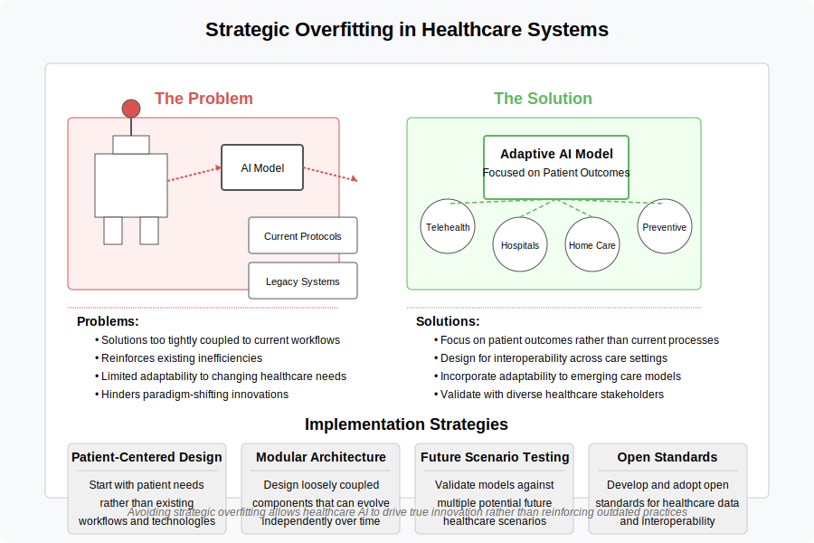
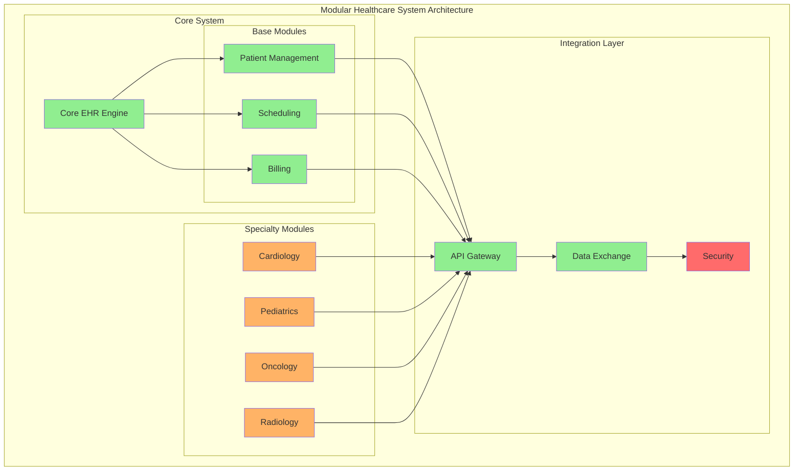

# 7. Context-Specific Case: Medical Information Systems

## 7.1 The Need for Customization in Healthcare IT

The development and implementation of information systems in highly regulated and specialized environments like healthcare present unique challenges that often necessitate a high degree of customization.

### Core Challenges
The healthcare industry faces inherent tensions between:
- Standardization requirements
- Specific workflow needs
- Patient safety measures
- Regulatory compliance

### Limitations of Generic Solutions
Off-the-shelf solutions often prove inadequate due to:
- Complex regulatory requirements
- Diverse medical specialties' needs
- Stringent patient safety standards
- Varying organizational workflows

### Custom EHR Benefits
Electronic Health Record (EHR) software can be tailored to:
- Meet unique organizational needs
- Improve workflow efficiency
- Enhance data security
- Adapt to regulatory changes

### Specialization Requirements
Different medical practices require:
- Specialized tools
- Custom templates
- Specific data management protocols
- Unique workflow optimizations

## 7.2 Strategic Overfitting and Modular Design

### Strategic Overfitting Concept
In healthcare IT, "strategic overfitting" represents:
- Necessary high degree of customization
- Specific clinical needs accommodation
- Regulatory compliance requirements
- Domain-specific optimizations
  

### Contrast with Traditional Overfitting
Unlike traditional overfitting concerns:
- Healthcare customization is often necessary
- Specificity serves critical purposes
- Generalization may be less important than accuracy

### Modular Design Solutions

#### Key Benefits
Modular design helps manage complexity through:
- Independent, reusable modules
- Standardized interfaces
- Flexible integration capabilities

#### Implementation Areas
Modularity applies to:
1. Software Components
   - Specialty-specific add-ons
   - Custom workflow modules
   - Integration interfaces

2. Physical Spaces
   - Operating room customization
   - Patient room adaptation
   - Clinical workspace optimization

### Balance Through Modularity

#### Achieving Specificity While Maintaining Maintainability
Modular approach enables:
- Customization for different specialties
- Workflow optimization
- System integration
- Updates and maintenance

#### Key Trade-offs
Managing the balance between:
- Deep customization benefits
- Maintenance complexity
- System scalability
- Long-term viability

## 7.3 Implementation Considerations

### Success Factors
1. Understanding specific clinical needs
2. Regulatory compliance integration
3. Workflow optimization
4. Security implementation
5. System integration capabilities

### Risk Management
- Thorough testing protocols
- Validation procedures
- Error prevention mechanisms
- Data integrity measures

### Long-term Sustainability
Focus on:
- Maintainable customization
- Scalable architecture
- Adaptable frameworks
- Future expansion capability

## 7.4 Analyzing the Case Through a DDD Lens

The challenges and solutions presented in the medical information systems case study align strongly with core concepts from Domain-Driven Design (DDD).

Applying a DDD perspective involves identifying distinct **Bounded Contexts** within the complex healthcare domain. Potential examples include:
- **Patient Records:** Managing demographics, medical history, allergies, etc.
- **Scheduling:** Handling appointments, resource allocation, and provider availability.
- **Billing:** Managing insurance claims, patient invoices, and payments.
- **Clinical Diagnostics:** Dealing with lab results, imaging reports, and diagnostic interpretations.
- **Pharmacy/Medication Management:** Tracking prescriptions, dosages, and interactions.

Each of these contexts likely requires its own specific model and terminology. The critical importance of a **Ubiquitous Language** within each Bounded Context cannot be overstated in a high-stakes domain like healthcare. Misunderstandings between diverse stakeholders (doctors, nurses, administrators, billing specialists, developers) due to ambiguous language can have severe consequences. Establishing clear, shared language within each specific context (e.g., how "visit" is defined in Scheduling vs. Billing) is paramount.

The concept of "strategic overfitting" discussed earlier can be viewed through the lens of needing highly specialized models within specific Bounded Contexts. Modular design, presented as a solution, directly corresponds to the DDD practice of isolating these contexts and defining clear interfaces (potentially using Context Mapping patterns like Anticorruption Layers or Open Host Services) to manage their interactions.

Designing the system, and potentially structuring development teams around these identified Bounded Contexts (applying the Inverse Conway Maneuver discussed in Chapter 3), provides a robust strategy for managing the inherent complexity, ensuring focus, and facilitating clearer communication within the intricate healthcare domain.

## 7.5 Lessons Learned

### Broader Applications
The healthcare IT case demonstrates:
- Value of strategic specialization
- Importance of modular design
- Balance between customization and maintainability
- Role of domain-specific requirements

### Key Takeaways
1. Some domains require high customization
2. Modularity can manage complexity
3. Balance is achievable through proper architecture
4. Long-term sustainability requires careful planning

[Back to Table of Contents](../README.md)
