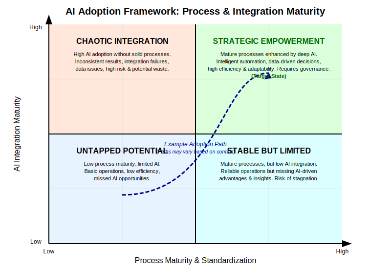
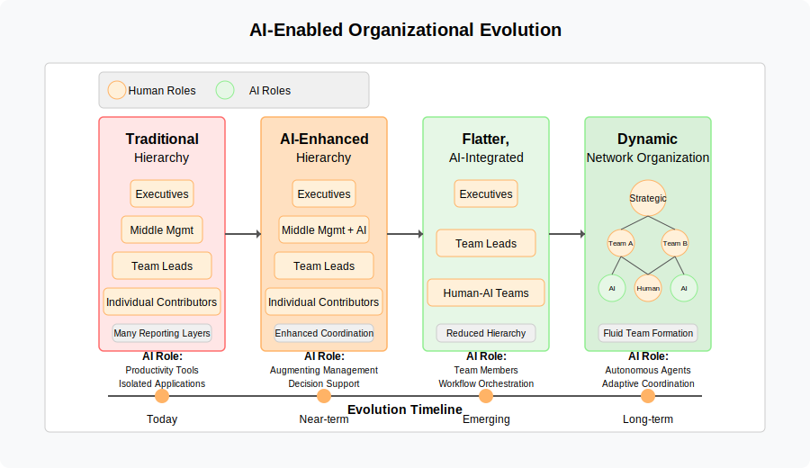
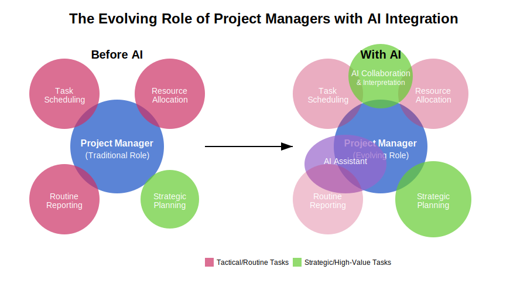

# 8. The Transformative Effects of AI Assistants and Agents

## 8.1 Introduction: AI and the Organizational Modeling Challenge

As established in earlier chapters, organizational models constantly grapple with the tension between simplicity and complexity, seeking a balance to avoid the pitfalls of underfitting (being too simplistic to be effective) and overfitting (being too complex and rigid to adapt). The integration of artificial intelligence (AI) assistants and agents into organizational workflows represents a profound shift, introducing new variables and forces into this delicate balancing act. This chapter delves into how intelligent automation and augmentation challenge existing paradigms of work arrangement and organizational design.

The core underfitting/overfitting analogy remains a valuable lens. An organizational model ill-equipped for the nuances of AI integration might underfit, failing to leverage AI's potential or account for its risks. Conversely, attempts to meticulously control every aspect of human-AI interaction could lead to an overfit model – bureaucratic, slow, and unable to capitalize on the adaptability AI might offer. The advent of AI necessitates a re-examination of where the optimal balance lies and introduces entirely new ways in which organizations might succeed or fail in managing complexity.

### 8.1.1 The Transformative Potential of AI

Artificial intelligence enters the organizational landscape not merely as an efficiency tool but as a technology capable of automating and augmenting cognitive functions. To understand AI's distinctive impact, it is helpful to consider the historical pattern of technological change. As documented by Autor (2015), previous technological waves systematically automated routine tasks — those that can be accomplished by following explicit rules. Industrial mechanization displaced routine manual work; computerization eliminated many routine cognitive tasks like bookkeeping and data processing. These technologies succeeded because they could codify and replicate well-understood procedures.

AI represents a fundamental departure from this pattern by targeting non-routine cognitive tasks that require adaptability, pattern recognition, and contextual judgment. AI-powered systems can analyze vast datasets, identify patterns, adapt, plan, guide, and even participate in decision-making. This capability extends beyond simple process optimization; it enables a fundamental reimagining of how knowledge work is performed, how expertise is developed and accessed, and how individuals and teams collaborate.

The organizational implications are profound. Following Autor's framework, AI's encroachment into what he terms "abstract tasks" — those requiring problem-solving capabilities, intuition, creativity, and persuasion — represents a qualitatively different challenge than previous automation waves. The potential lies in AI's ability to lower barriers to complex tasks and potentially reshape skill requirements across the organization. This integration, however, is not frictionless. It requires a careful examination of how AI alters established principles of managing complexity, coordinating work, and structuring organizations, moving beyond simply doing existing tasks faster towards fundamentally new ways of operating.

### 8.1.2 Chapter Scope and Objectives

This chapter provides an analysis of the transformative effects of integrating AI assistants and agents. We will explore several key dimensions:

*   The impact on the underfitting/overfitting balance in organizational design.
*   Emerging organizational structures and models leveraging AI.
*   Adaptations in workflows, processes, and communication patterns (including implications for Conway's Law).
*   Changes to estimation, planning, and project management approaches.
*   High-level implications for skills and roles in AI-augmented organizations.
*   Relevant theoretical frameworks (such as cybernetics, systems thinking, and institutional theory) for understanding these shifts.
*   Insights from real-world case studies and implementations.

The central objective is to understand how intelligent automation and augmentation fundamentally alter the dynamics of work arrangement and organizational design, providing a foundation for navigating the evolving landscape of AI-integrated organizations. While this chapter touches on implications for human skills and stakeholder dynamics, Chapter 9 provides more comprehensive exploration of these human dimensions, including detailed analysis of skill evolution, role transformations, and practical approaches to managing stakeholder relationships in AI-augmented organizations.

## 8.2 Shifting the Balance: AI's Impact on Underfitting and Overfitting

### 8.2.1 AI and Complexity Management

AI's capacity to process and analyze large datasets offers organizations a tool for managing complexity. By leveraging AI, organizations can gain insights into their structure, culture, and performance, potentially enabling more informed decisions that align with overarching goals. AI algorithms can analyze organizational elements such as communication patterns, workflow efficiency, and team dynamics, helping to reveal bottlenecks, redundancies, and areas for resource optimization. This analytical capability allows organizations to potentially navigate higher levels of complexity without necessarily increasing the risk of overfitting – manifesting as overly specialized or bureaucratic structures that struggle to adapt. AI provides a means to understand and manage interactions within a complex organization, potentially pushing the optimal balance point towards greater complexity by offering tools for oversight and coordination.

Organizational Network Analysis (ONA), introduced earlier in Chapter 3, could potentially benefit from such AI capabilities, particularly in processing and analyzing communication patterns and organizational relationships. However, the practical implementation of AI in ONA remains an emerging field, with current applications primarily augmenting rather than automating traditional analytical methods.

### 8.2.2 The Necessity for Simplicity and Standardization

While AI can handle complexity, its effective integration into organizational workflows might paradoxically necessitate simpler and more standardized structures and processes to facilitate human-AI interaction. Before implementing AI, organizations generally require a clear understanding of the specific problems they aim to solve. Defining these problems often requires simplification and standardization to ensure that AI tools can be applied effectively. Furthermore, for AI agents to be readily adopted and utilized, they typically need to be intuitive and integrate smoothly into existing workflows. Standardized processes can provide a predictable framework within which AI can operate, helping ensure that AI tools have the necessary structure to function optimally and that humans can interact with them clearly and consistently. In this sense, a degree of simplicity and standardization might be required to avoid underfitting the potential of AI, ensuring its capabilities are effectively leveraged.

### 8.2.3 Potential New Failure Modes

The emergence of human-AI hybrid systems introduces potential new failure modes beyond traditional underfitting and overfitting. The following diagram illustrates these key failure modes:

One significant risk is over-reliance on AI (automation bias or AI complacency), where individuals may accept AI recommendations without sufficient scrutiny, leading to a potential decline in critical human skills and oversight. Research suggests that individuals working with AI may tend to trust its recommendations even when flawed, potentially increasing errors and diminishing critical assessment. Conversely, organizations might suffer from under-reliance on AI, where valuable insights are disregarded or not effectively integrated with human expertise, leading to suboptimal outcomes. Moreover, ensuring the transparency and explainability of AI systems is crucial to avoid the "black box" problem, where AI decision-making processes remain opaque. A lack of transparency can erode trust, mask potential biases, and make validating AI-driven decisions difficult. The dynamic interplay between human judgment and AI algorithms in hybrid systems necessitates careful management to mitigate these novel failure modes, ensuring AI integration enhances organizational effectiveness rather than introducing new vulnerabilities.

## 8.3 Emerging Organizational Structures and Models Leveraging AI Agents

### 8.3.1 Flatter Hierarchies and Decentralized Decision-Making

AI's capacity to streamline communication and decision-making processes challenges traditional hierarchical organizational models. AI tools can facilitate real-time data sharing and collaboration across organizational levels, potentially reducing the necessity for rigid, top-down structures. This may foster shifts towards more decentralized and networked organizational forms, allowing for greater flexibility and responsiveness.

The evolution of AI adoption in organizations, particularly in software development contexts, typically follows two parallel paths: bottom-up adoption by individual contributors and top-down strategic integration. These complementary patterns are illustrated in the following diagrams:

In software development organizations, the bottom-up adoption pattern often precedes formal organizational restructuring. Individual contributors, particularly software engineers, are typically early adopters of AI tools like code assistants and pair programming agents. This organic adoption creates pockets of expertise and best practices that can inform broader organizational strategy.

The strategic integration pattern, while sometimes portrayed as starting with management layers, actually benefits from and builds upon this ground-level adoption:

The strategic integration pattern, while sometimes portrayed as starting with management layers, actually benefits from and builds upon this ground-level adoption. Organizations that recognize and support both patterns tend to achieve more effective AI integration, as they can combine:

1. **Practical Experience**: Gained through individual contributor adoption and experimentation
2. **Strategic Direction**: Provided by management's systematic integration approach
3. **Cultural Evolution**: Emerging from the interplay between bottom-up and top-down adoption

AI can potentially empower employees at various levels with access to data and analytical insights, enabling them to make more informed decisions without requiring multiple layers of managerial approval. Furthermore, as AI takes on more routine monitoring and coordination tasks, managerial spans of control could potentially widen, as direct supervision becomes less critical for certain functions. The ability of AI to process and disseminate information efficiently can contribute to a more distributed power structure and a potentially more collaborative and agile work environment.

These parallel patterns of AI adoption - bottom-up and strategic integration - create complex dynamics that influence everything from communication structures to project management approaches. As organizations navigate this dual evolution, they must consider how these patterns affect team formation, knowledge sharing, and operational resilience. The following sections explore these implications in detail, examining how organizations can effectively manage the interplay between organic AI adoption and strategic transformation while avoiding both the pitfalls of excessive rigidity and the risks of uncontrolled proliferation.

### 8.3.2 Team Formation and Coordination in AI-Augmented Environments

AI presents possibilities for changing how project teams are formed and coordinated. As individuals gain access to AI tools that augment their capabilities, reliance on traditional, static team structures might decrease, potentially leading to more self-organizing or dynamically formed teams. AI agents could act as coordinators, breaking down complex workflows, assigning tasks to specialized sub-agents or human team members based on skills and availability, and managing communication flows. 

As organizations integrate more AI capabilities, the nature of team structures may evolve. Some practitioners suggest that AI could facilitate more flexible team configurations where membership fluidly adapts based on the specific work at hand. For instance, expertise-matching algorithms could assemble temporary teams with optimal skill combinations for particular challenges. Traditional team boundaries might become more permeable as AI facilitates cross-functional collaboration through improved knowledge sharing and reduced coordination overhead. While some organizations may still benefit from stable team structures, the increased capabilities provided by AI tools could allow for more dynamic team formation and disbanding as needs evolve. This potential for enhanced flexibility and responsiveness represents a significant shift from traditional organizational design approaches centered on static departmental structures.

Recent research on human-AI teaming has identified distinct clusters of factors that influence team effectiveness (Berretta et al., 2023). These clusters include:

1. **Human variables** - focusing on psychological factors like trust, cognitive load, and team identification that shape how humans interact with AI teammates
2. **Task-dependent variables** - examining how the nature of tasks (complexity, interdependence, uncertainty) influences optimal team configurations 
3. **AI explainability** - exploring how AI transparency affects team dynamics and human acceptance
4. **AI-driven robotic systems** - investigating physical AI embodiment in collaborative spaces
5. **AI performance effects on human perception** - analyzing how AI capabilities shape human attitudes and behaviors

These research clusters provide a framework for understanding the multidimensional nature of human-AI collaboration and suggest that organizations must consider both technological and human factors when designing dynamic team structures. The socio-technical perspective emphasized by Berretta et al. (2023) suggests that effective human-AI teaming requires viewing AI not merely as tools but as potential team members with complementary capabilities, necessitating a fundamental shift in organizational design thinking.

### 8.3.3 Team Topologies for AI Integration

Team Topologies offers a particularly structured approach to organizing teams for effective generative AI integration (Lingnau de Oliveira, 2025). By adapting their four fundamental team types to AI-augmented environments, organizations can create more effective team structures:

1. **Stream-aligned Teams with AI Augmentation**: These teams maintain end-to-end responsibility for specific value streams but incorporate generative AI tools to accelerate delivery. For example, product development teams may use AI for code generation, content creation, and testing while maintaining responsibility for the overall customer experience. These teams benefit from clearly defined AI tool boundaries to avoid cognitive overload.

2. **AI Platform Teams**: These specialized platform teams create internal, self-service AI capabilities that other teams can consume. They abstract away the complexity of AI implementation, providing well-documented APIs, prompt libraries, and reusable AI components that stream-aligned teams can incorporate into their workflows without needing deep AI expertise.

3. **AI Enabling Teams**: These teams facilitate generative AI adoption by transferring knowledge and capabilities to other teams. They might develop training programs, create AI pattern libraries, and coach teams on effective AI integration. Unlike permanent structures, enabling teams typically exist temporarily until their expertise is sufficiently diffused throughout the organization.

4. **AI Complicated Subsystem Teams**: For specialized AI capabilities requiring deep expertise (such as fine-tuning foundation models or developing specialized AI agents), these teams handle complexity that would overwhelm stream-aligned teams. They maintain clear interfaces to isolate this complexity while delivering specialized AI capabilities to the rest of the organization.

This Team Topologies approach to AI integration emphasizes three interaction modes between teams (Collaboration, X-as-a-Service, and Facilitating), providing a structured framework for managing the fluid boundaries and dynamic coordination needed in AI-augmented environments while preventing cognitive overload as AI capabilities evolve.

When determining which team structure is most appropriate for AI integration, organizations should evaluate options against criteria such as adaptability to change, user interaction requirements, specialized AI expertise needs, speed of delivery, and domain knowledge requirements. This assessment approach allows organizations to thoughtfully structure their teams based on their specific AI objectives rather than defaulting to a one-size-fits-all model. For many organizations implementing generative AI, Stream-aligned Teams often emerge as particularly effective due to their direct user interaction capabilities and adaptability, though specific contexts may call for different approaches.

### 8.3.4 The Emergence of AI-Specific Leadership Roles

As organizations grapple with AI integration, a range of specialized leadership approaches has emerged, with the Chief AI Officer (CAIO) representing one possible model. This trend reflects both the strategic importance organizations are placing on AI and the recognition that traditional technology leadership roles may be insufficient for addressing the unique challenges of AI transformation.

#### The Case for Specialized AI Leadership

Recent research indicates that while 85% of IT leaders view CIOs as changemakers in their organizations, only 28% consider leading transformation their top priority, and 61% report having less time for strategic responsibilities than in previous years (Hoque et al., 2025). Meanwhile, 91% of large-company data leaders identify "cultural challenges/change management"—not technology—as the primary impediment to becoming data-driven. This gap between transformation needs and available leadership bandwidth has prompted some organizations to establish dedicated AI leadership roles.

The CAIO role typically encompasses responsibilities including:

- Developing an enterprise-wide AI strategy aligned with business objectives
- Establishing governance structures and ethical frameworks for AI development
- Coordinating cross-functional AI initiatives to prevent siloed implementations
- Leading organizational change management related to AI adoption
- Ensuring regulatory compliance and risk management for AI systems
- Advocating for appropriate funding and resource allocation

Organizations report that this centralized approach can help overcome the challenges presented by Conway's Law—the tendency for organizational structures to be reflected in technical systems. Leppitsch (2023) observes that without dedicated AI leadership, "solutions being proposed in your organization will likely reflect current departmental silos, legacy objectives, internal politics, and traditional power centers," potentially limiting AI's transformative potential.

#### Critical Perspectives on the CAIO Model

While the CAIO role has gained traction, organizations should consider potential limitations of this approach:

1. **Organizational Fit**: The CAIO model may be more appropriate for large organizations with complex, enterprise-wide AI implementation needs rather than smaller organizations or those with focused AI applications.

2. **Integration Challenges**: Creating a separate AI leadership function risks creating new organizational silos rather than embedding AI capabilities throughout the organization.

3. **Evolution vs. Revolution**: Some organizations may benefit more from evolving existing leadership roles (e.g., expanding CIO/CDO responsibilities) rather than establishing entirely new C-suite positions.

4. **Redundancy Risks**: Unclear boundaries between CAIO responsibilities and those of CIOs, CTOs, and CDOs can create confusion, duplication of effort, and organizational friction.

#### Alternative Models for AI Leadership

Rather than adopting a single prescribed approach, organizations should consider a range of models for AI leadership based on their specific context, AI maturity, and strategic objectives. Common approaches include:

- **Enhanced CIO/CTO Role**: Expanding the mandate and resources of existing technology leadership
- **AI Center of Excellence**: Creating a cross-functional team with representation from key stakeholders
- **Federated AI Leadership**: Distributing AI leadership across business units with central coordination
- **Temporary Transformation Office**: Establishing time-bound AI leadership to guide initial implementation

The critical factor is not the specific title or reporting structure, but ensuring clear executive accountability for addressing both the technical and organizational dimensions of AI integration. As Hoque et al. (2025) note, "When leaders fail to think through the strategic and organizational consequences of their AI plans, the results can be catastrophic," citing Zillow's failed AI-driven homebuying division that resulted in $300 million in losses.

Organizations should approach these leadership decisions with deliberate consideration of their unique circumstances rather than simply following emerging trends in C-suite structures.

### 8.3.5 Centralized vs. Decentralized AI Integration Models

Organizations face choices regarding the structural approach for integrating AI, leading to discussions around centralized versus decentralized models. A centralized model typically involves a single entity overseeing AI systems, potentially offering advantages in streamlined management and resource allocation. However, this approach can also present disadvantages, including single points of failure risk, potential data breach impacts, and the possibility of biases reflecting a limited development perspective. In contrast, a decentralized model distributes control and processing, potentially enhancing security, privacy, scalability, and resilience. Decentralization might also encourage broader innovation. However, managing decentralized AI systems can be more complex, requiring coordination across nodes and potentially posing challenges in maintaining consistent performance and updates.

| Feature                  | Centralized AI                                   | Decentralized AI                                       |
| :----------------------- | :----------------------------------------------- | :----------------------------------------------------- |
| **Control**              | Single organization oversees all aspects         | Distributed across multiple nodes                      |
| **Resource Efficiency**  | Efficient allocation in one location             | Can optimize underutilized computing resources         |
| **Privacy Risks**        | Higher risk due to centralized data storage      | Reduced risk as data is distributed and user-controlled |
| **Resilience**           | Vulnerable to single points of failure           | More robust against failures and cyberattacks          |
| **Innovation Model**     | Top-down, focused on specific organizational goals | Bottom-up, encourages diverse contributions             |
| **Scalability**          | May face limitations as data and usage grow      | Scales more readily to handle increasing workloads     |
| **Complexity of Mgmt.** | Generally simpler                                | Can be more complex, requiring robust coordination     |
| **Potential for Bias**   | May reflect biases of a limited development team | Can reduce bias through diverse data inputs          |

The strategic choice between centralized and decentralized approaches should be guided by specific organizational context rather than purely technical considerations. As Schwartz (2023) notes, the tension between centralization and decentralization has been a constant in organizational design discussions, with AI systems now becoming part of this fundamental debate. Organizations' decisions about AI governance reflect deeper strategic priorities:

- **Innovation-focused organizations** may benefit from decentralized approaches that enable experimentation and specialized use cases
- **Compliance-driven sectors** (e.g., financial services, healthcare) often require centralized oversight to ensure regulatory adherence
- **Operationally diverse companies** typically need hybrid solutions reflecting different functional requirements across business units

The empirical evidence suggests that neither pure centralization nor complete decentralization optimizes organizational outcomes in AI implementation. A McKinsey study found that companies with strong AI performance typically adopt a "federated" approach—combining centralized infrastructure and governance with decentralized application development and domain expertise (Fountaine et al., 2022).

Rather than viewing this as a binary choice, organizations can benefit from applying the Viable System Model (VSM) framework to design more effective hybrid approaches (Espinosa, 2023). The VSM, originally developed by Stafford Beer, provides a theoretical foundation for balancing autonomy with cohesion, addressing the fundamental tension between centralized and decentralized models.

#### The Viable System Model Approach to AI Integration

The VSM posits that a complex organization is more capable of responding to changing environments when it consists of "autonomous, effective, and agile subsidiary organisations" that are "highly connected to each other, and cohesively operating with shared ethos, purpose, processes, and technologies" (Espinosa, 2023). Applied to AI integration, this suggests organizations should:

1. **Grant operational autonomy to business units** in their AI applications (System 1 in VSM)
2. **Establish coordination mechanisms** to harmonize AI initiatives across units (System 2)
3. **Maintain central oversight** to ensure synergy and organizational effectiveness (System 3)
4. **Develop forward-looking intelligence** for AI strategy and adaptation (System 4)
5. **Define organizational AI policies** that create cohesion while allowing appropriate flexibility (System 5)

This framework suggests the following hybrid approach to AI integration:

**Functions to Decentralize (Systems 1 & 2):**
- Domain-specific AI use cases and applications
- Local AI training on specialized data
- Unit-level experimentation and innovation
- Direct integration with operational workflows
- Inter-unit AI coordination mechanisms

**Functions to Centralize (Systems 3, 4 & 5):**
- Enterprise-wide AI policies and governance
- Core AI infrastructure and platform services
- Strategic AI research and environmental scanning
- Cross-organizational data standards
- Ethical frameworks and compliance oversight

The VSM approach resolves many tensions in the centralized/decentralized dichotomy by recognizing that different organizational functions require different levels of autonomy and integration. As Espinosa (2023) notes, "The job of management is to provide the 'glue' which enables [autonomous parts] to bind together in mutually supportive interactions to create a new, larger whole system."

This VSM-inspired hybrid model can be visualized as follows:

Organizations should adapt this model based on their specific context, including size, objectives, data sensitivity, and desired agility. The key insight from VSM is that effective AI integration requires careful consideration of which functions need centralization for cohesion and which benefit from decentralization for agility and innovation.

### 8.3.6 Temporal Flexibility and Always-On Organizations

Building on the concept of temporal flexibility introduced in Chapter 3, AI-augmented organizations are increasingly challenging traditional time-bound operational models. The "always-on" capabilities of AI systems are creating new organizational possibilities that transcend conventional working hours and time zones.

#### From Time-Bound to Time-Flexible Operations

Traditional organizations typically operate within defined time boundaries - business hours, shifts, and synchronous collaboration periods. AI integration introduces the potential for:

1. **Continuous Operations**: AI systems can process information, monitor systems, and even make certain decisions 24/7 without fatigue or performance degradation.

2. **Asynchronous Collaboration**: Human-AI collaboration can span time periods, with humans setting objectives and parameters during working hours while AI systems continue execution during off-hours.

3. **Global Time-Zone Bridging**: AI systems can maintain operational continuity across international time zones, facilitating handoffs between distributed teams.

#### Models of Temporal Flexibility

Organizations are experimenting with several models that leverage AI's temporal advantages:

**Algorithmic Trading as Prototype**
Financial markets provide a mature example of AI-enabled temporal flexibility. Algorithmic trading systems demonstrate:

- Continuous market monitoring and response regardless of human presence
- Complex handoff protocols between daytime human supervision and overnight autonomous operation
- Sophisticated governance frameworks for managing always-on decision systems
- Strategic advantages gained through temporal responsiveness impossible for human-only teams

These financial systems represent early organizational adaptations to AI's temporal capabilities that are now extending to other sectors.

**The AI Night Shift**
Beyond manufacturing's "lights-out" model, organizations are developing "AI night shift" approaches where:

- Human teams define parameters and objectives during business hours
- AI systems continue information processing, content generation, analysis, and certain decision-making overnight
- Morning handoffs include AI-generated summaries and recommendations requiring human judgment
- Organizational velocity increases through continuous progress on knowledge work

**Asymmetric Productivity and Coordination Models**
A notable evolution in workflow design involves intentional asymmetry between human and AI working patterns:

- Human teams work synchronously during core hours, establishing objectives and reviewing outputs
- AI systems operate continuously, preparing options and processing information at all hours
- Organizational structures evolve to accommodate these asymmetric but complementary patterns
- Conventional project planning approaches shift to accommodate this temporal asymmetry

#### Organizational Design Implications

The emergence of temporal flexibility creates several implications for organizational design:

1. **New Coordination Mechanisms**: Organizations need structures to manage handoffs between human and AI work periods, requiring explicit protocols for context transfer
   
2. **Modified Decision Thresholds**: Clear delineation of what decisions can proceed automatically versus which require human review becomes essential
   
3. **Boundary Management**: As work potentially expands to all hours through AI systems, organizations must establish norms to protect human work-life boundaries

4. **Governance Structures**: New oversight mechanisms become necessary for monitoring continuous AI operations, particularly for systems with significant autonomy

5. **Skill Evolution**: Human roles increasingly involve defining parameters, reviewing AI work, and making judgment calls rather than performing time-bound execution

These implications directly connect to the Chapter 3 discussion of appropriate organizational complexity, as temporal flexibility requires sufficient structure to manage continuous operations while avoiding rigid processes that would negate AI's adaptability advantages.

#### Addressing Underfitting and Overfitting in Temporal Designs

Organizations face characteristic underfitting and overfitting risks when implementing temporally flexible models:

**Underfitting Risks:**
- Failure to establish adequate handoff protocols between human and AI work periods
- Insufficient monitoring systems for autonomous AI operations
- Inadequate governance structures for continuous operations
- Simplistic decision thresholds for AI autonomy

**Overfitting Risks:**
- Excessive documentation requirements nullifying speed advantages
- Over-rigid protocols preventing adaptive AI responses during off-hours
- Micromanagement of AI systems limiting their effectiveness
- Complicated approval workflows creating bottlenecks

Effective organizations establish minimally sufficient structures that provide necessary governance while leveraging AI's temporal flexibility for strategic advantage.

As one financial services executive noted in a recent industry forum: "We've moved beyond thinking of our organization as '9-to-5 with some automation' to conceptualizing it as 'always-on with strategic human intervention.' This shift fundamentally changes how we structure teams, manage operations, and create value."

### 8.3.7 AI as a Remote Work Communication Bridge: Counteracting Conway's Law Limitations

The intersection of AI integration and remote work presents both challenges and opportunities for organizational design. As established in Chapter 3 (Section 3.4.3), remote work environments tend to reinforce organizational silos, reduce cross-team communication, and shift interactions toward asynchronous patterns—all of which can significantly impact how Conway's Law manifests in distributed organizations.

AI systems can potentially serve as counterbalances to these remote work communication challenges in several ways:

#### Automated Communication Pattern Analysis

AI tools can analyze digital communication patterns across platforms (Slack, email, code repositories, document edits) to make the actual "communication structure" of the organization visible. This capability addresses a fundamental challenge in remote environments: the reduced visibility of interaction patterns that occur naturally in co-located settings.

Organizations can use these insights to:
- Identify emerging silos before they become entrenched
- Detect where cross-team communication is insufficient relative to interdependencies
- Measure changes in communication patterns after organizational redesigns

#### Cross-Boundary Knowledge Sharing

One of the most significant challenges in remote organizations is the weakening of "weak tie" networks that traditionally foster innovation and knowledge sharing. AI knowledge management systems can help counteract this tendency by:

- Identifying relevant information across team boundaries that individuals might not otherwise discover
- Suggesting connections between work being done in different parts of the organization
- Creating "digital serendipity" to replicate some of the chance encounters that drive innovation in physical spaces

#### Communication Enhancement and Translation

The shift to asynchronous communication in remote settings can lead to misunderstandings and reduced context sharing. AI assistants can help bridge these gaps through:

- Summarizing complex discussions for team members who couldn't attend synchronous sessions
- Providing context from past discussions when new team members join conversations
- Translating between different technical vocabularies used by specialized teams

#### Relationship Between Team Topologies and AI Integration

The Team Topologies approach introduced in Section 3.5 takes on new dimensions when combined with AI capabilities in remote environments:

1. **AI-Enhanced Stream-Aligned Teams**: These teams can leverage AI to maintain awareness of dependencies and integration points that might otherwise be lost in remote settings.

2. **AI Platform Teams With Remote Interfaces**: Platform teams providing AI capabilities need to design self-service interfaces that work effectively for remote consumers without requiring high-bandwidth synchronous communication.

3. **AI-Powered Enabling Teams**: Enabling teams can use AI tools to scale their impact across distributed organizations, helping to transfer knowledge despite reduced face-to-face interaction.

4. **Complicated Subsystem Teams with AI Expertise**: These teams face particular challenges in remote environments due to the complexity of their domain. AI can help document and transfer the tacit knowledge that would typically be shared through close collaboration.

The combination of AI capabilities with intentional team design creates the potential for organizations to maintain the benefits of loose coupling while avoiding the silos and communication barriers that remote work can otherwise reinforce. However, this requires deliberate attention to how AI tools are integrated into communication workflows—simply adding capabilities without considering their impact on communication structures may inadvertently reinforce existing Conway's Law limitations rather than addressing them.

## 8.4 Communication Dynamics in the Age of AI: Implications for Conway's Law

The organizational structures discussed in the previous section directly influence how information flows within an organization. As AI becomes integrated into these structures, it significantly transforms communication patterns, information exchange, and coordination mechanisms. This section examines how AI-augmented communication reshapes organizational dynamics and potentially challenges traditional principles like Conway's Law.

The integration of AI into organizational communication represents a fundamental shift that Hancock et al. (2020) formally define as "AI-Mediated Communication" (AI-MC)—interpersonal communication where an AI system operates between communicators, modifying content or the nature of interaction. This framework helps us understand how AI transforms not just the efficiency of communication but its essential character within organizational structures. As Hancock et al. (2020) argue, AI-MC introduces unique dynamics that differ from both face-to-face and computer-mediated communication, including issues of agency attribution, message transformation, and relationship perception that directly impact how Conway's Law might operate in AI-augmented environments.

### 8.4.1 AI as a Communication Intermediary

AI assistants and agents increasingly act as intermediaries in organizational communication, potentially altering traditional patterns of interaction. AI can facilitate personalized content delivery by analyzing preferences and behaviors, helping ensure individuals receive relevant information. Intelligent search functionalities powered by AI can improve information retrieval within organizational platforms. Furthermore, AI can automate the delivery of notifications and reminders. 

Recent empirical research strengthens our understanding of AI's role as a communication intermediary in organizational contexts. In a study of 211 employees across SMEs, Ateeq et al. (2024) found that AI significantly mediates the relationship between communication methods and effectiveness (β = 0.286 indirect effect). Their structural equation modeling demonstrated that AI amplifies the impact of communication approaches, providing quantitative validation for the theoretical advantages discussed in this section. Importantly, their findings suggest that AI doesn't merely accelerate existing communication patterns but fundamentally transforms how information flows through organizational structures, which has significant implications for Conway's Law and system design (Ateeq et al., 2024).

The effectiveness of AI as a communication intermediary is significantly influenced by its explainability and transparency. Research has identified AI explainability as a critical factor in human-AI teaming, affecting trust development and team performance (Berretta et al., 2023). When AI systems can effectively communicate their reasoning processes, capabilities, and limitations, humans are better able to calibrate their trust appropriately and collaborate more effectively. Conversely, opaque AI systems may undermine collaboration through uncertainty about system reliability and decision rationale.

Organizations must consider how to implement AI communication intermediaries that balance performance with appropriate levels of transparency. This challenge is particularly significant in asynchronous communication contexts where humans and AI systems interact without real-time feedback opportunities. The design of these communication interfaces becomes a critical factor in shaping organizational communication patterns and team effectiveness.

While these capabilities can enhance efficiency, the role of AI as a communication intermediary raises ethical considerations. Organizations may need to maintain transparency regarding AI use in communication, ensuring honesty and respecting stakeholder autonomy. Concerns exist about potential biases in AI algorithms influencing message tone, content, or delivery. Moreover, increased reliance on AI in communication might alter human-to-human interaction patterns, potentially impacting social bonds and organizational culture.

### 8.4.2 Reinforcing or Challenging Conway's Law

The integration of AI into communication structures presents a complex interplay with Conway's Law, which posits that organizations design systems mirroring their communication structures. Understanding this interplay requires recognizing how AI differs from previous automation waves in its impact on organizational communication.

Following Autor's (2015) analysis, previous automation primarily affected task execution while leaving communication and coordination patterns largely unchanged. Routine task automation — whether physical (assembly lines) or cognitive (payroll processing) — typically occurred within existing organizational boundaries without fundamentally altering how teams communicated or coordinated. AI's capacity to handle non-routine cognitive work, including analysis, synthesis, and even aspects of communication itself, creates unprecedented challenges for Conway's Law.

AI integration could reinforce existing patterns. If different teams adopt AI tools independently and optimize them for specific needs, the resulting AI-mediated communication might mirror existing silos and fragmented information flows. For instance, individual prompting styles for AI might reflect communication habits, potentially leading to unexpected siloing. Conversely, AI also has the potential to challenge Conway's Law. If organizations intentionally design AI strategies to foster cross-functional communication, AI could become a tool for reshaping communication structures and, consequently, the systems developed. Defining clear prompts and workflows for AI agents might impose a new structural layer influencing team interaction, potentially leading to more integrated systems less reflective of pre-existing communication boundaries.

As Skelton and Pais (2020) note, Ruth Malan's modern interpretation of Conway's Law is particularly relevant here: "If the architecture of the system and the architecture of the organization are at odds, the architecture of the organization wins." This insight has profound implications for AI-integrated organizations. It suggests that if an organization's structure is arranged in functional silos while attempting to implement seamlessly integrated AI capabilities, the siloed organizational structure will likely prevail in the resulting technology architecture. This reinforces the idea that "team assignments are the first draft of the architecture" (Skelton & Pais, 2020)—a principle that becomes even more consequential when those teams are augmented by AI systems that may amplify existing communication patterns.

A particularly important consideration for AI-augmented organizations is the counterintuitive insight that "fast flow requires restricting communication between teams" (Skelton & Pais, 2020). While AI can facilitate more efficient communication, organizations must be strategic about where communication channels are established and where boundaries should be maintained. Team collaboration is vital for areas requiring discovery and expertise, but in execution-focused domains, excessive communication—even when AI-facilitated—may become unnecessary overhead that impedes rather than accelerates delivery.

Looking further ahead, as AI agents potentially become dominant components in teams, Conway's Law may require fundamental reimagining. Spamer (2025) suggests that in teams where AI agents comprise a substantial portion of members, the communication limitations that shape human organizations become less relevant. AI systems can, in theory, be configured to communicate perfectly with one another without the social constraints that affect human teams. However, this creates a new challenge: ensuring these AI-to-AI communication structures remain aligned with human goals and organizational needs. As organizations increasingly integrate AI into their teams, they will need to deliberately design communication structures that facilitate effective AI-to-AI interactions while remaining governed by human-centered principles and objectives.

### 8.4.3 The Inverse Conway Maneuver in the Age of AI

The Inverse Conway Maneuver suggests organizations can achieve a desired system architecture by intentionally shaping communication structures. In the age of AI, this maneuver gains new dimensions. AI-driven insights into communication patterns can provide data for organizational restructuring decisions aimed at promoting specific architectural outcomes. For example, AI could analyze information flow between teams to identify dependencies or communication weaknesses hindering modular system development. By highlighting these bottlenecks, AI might help leaders make informed decisions about reorganizing teams to align with a desired architecture (e.g., microservices). Furthermore, AI-mediated communication itself might necessitate new approaches to the Inverse Conway Maneuver. As AI agents integrate into workflows, the design of these agents and human-AI interaction protocols could become critical factors in shaping organizational communication and, ultimately, system architecture.

Skelton and Pais (2020) emphasize that for a safe, rapid flow of changes, "we need to consider team-scoped flow and design the software architecture to fit it." This principle becomes particularly relevant when AI is integrated into teams, as the fundamental means of delivery remains the team, even when augmented by AI capabilities. The system architecture—including AI components—needs to enable and encourage fast flow within each team. This suggests that when implementing the Inverse Conway Maneuver in AI-augmented organizations, leaders should focus on creating team structures that promote cohesion and clear boundaries, with AI systems designed to enhance rather than complicate team-scoped flow.

The strategic application of the Inverse Conway Maneuver becomes even more crucial in AI-integrated organizations because, as Skelton and Pais (2020) observe, "organization design and software design are, in practice, two sides of the same coin, and both need to be undertaken by the same informed group of people." This indicates that decisions about AI integration cannot be made solely by technical teams or business leaders in isolation—they require collaborative input from those who understand both the technical capabilities of AI systems and the strategic goals of the organization. Given the transformative potential of AI, technical leaders must be involved in organizational design decisions, as they possess the understanding of key concepts such as APIs, interfaces, abstraction, and encapsulation that are essential for creating effective socio-technical systems.

An AI-aware implementation of the Inverse Conway Maneuver requires organizations to recognize that their structure limits the possible solutions for system architecture, while simultaneously affecting the speed of software delivery through team dependencies. By deliberately designing team structures and communication patterns with AI integration in mind, organizations can better achieve the desired system architecture while maintaining the fast flow necessary for effective delivery in the digital age.

## 8.5 Transforming Estimation and Planning Models with AI Assistance

### 8.5.1 Enhancing Accuracy and Efficiency

AI agents can analyze historical project data (e.g., timelines, resource allocation, task dependencies) to potentially provide more accurate software development time estimations and project plans. By identifying patterns in historical data, AI might offer more precise timelines compared to traditional estimation methods relying heavily on human intuition. Furthermore, AI can automate aspects of project management, such as scheduling tasks, allocating resources based on specifications and skills, and assessing potential risks during planning. This automation can improve planning efficiency and potentially contribute to greater accuracy by reducing certain types of human error.

### 8.5.2 Addressing Biases in Estimation

Human estimation is susceptible to cognitive biases (e.g., optimism bias, anchoring). AI offers a potential avenue for mitigation, as algorithms can focus on data and evidence, possibly leading to more consistent estimations than human judgment alone. However, AI itself is not immune to bias. If historical training data contains inherent biases (e.g., skewed project success rates, underestimated timelines), the AI system might perpetuate these biases. Ensuring diverse, representative training data and maintaining transparency in AI decision-making processes are important considerations when using AI to reduce bias in estimation.

### 8.5.3 The Evolving Role of Project Managers

The integration of AI assistance into project management may shift the project manager role away from primarily tactical task management towards more strategic activities. With AI potentially handling routine planning tasks (scheduling, resource allocation, risk identification), project managers could have more capacity for higher-level work. This includes developing project strategy, managing stakeholders, leading teams, and making critical decisions informed by AI-provided insights. Adapting to this landscape may require project managers to develop skills in collaborating with AI, interpreting AI-driven insights, and integrating them into decision-making. Project management may evolve towards a partnership between human expertise and AI augmentation.

## 8.6 Practical Challenges of AI Integration

*Note: This section presents emerging considerations rather than established practices. Organizations should adapt these insights to their specific context and risk tolerance.*

As organizations progress in their AI journey, they encounter a new set of practical challenges that extend our earlier discussions of underfitting and overfitting risks. While previous sections examined how AI transforms organizational structures and processes, this section explores the operational realities that emerge during implementation—areas where organizations must navigate between excessive caution (underfitting) and overconfidence (overfitting) in AI capabilities.

### 8.6.1 Dependency and Resilience

**Context:** As AI capabilities become integrated into critical systems and workflows, organizations face important questions about dependency, resilience, and appropriate fallback mechanisms. The following diagram illustrates a framework for managing AI system resilience:

**Time Horizon Considerations:**

*Near-term:*
- Organizations begin developing basic fallback procedures for AI system failures
- Limited integration of AI into critical path systems to minimize dependency risks
- Focus on human oversight and verification of AI outputs in sensitive domains

*Emerging:*
- Growing sophistication of resilience frameworks as AI integration deepens
- Development of tiered degradation approaches for AI-dependent systems
- Increasing attention to potential "learned helplessness" as workflows adapt to AI availability

*Long-term:*
- Potential need for fundamentally new resilience frameworks for deeply AI-integrated systems
- Organizations may need to balance efficiency gains against resilience requirements
- Evolution of new skills and capabilities specifically focused on managing AI dependency

Recent research on configuring viable systems during crises provides valuable insights for organizations developing AI resilience frameworks. Building on the Viable System Model introduced in Section 8.3.5, this work demonstrates how organizations can dynamically reconfigure their structures during system failures to maintain essential functions. Applied to AI dependency, this suggests organizations should design reconfiguration capabilities that allow for:

1. Temporary redistribution of decision-making authority when AI systems fail
2. Rapid reallocation of human resources to compensate for AI unavailability
3. Predefined communication protocols that activate during system degradation
4. Flexible boundary adjustments between human and AI responsibilities

These mechanisms align with emerging best practices for maintaining viability during system disruptions - a capability that becomes increasingly critical as organizational dependence on AI systems grows. Organizations implementing tiered degradation approaches would benefit from mapping these approaches to the five VSM systems, ensuring that each system has appropriate fallback mechanisms that maintain organizational coherence during AI disruptions.

#### The Irony of Automation: Organizational Knowledge Preservation

Bainbridge's (1983) research on the "Ironies of Automation" identifies a fundamental paradox relevant to AI-augmented organizations: as systems become more automated, humans are increasingly expected to monitor these systems and intervene only when automation fails—precisely when situations are most complex and demanding.

At an organizational level, this creates a significant resilience challenge. As AI systems handle routine operations, organizational knowledge of these operations may erode over time. This creates vulnerabilities where:

1. Institutional memory of manual processes diminishes, particularly as employees who predated AI integration leave
2. Monitoring effectiveness decreases as the task becomes increasingly passive
3. Intervention capabilities degrade precisely when they are most needed during system failures

Organizations can address these challenges through structural approaches that preserve operational knowledge:

- Establishing periodic practice of critical functions without AI assistance
- Documenting core processes before AI integration
- Developing simulation training for AI failure scenarios
- Implementing staff rotation between AI-augmented and conventional operations

These measures complement technical resilience frameworks by addressing the human and organizational dimensions of AI dependency. They directly counter the risk of organizational structures that neglect knowledge preservation requirements.

#### The Monitoring Paradox and Failure Design

Bainbridge's work highlights another critical paradox directly relevant to AI-dependent organizations: "The automatic control system has been put in because it can do the job better than the operator, but yet the operator is being asked to monitor that it is working effectively." This creates a fundamental challenge for organizational resilience.

Human monitoring of automated systems faces inherent cognitive limitations:

1. **Vigilance degradation**: Sustained attention to automated systems that rarely require intervention is cognitively difficult to maintain
2. **Passive processing**: Monitoring without active engagement reduces situation awareness
3. **Confirmation bias**: Humans tend to see what they expect to see in system operations
4. **Reduced feedback**: Automation often removes informative cues humans previously used to understand system states

Organizations implementing AI face a critical design choice that affects their resilience posture. Traditional approaches often emphasize "graceful degradation" of AI systems—attempting to preserve partial functionality during failures. However, Bainbridge's insights suggest an alternative approach may be more effective for maintaining organizational resilience: designing for obvious, detectable failures rather than subtle degradation.

This "failure obviousness" approach includes:

- Creating clear, unambiguous indicators when AI systems shift from normal operation
- Designing explicit state transitions rather than gradual capability reduction
- Implementing monitoring systems that actively require human engagement rather than passive observation
- Providing explicit contextual cues about AI system limitations during degraded states

This approach directly addresses the cognitive monitoring limitations that traditional fault-tolerant designs often overlook. By making failures more obvious rather than more graceful, organizations can better activate human intervention capabilities when most needed.

**Strategic Questions:** How can organizations balance the benefits of AI integration with appropriate resilience? What safeguards are necessary to prevent critical dependency on AI systems with potential points of failure?

### 8.6.2 Economic Structures

**Context:** The integration of AI capabilities often involves usage-based cost structures that differ fundamentally from traditional technology investments. The following diagram illustrates the key economic considerations:

**Time Horizon Considerations:**

*Near-term:*
- Organizations treat AI as a specialized, supplementary capability with limited budget allocation
- Experimental deployment with careful ROI tracking
- Limited integration into core workflows to manage cost unpredictability

*Emerging:*
- Growing sophistication in AI cost management and optimization
- Development of internal markets or allocation mechanisms for AI resources
- Increasing attention to potential access disparities based on budget constraints

*Long-term:*
- Potential evolution of new economic frameworks for sustainable AI integration
- Organizations may develop sophisticated approaches to balancing cost and capability
- Evolution of new budgeting models specifically designed for AI-intensive operations

**Strategic Questions:** How should organizations manage the economic implications of usage-based AI systems? What resource allocation mechanisms effectively balance cost control with appropriate access to AI capabilities?

### 8.6.3 Intellectual Property

**Context:** The use of AI systems in creative and knowledge work raises complex questions about intellectual property, attribution, and ownership of AI-assisted outputs.

**Time Horizon Considerations:**

*Near-term:*
- Organizations develop initial guidelines for managing IP in simple AI-assisted workflows
- Limited integration of AI into creative or intellectual property-generating activities
- Focus on clear delineation between human and AI contributions

*Emerging:*
- Growing sophistication in frameworks for managing IP in collaborative human-AI contexts
- Development of attribution approaches for complex human-AI collaboration
- Increasing attention to contractual frameworks for managing AI-related IP

*Long-term:*
- Potential evolution of fundamentally new IP frameworks specifically addressing human-AI collaboration
- Organizations may develop sophisticated approaches to valuing different types of contributions
- Evolution of new legal and organizational structures that recognize the complex nature of AI-assisted creation

**Strategic Questions:** How should intellectual property be managed in contexts of human-AI collaboration? What frameworks best balance recognition of human creativity with the reality of AI assistance?

### 8.6.4 Digital Sovereignty

**Context:** Increasing reliance on AI capabilities, often provided by third parties, raises important questions about technological sovereignty, data control, and geopolitical considerations. The following framework illustrates key considerations:

**Time Horizon Considerations:**

*Near-term:*
- Organizations begin developing basic frameworks for managing third-party AI dependencies
- Limited attention to geopolitical dimensions of AI supply chains
- Focus on data sovereignty over algorithmic sovereignty

*Emerging:*
- Growing sophistication in managing the geopolitical dimensions of AI deployment
- Development of multi-provider strategies to mitigate concentration risks
- Increasing attention to developing internal capabilities in critical AI functions

*Long-term:*
- Potential evolution of sophisticated frameworks for managing technological sovereignty
- Organizations may develop hybrid approaches balancing external capabilities with internal control
- Evolution of new organizational structures specifically designed to manage sovereignty considerations

**Strategic Questions:** How should organizations navigate the geopolitical dimensions of AI adoption? What strategies effectively balance access to cutting-edge capabilities with appropriate sovereignty considerations?

### 8.6.5 Strategic Considerations for Practitioners

Organizations anticipating the practical challenges of AI integration should consider:

1. Developing comprehensive resilience frameworks that address potential AI system failures
2. Creating sustainable economic models for managing AI resource allocation
3. Establishing clear intellectual property frameworks for AI-assisted outputs
4. Implementing thoughtful approaches to managing digital sovereignty and third-party dependencies

While these considerations remain forward-looking, proactive organizations can begin preparing for these potential developments through strategic planning, targeted experiments, and ongoing evaluation of emerging implementation challenges.

## 8.7 Multi-Agent AI Workflows: Organizational Implications

Building on the practical challenges outlined above, organizations are now developing sophisticated approaches to AI implementation that involve multiple coordinated AI systems working together. These multi-agent workflows represent a natural evolution in organizational complexity management—addressing the underfitting/overfitting balance through specialized yet interconnected AI capabilities that mirror traditional organizational design principles.

### 8.7.1 The Organizational Logic of Multi-Agent Systems

The fundamental insight of multi-agent approaches is that organizations can benefit from creating AI "teams" rather than relying on isolated AI instances. This mirrors traditional organizational design principles where specialization and role definition enhance effectiveness. Organizations adopting this approach typically:

- Assign differentiated roles to multiple AI agents based on function
- Create clear boundaries of responsibility between agents
- Establish communication patterns between agents and human supervisors
- Design shared workspaces for knowledge transfer

This approach reflects the fundamental organizational design tensions explored throughout this work - balancing specificity with generalization, autonomy with coordination, and complexity with manageability.

### 8.7.2 Emerging Organizational Patterns

Four primary organizational patterns are emerging in multi-agent AI implementations (Cherny, 2025):

1. **Parallel Processing Model**: Multiple AI agent instances work simultaneously on different aspects of a problem, operating independently with minimal coordination needs.

2. **Specialization and Review Model**: One AI agent creates work products while another reviews them, establishing a quality control mechanism that resembles traditional editorial workflows.

3. **Resource Partitioning Model**: Multiple AI agents work in separate contexts or workspaces, enabling focused attention on distinct problem areas.

4. **Pipeline Model**: AI agents are arranged in sequential workflows, each specialized for particular stages of a process.

Recent industry guidance from OpenAI (2024a) formalizes these multi-agent orchestration patterns into two primary categories that have proven effective across numerous implementations:

1. **Manager Pattern**: A central "manager" agent coordinates multiple specialized agents via tool calls, each handling a specific task or domain. This creates a hub-and-spoke arrangement where the manager maintains central control of the workflow while delegating specialized tasks to purpose-built agents.

2. **Decentralized Pattern**: Multiple agents operate as peers, handing off tasks to one another based on their specializations. This approach allows workflow execution to transfer completely between agents, with each taking full control when their expertise is needed.

Both patterns can be conceptualized as graphs: in the manager pattern, edges represent tool calls from the central manager to specialized agents; in the decentralized pattern, edges represent handoffs that transfer execution control between peer agents (OpenAI, 2024a).

A compelling implementation of these patterns comes from Mercado Libre, Latin America's largest ecommerce and fintech company. As detailed by OpenAI (2024b), they created a unified development platform called Verdi to help their 17,000 developers build AI applications more consistently and efficiently. This platform implements a version of the manager pattern where:

1. A central orchestration layer routes tasks to appropriate specialized components
2. Standardized connections to language models, APIs, and Python nodes create a consistent architecture
3. Security, guardrails, and routing logic are implemented at the platform level

This approach enabled dramatic acceleration of AI application development throughout the organization, with specific benefits including:

- Improved inventory capacity through automated tagging and cataloging
- Enhanced fraud detection achieving nearly 99% accuracy for flagged items
- Customized product descriptions adapted to regional language variations
- Automated review summaries to improve customer experience

The Mercado Libre case demonstrates how a well-designed organizational structure for AI development can create significant leverage across multiple business functions while maintaining consistency and quality. By providing a common platform with standardized patterns, they effectively balanced the need for specialized AI capabilities with the efficiency of shared infrastructure and governance.

These patterns have direct parallels to traditional organizational models but often operate with significantly reduced coordination overhead. They provide a useful lens for examining the underfitting/overfitting balance in organizational design:

- **Underfitting risk**: Insufficient specialization among AI agents may result in reduced effectiveness for complex tasks requiring deep domain knowledge
- **Overfitting risk**: Excessive fragmentation may create unnecessary coordination costs and system complexity

### 8.7.3 Human-AI Organizational Design Considerations

Organizations implementing these approaches must address several fundamental design questions:

- How should authority and oversight be distributed between humans and AI systems?
- What coordination mechanisms will ensure alignment across multiple agents?
- How will organizational knowledge be shared across the human-AI boundary?
- What feedback loops will enable continuous improvement of the system?

**When to Split Functions Across Multiple Agents**

A critical organizational design question involves determining when to divide functions across multiple agents versus maintaining a single agent with expanded capabilities. OpenAI (2024a) recommends an incremental approach, maximizing a single agent's capabilities before introducing additional agents. Their research identifies specific signals that indicate when splitting functionality across multiple agents becomes beneficial:

1. **Complex Logic**: When prompts contain numerous conditional statements and decision branches that become difficult to maintain in a single agent

2. **Tool Overload**: When an agent struggles with selecting the correct tools, particularly when tools have similar functions or overlapping capabilities

3. **Specialized Expertise**: When certain tasks benefit from highly specialized knowledge domains or reasoning approaches that are difficult to combine in a single agent

The decision to split functionality should be approached iteratively, testing performance improvements empirically rather than assuming that more specialized agents will automatically enhance workflow execution (OpenAI, 2024a). This incremental approach to organizational design mirrors traditional principles of managing complexity in human organizations, where specialized departments emerge organically as organizational needs evolve.

### 8.7.4 Democratizing AI: Empowering Domain Experts

A particularly powerful organizational approach to AI integration involves democratizing access to AI capabilities across the enterprise, enabling domain experts to create their own AI applications without requiring technical expertise. This approach represents a significant evolution in how organizations leverage AI, moving from centralized development teams to a distributed model where subject matter experts become creators rather than just consumers of AI solutions.

OpenAI (2024b) highlights global banking leader BBVA as a case study in this approach. Rather than limiting AI development to technical specialists, BBVA made the strategic decision to deploy ChatGPT Enterprise to their 125,000 employees worldwide. This democratized access was implemented with careful governance mechanisms developed in collaboration with Legal, Compliance, and IT Security teams to ensure responsible use.

The results were remarkable: within just five months, BBVA employees created over 2,900 custom AI applications, many of which reduced project timelines from weeks to hours. These applications spanned diverse functions:

- The Credit Risk team developed applications to determine creditworthiness more efficiently
- The Legal team created systems to answer approximately 40,000 annual questions about policies and compliance
- The Customer Service team automated sentiment analysis of customer satisfaction surveys

As Elena Alfaro, Head of Global AI Adoption at BBVA, noted, "With custom GPTs, anyone can create apps to solve unique problems—it's very easy to start" (OpenAI, 2024b). This approach transformed employees from passive consumers of technology to active creators of solutions tailored to their specific domains.

**Organizational Design Implications**

This democratized approach has several important implications for organizational design:

1. **Expertise Utilization**: Domain specialists can directly implement their knowledge without translation through technical intermediaries
2. **Innovation Distribution**: Solutions emerge from throughout the organization rather than from centralized teams
3. **Governance Frameworks**: Organizations must develop clear guidelines for responsible AI application development
4. **Support Structures**: Central teams shift focus from development to enablement, platform support, and governance

The BBVA approach represents a sophisticated resolution to the tension between centralized and decentralized organizational models discussed earlier in this chapter. By providing a unified platform with appropriate guardrails, while distributing creation capabilities broadly, they achieved a balance that leverages both domain expertise and technical consistency.

This democratized model also addresses a common underfitting risk in AI implementation: the tendency for centrally developed solutions to lack sufficient domain specificity. By enabling those closest to specific problems to create tailored solutions, organizations can achieve more appropriate levels of specialization across diverse use cases.

**Foundational AI Capabilities Across Organizations**

To facilitate the democratization of AI development, organizations need shared frameworks that help employees identify suitable AI applications in their domains. OpenAI (2024c) identifies six fundamental "primitives" that serve as building blocks for AI applications across all departments and functions:

1. **Content Creation**: Generating, editing, and adapting written materials, from emails and reports to technical documentation and marketing copy
2. **Research**: Finding, synthesizing, and analyzing information from internal and external sources
3. **Coding**: Developing, debugging, and documenting software or scripts
4. **Data Analysis**: Processing, visualizing, and extracting insights from structured and unstructured data
5. **Ideation/Strategy**: Brainstorming ideas, designing plans, and evaluating approaches
6. **Automation**: Creating systems that perform routine tasks with minimal human intervention

These primitives serve as a useful taxonomy for organizations developing AI capabilities, helping teams categorize potential use cases and identify opportunities at the intersection of their domain knowledge and AI's fundamental strengths.

The democratization of AI is further enhanced when organizations move from viewing AI applications as isolated tasks to seeing them as integrated into complete departmental workflows. OpenAI (2024c) recommends "department workflow mapping" as an approach to identify how AI can transform entire processes rather than just individual steps.

For example, a marketing team might map their campaign development workflow to identify multiple integration points for AI:
1. Using AI research capabilities to analyze market trends
2. Employing data analysis to size audience opportunities
3. Leveraging ideation capabilities for campaign strategy development
4. Utilizing content creation for messaging and copywriting
5. Implementing automation for content localization and channel optimization

This end-to-end workflow approach helps organizations move beyond tactical AI applications toward more strategic implementations that transform entire business processes. It also provides a foundation for the multi-agent AI workflows discussed earlier, as different specialized agents might eventually handle different stages of these workflows.

The emergence of multi-agent AI workflows represents a significant evolution in organizational design thinking, extending the under/overfitting framework beyond purely human organizations to human-AI collaborative structures. Organizations that thoughtfully navigate this frontier can potentially achieve new levels of effectiveness by combining human judgment with AI capabilities in complementary systems.

### 8.7.5 Technical Architecture Patterns for AI Agent Systems

As organizations progress in their AI integration journey from individual use cases to enterprise-wide agent systems, the underlying technical architecture becomes a critical consideration. McKinsey (2025) identifies an important shift occurring in organizational IT architectures—moving away from traditional application-focused patterns toward new multi-agent models where numerous agents communicate with each other, humans, and external systems to achieve common goals.

This architectural evolution directly impacts how organizations implement the multi-agent and democratized AI patterns discussed in previous sections. Three emerging technical patterns are particularly relevant for organizations designing their agent implementation approach:

**1. Super Platforms**

Super platforms represent the next generation of third-party business applications with embedded AI capabilities. These platforms integrate AI agents directly into existing enterprise systems such as collaboration tools, customer relationship management systems, and enterprise resource planning platforms.

The key advantage of this approach is the ability to leverage AI agents within established workflows without requiring significant custom development. As McKinsey (2025) notes, these platforms enable users to accomplish complex tasks that would previously have required "use-case-specific programming," such as generating reports while automatically communicating with analytics tools.

Super platforms align well with the democratized AI approach discussed in Section 8.8.4, providing non-technical domain experts with accessible interfaces to leverage AI capabilities within familiar environments.

**2. AI Wrappers**

AI wrappers provide an intermediary layer that enables enterprise services to communicate with third-party AI services through APIs without exposing proprietary data. This pattern is particularly valuable for organizations with sensitive data or specialized internal models that need to interact with external AI systems.

McKinsey (2025) provides the example of a bank building "a gen AI–enabled wrapper around an internally developed, AI-driven credit risk model" that could then leverage external LLMs for generating risk factors without revealing customer data to the external system.

This pattern offers a solution to one of the significant tensions in AI implementation: balancing the benefits of powerful external AI models with data security and competitive advantage concerns. AI wrappers allow organizations to maintain control of their core intellectual property and sensitive data while still benefiting from external AI capabilities.

**3. Custom AI Agents**

The custom AI agent pattern involves fine-tuning pre-trained models or using techniques like retrieval-augmented generation (RAG) to create specialized agents that can access an organization's proprietary data and knowledge. This approach enables highly tailored solutions for specific organizational contexts.

Custom agents can be developed by business users without extensive technical expertise, using techniques like prompt engineering, few-shot learning, and increasingly accessible fine-tuning interfaces. McKinsey (2025) provides the example of customer service applications where employees can feed existing models with "customer data, call center transcripts, and company policies to create a gen AI agent to assist call center staff."

This pattern complements the six AI primitives framework discussed in Section 8.8.4, providing a technical implementation approach for domain experts to create specialized agents for their specific needs.

**Implementation Considerations**

The selection and implementation of these architectural patterns have significant implications for an organization's broader AI strategy. McKinsey (2025) recommends that leaders focus on three key considerations as they deploy agent-based architectures:

1. **Review Technology Investments**: Critically evaluate any technology proposals with "long timelines and require many people," particularly examining how AI agents might reduce costs and accelerate implementation.

2. **Focus on Major Challenges**: Target "the largest and most complex tech problems" rather than small-scale initiatives, as these typically offer the greatest value potential for AI transformation.

3. **Prepare for Organizational Implications**: Proactively address the talent, technology, and operating model implications of multi-agent architectures, including reskilling programs and capital expenditure adjustments.

These architecture patterns and implementation considerations provide organizations with a framework for translating the conceptual multi-agent models discussed earlier in this chapter into concrete technical implementations, addressing the practical challenges of balancing standardization and specialization in AI deployment.

### 8.7.6 Prompt Engineering as an Organizational Capability

As organizations progress with multi-agent implementations, the practice of prompt engineering emerges as a distinct and strategic organizational capability. Prompt engineering—the process of designing effective instructions that guide language models toward desired outputs—represents a critical competency that bridges technical implementation and practical business value (Google, 2025).

This section establishes foundational concepts of prompt engineering that are applied in specific contexts in other chapters: medical applications (Section 7.6.9) and testing frameworks (Section 9.4.8).

#### The Strategic Value of Structured Prompting

The effectiveness of AI agents depends significantly on how they're instructed to perform tasks. Well-designed prompts can dramatically improve output quality, reduce error rates, and lower operational costs. Organizations implementing multi-agent systems should view prompt engineering as a systematic practice requiring:

1. **Standardized Documentation** - Tracking prompt attempts, model configurations, and performance metrics
2. **Experimental Methodology** - Testing variations in prompt structure, wording, and examples
3. **Cross-functional Collaboration** - Bringing together domain experts and technical specialists

Organizations that treat prompt development as an ad hoc activity often experience inconsistent results, inefficient resource utilization, and governance challenges in AI deployment.

#### Core Prompting Techniques and Organizational Applications

Several key techniques form the foundation of effective prompt engineering across organizational functions:

**Chain of Thought (CoT)**
This technique encourages AI systems to generate intermediate reasoning steps before reaching conclusions. By prompting the AI to "think step by step," organizations can achieve more accurate results for complex reasoning tasks. CoT is particularly effective for problem-solving that requires multiple logical steps and benefits from transparency in the reasoning process.

**Self-Consistency**
This approach involves generating multiple reasoning paths for the same problem and selecting the most consistent answer. By creating multiple independent assessments, self-consistency improves reliability for high-stakes decisions where occasional logical errors could have significant consequences.

**Step-Back Prompting**
Step-back prompting involves instructing the AI to first consider broader principles or categories before addressing specific details. This technique helps prevent premature conclusions and encourages more thorough analysis, particularly valuable for complex categorization or assessment tasks.

**ReAct (Reason + Act)**
This paradigm combines reasoning with the ability to take actions, such as using tools or retrieving information. ReAct enables AI systems to perform more complex workflows by interleaving thinking and doing, making it particularly valuable for process automation and complex information gathering.

**Few-Shot Prompting**
By providing examples of desired outputs within the prompt, few-shot prompting helps guide the AI system toward particular response patterns. This technique is especially effective for standardizing outputs and ensuring consistency across similar tasks.

The application of these techniques varies across organizational functions, with different approaches showing particular promise in various contexts:

| Organizational Function | Effective Prompting Techniques | Applications |
|-------------------------|--------------------------------|--------------|
| Research & Development | Chain of Thought (CoT) | Complex problem-solving, idea generation |
| Customer Service | Few-shot with JSON output | Structured response generation, intent classification |
| Operations | ReAct (Reason+Act) | Process automation, workflow optimization |
| Legal & Compliance | Step-back prompting | Regulatory analysis, risk assessment |
| Marketing | Role prompting | Audience-specific content creation |

This differentiated approach recognizes that different business functions face unique challenges requiring tailored prompting strategies.

#### The Prompt Management Lifecycle

Organizations implementing multi-agent systems require a structured approach to managing prompts throughout their lifecycle:

Each phase of this lifecycle involves specific governance considerations:

**Prompt Design**
- Establishing clear objectives aligned with business requirements
- Involving domain experts in prompt formulation
- Considering ethical implications and potential biases

**Controlled Testing**
- Evaluating prompts across diverse scenarios
- Documenting temperature and sampling settings 
- Comparing performance against established benchmarks

**Production Deployment**
- Ensuring version control and change management
- Implementing appropriate approval workflows
- Documenting production configurations

**Performance Monitoring**
- Tracking key metrics including accuracy and resource utilization
- Analyzing user satisfaction and interaction patterns
- Identifying potential drift or degradation

**Iterative Refinement**
- Applying structured methodology to prompt improvements
- Maintaining comprehensive documentation of changes
- Evaluating business impact of refinements

While Chapter 9 explores specific testing methodologies and evaluation frameworks for prompts, this lifecycle view emphasizes how prompt engineering integrates with broader organizational processes.

#### Building Organizational Prompt Engineering Capabilities

Organizations seeking to develop prompt engineering as a strategic capability should consider several key initiatives:

1. **Establishing Communities of Practice** - Creating cross-functional groups to share prompt engineering knowledge and best practices
2. **Developing Internal Guidelines** - Creating organization-specific frameworks for prompt development, documentation, and governance
3. **Implementing Prompt Libraries** - Building repositories of effective prompts that can be reused and adapted across multiple use cases
4. **Training Programs** - Developing educational resources that enhance prompt engineering skills across technical and business teams

These initiatives help transform prompt engineering from an individual skill to an organizational capability that can be systematically developed, measured, and improved over time.

#### Integration with Multi-Agent Orchestration

When implementing the multi-agent patterns discussed in Section 8.8.2, prompt engineering becomes particularly critical for:

1. **Agent Specialization** - Designing prompts that establish clear boundaries between specialized agent capabilities
2. **Coordination Mechanisms** - Creating effective prompts for manager agents that orchestrate workflows
3. **Human-AI Interfaces** - Developing prompts that facilitate smooth transitions between AI and human contributors

By treating prompt engineering as a distinct organizational capability integrated with broader AI governance frameworks, organizations can achieve more consistent, effective, and responsible outcomes from their multi-agent AI implementations.

## 8.8 Multi-Agent AI Workflows: Organizational Implications

Building on the practical challenges outlined above, organizations are now developing sophisticated approaches to AI implementation that involve multiple coordinated AI systems working together. These multi-agent workflows represent a natural evolution in organizational complexity management—addressing the underfitting/overfitting balance through specialized yet interconnected AI capabilities that mirror traditional organizational design principles.

### 8.8.1 The Organizational Logic of Multi-Agent Systems

The fundamental insight of multi-agent approaches is that organizations can benefit from creating AI "teams" rather than relying on isolated AI instances. This mirrors traditional organizational design principles where specialization and role definition enhance effectiveness. Organizations adopting this approach typically:

- Assign differentiated roles to multiple AI agents based on function
- Create clear boundaries of responsibility between agents
- Establish communication patterns between agents and human supervisors
- Design shared workspaces for knowledge transfer

This approach reflects the fundamental organizational design tensions explored throughout this work - balancing specificity with generalization, autonomy with coordination, and complexity with manageability.

### 8.8.2 Emerging Organizational Patterns

Four primary organizational patterns are emerging in multi-agent AI implementations (Cherny, 2025):

1. **Parallel Processing Model**: Multiple AI agent instances work simultaneously on different aspects of a problem, operating independently with minimal coordination needs.

2. **Specialization and Review Model**: One AI agent creates work products while another reviews them, establishing a quality control mechanism that resembles traditional editorial workflows.

3. **Resource Partitioning Model**: Multiple AI agents work in separate contexts or workspaces, enabling focused attention on distinct problem areas.

4. **Pipeline Model**: AI agents are arranged in sequential workflows, each specialized for particular stages of a process.

Recent industry guidance from OpenAI (2024a) formalizes these multi-agent orchestration patterns into two primary categories that have proven effective across numerous implementations:

1. **Manager Pattern**: A central "manager" agent coordinates multiple specialized agents via tool calls, each handling a specific task or domain. This creates a hub-and-spoke arrangement where the manager maintains central control of the workflow while delegating specialized tasks to purpose-built agents.

2. **Decentralized Pattern**: Multiple agents operate as peers, handing off tasks to one another based on their specializations. This approach allows workflow execution to transfer completely between agents, with each taking full control when their expertise is needed.

Both patterns can be conceptualized as graphs: in the manager pattern, edges represent tool calls from the central manager to specialized agents; in the decentralized pattern, edges represent handoffs that transfer execution control between peer agents (OpenAI, 2024a).

A compelling implementation of these patterns comes from Mercado Libre, Latin America's largest ecommerce and fintech company. As detailed by OpenAI (2024b), they created a unified development platform called Verdi to help their 17,000 developers build AI applications more consistently and efficiently. This platform implements a version of the manager pattern where:

1. A central orchestration layer routes tasks to appropriate specialized components
2. Standardized connections to language models, APIs, and Python nodes create a consistent architecture
3. Security, guardrails, and routing logic are implemented at the platform level

This approach enabled dramatic acceleration of AI application development throughout the organization, with specific benefits including:

- Improved inventory capacity through automated tagging and cataloging
- Enhanced fraud detection achieving nearly 99% accuracy for flagged items
- Customized product descriptions adapted to regional language variations
- Automated review summaries to improve customer experience

The Mercado Libre case demonstrates how a well-designed organizational structure for AI development can create significant leverage across multiple business functions while maintaining consistency and quality. By providing a common platform with standardized patterns, they effectively balanced the need for specialized AI capabilities with the efficiency of shared infrastructure and governance.

These patterns have direct parallels to traditional organizational models but often operate with significantly reduced coordination overhead. They provide a useful lens for examining the underfitting/overfitting balance in organizational design:

- **Underfitting risk**: Insufficient specialization among AI agents may result in reduced effectiveness for complex tasks requiring deep domain knowledge
- **Overfitting risk**: Excessive fragmentation may create unnecessary coordination costs and system complexity

### 8.8.3 Human-AI Organizational Design Considerations

Organizations implementing these approaches must address several fundamental design questions:

- How should authority and oversight be distributed between humans and AI systems?
- What coordination mechanisms will ensure alignment across multiple agents?
- How will organizational knowledge be shared across the human-AI boundary?
- What feedback loops will enable continuous improvement of the system?

**When to Split Functions Across Multiple Agents**

A critical organizational design question involves determining when to divide functions across multiple agents versus maintaining a single agent with expanded capabilities. OpenAI (2024a) recommends an incremental approach, maximizing a single agent's capabilities before introducing additional agents. Their research identifies specific signals that indicate when splitting functionality across multiple agents becomes beneficial:

1. **Complex Logic**: When prompts contain numerous conditional statements and decision branches that become difficult to maintain in a single agent

2. **Tool Overload**: When an agent struggles with selecting the correct tools, particularly when tools have similar functions or overlapping capabilities

3. **Specialized Expertise**: When certain tasks benefit from highly specialized knowledge domains or reasoning approaches that are difficult to combine in a single agent

The decision to split functionality should be approached iteratively, testing performance improvements empirically rather than assuming that more specialized agents will automatically enhance workflow execution (OpenAI, 2024a). This incremental approach to organizational design mirrors traditional principles of managing complexity in human organizations, where specialized departments emerge organically as organizational needs evolve.

### 8.8.4 Democratizing AI: Empowering Domain Experts

A particularly powerful organizational approach to AI integration involves democratizing access to AI capabilities across the enterprise, enabling domain experts to create their own AI applications without requiring technical expertise. This approach represents a significant evolution in how organizations leverage AI, moving from centralized development teams to a distributed model where subject matter experts become creators rather than just consumers of AI solutions.

OpenAI (2024b) highlights global banking leader BBVA as a case study in this approach. Rather than limiting AI development to technical specialists, BBVA made the strategic decision to deploy ChatGPT Enterprise to their 125,000 employees worldwide. This democratized access was implemented with careful governance mechanisms developed in collaboration with Legal, Compliance, and IT Security teams to ensure responsible use.

The results were remarkable: within just five months, BBVA employees created over 2,900 custom AI applications, many of which reduced project timelines from weeks to hours. These applications spanned diverse functions:

- The Credit Risk team developed applications to determine creditworthiness more efficiently
- The Legal team created systems to answer approximately 40,000 annual questions about policies and compliance
- The Customer Service team automated sentiment analysis of customer satisfaction surveys

As Elena Alfaro, Head of Global AI Adoption at BBVA, noted, "With custom GPTs, anyone can create apps to solve unique problems—it's very easy to start" (OpenAI, 2024b). This approach transformed employees from passive consumers of technology to active creators of solutions tailored to their specific domains.

**Organizational Design Implications**

This democratized approach has several important implications for organizational design:

1. **Expertise Utilization**: Domain specialists can directly implement their knowledge without translation through technical intermediaries
2. **Innovation Distribution**: Solutions emerge from throughout the organization rather than from centralized teams
3. **Governance Frameworks**: Organizations must develop clear guidelines for responsible AI application development
4. **Support Structures**: Central teams shift focus from development to enablement, platform support, and governance

The BBVA approach represents a sophisticated resolution to the tension between centralized and decentralized organizational models discussed earlier in this chapter. By providing a unified platform with appropriate guardrails, while distributing creation capabilities broadly, they achieved a balance that leverages both domain expertise and technical consistency.

This democratized model also addresses a common underfitting risk in AI implementation: the tendency for centrally developed solutions to lack sufficient domain specificity. By enabling those closest to specific problems to create tailored solutions, organizations can achieve more appropriate levels of specialization across diverse use cases.

**Foundational AI Capabilities Across Organizations**

To facilitate the democratization of AI development, organizations need shared frameworks that help employees identify suitable AI applications in their domains. OpenAI (2024c) identifies six fundamental "primitives" that serve as building blocks for AI applications across all departments and functions:

1. **Content Creation**: Generating, editing, and adapting written materials, from emails and reports to technical documentation and marketing copy
2. **Research**: Finding, synthesizing, and analyzing information from internal and external sources
3. **Coding**: Developing, debugging, and documenting software or scripts
4. **Data Analysis**: Processing, visualizing, and extracting insights from structured and unstructured data
5. **Ideation/Strategy**: Brainstorming ideas, designing plans, and evaluating approaches
6. **Automation**: Creating systems that perform routine tasks with minimal human intervention

These primitives serve as a useful taxonomy for organizations developing AI capabilities, helping teams categorize potential use cases and identify opportunities at the intersection of their domain knowledge and AI's fundamental strengths.

### 8.8.5 Technical Architecture Patterns for AI Agent Systems

As organizations progress in their AI integration journey from individual use cases to enterprise-wide agent systems, the underlying technical architecture becomes a critical consideration. McKinsey (2025) identifies an important shift occurring in organizational IT architectures—moving away from traditional application-focused patterns toward new multi-agent models where numerous agents communicate with each other, humans, and external systems to achieve common goals.

This architectural evolution directly impacts how organizations implement the multi-agent and democratized AI patterns discussed in previous sections. Three emerging technical patterns are particularly relevant for organizations designing their agent implementation approach:

**1. Super Platforms**

Super platforms represent the next generation of third-party business applications with embedded AI capabilities. These platforms integrate AI agents directly into existing enterprise systems such as collaboration tools, customer relationship management systems, and enterprise resource planning platforms.

The key advantage of this approach is the ability to leverage AI agents within established workflows without requiring significant custom development. As McKinsey (2025) notes, these platforms enable users to accomplish complex tasks that would previously have required "use-case-specific programming," such as generating reports while automatically communicating with analytics tools.

Super platforms align well with the democratized AI approach discussed in Section 8.8.4, providing non-technical domain experts with accessible interfaces to leverage AI capabilities within familiar environments.

**2. AI Wrappers**

AI wrappers provide an intermediary layer that enables enterprise services to communicate with third-party AI services through APIs without exposing proprietary data. This pattern is particularly valuable for organizations with sensitive data or specialized internal models that need to interact with external AI systems.

McKinsey (2025) provides the example of a bank building "a gen AI–enabled wrapper around an internally developed, AI-driven credit risk model" that could then leverage external LLMs for generating risk factors without revealing customer data to the external system.

This pattern offers a solution to one of the significant tensions in AI implementation: balancing the benefits of powerful external AI models with data security and competitive advantage concerns. AI wrappers allow organizations to maintain control of their core intellectual property and sensitive data while still benefiting from external AI capabilities.

**3. Custom AI Agents**

The custom AI agent pattern involves fine-tuning pre-trained models or using techniques like retrieval-augmented generation (RAG) to create specialized agents that can access an organization's proprietary data and knowledge. This approach enables highly tailored solutions for specific organizational contexts.

Custom agents can be developed by business users without extensive technical expertise, using techniques like prompt engineering, few-shot learning, and increasingly accessible fine-tuning interfaces. McKinsey (2025) provides the example of customer service applications where employees can feed existing models with "customer data, call center transcripts, and company policies to create a gen AI agent to assist call center staff."

This pattern complements the six AI primitives framework discussed in Section 8.8.4, providing a technical implementation approach for domain experts to create specialized agents for their specific needs.

**Implementation Considerations**

The selection and implementation of these architectural patterns have significant implications for an organization's broader AI strategy. McKinsey (2025) recommends that leaders focus on three key considerations as they deploy agent-based architectures:

1. **Review Technology Investments**: Critically evaluate any technology proposals with "long timelines and require many people," particularly examining how AI agents might reduce costs and accelerate implementation.

2. **Focus on Major Challenges**: Target "the largest and most complex tech problems" rather than small-scale initiatives, as these typically offer the greatest value potential for AI transformation.

3. **Prepare for Organizational Implications**: Proactively address the talent, technology, and operating model implications of multi-agent architectures, including reskilling programs and capital expenditure adjustments.

These architecture patterns and implementation considerations provide organizations with a framework for translating the conceptual multi-agent models discussed earlier in this chapter into concrete technical implementations, addressing the practical challenges of balancing standardization and specialization in AI deployment.

### 8.8.6 Prompt Engineering as an Organizational Capability

As organizations progress with multi-agent implementations, the practice of prompt engineering emerges as a distinct and strategic organizational capability. Prompt engineering—the process of designing effective instructions that guide language models toward desired outputs—represents a critical competency that bridges technical implementation and practical business value (Google, 2025).

This section establishes foundational concepts of prompt engineering that are applied in specific contexts in other chapters: medical applications (Section 7.6.9) and testing frameworks (Section 9.4.8).

#### The Strategic Value of Structured Prompting

The effectiveness of AI agents depends significantly on how they're instructed to perform tasks. Well-designed prompts can dramatically improve output quality, reduce error rates, and lower operational costs. Organizations implementing multi-agent systems should view prompt engineering as a systematic practice requiring:

1. **Standardized Documentation** - Tracking prompt attempts, model configurations, and performance metrics
2. **Experimental Methodology** - Testing variations in prompt structure, wording, and examples
3. **Cross-functional Collaboration** - Bringing together domain experts and technical specialists

Organizations that treat prompt development as an ad hoc activity often experience inconsistent results, inefficient resource utilization, and governance challenges in AI deployment.

#### Core Prompting Techniques and Organizational Applications

Several key techniques form the foundation of effective prompt engineering across organizational functions:

**Chain of Thought (CoT)**
This technique encourages AI systems to generate intermediate reasoning steps before reaching conclusions. By prompting the AI to "think step by step," organizations can achieve more accurate results for complex reasoning tasks. CoT is particularly effective for problem-solving that requires multiple logical steps and benefits from transparency in the reasoning process.

**Self-Consistency**
This approach involves generating multiple reasoning paths for the same problem and selecting the most consistent answer. By creating multiple independent assessments, self-consistency improves reliability for high-stakes decisions where occasional logical errors could have significant consequences.

**Step-Back Prompting**
Step-back prompting involves instructing the AI to first consider broader principles or categories before addressing specific details. This technique helps prevent premature conclusions and encourages more thorough analysis, particularly valuable for complex categorization or assessment tasks.

**ReAct (Reason + Act)**
This paradigm combines reasoning with the ability to take actions, such as using tools or retrieving information. ReAct enables AI systems to perform more complex workflows by interleaving thinking and doing, making it particularly valuable for process automation and complex information gathering.

**Few-Shot Prompting**
By providing examples of desired outputs within the prompt, few-shot prompting helps guide the AI system toward particular response patterns. This technique is especially effective for standardizing outputs and ensuring consistency across similar tasks.

The application of these techniques varies across organizational functions, with different approaches showing particular promise in various contexts:

| Organizational Function | Effective Prompting Techniques | Applications |
|-------------------------|--------------------------------|--------------|
| Research & Development | Chain of Thought (CoT) | Complex problem-solving, idea generation |
| Customer Service | Few-shot with JSON output | Structured response generation, intent classification |
| Operations | ReAct (Reason+Act) | Process automation, workflow optimization |
| Legal & Compliance | Step-back prompting | Regulatory analysis, risk assessment |
| Marketing | Role prompting | Audience-specific content creation |

This differentiated approach recognizes that different business functions face unique challenges requiring tailored prompting strategies.

#### The Prompt Management Lifecycle

Organizations implementing multi-agent systems require a structured approach to managing prompts throughout their lifecycle:

Each phase of this lifecycle involves specific governance considerations:

**Prompt Design**
- Establishing clear objectives aligned with business requirements
- Involving domain experts in prompt formulation
- Considering ethical implications and potential biases

**Controlled Testing**
- Evaluating prompts across diverse scenarios
- Documenting temperature and sampling settings 
- Comparing performance against established benchmarks

**Production Deployment**
- Ensuring version control and change management
- Implementing appropriate approval workflows
- Documenting production configurations

**Performance Monitoring**
- Tracking key metrics including accuracy and resource utilization
- Analyzing user satisfaction and interaction patterns
- Identifying potential drift or degradation

**Iterative Refinement**
- Applying structured methodology to prompt improvements
- Maintaining comprehensive documentation of changes
- Evaluating business impact of refinements

While Chapter 9 explores specific testing methodologies and evaluation frameworks for 
prompts, this lifecycle view emphasizes how prompt engineering integrates with broader 
organizational processes.

#### Building Organizational Prompt Engineering Capabilities
Organizations seeking to develop prompt engineering as a strategic capability should 
consider several key initiatives:
1. **Establishing Communities of Practice** - Creating cross-functional groups to share 
prompt engineering knowledge and best practices
2. **Developing Internal Guidelines** - Creating organization-specific frameworks for 
prompt development, documentation, and governance
3. **Implementing Prompt Libraries** - Building repositories of effective prompts that 
can be reused and adapted across multiple use cases
4. **Training Programs** - Developing educational resources that enhance prompt 
engineering skills across technical and business teams
These initiatives help transform prompt engineering from an individual skill to an 
organizational capability that can be systematically developed, measured, and improved 
over time.
#### Integration with Multi-Agent Orchestration
When implementing the multi-agent patterns discussed in Section 8.8.2, prompt engineering 
becomes particularly critical for:
1. **Agent Specialization** - Designing prompts that establish clear boundaries between 
specialized agent capabilities
2. **Coordination Mechanisms** - Creating effective prompts for manager agents that 
orchestrate workflows
3. **Human-AI Interfaces** - Developing prompts that facilitate smooth transitions 
between AI and human contributors

By treating prompt engineering as a distinct organizational capability integrated with 
broader AI governance frameworks, organizations can achieve more consistent, effective, 
and responsible outcomes from their multi-agent AI implementations.

### 8.8.7 Human-Computer Collaboration Models in Multi-Agent Systems

Bainbridge's (1983) research on human-computer collaboration provides valuable insights for organizations implementing multi-agent AI systems. Her work, though preceding modern AI by decades, identified collaboration patterns that remain relevant for designing effective human-AI work systems.

#### Four Types of Computer Assistance

Bainbridge identified four primary approaches to human-computer collaboration that provide a framework for designing multi-agent systems:

**1. Instructions and Advice**
Early computer systems primarily provided instructions or advice to human operators. In multi-agent AI environments, this evolves into systems that generate recommendations while leaving decision authority with humans. The design challenge identified by Bainbridge remains relevant: ensuring recommendations are delivered with appropriate context that enables humans to evaluate their validity rather than creating blind reliance.

**2. Error Mitigation**
Computer systems can detect and correct human errors. In AI-augmented organizations, this takes the form of AI agents that validate human actions, check for inconsistencies, or identify potential process defects. However, Bainbridge notes that poorly designed error mitigation can create new problems when:
- The system incorrectly flags valid actions as errors
- Error messages lack sufficient context for correction
- The interaction design creates unnecessary interruptions

**3. Sophisticated Displays**
Information presentation significantly affects human-computer collaboration effectiveness. Bainbridge highlights that display design must balance completeness with cognitive processing limitations. In multi-agent systems, this translates to designing interfaces that provide visibility into AI agent actions without overwhelming human monitors with excessive detail. As agents proliferate, organizations need deliberate strategies for what information to surface about agent operations.

**4. Workload Management**
Perhaps most relevant to modern multi-agent systems is Bainbridge's analysis of computer-assisted workload management. She identified that computerized assistance can sometimes increase rather than decrease human workload when:
- The system requires monitoring that demands continuous attention
- Automation creates new coordination requirements
- The human must maintain situation awareness to intervene effectively
- The system introduces tool management overhead

#### The Workload Paradox in Multi-Agent Systems

A critical insight from Bainbridge is that computer assistance does not automatically reduce human workload. This "workload paradox" is particularly relevant for organizations implementing multi-agent AI systems. As Bainbridge observed, "more sophisticated on-line methods of adapting computer aiding to human workload will only be possible if the workload computations can be done in real time."

In multi-agent implementations, this manifests in several ways:

1. **Coordination Overhead**: As agent numbers increase, humans often spend more time coordinating between agents and less time on direct value-adding activities

2. **Interface Proliferation**: Each agent may have its own interface, creating cognitive switching costs that offset productivity gains

3. **Prompt Management Burden**: Maintaining effective prompts across multiple agents requires ongoing effort that constitutes a new form of work

4. **Uncertainty Handling**: When agents produce inconsistent outputs, resolving these inconsistencies falls to humans

Organizations can address these challenges through:

- Unified interfaces that provide consistent interaction patterns across multiple agents
- Clear allocation of responsibilities between humans and various AI agents
- Explicit consideration of cognitive work required to supervise multi-agent systems
- Measurement systems that track coordination costs alongside productivity gains

#### Implications for Organizational Design

Bainbridge's research suggests that effective multi-agent systems require organizational structures that explicitly account for human-AI interaction patterns. Organizations implementing such systems should consider:

- Creating roles specifically focused on agent orchestration and supervision
- Establishing feedback mechanisms that rapidly identify increased coordination burdens
- Developing metrics that capture the full cognitive work of human-AI collaboration
- Designing processes that maintain human understanding of system operations

By incorporating these considerations into multi-agent implementation strategies, organizations can better navigate the balance between automation benefits and the new forms of work that such systems create.

## 8.9 Adaptation Strategies for Human-AI Organizations

Organizations seeking to effectively integrate AI capabilities while maintaining appropriate complexity should consider
these theoretically-grounded adaptation strategies, several of which are supported by emerging empirical evidence:

1. **Integration Interfaces:** Design specific organizational interfaces that enable human-AI teams to integrate with
traditional teams without imposing unnecessary process overhead.
This approach aligns with emerging frameworks for human-AI collaboration that
emphasize structured interaction patterns, as confirmed by *Frontiers'* comprehensive review of human-AI teaming (Berretta et al., [2023](https://www.frontiersin.org/articles/10.3389/frai.2023.1250725/full)) and research on pattern-based human-AI teamwork interface design (Ashktorab et al., [2024](https://www.researchgate.net/publication/383426629_Human-AI_Teamwork_Interface_Design_Using_Patterns_of_Interactions)).

2. **Differentiated Complexity Zones:** Rather than uniformly simple or complex organizational models, develop differentiated complexity zones that align with Beer's Viable System Model principle of recursion, where greater structural elaboration is justified by domain complexity or strategic importance. This approach is well-documented in Espinosa's i2 Insights explainer on VSM (Espinosa, [2023](https://i2insights.org/2023/01/24/viable-system-model/)).

3. **Adaptive Structural Reconfiguration:** Create organizational structures that can temporarily increase or decrease in complexity as needed, implementing [Ashby's Law of Requisite Variety](https://en.wikipedia.org/wiki/Variety_(cybernetics)) by modulating the appropriate level of structural detail based on environmental conditions. This approach is supported by Alves et al.'s research on configuring viable systems during crises (Alves et al., [2024](https://www.sciencedirect.com/science/article/pii/S0377221724002340)).

4. **Complexity Pattern Recognition:** Leverage AI's analytical capabilities to recognize patterns in organizational behavior and identify where existing structures are overfitting or underfitting, a capability described in Cognitive Talent Solutions' white paper on organizational network analysis and AI integration (Cognitive Talent Solutions, [2024](https://www.cognitivetalentsolutions.com/organizational-network-analysis-ona-concept-use-cases-and-integration-of-ai-capabilities/)).

5. **Temporal Continuity Management:** Design organizational processes that can leverage extended operational timeframes of AI systems while ensuring effective handoffs and information flow between human and AI working periods. This is illustrated in early field deployments of always-on AI agents (Glorium Technologies, [2024](https://gloriumtech.com/custom-ai-agent-development/)). *Rigorous human-factor studies are still pending; pilot carefully before large-scale rollout.*

6. **Team Topology Evolution:** As organizations integrate AI capabilities, their team topologies will need to evolve:
   - Establish clear interaction modes between human teams and AI systems (collaboration, service, facilitation)
   - Manage cognitive load by appropriately distributing work between humans and AI
   - Create platform teams focused on enabling effective human-AI interfaces
   - Recognize when AI systems are handling complicated subsystems and define appropriate boundaries
   - Implement a structured assessment approach to determine optimal team types for AI integration
   
   Recent research from Team Topologies suggests Stream-aligned Teams often provide the best framework for generative AI integration due to their direct user interaction, adaptability, and alignment with business goals. However, Enabling Teams may be more appropriate when organizations need to overcome initial adoption barriers or build foundational knowledge (Lingnau de Oliveira, [2024](https://teamtopologies.com/news-blogs-newsletters/2025/1/28/how-team-topologies-can-transform-generative-ai-integration)). This team selection should be guided by a systematic assessment of factors including technical complexity, required speed of delivery, and integration with existing workflows. These approaches are further supported by AIS studies on generative-AI cognitive load dynamics (Wagner et al., [2024](https://aisel.aisnet.org/context/icis2024/article/1190/viewcontent/2697_doc.pdf)).

These considerations suggest that effective organizational models in AI-augmented environments will likely neither be
uniformly simple nor complex, but rather embody "requisite complexity" - matching their structural sophistication to the
specific domains, tasks, and contexts they encompass, while avoiding both the rigidity of excessive simplicity and the
coordination costs of unnecessary complexity.

## 8.9 Chapter Summary

This chapter has examined the transformative effects of AI integration on organizational models and processes, using the underfitting/overfitting framework as a consistent analytical lens.

We began by exploring how AI capabilities shift the fundamental balance in complexity management, potentially allowing organizations to handle greater complexity while introducing new requirements for standardization and novel failure modes. The analysis then progressed to emerging organizational structures influenced by AI integration, including flatter hierarchies, dynamically formed teams, and the evolving role of the Chief AI Officer. The Viable System Model provided a particularly useful framework for reconciling the tensions between centralized and decentralized AI implementation approaches.

The discussion examined AI's complex role in communication dynamics, investigating how intelligent systems function as intermediaries and potentially reinforce or challenge Conway's Law. We then considered AI's application in estimation and planning, highlighting its potential to leverage data for accuracy while cautioning against bias amplification risks.

Our exploration extended to practical implementation challenges across multiple dimensions—dependency and resilience, economic structures, intellectual property, and digital sovereignty. These considerations highlighted the need for organizations to develop nuanced approaches that avoid both excessive caution and overconfidence in AI capabilities.

Finally, we analyzed the emergence of multi-agent AI workflows as a sophisticated organizational response to complexity management. The patterns identified—from manager-coordinated workflows to democratized development approaches—demonstrate how organizations are evolving beyond simple AI implementations toward more integrated socio-technical systems. These multi-agent approaches represent a sophisticated balance point in the underfitting/overfitting spectrum, enabling appropriate specialization without excessive rigidity.

Throughout these discussions, we've seen how the fundamental tensions in organizational design—between standardization and customization, centralization and decentralization, human and automated decision-making—are being reconfigured rather than resolved by AI integration. The most successful organizations will likely be those that develop nuanced approaches to these tensions, avoiding both the underfitting risk of treating AI as merely an efficiency tool and the overfitting risk of over-engineering AI implementations beyond practical utility.

While this chapter has focused on the structural and organizational impacts of AI integration, the successful implementation of these changes depends heavily on human adaptation and stakeholder engagement. Chapter 9 builds on these organizational foundations to explore in depth how individuals and teams can effectively adapt to AI-augmented environments, including detailed examination of evolving skill requirements, role transformations, and practical approaches to managing stakeholder dynamics in this new landscape.

## References

Ateeq, A., Milhem, M., Alzoraiki, M., Dawwas, M. I. F., Ali, S. A., & Yahia Al Astal, A. (2024). The impact of AI as a mediator on effective communication: enhancing interaction in the digital age. Frontiers in Human Dynamics, 6, 1467384. https://doi.org/10.3389/fhumd.2024.1467384

Autor, D. H. (2015). Why are there still so many jobs? The history and future of workplace automation. Journal of Economic Perspectives, 29(3), 3-30. https://doi.org/10.1257/jep.29.3.3

Bainbridge, L. (1983). Ironies of automation. Automatica, 19(6), 775-779. https://doi.org/10.1016/0005-1098(83)90046-8

Berretta, S., Tausch, A., Ontrup, G., Gilles, B., Peifer, C., & Kluge, A. (2023). Defining human-AI teaming the human-centered way: a scoping review and network analysis. Frontiers in Artificial Intelligence, 6, 1250725. https://doi.org/10.3389/frai.2023.1250725

Cherny, B. (2025, April 18). Claude Code: Best practices for agentic coding. Anthropic. https://www.anthropic.com/engineering/claude-code-best-practices

Espinosa, A. (2023, January 24). Viable System Model: A theory for designing more responsive organisations. Integration and Implementation Insights. https://i2insights.org/2023/01/24/viable-system-model/

Fountaine, T., McCarthy, B., & Saleh, T. (2022). Building the AI-powered organization. Harvard Business Review, 100(4), 64-73. https://hbr.org/2022/07/building-the-ai-powered-organization

Google. (2025). Prompt Engineering. https://cloud.google.com/vertex-ai/generative-ai/docs/learn/prompts

Hancock, J. T., Naaman, M., & Levy, K. (2020). AI-Mediated Communication: Definition, Research Agenda, and Ethical Considerations. Journal of Computer-Mediated Communication, 25(1), 89-100. https://doi.org/10.1093/jcmc/zmz022

Hoque, F., Davenport, T. H., & Nelson, E. (2025, April 9). Why AI demands a new breed of leaders. MIT Sloan Management Review. https://sloanreview.mit.edu/article/why-ai-demands-a-new-breed-of-leaders/

Leppitsch, M. (2023, November 14). The Chief AI Officer: Avoid the trap of Conway's Law. Ascend.io. https://www.ascend.io/blog/the-chief-ai-officer-avoid-the-trap-of-conways-law/

Lingnau de Oliveira, R. (2025, January 28). Building bridges: How team topologies can transform generative AI integration. Team Topologies. https://teamtopologies.com/news-blogs-newsletters/2025/1/28/how-team-topologies-can-transform-generative-ai-integration

McKinsey. (2025, March 25). What is an AI agent? McKinsey & Company. https://www.mckinsey.com/featured-insights/mckinsey-explainers/what-is-an-ai-agent

OpenAI. (2024a). A practical guide to building agents. https://cdn.openai.com/business-guides-and-resources/a-practical-guide-to-building-agents.pdf

OpenAI. (2024b). AI in the enterprise: Lessons from seven frontier companies. https://cdn.openai.com/enterprise-docs/ai-in-the-enterprise.pdf

OpenAI. (2024c). Identifying and scaling AI use cases: How early adopters focus their AI efforts. https://cdn.openai.com/enterprise-docs/identifying-and-scaling-ai-use-cases.pdf

Schwartz, M. (2023, April 27). Centralizing or decentralizing generative AI? The answer: Both. AWS Enterprise Strategy Blog. https://aws.amazon.com/blogs/enterprise-strategy/centralizing-or-decentralizing-generative-ai-the-answer-both/

Spamer, A. (2025, January 14). The future of team topologies: When AI agents dominate. Team Topologies. https://teamtopologies.com/news-blogs-newsletters/2025/1/14/the-future-of-team-topologies-when-ai-agents-dominate

Skelton, R., & Pais, J. (2020). The Inverse Conway Maneuver: A New Approach to System Architecture. IEEE Software, 37(4), 82-89. https://doi.org/10.1109/MS.2020.2993871

[Skelton2020]: Skelton, M., & Pais, M. (2020). Team Topologies: Organizing Business and Technology Teams for Fast Flow. IT Revolution Press.

[Yang2022]: Yang, L., Holtz, D., Jaffe, S., Suri, S., Sinha, S., Weston, J., ... & Teevan, J. (2022). The effects of remote work on collaboration among information workers. Nature Human Behaviour, 6(1), 43-54.

[Aguillon2024]: Aguillon, S., & Cronin-Gilmore, J. (2024). How Remote Work Changes Communication in Organizations. Journal of Behavioral and Applied Management, 24(3), 173-185.

[DORA2022]: DevOps Research and Assessment. (2022). 2022 Accelerate State of DevOps Report. https://dora.dev/research/2022/dora-report/2022-dora-accelerate-state-of-devops-report.pdf

[Back to Table of Contents](../README.md) 
