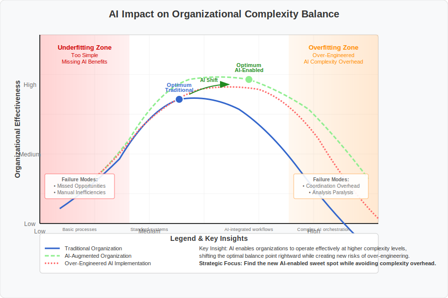
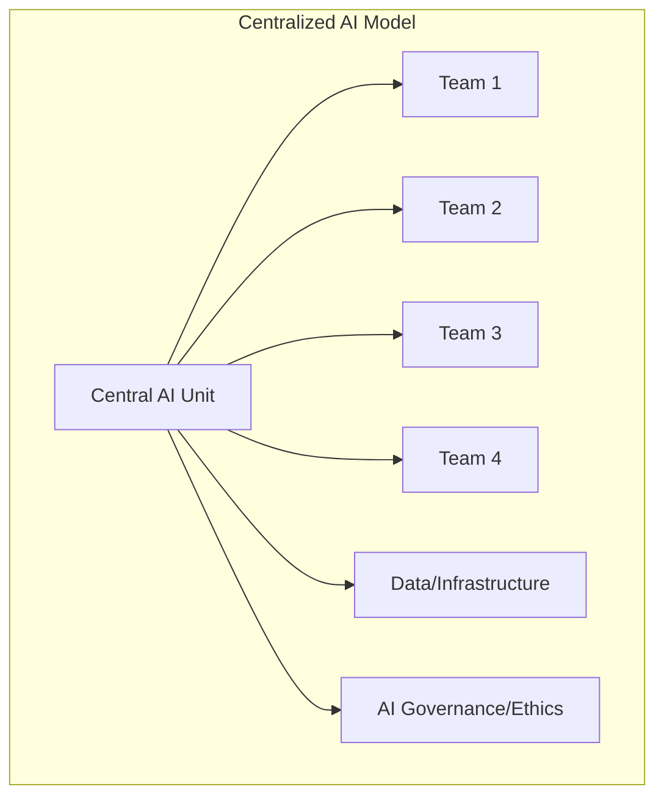
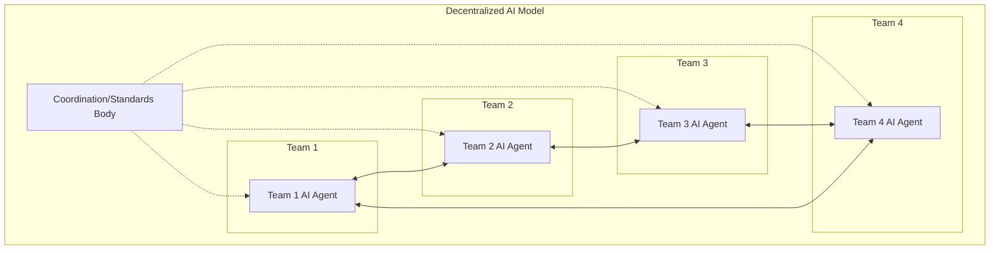

# 8. The Transformative Effects of AI Assistants and Agents

## 8.1 Introduction: AI and the Organizational Modeling Challenge

As established in earlier chapters, organizational models constantly grapple with the tension between simplicity and complexity, seeking a balance to avoid the pitfalls of underfitting (being too simplistic to be effective) and overfitting (being too complex and rigid to adapt). The integration of artificial intelligence (AI) assistants and agents into organizational workflows represents a profound shift, introducing new variables and forces into this delicate balancing act. This chapter delves into how intelligent automation and augmentation challenge existing paradigms of work arrangement and organizational design.

The core underfitting/overfitting analogy remains a valuable lens. An organizational model ill-equipped for the nuances of AI integration might underfit, failing to leverage AI's potential or account for its risks. Conversely, attempts to meticulously control every aspect of human-AI interaction could lead to an overfit model – bureaucratic, slow, and unable to capitalize on the adaptability AI might offer. The advent of AI necessitates a re-examination of where the optimal balance lies and introduces entirely new ways in which organizations might succeed or fail in managing complexity.

### 8.1.1 The Transformative Potential of AI

Artificial intelligence enters the organizational landscape not merely as an efficiency tool but as a technology capable of automating and augmenting cognitive functions. Unlike previous technological waves focused primarily on automating routine physical or simple information tasks, AI-powered systems can analyze vast datasets, identify patterns, adapt, plan, guide, and even participate in decision-making. This capability extends beyond simple process optimization; it enables a fundamental reimagining of how knowledge work is performed, how expertise is developed and accessed, and how individuals and teams collaborate.

The potential lies in AI's ability to lower barriers to complex tasks and potentially reshape skill requirements across the organization. This integration, however, is not frictionless. It requires a careful examination of how AI alters established principles of managing complexity, coordinating work, and structuring organizations, moving beyond simply doing existing tasks faster towards fundamentally new ways of operating.

### 8.1.2 Chapter Scope and Objectives

This chapter provides an analysis of the transformative effects of integrating AI assistants and agents. We will explore several key dimensions:

*   The impact on the underfitting/overfitting balance in organizational design.
*   Emerging organizational structures and models leveraging AI.
*   Adaptations in workflows, processes, and communication patterns (including implications for Conway's Law).
*   Changes to estimation, planning, and project management approaches.
*   The evolution of required skills, roles, and stakeholder dynamics.
*   Relevant theoretical frameworks (such as cybernetics, systems thinking, and institutional theory) for understanding these shifts.
*   Insights from real-world case studies and implementations.

The central objective is to understand how intelligent automation and augmentation fundamentally alter the dynamics of work arrangement and organizational design, providing a foundation for navigating the evolving landscape of AI-integrated organizations.

## 8.2 Shifting the Balance: AI's Impact on Underfitting and Overfitting

### 8.2.1 AI and Complexity Management

AI's capacity to process and analyze large datasets offers organizations a tool for managing complexity. By leveraging AI, organizations can gain insights into their structure, culture, and performance, potentially enabling more informed decisions that align with overarching goals. AI algorithms can analyze organizational elements such as communication patterns, workflow efficiency, and team dynamics, helping to reveal bottlenecks, redundancies, and areas for resource optimization. This analytical capability allows organizations to potentially navigate higher levels of complexity without necessarily increasing the risk of overfitting – manifesting as overly specialized or bureaucratic structures that struggle to adapt. AI provides a means to understand and manage interactions within a complex organization, potentially pushing the optimal balance point towards greater complexity by offering tools for oversight and coordination.

### 8.2.2 The Necessity for Simplicity and Standardization

While AI can handle complexity, its effective integration into organizational workflows might paradoxically necessitate simpler and more standardized structures and processes to facilitate human-AI interaction. Before implementing AI, organizations generally require a clear understanding of the specific problems they aim to solve. Defining these problems often requires simplification and standardization to ensure that AI tools can be applied effectively. Furthermore, for AI agents to be readily adopted and utilized, they typically need to be intuitive and integrate smoothly into existing workflows. Standardized processes can provide a predictable framework within which AI can operate, helping ensure that AI tools have the necessary structure to function optimally and that humans can interact with them clearly and consistently. In this sense, a degree of simplicity and standardization might be required to avoid underfitting the potential of AI, ensuring its capabilities are effectively leveraged.

### 8.2.3 Potential New Failure Modes

The emergence of human-AI hybrid systems introduces potential new failure modes beyond traditional underfitting and overfitting. One significant risk is over-reliance on AI (automation bias or AI complacency), where individuals may accept AI recommendations without sufficient scrutiny, leading to a potential decline in critical human skills and oversight. Research suggests that individuals working with AI may tend to trust its recommendations even when flawed, potentially increasing errors and diminishing critical assessment. Conversely, organizations might suffer from under-reliance on AI, where valuable insights are disregarded or not effectively integrated with human expertise, leading to suboptimal outcomes. Moreover, ensuring the transparency and explainability of AI systems is crucial to avoid the "black box" problem, where AI decision-making processes remain opaque. A lack of transparency can erode trust, mask potential biases, and make validating AI-driven decisions difficult. The dynamic interplay between human judgment and AI algorithms in hybrid systems necessitates careful management to mitigate these novel failure modes, ensuring AI integration enhances organizational effectiveness rather than introducing new vulnerabilities.

## 8.3 Emerging Organizational Structures and Models Leveraging AI Agents

### 8.3.1 Flatter Hierarchies and Decentralized Decision-Making

AI's capacity to streamline communication and decision-making processes challenges traditional hierarchical organizational models. AI tools can facilitate real-time data sharing and collaboration across organizational levels, potentially reducing the necessity for rigid, top-down structures. This may foster shifts towards more decentralized and networked organizational forms, allowing for greater flexibility and responsiveness.

AI can potentially empower employees at various levels with access to data and analytical insights, enabling them to make more informed decisions without requiring multiple layers of managerial approval. Furthermore, as AI takes on more routine monitoring and coordination tasks, managerial spans of control could potentially widen, as direct supervision becomes less critical for certain functions. The ability of AI to process and disseminate information efficiently can contribute to a more distributed power structure and a potentially more collaborative and agile work environment.

### 8.3.2 Dynamically Formed Teams and AI-Mediated Coordination

AI presents possibilities for changing how project teams are formed and coordinated. As individuals gain access to AI tools that augment their capabilities, reliance on traditional, static team structures might decrease, potentially leading to more self-organizing or dynamically formed teams. AI agents could act as coordinators, breaking down complex workflows, assigning tasks to specialized sub-agents or human team members based on skills and availability, and managing communication flows. The concept of specialized cross-functional teams, sometimes termed "AI Pods," optimized for AI-related workloads is also emerging. These teams might include machine learning engineers, data scientists, domain experts, and AI product managers, working in iterative cycles. Such dynamic and potentially AI-mediated coordination could lead to more efficient resource allocation and greater organizational agility.

### 8.3.3 The Rise of the Chief AI Officer (CAIO)

The perceived strategic importance of AI is contributing to the emergence of new executive roles, such as the Chief AI Officer (CAIO). Reports suggest an increase in AI leaders reporting directly to the CEO, indicating a growing recognition of AI as a strategic function. The CAIO role typically involves developing a vision for AI leverage across the organization, establishing ethical frameworks for AI development and deployment, and ensuring compliance. This role often aims to foster cross-functional collaboration, ensuring AI initiatives align with broader business objectives. The appearance of the CAIO role signifies a strategic response within some organizations, acknowledging the perceived need for dedicated leadership to guide AI integration.

### 8.3.4 Centralized vs. Decentralized AI Integration Models

Organizations face choices regarding the structural approach for integrating AI, leading to discussions around centralized versus decentralized models. A centralized model typically involves a single entity overseeing AI systems, potentially offering advantages in streamlined management and resource allocation. However, this approach can also present disadvantages, including single points of failure risk, potential data breach impacts, and the possibility of biases reflecting a limited development perspective. In contrast, a decentralized model distributes control and processing, potentially enhancing security, privacy, scalability, and resilience. Decentralization might also encourage broader innovation. However, managing decentralized AI systems can be more complex, requiring coordination across nodes and potentially posing challenges in maintaining consistent performance and updates. Recognizing these trade-offs, organizations may explore hybrid models, leveraging centralization for core governance while allowing decentralized innovation closer to specific needs. The choice depends on organizational context, including size, objectives, data sensitivity, and desired agility.

| Feature                  | Centralized AI                                   | Decentralized AI                                       |
| :----------------------- | :----------------------------------------------- | :----------------------------------------------------- |
| **Control**              | Single organization oversees all aspects         | Distributed across multiple nodes                      |
| **Resource Efficiency**  | Efficient allocation in one location             | Can optimize underutilized computing resources         |
| **Privacy Risks**        | Higher risk due to centralized data storage      | Reduced risk as data is distributed and user-controlled |
| **Resilience**           | Vulnerable to single points of failure           | More robust against failures and cyberattacks          |
| **Innovation Model**     | Top-down, focused on specific organizational goals | Bottom-up, encourages diverse contributions             |
| **Scalability**          | May face limitations as data and usage grow      | Scales more readily to handle increasing workloads     |
| **Complexity of Mgmt.** | Generally simpler                                | Can be more complex, requiring robust coordination     |
| **Potential for Bias**   | May reflect biases of a limited development team | Can reduce bias through diverse data inputs          |

These models can be visualized as follows:

## 8.4 Communication Dynamics in the Age of AI: Implications for Conway's Law

### 8.4.1 AI as a Communication Intermediary

AI assistants and agents increasingly act as intermediaries in organizational communication, potentially altering traditional patterns of interaction. AI can facilitate personalized content delivery by analyzing preferences and behaviors, helping ensure individuals receive relevant information. Intelligent search functionalities powered by AI can improve information retrieval within organizational platforms. Furthermore, AI can automate the delivery of notifications and reminders. While these capabilities can enhance efficiency, the role of AI as a communication intermediary raises ethical considerations. Organizations may need to maintain transparency regarding AI use in communication, ensuring honesty and respecting stakeholder autonomy. Concerns exist about potential biases in AI algorithms influencing message tone, content, or delivery. Moreover, increased reliance on AI in communication might alter human-to-human interaction patterns, potentially impacting social bonds and organizational culture.

### 8.4.2 Reinforcing or Challenging Conway's Law

The integration of AI into communication structures presents a complex interplay with Conway's Law, which posits that organizations design systems mirroring their communication structures. AI integration could reinforce existing patterns. If different teams adopt AI tools independently and optimize them for specific needs, the resulting AI-mediated communication might mirror existing silos and fragmented information flows. For instance, individual prompting styles for AI might reflect communication habits, potentially leading to unexpected siloing. Conversely, AI also has the potential to challenge Conway's Law. If organizations intentionally design AI strategies to foster cross-functional communication, AI could become a tool for reshaping communication structures and, consequently, the systems developed. Defining clear prompts and workflows for AI agents might impose a new structural layer influencing team interaction, potentially leading to more integrated systems less reflective of pre-existing communication boundaries.

### 8.4.3 The Inverse Conway Maneuver in the Age of AI

The Inverse Conway Maneuver suggests organizations can achieve a desired system architecture by intentionally shaping communication structures. In the age of AI, this maneuver gains new dimensions. AI-driven insights into communication patterns can provide data for organizational restructuring decisions aimed at promoting specific architectural outcomes. For example, AI could analyze information flow between teams to identify dependencies or communication weaknesses hindering modular system development. By highlighting these bottlenecks, AI might help leaders make informed decisions about reorganizing teams to align with a desired architecture (e.g., microservices). Furthermore, AI-mediated communication itself might necessitate new approaches to the Inverse Conway Maneuver. As AI agents integrate into workflows, the design of these agents and human-AI interaction protocols could become critical factors in shaping organizational communication and, ultimately, system architecture.

## 8.5 Transforming Estimation and Planning Models with AI Assistance

### 8.5.1 Enhancing Accuracy and Efficiency

AI agents can analyze historical project data (e.g., timelines, resource allocation, task dependencies) to potentially provide more accurate software development time estimations and project plans. By identifying patterns in historical data, AI might offer more precise timelines compared to traditional estimation methods relying heavily on human intuition. Furthermore, AI can automate aspects of project management, such as scheduling tasks, allocating resources based on specifications and skills, and assessing potential risks during planning. This automation can improve planning efficiency and potentially contribute to greater accuracy by reducing certain types of human error.

### 8.5.2 Addressing Biases in Estimation

Human estimation is susceptible to cognitive biases (e.g., optimism bias, anchoring). AI offers a potential avenue for mitigation, as algorithms can focus on data and evidence, possibly leading to more consistent estimations than human judgment alone. However, AI itself is not immune to bias. If historical training data contains inherent biases (e.g., skewed project success rates, underestimated timelines), the AI system might perpetuate these biases. Ensuring diverse, representative training data and maintaining transparency in AI decision-making processes are important considerations when using AI to reduce bias in estimation.

### 8.5.3 The Evolving Role of Project Managers

The integration of AI assistance into project management may shift the project manager role away from primarily tactical task management towards more strategic activities. With AI potentially handling routine planning tasks (scheduling, resource allocation, risk identification), project managers could have more capacity for higher-level work. This includes developing project strategy, managing stakeholders, leading teams, and making critical decisions informed by AI-provided insights. Adapting to this landscape may require project managers to develop skills in collaborating with AI, interpreting AI-driven insights, and integrating them into decision-making. Project management may evolve towards a partnership between human expertise and AI augmentation.

## 8.6 Chapter Summary

This chapter focused on the direct impact of AI integration on organizational models and core processes. We began by framing AI's arrival through the lens of the underfitting/overfitting challenge, exploring how AI might allow management of greater complexity but also necessitate standardization and introduce new failure modes like automation bias. 

The discussion examined emerging AI-influenced organizational structures, such as potentially flatter hierarchies and dynamic teams, alongside strategic choices like centralized versus decentralized AI models. We analyzed AI's complex role in communication dynamics, acting as an intermediary and potentially reinforcing or challenging Conway's Law and the Inverse Conway Maneuver.

Finally, the chapter considered AI's application in estimation and planning, highlighting its potential to leverage data for accuracy while cautioning against the significant risks of bias amplification and the current uncertainty surrounding its net productivity impact. The subsequent chapter delves into the human, theoretical, and practical dimensions of adapting to these AI-driven transformations. 

## 8.7 PRACTICAL CHALLENGES OF AI INTEGRATION

*Note: This section presents emerging considerations rather than established practices. Organizations should adapt these insights to their specific context and risk tolerance.*

As organizations integrate AI capabilities, several practical challenges emerge that merit strategic consideration. The following discussion points examine potential implementation challenges at different time horizons. These observations draw from early implementations and emerging trends, providing strategic considerations for forward-thinking practitioners rather than established theory.

### 8.7.1 Dependency and Resilience

**Context:** As AI capabilities become integrated into critical systems and workflows, organizations face important questions about dependency, resilience, and appropriate fallback mechanisms.

**Time Horizon Considerations:**

*Near-term:*
- Organizations begin developing basic fallback procedures for AI system failures
- Limited integration of AI into critical path systems to minimize dependency risks
- Focus on human oversight and verification of AI outputs in sensitive domains

*Emerging:*
- Growing sophistication of resilience frameworks as AI integration deepens
- Development of tiered degradation approaches for AI-dependent systems
- Increasing attention to potential "learned helplessness" as workflows adapt to AI availability

*Long-term:*
- Potential need for fundamentally new resilience frameworks for deeply AI-integrated systems
- Organizations may need to balance efficiency gains against resilience requirements
- Evolution of new skills and capabilities specifically focused on managing AI dependency

**Strategic Questions:** How can organizations balance the benefits of AI integration with appropriate resilience? What safeguards are necessary to prevent critical dependency on AI systems with potential points of failure?

### 8.7.2 Economic Structures

**Context:** The integration of AI capabilities often involves usage-based cost structures that differ fundamentally from traditional technology investments, creating new challenges for resource planning and allocation.

**Time Horizon Considerations:**

*Near-term:*
- Organizations treat AI as a specialized, supplementary capability with limited budget allocation
- Experimental deployment with careful ROI tracking
- Limited integration into core workflows to manage cost unpredictability

*Emerging:*
- Growing sophistication in AI cost management and optimization
- Development of internal markets or allocation mechanisms for AI resources
- Increasing attention to potential access disparities based on budget constraints

*Long-term:*
- Potential evolution of new economic frameworks for sustainable AI integration
- Organizations may develop sophisticated approaches to balancing cost and capability
- Evolution of new budgeting models specifically designed for AI-intensive operations

**Strategic Questions:** How should organizations manage the economic implications of usage-based AI systems? What resource allocation mechanisms effectively balance cost control with appropriate access to AI capabilities?

### 8.7.3 Intellectual Property

**Context:** The use of AI systems in creative and knowledge work raises complex questions about intellectual property, attribution, and ownership of AI-assisted outputs.

**Time Horizon Considerations:**

*Near-term:*
- Organizations develop initial guidelines for managing IP in simple AI-assisted workflows
- Limited integration of AI into creative or intellectual property-generating activities
- Focus on clear delineation between human and AI contributions

*Emerging:*
- Growing sophistication in frameworks for managing IP in collaborative human-AI contexts
- Development of attribution approaches for complex human-AI collaboration
- Increasing attention to contractual frameworks for managing AI-related IP

*Long-term:*
- Potential evolution of fundamentally new IP frameworks specifically addressing human-AI collaboration
- Organizations may develop sophisticated approaches to valuing different types of contributions
- Evolution of new legal and organizational structures that recognize the complex nature of AI-assisted creation

**Strategic Questions:** How should intellectual property be managed in contexts of human-AI collaboration? What frameworks best balance recognition of human creativity with the reality of AI assistance?

### 8.7.4 Digital Sovereignty

**Context:** Increasing reliance on AI capabilities, often provided by third parties, raises important questions about technological sovereignty, data control, and geopolitical considerations.

**Time Horizon Considerations:**

*Near-term:*
- Organizations begin developing basic frameworks for managing third-party AI dependencies
- Limited attention to geopolitical dimensions of AI supply chains
- Focus on data sovereignty over algorithmic sovereignty

*Emerging:*
- Growing sophistication in managing the geopolitical dimensions of AI deployment
- Development of multi-provider strategies to mitigate concentration risks
- Increasing attention to developing internal capabilities in critical AI functions

*Long-term:*
- Potential evolution of sophisticated frameworks for managing technological sovereignty
- Organizations may develop hybrid approaches balancing external capabilities with internal control
- Evolution of new organizational structures specifically designed to manage sovereignty considerations

**Strategic Questions:** How should organizations navigate the geopolitical dimensions of AI adoption? What strategies effectively balance access to cutting-edge capabilities with appropriate sovereignty considerations?

### 8.7.5 Strategic Considerations for Practitioners

Organizations anticipating the practical challenges of AI integration should consider:

1. Developing comprehensive resilience frameworks that address potential AI system failures
2. Creating sustainable economic models for managing AI resource allocation
3. Establishing clear intellectual property frameworks for AI-assisted outputs
4. Implementing thoughtful approaches to managing digital sovereignty and third-party dependencies

While these considerations remain forward-looking, proactive organizations can begin preparing for these potential developments through strategic planning, targeted experiments, and ongoing evaluation of emerging implementation challenges.

---

[Back to Table of Contents](../README.md) 