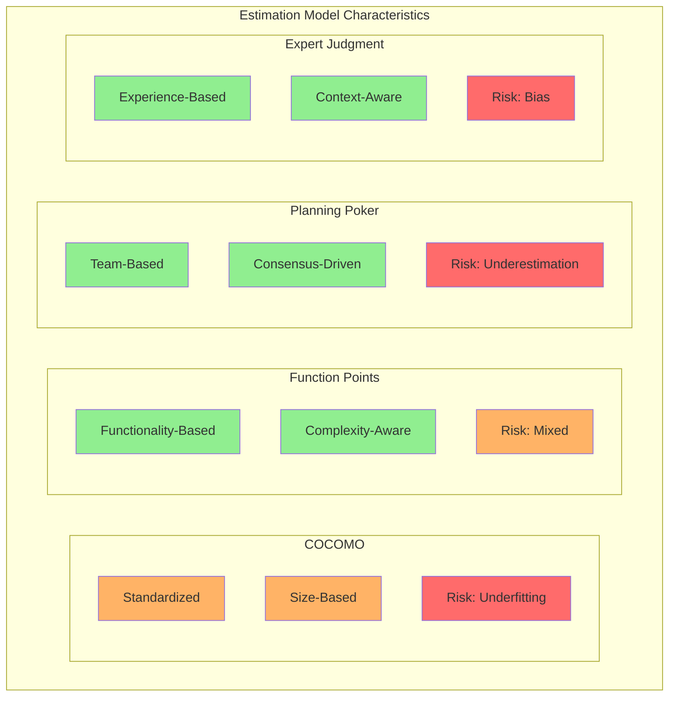
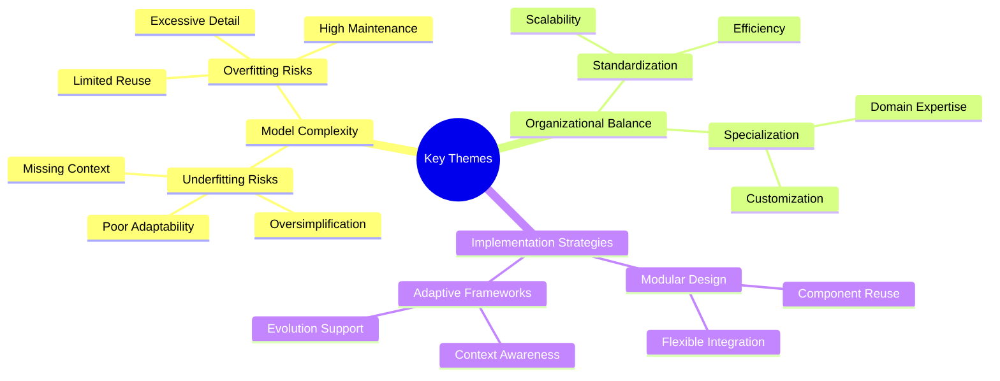

# 8. Conclusion

## 8.1 Summary of Key Findings

The application of underfitting and overfitting analogies from machine learning to software development models and organizational structures provides valuable insights into the balance between simplicity and complexity.

### Software Time Estimation
Key findings in estimation models:
- COCOMO and Function Points show tendencies toward both underfitting and overfitting
- Planning Poker carries risks of underestimation
- Expert judgment is susceptible to various biases
- Long-tail risks often lead to underfitting in simpler models

### Organizational Models
Analysis revealed that:
- Models exist on a spectrum of simplicity and complexity
- Overly standardized models risk underfitting the dynamic environment
- Excessively tailored models risk poor generalizability
- Balance is crucial for organizational effectiveness

### Stakeholder Dynamics
Important patterns emerged:
- Management tends to favor simpler, scalable models
- Technical specialists prefer detailed, precise approaches
- This tension requires careful balance and communication

## 8.2 Cross-cutting Themes

### Theoretical Foundations
The analysis is supported by:
- Long-tail distribution theory in risk assessment
- Dissipative systems theory in organizational dynamics
- Principles of modularity and adaptability

### Practical Implications
Key lessons include:
1. The importance of context in determining appropriate model complexity
2. The value of modular approaches in managing complexity
3. The need for balance between standardization and specialization
4. The role of strategic overfitting in certain domains

<!-- TODO: Add visualization of key themes and their relationships -->

## 8.3 Healthcare Case Study Insights

The medical information systems case study demonstrated:
- Necessity of strategic overfitting in highly regulated domains
- Value of modular design in managing complexity
- Balance between customization and maintainability
- Importance of domain-specific requirements

## 8.4 Future Directions

### Research Opportunities
Areas for further investigation:
1. Quantitative measures of model fit in organizational contexts
2. Impact of emerging technologies on model complexity
3. Long-term effects of different modeling approaches
4. Cross-industry comparisons of fitting strategies

### Practical Applications
Potential areas for implementation:
1. Development of hybrid modeling approaches
2. Creation of adaptive organizational frameworks
3. Integration of machine learning insights into organizational design
4. Enhancement of estimation techniques

## 8.5 Final Thoughts

The underfitting/overfitting analogy serves as:
- A useful analytical tool
- A framework for understanding complexity trade-offs
- A guide for practical decision-making

Success requires:
- Finding appropriate balance for each context
- Maintaining effectiveness and adaptability
- Managing complexity without sacrificing capability
- Understanding domain-specific requirements

The right level of complexity is often domain-dependent. Strategies like modular design or Domain-Driven Design patterns (such as **Bounded Contexts**) can be crucial for navigating these trade-offs in highly specialized fields. Success requires acknowledging the powerful influence of organizational communication structures on system design (**Conway's Law**) and potentially leveraging this by proactively shaping team structures to foster desired architectures (the **Inverse Conway Maneuver**).

[Back to Table of Contents](../README.md)
