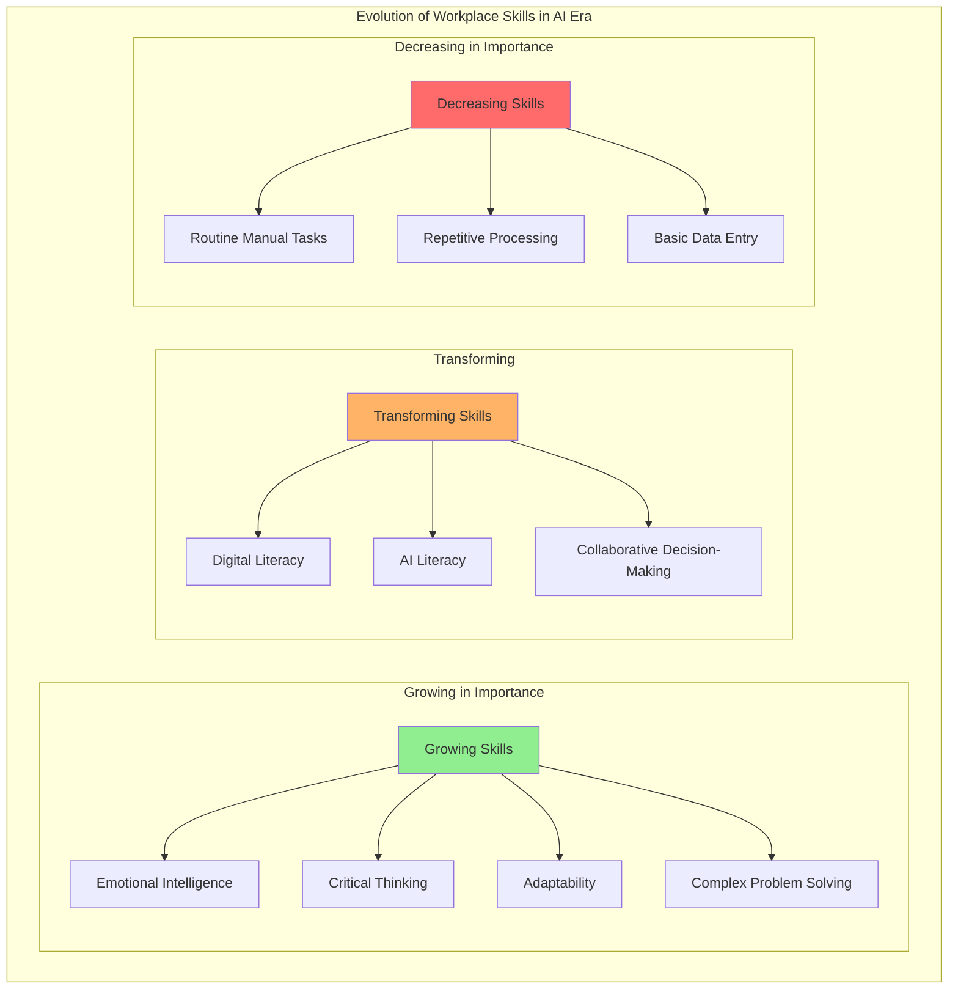
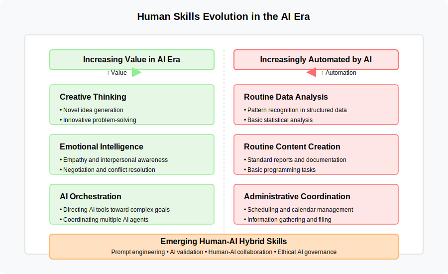
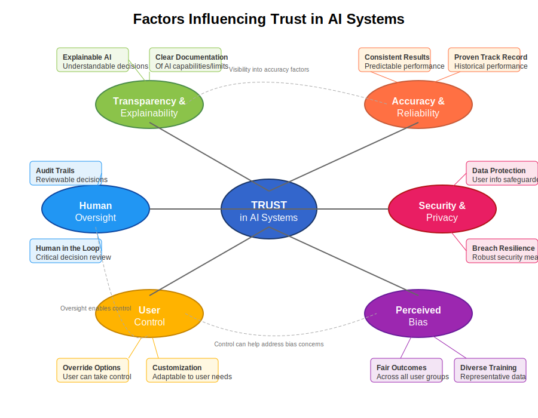
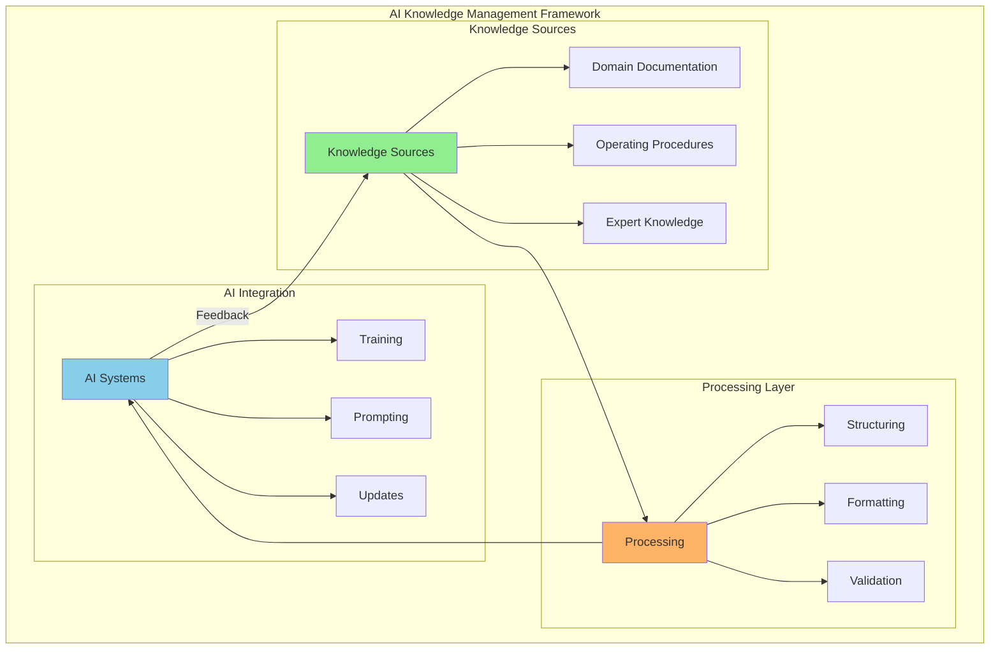
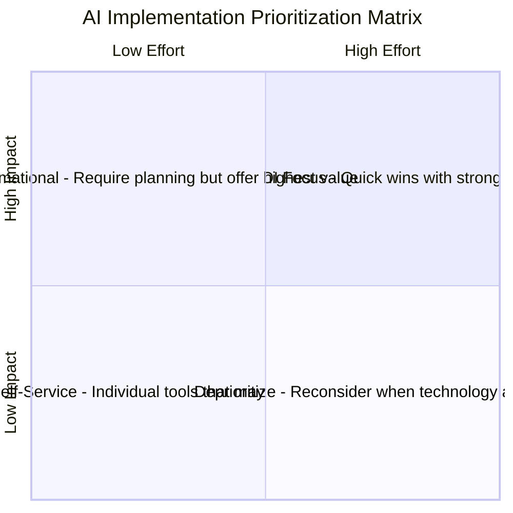
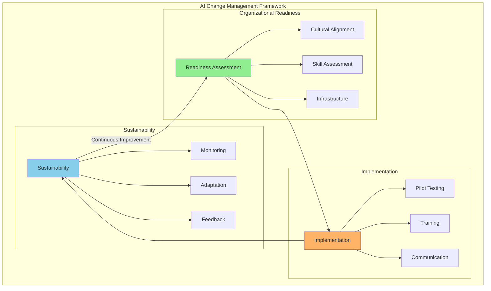

# 9. Adapting to AI: People, Theories, and Practice

// TODO: Ensure strong connection with Chapter 8's organizational foundations:
// - Reference relevant organizational structures and models from Chapter 8 when discussing human adaptation
// - Build on Chapter 8's multi-agent workflow patterns when discussing skill requirements
// - Connect stakeholder analysis to Chapter 8's discussion of organizational changes
// - Maintain consistent theoretical frameworks while expanding human dimensions

## 9.1 Introduction

Having examined AI's direct impact on organizational models, structures, communication, and estimation in the previous chapter, this chapter shifts focus to the human, theoretical, and practical dimensions of adapting to AI integration. 

While Chapter 8 analyzed the structural and process changes that AI brings to organizations, this chapter examines how individuals experience and adapt to these changes. Our focus moves from organizational architecture to human adaptation, exploring questions of professional identity, psychological experience, skill development, and practical implementation approaches centered on human needs.

We will explore the evolving skill requirements and roles within AI-augmented organizations, the dynamics among stakeholders, relevant theoretical frameworks for understanding these shifts from a human-centered perspective, and insights gleaned from real-world case studies that highlight the human experience of AI adoption.

This complementary perspective acknowledges that successful AI integration requires attention to both organizational structures (Chapter 8) and human adaptation (Chapter 9). By examining how individuals perceive, experience, and respond to AI integration, we can develop more comprehensive approaches that address both the technical and human dimensions of this transformation.

## 9.2 The Evolution of Skills, Roles, and Stakeholder Dynamics

// TODO: Expand this section to provide comprehensive coverage of topics only briefly touched in Chapter 8, including:
// - Detailed frameworks for evaluating and developing AI-relevant skills
// - Case studies of successful role transformations in AI-augmented organizations
// - Metrics and assessment tools for tracking skill evolution
// - Best practices for identifying and developing emerging roles

### 9.2.1 Shifting Skill Requirements

// TODO: Add detailed analysis of:
// - Specific technical and non-technical skills required for AI collaboration
// - Learning pathways and development programs
// - Impact of AI on different job functions and levels
// - Skills assessment and gap analysis methodologies

The integration of AI into organizational processes is catalyzing a substantial shift in the skills demanded of professionals at all levels. The following diagram illustrates the evolution of workplace skills in the AI era:

We are witnessing not merely an evolution but a fundamental reconfiguration of the skill landscape, with certain capabilities becoming exponentially more valuable while others face automation.

As AI takes over more routine tasks, the demand for skills often considered uniquely human, such as emotional intelligence, creativity, critical thinking, and adaptability, may grow. Roles requiring analytical thinking, creative problem-solving, and interpretation of complex information could become more prominent. 

#### The Automation Paradox: Manual and Cognitive Skills

Organizations implementing AI might want to consider strategies to maintain both manual and cognitive skills, such as:

- Regular practice sessions where professionals perform tasks without AI assistance
- Simulation training for AI failure scenarios requiring human intervention
- Collaborative workflows where humans and AI systems work together rather than in sequence
- Knowledge preservation systems that capture domain expertise before it's lost to AI automation

These approaches address Bainbridge's irony: increasing system sophistication often makes the human operator's role both more important and more challenging.

#### Professional Identity and Status in AI-Augmented Environments

Beyond skill maintenance, Bainbridge's observations reveal another crucial dimension of automation that applies directly to AI integration: the impact on professional identity and status. As she identified, automation decisions affect not just technical operations but also the social dynamics of the workplace and individuals' sense of professional value.

**The Status-Skill Paradox**

When organizations implement AI to handle tasks previously requiring specialized human expertise, they often create what we might call a "status-skill paradox" where:

- Management expects AI integration to reduce skill requirements and therefore potentially reduce labor costs
- Professionals resist this framing because their identity and status are closely tied to their specialized skills
- The newly "AI-augmented" roles paradoxically still require substantial compensation because:
  1. The remaining human tasks often involve high-stakes judgment in complex or abnormal situations
  2. Professionals recognize their continued importance despite shifted skill requirements
  3. Professional identity remains anchored to pre-AI status expectations

This paradox helps explain why resistance to AI integration often persists even when technical arguments are compelling. Beyond technical concerns, AI decisions directly impact professional identity and perceived value. Organizations that fail to acknowledge these status implications often encounter stronger resistance to otherwise beneficial AI initiatives.

**Identity Dimensions of Skills**

Professional skills represent more than just capabilities—they form a central component of identity and status. When AI systems take over aspects of knowledge work previously requiring specialized expertise, professionals often experience this as a challenge to their identity, not merely a change in task allocation.

Research on professional identity shows that feelings of distinctiveness and competence are crucial components of how knowledge workers perceive themselves. AI automation that reduces opportunities to demonstrate specialized skills can threaten this sense of distinctiveness even when the work outcomes improve. This helps explain why even technical professionals who understand AI's capabilities may resist implementations that diminish their opportunities to demonstrate expertise.

**Organizational Approaches**

Organizations successfully navigating these identity and status challenges typically adopt approaches that:

1. **Reframe value contribution**: Emphasizing human judgment, oversight, and exception handling as high-value skills rather than viewing them as diminished technical roles
   
2. **Create skill evolution pathways**: Developing clear career trajectories that show how professional expertise evolves rather than disappears with AI augmentation
   
3. **Establish new status markers**: Creating recognition systems for excellence in human-AI collaboration rather than solely technical expertise

4. **Maintain skill practice**: Implementing regular opportunities for professionals to exercise core skills even as AI handles routine applications

These approaches acknowledge the deep connection between skill, identity, and status identified by Bainbridge while creating constructive pathways for professional evolution in AI-augmented environments.

**Creative Thinking and Problem-Solving**  
As AI increasingly handles routine analytical tasks, uniquely human creative thinking becomes more valuable. The ability to generate truly novel ideas, approach problems from unconventional angles, and connect disparate concepts in innovative ways represents a distinctly human advantage. AI may augment creative processes, but the initial spark of truly innovative thinking remains a human domain.

Furthermore, effective collaboration with AI tools may necessitate a certain level of AI literacy for many professionals. Organizations might need to invest in training and development to help their workforce acquire these skills and adapt to AI-augmented workplaces.

### 9.2.2 Transformation of Traditional Roles

AI integration can enable a redefinition of traditional roles, potentially making them more dynamic. By automating routine tasks, AI may allow professionals to shift focus towards more strategic or creative work aspects. For instance, customer service representatives might transition from handling basic inquiries (potentially handled by chatbots) to resolving more complex issues requiring empathy and problem-solving. Similarly, in fields like finance or marketing, AI might take over some data analysis and reporting, allowing professionals to concentrate more on strategic decision-making or campaign development. Alongside the evolution of existing roles, AI integration is leading to the creation of new roles (e.g., data scientists, machine learning engineers, AI ethicists, AI trainers) reflecting specialized skills needed to develop, implement, and govern AI technologies.

Recent research on human-AI teaming has highlighted the need to view AI not merely as tools but as potential team members that collaborate with humans to accomplish shared goals (Berretta et al., 2023). This human-centered perspective recognizes that effective integration requires understanding both human factors (trust, cognitive load, attitudes) and technological capabilities in designing collaborative work systems. Rather than simply substituting human labor, the most effective AI implementations complement human capabilities and create synergies that transform the nature of roles.

While Chapter 8 explored the organizational models and structural aspects of human-AI collaboration, our focus here is on the psychological and professional identity dimensions of these transformations. The key question is not just how teams are structured around AI capabilities, but how individual professionals experience these shifts and adapt their self-concept, skills, and career trajectories in response.

From a professional identity perspective, role transformations in AI-augmented environments require individuals to:

1. **Redefine expertise boundaries** - Understanding which aspects of professional knowledge remain uniquely human versus which can be augmented or automated
   
2. **Develop collaboration mental models** - Building accurate understanding of AI capabilities and limitations to enable effective task distribution
   
3. **Articulate new value propositions** - Creating clarity about how human judgment, creativity, and contextual understanding complement AI contributions

4. **Navigate status transitions** - Managing changes in perceived expertise and professional standing as certain previously high-status skills become augmentable

These identity transformations represent a significant psychological challenge alongside the technical and organizational changes discussed in Chapter 8. Organizations that attend to both dimensions—structural and psychological—are more likely to achieve successful AI integration that maintains employee engagement while enhancing organizational capabilities.

### 9.2.3 Evolving Stakeholder Dynamics

// TODO: Significantly expand stakeholder analysis to include:
// - Detailed stakeholder mapping frameworks for AI initiatives
// - Power/interest matrices for AI transformation
// - Communication strategies for different stakeholder groups
// - Change management approaches specific to AI adoption
// - Methods for measuring and monitoring stakeholder sentiment
// - Strategies for building trust and acceptance

AI integration impacts preferences and potential tensions among stakeholders. Management may prioritize efficiency gains and cost savings from AI, while technical staff might focus on implementation challenges and opportunities. Professionals may have concerns about job displacement or the need for new skills. Customers could benefit from personalized or efficient AI-powered services but might have concerns about data privacy or impersonal interactions. The introduction of AI as an influencing factor in organizational processes adds complexity to stakeholder dynamics. Navigating these dynamics may require proactive stakeholder engagement, transparent communication about AI integration goals and implications, and addressing concerns related to job security, ethics, and overall impact.

**Key Stakeholder Perspectives and Priorities**

| Stakeholder | Primary Concerns | Potential Tensions | Success Indicators |
|-------------|------------------|---------------------|-------------------|
| **Executive Leadership** | ROI, competitive advantage, risk management | Balancing innovation pressure with implementation practicalities | Strategic alignment, measurable business impact |
| **Technical Staff** | Implementation feasibility, system integration, technical debt | Resource constraints, timeline pressure, quality vs. speed | Technical performance, maintainability, scalability |
| **Department Managers** | Operational efficiency, team productivity, budget constraints | Resistance to workflow disruption, authority redistribution | Process improvements, team adoption, cost reduction |
| **Frontline Professionals** | Job security, skill relevance, workload impact | Fear of replacement, learning curve challenges | Enhanced capabilities, reduced tedium, career development |
| **Customers/Clients** | Service quality, personalization, privacy | Human vs. AI interaction preferences | Satisfaction scores, reduced friction, loyalty metrics |

This complex stakeholder landscape creates potential implementation challenges that can push organizations toward either underfitting (implementing overly cautious AI with limited capabilities) or overfitting (creating rigid systems that prioritize certain stakeholder concerns while neglecting others).

**Adaptive Stakeholder Engagement Approaches**

Organizations that successfully navigate these dynamics typically employ a structured approach to stakeholder engagement that evolves across the AI implementation lifecycle:

1. **Planning Phase**: Conduct comprehensive stakeholder mapping and needs assessment, with particular attention to potential resistance points and alignment opportunities
   
2. **Design Phase**: Implement co-creation methodologies that engage diverse stakeholders in system design, establishing shared ownership and addressing concerns proactively

3. **Implementation Phase**: Deploy transparent communication strategies that set realistic expectations, highlight early wins, and acknowledge limitations honestly

4. **Optimization Phase**: Establish feedback mechanisms that capture diverse stakeholder experiences and incorporate them into continuous improvement cycles

These engagement approaches directly impact how well organizations manage the underfitting/overfitting balance, as they determine whether an AI implementation appropriately addresses the full spectrum of stakeholder needs or disproportionately favors certain perspectives.

The stakeholder engagement practices established during initial AI implementation directly connect to the change management frameworks discussed in Section 9.4.7, creating a foundation for the organizational transformations required for successful AI integration.

## 9.3 Theoretical Frameworks for Understanding AI's Role

Building upon the theoretical frameworks for AI-augmented organizations introduced in Section 3.6.4, this section expands our conceptual toolkit with additional perspectives particularly relevant to the human and practical dimensions of AI integration.

### 9.3.1 New Institutional Theory

New institutional theory offers a framework for understanding AI's role, viewing AI not just as technology but also as a product of and force within institutional environments. This perspective allows analysis of how societal norms, cultural values, and assumptions influence AI adoption and implementation. Concepts like algorithmic isomorphism (increasing similarity across fields due to AI algorithm adoption) and algorithmic legitimacy (social acceptance of AI in organizational practices) become relevant. Applying this theory helps explore how organizations respond to institutional pressures to adopt AI, how AI shapes structures and practices towards emerging norms, and how AI gains legitimacy as an organizational tool.

This institutional perspective complements the Sociotechnical AI Integration Model introduced in Section 3.6.4 by examining the broader social forces that shape how organizations implement the technical-social boundaries discussed in that framework.

### 9.3.2 Cybernetics and Systems Thinking

Building on the cybernetic concepts introduced in Chapter 8, this section explores the human and psychological dimensions of these frameworks when applied to AI-human systems.

While Chapter 8 examined organizational structures from a cybernetic perspective, here we focus on how these principles affect human experience, cognitive development, and adaptation at the individual level. This human-centered application of cybernetics provides insights into:

1. **Individual feedback processing** - How humans receive, interpret, and respond to feedback from AI systems
2. **Identity adaptation** - How professional self-concept evolves through interaction with intelligent systems
3. **Learning dynamics** - How skill development changes in environments with AI-mediated feedback loops

The socio-technical perspective identified in research on human-AI teaming (Berretta et al., 2023) strongly aligns with these cybernetic principles. This approach views AI not in isolation but as part of an integrated socio-technical system where human and technological elements must be jointly optimized. Research has identified five distinct clusters of factors influencing human-AI teaming effectiveness, including human variables, task characteristics, AI explainability, AI embodiment, and how AI performance affects human perception (Berretta et al., 2023). These clusters demonstrate the multidimensional nature of human-AI systems and the need to consider both technical and social dimensions in system design.

This sociotechnical systems approach has been further developed into practical frameworks for AI implementation. Salwei and Carayon (2023) propose a comprehensive sociotechnical systems framework for AI integration in healthcare that addresses common implementation challenges. Their research demonstrates how workflow integration failures often result from narrow technical focus rather than holistic system design. Through a case study of clinical decision support implementation, they show how considering the entire work system—including organizational elements (policies, culture), social factors (team dynamics, roles), environmental context, task requirements, and technology design—significantly improves AI adoption and effectiveness. Their framework highlights the critical importance of systematically analyzing all sociotechnical interactions throughout the AI design and implementation process, from needs assessment through continuous improvement. This research underscores that successful AI integration requires not just technical excellence but deliberate attention to how the technology will function within complex human and organizational systems.

Effective human-AI teaming requires careful attention to the design of:

1. **Information flows** between human and AI components 
2. **Feedback mechanisms** that enable mutual adjustment
3. **Control structures** that maintain system stability while enabling adaptation
4. **Boundary interfaces** that define appropriate domains for human and AI decision-making

These cybernetic principles provide a theoretical foundation for understanding how AI integration affects individuals' adaptation capabilities and offer practical guidance for designing human-AI systems that leverage the complementary strengths of both human and artificial intelligence while supporting human development and agency.

### 9.3.3 AI Management Science

The prevalence of AI is contributing to an emerging field sometimes termed AI Management Science. This interdisciplinary area seeks theoretical frameworks for managing human-AI interactions. Drawing from Management Information Systems (MIS), AI Ethics, and Organizational Behavior, it addresses challenges and opportunities of integrating intelligent agents. This field suggests traditional management theories focused on human interactions might be insufficient for complexities introduced by AI's potential autonomy and decision-making capabilities. AI Management Science aims to provide theoretical grounding and practical guidance for optimizing AI use, addressing ethics, and fostering human-AI collaboration.

This emerging discipline provides practical applications for the Cognitive Load Distribution Framework outlined in Section 3.6.4, offering concrete approaches for allocating responsibilities between humans and AI based on their respective cognitive strengths while considering ethical and organizational implications.

### 9.3.4 Cognitive Load Theory in Human-AI Systems

Cognitive Load Theory, originally developed in educational psychology, has emerged as a crucial theoretical framework for understanding the psychological experience of humans interacting with AI systems. This theory extends beyond the structural and organizational dimensions discussed in Chapter 8 to examine how individual mental processes are affected by AI integration.

**Theoretical Foundation**

Cognitive Load Theory posits that human working memory has finite capacity that can be easily overwhelmed when processing complex information. The theory distinguishes between three types of cognitive load:

1. **Intrinsic load** - The inherent complexity of the task itself
2. **Extraneous load** - Unnecessary cognitive burden created by poor design
3. **Germane load** - Productive mental effort that contributes to learning and skill development

In human-AI contexts, this framework provides a theoretical basis for understanding the psychological dimensions of human-AI collaboration, specifically how different interaction designs affect human cognitive development, satisfaction, and performance.

**The Role of Working Storage in Human-AI Collaboration**

An extension to Cognitive Load Theory in human-AI systems comes from Bainbridge's (1983) concept of "working storage" - the operator's mental model of system state that enables decision-making. This concept extends beyond memory capacity to include situation awareness and operational context.

As Bainbridge explains, this working storage contains "not raw data about the process state, but results of making predictions and decisions about the process which will be useful in future situations, including their future actions." This information "takes time to build up" and serves as the foundation for effective decision-making, particularly in complex situations.

In modern AI-augmented environments, professionals need to develop and maintain accurate mental models of how AI systems function, their capabilities and limitations, and how their outputs should be interpreted. This psychological dimension of human-AI interaction is distinct from the structural aspects covered in Chapter 8 and represents a critical factor in successful adaptation.

**Psychological Impact of AI Collaboration**

Research on cognitive load in AI-augmented environments (Spamer, 2025) has identified several key psychological effects that extend traditional organizational constraints:

1. **Metacognitive Demands**: Human-AI collaboration often requires increased metacognitive processing - thinking about one's own thinking - to appropriately evaluate AI-generated outputs. This represents a qualitatively different cognitive demand than traditional work activities.

2. **Trust Calibration Burden**: Working with AI systems requires ongoing calibration of trust based on observed system performance. This psychological process consumes cognitive resources that might otherwise be available for task performance.

3. **Identity-Based Cognitive Tax**: When AI systems perform tasks previously central to professional identity, individuals may experience additional cognitive load from reconciling their shifting professional self-concept with new work patterns.

4. **Temporal Pattern Disruption**: AI-augmented work often disrupts established temporal patterns of cognitive effort, requiring adaptation to new rhythms of attention and reflection.

These psychological dimensions complement the structural considerations outlined in Chapter 8, highlighting that effective human adaptation to AI requires addressing both organizational and individual cognitive factors.

**Research Directions**

Several questions emerge from applying Cognitive Load Theory to human-AI systems:

- How does long-term interaction with AI systems affect human cognitive capacity and professional self-concept?
- What cognitive load measurement techniques are most appropriate for human-AI collaborative contexts?
- How can AI systems adapt their information presentation based on detected human cognitive load?
- What are the implications of reduced cognitive load for human skill development and expertise?

Organizations will need to strike a careful balance between leveraging AI's ability to reduce cognitive burden while preserving the cognitive development that enables effective human contribution and oversight. This balancing act represents one of the fundamental challenges of the AI era: creating environments that amplify human capabilities through AI augmentation without undermining the cognitive development that enables effective human judgment and innovation.

### 9.3.5 Human Dimensions of Temporal Flexibility

Building on the concept of temporal flexibility and "always-on" organizations introduced in Chapter 8 (Section 8.3.6), this section explores the profound implications of AI-enabled temporal changes for the human experience of work. While Chapter 8 examined the structural and organizational aspects of temporal flexibility, here we focus on the psychological, cognitive, and social dimensions that determine how individuals adapt to these new temporal patterns.

#### Psychological Boundaries in Always-On Environments

The temporal flexibility enabled by AI systems creates complex boundary management challenges for employees that extend beyond organizational structures:

1. **Psychological Detachment**: Research in occupational psychology has established that psychological detachment from work—mentally disengaging during non-work time—is essential for recovery and well-being (Sonnentag & Fritz, 2015). Yet AI systems that continue working outside business hours can create persistent cognitive engagement with work activities.

2. **Boundary Management Strategies**: Professionals developing AI supervision skills often establish personalized boundary management approaches, including:
   - "Time boxing" techniques that strictly limit when they engage with AI outputs
   - Notification management systems that filter AI communications
   - Explicit designation of "AI-free" periods despite system operation

3. **Temporal Agency**: The psychological concept of "temporal agency"—individuals' ability to control their relationship with time—emerges as a critical factor in well-being within AI-augmented environments. Research indicates that perceived control over temporal boundaries significantly moderates the stress effects of always-on technologies (Barley et al., 2011).

These psychological dimensions complement the structural aspects of temporal flexibility discussed in Chapter 8, highlighting that organizational policies alone are insufficient without addressing the cognitive and psychological aspects of temporal boundary management.

#### Cognitive Adaptations to Temporal Asynchrony

The temporal asynchrony between human and AI work patterns requires employees to develop new cognitive strategies focused on effectively managing this relationship:

1. **Discontinuous Attention Management**: The ability to effectively engage with work that has progressed significantly during off-hours without direct human supervision. This includes:
   - Rapidly reconstructing the context and history of AI actions
   - Identifying critical decision points requiring human judgment
   - Rebuilding situational awareness after periods of disengagement

2. **Cognitive Handoff Optimization**: Minimizing the "cognitive overhead" involved in transitioning work between human and AI periods requires specific metacognitive skills:
   - Explicit documentation of reasoning patterns for AI systems
   - Structured tracking of assumptions and decision criteria
   - Deliberate design of information packages for asynchronous collaboration

3. **Temporal Pattern Recognition**: Developing sensitivity to time-based patterns in AI system behavior, including:
   - Recognition of temporal bias in AI responses
   - Awareness of performance variations across time periods
   - Understanding of cyclical patterns in AI-human workflows

These cognitive adaptations represent a significant evolution in how professionals manage their attention, memory, and reasoning processes in AI-augmented environments—extending beyond the organizational structures that enable them.

#### Social Synchronization Needs in Flexible Environments

Despite the benefits of temporal flexibility, humans remain inherently social beings who derive value from synchronized experiences. Research in social psychology and chronobiology indicates that:

1. **Social Coordination Benefits**: Synchronized activities create social capital and team cohesion that purely asynchronous interaction often lacks. Even in highly AI-augmented environments, humans benefit from:
   - Shared temporal rhythms that create collective experience
   - Synchronous periods that enable spontaneous interaction
   - Common temporal markers that structure work experience

2. **Belonging Through Synchronicity**: Temporal synchronization creates feelings of belonging and social integration that remain psychologically important even as AI enables greater flexibility:
   - Shared deadlines create collective purpose and identity
   - Concurrent work generates social presence and reduced isolation
   - Synchronized celebrations mark collective achievement

3. **Temporal Rituals**: Organizations increasingly recognize the importance of creating deliberate temporal rituals in AI-augmented environments to maintain social cohesion:
   - Morning reviews of overnight AI activities become team bonding experiences
   - Scheduled reflection sessions provide shared meaning-making
   - Temporal boundaries between intensive and recuperative periods establish sustainable rhythms

These social dimensions of temporal experience highlight that while AI may technically enable "always-on" operations, human psychological and social needs continue to require thoughtful temporal design that balances flexibility with appropriate synchronization.

#### Ethical Considerations in Temporal Experience

The implementation of temporally flexible work models raises important ethical considerations regarding how time is experienced and valued in AI-augmented environments:

1. **Temporal Justice**: How are monitoring responsibilities and early-morning response duties distributed? Do these create unintentional impacts on certain demographic groups with caregiving responsibilities or health considerations?

2. **Right to Temporal Autonomy**: What ethical frameworks protect individuals' right to control their temporal boundaries while enabling organizational benefits from AI systems?

3. **Compensation for Temporal Flexibility**: How should organizations value the cognitive load of maintaining awareness of AI systems operating outside traditional work hours?

These ethical dimensions complement the organizational considerations in Chapter 8, focusing specifically on the human experience of time rather than operational structures.

By examining these psychological, cognitive, social, and ethical dimensions of temporal flexibility, organizations can design more human-centered approaches that leverage AI's temporal capabilities while respecting fundamental human needs for control, predictability, social connection, and recovery. The most effective implementations will balance the structural considerations outlined in Chapter 8 with these human experiential factors to create sustainable work environments in an era of AI-enabled temporal flexibility.

### 9.3.6 System Design Characteristics and Developer Wellbeing

Research on how system design characteristics affect human operators provides insights relevant to AI-augmented software development. Bainbridge (1983) discusses work by Ekkers and colleagues examining relationships between system characteristics and operator wellbeing in process control environments, identifying factors correlating with health, stress levels, and job satisfaction.

In their studies of process operators, Ekkers and colleagues found several system characteristics associated with positive operator outcomes:

1. **Information Load**: Systems providing sufficient but not excessive information showed positive correlations with operator wellbeing. This finding has implications for how AI coding assistants present information to developers.

2. **Operator Autonomy**: Operators reported better outcomes when retaining meaningful control and decision-making authority. For AI-augmented development, this suggests preserving developer agency in key technical decisions.

3. **Control Over Work Pace**: The ability to influence timing and sequencing of tasks correlated with wellbeing, relevant for how AI assistance is integrated into development workflows.

4. **System Predictability**: Operators experienced lower stress when working with systems whose behavior was comprehensible and predictable, highlighting the importance of AI system transparency.

These findings from process control environments suggest considerations for AI-augmented development:

**Information Design Principles**

Given AI systems' capacity to generate large volumes of information:

- Layered information presentation allowing access to details as needed
- Clear prioritization of information requiring developer attention
- Contextual filtering of AI suggestions
- Developer control over suggestion frequency and detail level

**Agency and Control Frameworks**

To maintain appropriate developer autonomy:

- Clear allocation of decision authority between developers and AI systems
- Mechanisms for developer override of AI suggestions
- Preservation of developer control in areas requiring security, ethical, or architectural judgment
- Graduated autonomy approaches maintaining developer engagement

**Wellbeing Monitoring**

Organizations should track:

- Stress levels and health indicators in development teams
- Job satisfaction in AI-augmented roles
- Cognitive load during human-AI collaboration
- Work-life boundaries in AI-enabled development

#### Adaptive Assistance Based on Professional Workload

Research by Rouse and colleagues cited by Bainbridge (1983) explored adapting automation levels based on operator workload. Their work in aviation contexts showed how assistance could adjust to operator cognitive capacity and task demands.

Chu and Rouse (1979) designed systems where "the computer [would] take over decision making when the pilot had a queue of one other task item to be dealt with and the pilot was controlling manually, or after a queue of three items if the autopilot was controlling." This approach recognized that professionals benefit from different levels of assistance depending on their cognitive load.

For modern AI assistants and agents, implementation considerations include:

1. **Workload Detection**: Methods to assess professional cognitive load through:
   - Direct measures (response times, interaction patterns)
   - Contextual inferences (task complexity, time constraints)
   - Physiological signals where appropriate

2. **Graduated Assistance**: AI systems with multiple assistance modes based on detected workload:
   - Minimal assistance during low-workload periods to maintain skill practice
   - Moderate assistance during normal operations
   - Maximum support during high-workload situations such as emergencies or deadlines

3. **Transparent Transitions**: Ensuring professionals remain aware of which tasks AI systems are handling. As Enstrom and Rouse (1977) noted, "the professional being must know which tasks the computer is dealing with and how."

Research by Johannsen and Rouse (1981) revealed that pilots reported "less depth of planning under autopilot in abnormal environmental conditions" but "more planning under emergency aircraft conditions." This suggests professionals redistribute cognitive resources depending on the situation, a finding with implications for how professionals might adapt their thinking patterns when working with AI assistants.

Implementation considerations for AI-based adaptive assistance:

1. **Task-Specific Rules**: Different professional work tasks may benefit from different adaptation thresholds
2. **User Customization**: Allowing professionals to influence AI adaptation parameters
3. **Evaluation**: Regularly assessing whether adaptive AI systems support professional performance and skill maintenance

While Enstrom and Rouse (1977) noted that sophisticated workload-based adaptation would require significant computational resources, modern AI systems increasingly possess this capability, creating opportunities for truly intelligent assistance that responds to professional cognitive states and needs.

#### Evaluation Criteria Beyond Technical Performance

While technical criteria (see Section 8.8.6) remain important, organizations should establish additional evaluation criteria focused on the human dimensions of prompt performance:

**Human-Centered Criteria**
- **Learnability**: How easily users can develop effective prompting skills
- **Consistency**: Reliability of experience across different user groups
- **Transparency**: Clarity about AI capabilities and limitations
- **Trust**: User confidence in the AI's outputs over time

**Organizational Criteria**
- **Alignment**: Support for organizational culture and values
- **Accessibility**: Usability across diverse stakeholder groups
- **Adaptability**: Ability to evolve as organizational needs change
- **Scalability**: Effectiveness when deployed across the organization

These criteria reflect the sociotechnical nature of AI systems, acknowledging that technical performance alone is insufficient for successful organizational integration.

#### Practical Implementation Steps

Organizations implementing prompt testing frameworks should focus on integrating technical and human considerations through several practical steps:

1. **Collaborative Design** - Bringing together technical experts and end-users in prompt development
2. **Staged Deployment** - Testing prompts with progressively larger user groups before full-scale implementation
3. **Feedback Mechanisms** - Creating structured channels for users to report AI interaction challenges
4. **Continuous Education** - Developing resources to help users improve their prompting skills over time
5. **Community Building** - Fostering knowledge sharing about effective prompting practices across teams

These steps help organizations bridge the gap between technical capabilities and practical implementation, creating an environment where humans and AI systems can effectively collaborate to achieve organizational goals.

By developing robust testing and evaluation frameworks that address both technical and human dimensions, organizations can improve the consistency, quality, and value of AI interactions while managing the risks associated with AI deployment.

## 9.4 Customizing AI Integration: Bridging Theory and Practice

The theoretical frameworks discussed above provide conceptual foundations for AI integration, but translating theory into effective practice requires thoughtful customization approaches. Drawing on emerging implementation research (Cherny, 2025), organizations can develop structured methodologies that enhance AI adoption while maintaining alignment with organizational goals.

### 9.4.1 Knowledge Management for AI Systems

Successful AI integration depends on effectively capturing and communicating organizational knowledge. The following framework illustrates the key components of AI knowledge management:

Organizations showing the highest adoption rates often establish dedicated knowledge repositories that:

- Document domain-specific terminology and workflows
- Capture organizational norms and conventions
- Define common processes and procedures
- Record organizational structure and reporting relationships

These knowledge bases function as contextual foundations that enable AI systems to operate within appropriate organizational boundaries, reducing the need for repetitive knowledge transfer (Cherny, 2025). By reflecting the organization's unique characteristics, these repositories help address the underfitting risk of generic AI implementations that fail to align with specific organizational contexts.

Recent guidance from OpenAI (2024a) outlines a structured approach to creating effective instructions for AI systems, which represents a critical aspect of knowledge management:

1. **Leverage Existing Documents**: Convert established operating procedures, support scripts, or policy documents into LLM-friendly formats. In customer service scenarios, for example, this might involve transforming knowledge base articles into structured instructions.

2. **Break Down Complex Tasks**: Subdivide dense instructions into smaller, more manageable steps to minimize ambiguity and improve AI understanding and execution.

3. **Define Clear Actions**: Ensure each instruction step corresponds to a specific, actionable output, such as requesting particular information from users or calling specific APIs.

4. **Capture Edge Cases**: Anticipate variations in user interactions by including conditional logic for handling incomplete information or unexpected questions.

Organizations can further enhance this process by using advanced AI models to automatically generate structured instructions from existing documentation (OpenAI, 2024a). This approach maintains organizational knowledge continuity while adapting it to formats that optimize AI performance.

### 9.4.2 Capability Management and Governance

A second critical dimension involves deliberately defining boundaries for AI system capabilities. Effective approaches include:

- Creating tiered capability frameworks based on risk profiles
- Defining explicit permission structures for sensitive operations
- Implementing guardrails aligned with regulatory requirements

This approach directly addresses the fundamental tension between underfitting and overfitting in AI integration. Organizations that design these frameworks thoughtfully can achieve an effective balance that maximizes value while maintaining necessary controls (Cherny, 2025).

### 9.4.3 The Customization Spectrum and Feedback Cycles

Organizations must determine their position on the AI customization spectrum, ranging from minimal customization to deeply tailored systems. This positioning should consider:

- The criticality of AI applications to core operations
- Regulatory constraints specific to the industry
- Available resources for customization
- Expected integration timeframes

Regardless of position, successful organizations establish robust feedback mechanisms to continuously refine their approach, creating a dynamic process that evolves as both the organization and AI capabilities mature.

### 9.4.4 Planning for Human Intervention

A critical dimension of effective AI integration is establishing appropriate mechanisms for human intervention. While AI systems can handle many tasks autonomously, thoughtfully designed handoff points between AI and human experts represent a sophisticated approach to balancing automation with human judgment.

OpenAI (2024a) identifies human intervention as "a critical safeguard enabling you to improve an agent's real-world performance without compromising user experience." This is particularly important during initial deployment phases, when AI systems are still building reliability in real-world conditions.

**Primary Triggers for Human Intervention**

Organizations typically establish two categories of triggers for human involvement:

1. **Exceeding Failure Thresholds**: Setting specific limits on AI system retries or actions, after which human intervention is automatically initiated. Examples include:
   - Multiple failed attempts to understand user intent
   - Repeated inability to successfully execute a particular tool or function
   - Circular reasoning patterns that fail to progress toward resolution

2. **High-Risk Actions**: Identifying sensitive, irreversible, or high-impact actions that warrant human oversight. This could include:
   - Transactions above certain financial thresholds
   - Critical decision points in customer journeys (e.g., service cancellations)
   - Actions that might have significant compliance or regulatory implications

**Maintaining Intervention Capabilities**

Professional intervention capabilities face a challenge identified in Bainbridge's (1983) analysis: the skills required for intervention may diminish when professionals primarily monitor automated systems. Bainbridge notes that "when manual takeover is needed there is likely to be something wrong with the process," requiring unusual actions when professional skills may have deteriorated.

This creates an "intervention paradox" in AI systems - professionals need to intervene in challenging AI failure scenarios precisely when their skills may be diminished from lack of practice. To address this paradox, organizations should implement:

1. **Skill Preservation**: Regular practice periods without AI assistance and simulation exercises for failure conditions
2. **Situation Awareness**: Tools and processes that provide visibility into AI operations and decision patterns
3. **Knowledge Management**: Documentation of unusual scenarios and appropriate responses

These approaches ensure that professionals maintain the necessary skills and context for effective intervention when needed, while allowing AI systems to handle routine operations.

The appropriate balance evolves over time, with organizations adjusting human oversight based on demonstrated AI system reliability while maintaining intervention capabilities for high-consequence scenarios.

### 9.4.5 Model Customization and Fine-Tuning

A powerful approach to optimizing AI for organizational contexts involves customizing and fine-tuning models to specific domain requirements. OpenAI (2024b) describes this approach as moving from "a store-bought suit" to "the tailored option" - enhancing model performance by training on an organization's unique data and requirements.

The case of Lowe's, a Fortune 50 home improvement retailer, illustrates the significant impact of this approach. As described by OpenAI (2024b), Lowe's faced challenges with inconsistent product data across thousands of suppliers, creating difficulties in accurate ecommerce search functionality. By fine-tuning AI models on their specific product data, they achieved remarkable improvements:

- Product tagging accuracy improved by 20%
- Error detection improved by 60%

This customization effort had a substantial business impact given the scale of Lowe's operations and the critical importance of search functionality to their digital customer experience. As Nishant Gupta, their Senior Director of Data, Analytics and Computational Intelligence noted, "Excitement in the team was palpable when we saw results from fine-tuning... We knew we had a winner on our hands!" (OpenAI, 2024b).

**Implementation Approach**

Organizations considering model customization should evaluate several key dimensions:

1. **Improved Accuracy**: Fine-tuning on domain-specific data (product catalogs, internal knowledge bases, specialized terminology) can significantly enhance relevance and precision
2. **Domain Expertise**: Custom models better understand industry-specific terminology, standards, and context
3. **Consistent Style**: Ensuring outputs maintain appropriate tone, formatting, and organizational conventions
4. **Efficiency Gains**: Reducing the need for extensive prompting or output editing

The customization approach directly addresses the core underfitting/overfitting tension. Generic models (underfit to organizational contexts) may miss critical domain-specific nuances, while excessive customization could potentially create overfit models that perform poorly on edge cases or novel situations not represented in training data.

Organizations should approach customization as an iterative process, beginning with well-defined use cases where domain specificity is particularly valuable. The implementation should include:

- Clear definition of success metrics relevant to business objectives
- Selection of appropriate training data representative of actual usage scenarios
- Testing in controlled environments before broader deployment
- Ongoing evaluation to ensure performance improvements persist over time

This customization capability represents a significant evolution in how organizations can optimize AI systems for their specific needs, potentially creating substantial competitive advantages through more relevant, accurate, and context-aware AI applications.

### 9.4.6 Identifying and Prioritizing AI Use Cases

A key challenge for organizations implementing AI is determining where to focus their efforts among countless potential applications. Recent guidance from OpenAI (2024c) suggests a structured approach to identifying and prioritizing use cases, focused on addressing three common workplace challenges:

1. **Repetitive, Low-Value Tasks**: Activities that consume time but add minimal strategic value
2. **Skill Bottlenecks**: Areas where work slows due to limited expertise or resource constraints
3. **Navigating Ambiguity**: Situations where progress stalls due to uncertainty about next steps

These challenge areas provide a practical lens for identifying AI opportunities across all organizational functions, helping teams move beyond general use cases to specific applications that address their unique pain points.

**Teaching Teams to Identify Opportunities**

Organizations that successfully scale AI adoption often implement formal programs to teach teams how to identify and develop high-impact use cases. OpenAI (2024c) describes Estée Lauder's "GPT Lab" as an exemplar of this approach, using cross-disciplinary teams (including business users, subject matter experts, and technical leads) to identify, develop, and scale AI applications.

Their process follows a structured methodology:
1. **Design**: Defining purpose, scope, and audience in a concise brief
2. **Prepare**: Gathering relevant data to inform the AI implementation
3. **Build and Test**: Creating the AI application and validating its performance
4. **Launch**: Deploying the solution with appropriate user guidance
5. **Pivot and Scale**: Establishing feedback loops to iterate and improve

This methodology embodies the iterative, feedback-driven approach to AI integration discussed throughout this work, emphasizing the importance of continuous learning and adaptation.

**Prioritization Framework**

To prioritize among identified opportunities, OpenAI (2024c) recommends an Impact/Effort Framework that maps potential AI applications along two dimensions:

This framework encourages organizations to:
- Begin with "High ROI Focus" use cases to build momentum and demonstrate value
- Scale successful self-service applications across departments when value is proven
- Invest in transformational initiatives only after establishing foundational capabilities

By systematically evaluating potential AI applications through this framework, organizations can develop implementation roadmaps that balance quick wins with strategic, long-term transformation goals.

**Integrating with Existing Frameworks**

This prioritization approach complements the underfitting/overfitting framework by addressing a critical implementation question: how to sequence the development of AI capabilities to optimize organizational learning and value realization. Starting with high-impact, low-effort applications provides organizations with valuable experience and feedback before tackling more complex implementations that might require greater specialization (and risk overfitting).

Similarly, beginning with self-service applications allows individual teams to develop familiarity with AI capabilities before attempting to integrate them into critical organizational workflows, addressing a common adoption challenge where ambitious but poorly understood implementations lead to failure.

As organizations gain experience with AI implementation, they can gradually shift toward more sophisticated applications, using the lessons learned from earlier initiatives to inform the appropriate balance between generalization and specialization in more complex domains.

### 9.4.7 Change Management and Talent Implications for AI Agent Systems

As organizations progress from experimental AI implementations to more sophisticated agent-based systems, they face significant challenges beyond the technical aspects of deployment. The following framework illustrates the key components of AI change management:

McKinsey (2025) identifies change management as a critical success factor, noting that scaling AI agents is "much broader than simply rolling out a new set of tools" and requires organizations to "rewire how functions work" to realize the full value of these systems.

**Change Management Framework for AI Agent Deployment**

Successful AI agent implementations require a comprehensive change management approach that addresses several key dimensions:

1. **Building Trust**: McKinsey (2025) identifies trust-building as "a big hurdle in adopting AI agent technology," noting that even digitally native generations still prefer human interaction for certain high-value exchanges. Organizations must establish trust through:
   - Implementing error-checking architectures that validate agent outputs before sharing them
   - Creating transparency about agent capabilities and limitations
   - Establishing clear escalation paths for users who encounter agent limitations

2. **Operating Model Adjustments**: Organizations need to reconfigure how teams and departments function to incorporate AI agents effectively. This includes:
   - Redesigning workflows to leverage agent capabilities
   - Adjusting reporting structures to support small, iterative teams
   - Establishing new coordination mechanisms between human and AI contributors

3. **Technology Integration**: Existing systems may require modification to work effectively with AI tools based on machine learning and generative AI. This involves:
   - Creating appropriate APIs and data access mechanisms
   - Ensuring appropriate security controls
   - Developing monitoring systems to track agent performance

**Talent Strategy for the Age of AI Agents**

The widespread deployment of AI agents has profound implications for organizational talent strategies. McKinsey (2025) notes that organizations must "rethink their talent strategy and reskilling programs" as they scale agent-based approaches. This reconsideration should address several key areas:

**1. Skill Evolution and Reskilling**

Organizations need to develop comprehensive approaches to help employees build the skills needed to work effectively with AI agents:

- **AI Literacy**: Ensuring employees understand AI capabilities and limitations to form appropriate mental models of how agents function
- **Prompt Engineering**: Teaching employees to craft effective instructions for AI systems
- **Critical Evaluation**: Developing skills to assess AI outputs for quality, bias, and appropriateness
- **Collaborative Intelligence**: Building capabilities for human-AI teamwork and determining appropriate task allocation

**2. Role Transformation**

As AI agents take on specific activities, human roles will evolve in response:

- **Supervisory Roles**: Emergence of positions focused on monitoring and guiding AI systems
- **Exception Handling**: Greater emphasis on addressing complex edge cases that agents cannot resolve
- **Strategic Focus**: Shift toward higher-order tasks requiring uniquely human capabilities
- **Agent Development**: New roles centered on creating, refining, and maintaining AI agents

**3. Incentive Structures**

Traditional incentive models may not effectively promote the adoption of AI agent technologies. Organizations should consider:

- **Rewarding Collaboration**: Creating incentives for effective human-AI teamwork
- **Encouraging Experimentation**: Promoting exploration of new agent applications
- **Measuring New Outcomes**: Establishing metrics that capture the value of human-AI partnerships
- **Supporting Knowledge Sharing**: Incentivizing the documentation and sharing of effective agent interactions

**Implementation Considerations**

The transition to an organization populated by both human employees and AI agents requires thoughtful planning. McKinsey (2025) suggests several practical approaches for this journey:

1. **Start with Augmentation**: Focus initially on how agents can augment human capabilities rather than replace roles entirely
2. **Establish Clear Boundaries**: Define appropriate domains for agent autonomy versus human oversight
3. **Create Feedback Loops**: Develop mechanisms for continuous improvement based on human-agent interactions
4. **Build a Learning Culture**: Foster an environment where both humans and AI systems continuously improve through interaction

This human-centered approach to AI agent deployment directly addresses the underfitting/overfitting tension discussed throughout this work. By thoughtfully designing the human-AI boundary and creating appropriate mechanisms for collaboration, organizations can avoid both underutilizing AI capabilities (underfitting) and creating overly rigid or inappropriate automation (overfitting). The result is a more adaptive organization that effectively leverages both human judgment and AI capabilities.

### 9.4.8 Human-Centered Prompt Testing and Evaluation

While Chapter 8 explored prompt engineering as an organizational capability and outlined foundational techniques, this section focuses specifically on the human and experiential dimensions of testing and evaluating prompts in operational contexts.

#### The Human Experience of Prompt Quality Assurance

Organizations implementing AI systems face significant challenges related to ensuring consistent quality in human-AI interactions:

1. **Performance Variability** - Minor changes in how humans frame instructions can dramatically affect AI output quality
2. **User Experience Inconsistency** - Different stakeholders may receive varying quality of AI assistance based on their prompting skills
3. **Governance Risk** - Without proper evaluation, potentially problematic AI outputs may reach stakeholders

These challenges reflect the broader organizational tension between underfitting (too little governance of AI interactions) and overfitting (excessive constraints that limit AI utility). Finding the appropriate balance requires systematic approaches to prompt evaluation that center human experience.

#### Building Human-Centered Testing Practices

While technical testing approaches were covered in Chapter 8, implementing effective prompt testing requires methodologies that acknowledge the collaborative nature of human-AI systems:

**Comparative User Testing**
- Having diverse users test alternative prompt formulations
- Observing how different stakeholders interpret and respond to AI outputs
- Identifying variations in effectiveness across user groups

**Contextual Testing**
- Evaluating prompts in realistic usage environments
- Assessing integration with established workflows
- Identifying potential barriers to adoption or usability

**Longitudinal Assessment**
- Tracking how prompt effectiveness evolves over time
- Assessing how user behaviors adapt to AI capabilities
- Identifying potential skill development needs

These methodologies extend beyond technical performance testing to address the human dimensions of AI integration, including user experience, adoption patterns, and skill development needs.

#### Cognitive Frameworks for Prompt Evaluation

A critical aspect of human-centered prompt evaluation involves understanding the cognitive dimensions of human-AI interaction:

1. **Mental Model Alignment** - How accurately do users understand the AI system's capabilities?
2. **Cognitive Load Appropriateness** - Does interaction with the system impose excessive mental burden?
3. **Agency and Control** - Do users feel they maintain appropriate direction over system behaviors?
4. **Trust Calibration** - Is user trust appropriately matched to system reliability?

These cognitive dimensions should form the foundation of prompt evaluation frameworks alongside traditional technical performance metrics.

#### Human-Centered Evaluation Criteria

Organizations should establish evaluation criteria focused on the human dimensions of prompt performance:

**Human-Centered Criteria**
- **Learnability**: How easily users can develop effective prompting skills
- **Consistency**: Reliability of experience across different user groups
- **Transparency**: Clarity about AI capabilities and limitations
- **Trust**: User confidence in the AI's outputs over time

**Organizational Criteria**
- **Alignment**: Support for organizational culture and values
- **Accessibility**: Usability across diverse stakeholder groups
- **Adaptability**: Ability to evolve as organizational needs change
- **Scalability**: Effectiveness when deployed across the organization

These criteria reflect the sociotechnical nature of AI systems, acknowledging that technical performance alone is insufficient for successful organizational integration.

By developing evaluation frameworks that address these human dimensions, organizations can improve the consistency, quality, and value of AI interactions while managing the risks associated with AI deployment and supporting human adaptation to these new collaboration systems.

## 9.5 Case Studies: The Human Dimensions of AI Integration

While Chapter 8 examined case studies from an organizational structure and process perspective, this section focuses specifically on the human experience of AI integration. These complementary case studies highlight how individuals and teams adapt to AI-augmented environments, the psychological and professional challenges they face, and the approaches that facilitated successful human adaptation.

### 9.5.1 Professional Identity Transformation in Practice

**Healthcare: Radiologists Adapting to AI-Augmented Diagnostics**

Research on radiologists working with AI diagnostic tools reveals complex professional identity dynamics that go beyond organizational structure considerations. A longitudinal study by Chen et al. (2024) found that radiologists experienced three distinct adaptation phases:

1. **Identity Threat** - Initial resistance as AI tools appeared to challenge core aspects of professional expertise
2. **Boundary Renegotiation** - A middle phase where radiologists redefined their value contribution to emphasize interpretive judgment
3. **Identity Expansion** - Advanced adaptation where professionals incorporated AI expertise into their professional identity

This evolution exemplifies how professionals reconcile AI capabilities with their sense of expertise and value. Successful adaptation was facilitated by:

- Creating opportunities for radiologists to demonstrate expertise beyond pattern recognition
- Reframing AI as enhancing rather than replacing diagnostic capabilities  
- Establishing new status markers based on sophisticated collaboration with AI tools
- Providing clear career development pathways that incorporated AI-related skills

These human-centered approaches complemented the organizational structures discussed in Chapter 8, addressing the psychological dimensions of adaptation alongside process changes.

**Education: Teacher Adaptation to AI Writing Tools**

A mixed-methods study of K-12 educators navigating the introduction of AI writing tools (Rivera & Martinez, 2024) provides insights into professional adaptation in educational contexts. Teachers reported significant identity challenges when students gained access to sophisticated writing AI, particularly:

- Uncertainty about assessment authenticity and how to evaluate AI-assisted work
- Questions about which writing skills remain essential versus augmentable
- Concerns about maintaining instructional authority with AI-knowledgeable students

Schools that successfully navigated these transitions implemented:

- Collaborative workshops where teachers co-developed new assessment approaches
- "Skill portfolio" frameworks that explicitly differentiated core writing skills from augmentable components
- Professional development focused on teachers as AI-augmented writing coaches rather than primary writing evaluators

These approaches directly addressed the human and psychological dimensions of adaptation that organizational structures alone couldn't resolve.

### 9.5.2 Skill Development Pathways and Learning Models

**Financial Services: From Analysts to AI-Augmented Advisors**

A case study of investment advisory firm Wealthfront's transition to AI-augmented financial analysis (Taylor et al., 2023) documented the skill development pathways that facilitated successful adaptation. Rather than focusing only on organizational structure, they created:

1. **Progressive Skill Scaffolding** - A structured learning program that introduced analysts to AI tools through progressive complexity
2. **Complementary Capability Frameworks** - Clear articulation of which analytical capabilities remained human-centered versus augmentable
3. **Peer Learning Communities** - Facilitated forums where analysts shared effective practices for human-AI collaboration  
4. **Client Communication Training** - Specialized development on how to translate AI-generated insights into client-facing recommendations

The skill development focus complemented organizational changes by addressing the "how" of human adaptation to new work patterns.

**Manufacturing: Operator Transition to AI Supervision Roles**

The transition of manufacturing operators from direct equipment operation to supervisory roles overseeing AI-controlled systems at GE Aviation (Rodriguez & Patel, 2024) provides insights into skill development for frontline workers. Their human-centered adaptation program included:

- Simulation training that helped operators build accurate mental models of AI system capabilities
- Structured practice of intervention scenarios to maintain critical skills
- Development of new expertise in pattern recognition across multiple AI systems
- Creation of "skill maintenance exercises" that preserved fundamental operational knowledge

These approaches directly addressed Bainbridge's "ironies of automation" challenges by maintaining human capabilities while leveraging AI benefits.

### 9.5.3 Psychological Support and Change Management Models

**Retail: Multi-Level Support for AI Transformation**

In contrast to the organizational changes covered in Chapter 8, Target's AI transformation case study (Davidson, 2023) offers insights into the psychological support structures that facilitated human adaptation:

1. **Emotional Journey Mapping** - Explicit acknowledgment and support for the emotional aspects of work transformation
2. **Status Preservation Strategies** - Approaches for maintaining professional status through transition periods
3. **Uncertainty Management** - Structured communications that balanced transparency about changes with appropriate certainty
4. **Identity Workshops** - Collaborative sessions helping team members articulate their unique value in AI-augmented environments

These approaches complemented structural changes by addressing the fundamental human needs for meaning, status, and clarity during transitions.

**Software Development: Developer Experience in AI-Augmented Coding**

A mixed-methods study of software developers adapting to AI pair programming tools (Liang et al., 2024) revealed important psychological dimensions of successful adaptation:

- **Flow State Disruption** - Initial challenges in maintaining productive flow states when integrating AI tools
- **Expertise Recalibration** - A process of determining which coding skills to maintain versus delegate  
- **Learning Pattern Shifts** - Changes in how developers acquire new programming knowledge with AI assistance
- **Collaboration Model Evolution** - Development of new mental models for human-AI coding partnerships

Organizations that addressed these psychological dimensions alongside technical implementation achieved better adoption rates and developer satisfaction than those focusing only on technical integration.

### 9.5.4 Human-Centered Analysis of AI Integration Challenges

The case studies above reveal several common patterns in the human experience of AI integration that complement the organizational challenges discussed in Chapter 8:

**Identity and Status Challenges**

Across domains, professionals navigating AI integration consistently face questions about:
- How their expertise is valued when AI can perform aspects of their traditional role
- What constitutes their unique contribution in human-AI partnerships  
- How to articulate their professional value in changing environments
- Where to focus their ongoing skill development

**Cognitive Adaptation Requirements**

The psychological demands of working with AI systems include:
- Building accurate mental models of AI capabilities and limitations
- Developing appropriate trust calibration mechanisms
- Creating new metacognitive strategies for evaluating AI outputs
- Adapting to changing temporal patterns of work

**Emotional Journey Patterns**

Successful adaptation typically involves supporting individuals through several emotional phases:
- Initial anxiety or resistance when confronting potential changes to established work patterns
- Experimentation and calibration as new human-AI workflows are tested
- Development of new confidence based on effective collaboration models
- Integration of AI collaboration capabilities into professional identity

These human-centered patterns complement the organizational structures and processes highlighted in Chapter 8, emphasizing that successful AI integration requires attention to both the technical/structural dimensions and the human/psychological dimensions of change.

The case studies in this section demonstrate that organizations achieving the most successful AI integration address not only the architectural and process considerations outlined in Chapter 8 but also the fundamental human experiences of meaning, identity, skill development, and psychological adaptation that shape how individuals engage with new technologies.

## 9.6 Chapter Summary

This chapter explored the human dimensions of adaptation to AI, complementing Chapter 8's focus on organizational structures and processes with an examination of how individuals experience and navigate AI integration. We examined the significant shifts in required skills towards human-centric capabilities like critical thinking and emotional intelligence, alongside the transformation of professional identity when traditional roles evolve in AI-augmented environments.

While Chapter 8 analyzed AI's impact on organizational models, this chapter examined how stakeholders—from frontline professionals to executives—experience these changes through a psychological and social lens. We explored theoretical frameworks including Cognitive Load Theory, psychological aspects of temporal flexibility, and identity transformation processes that help explain the human experience of working alongside AI systems.

Our exploration of practical adaptation approaches centered on human needs—how knowledge management, capability governance, and change management frameworks can be designed to support psychological adaptation alongside organizational transformation. Finally, our case studies examined how individuals across industries navigate the challenges of professional identity evolution, skill development, and psychological adjustment to AI integration.

Together with Chapter 8, this human-centered perspective provides a comprehensive view of how organizations and individuals can successfully adapt to AI, balancing the technical and structural requirements with the fundamental human needs for meaning, agency, skill development, and social connection that remain essential even as AI transforms the landscape of work.

## References

Bainbridge, L. (1983). Ironies of Automation. *Automatica*, 19(6), 775-779.

Cherny, B. (2025, April 18). Claude Code: Best practices for agentic coding. Anthropic. https://www.anthropic.com/engineering/claude-code-best-practices

Dunbar, R. I. M. (1992). Neocortex size as a constraint on group size in primates. Journal of Human Evolution, 22(6), 469-493. https://doi.org/10.1016/0047-2484(92)90081-J

OpenAI. (2024a). A practical guide to building agents. https://cdn.openai.com/business-guides-and-resources/a-practical-guide-to-building-agents.pdf

OpenAI. (2024b). AI in the enterprise: Lessons from seven frontier companies. https://cdn.openai.com/enterprise-docs/ai-in-the-enterprise.pdf

OpenAI. (2024c). Identifying and scaling AI use cases: How early adopters focus their AI efforts. https://cdn.openai.com/enterprise-docs/identifying-and-scaling-ai-use-cases.pdf

McKinsey. (2025, March 25). What is an AI agent? McKinsey & Company. https://www.mckinsey.com/featured-insights/mckinsey-explainers/what-is-an-ai-agent

Spamer, A. (2025, January 14). The future of team topologies: When AI agents dominate. Team Topologies. https://teamtopologies.com/news-blogs-newsletters/2025/1/14/the-future-of-team-topologies-when-ai-agents-dominate

Google. (2025). Prompt Engineering. https://cloud.google.com/vertex-ai/generative-ai/docs/learn/prompts 
