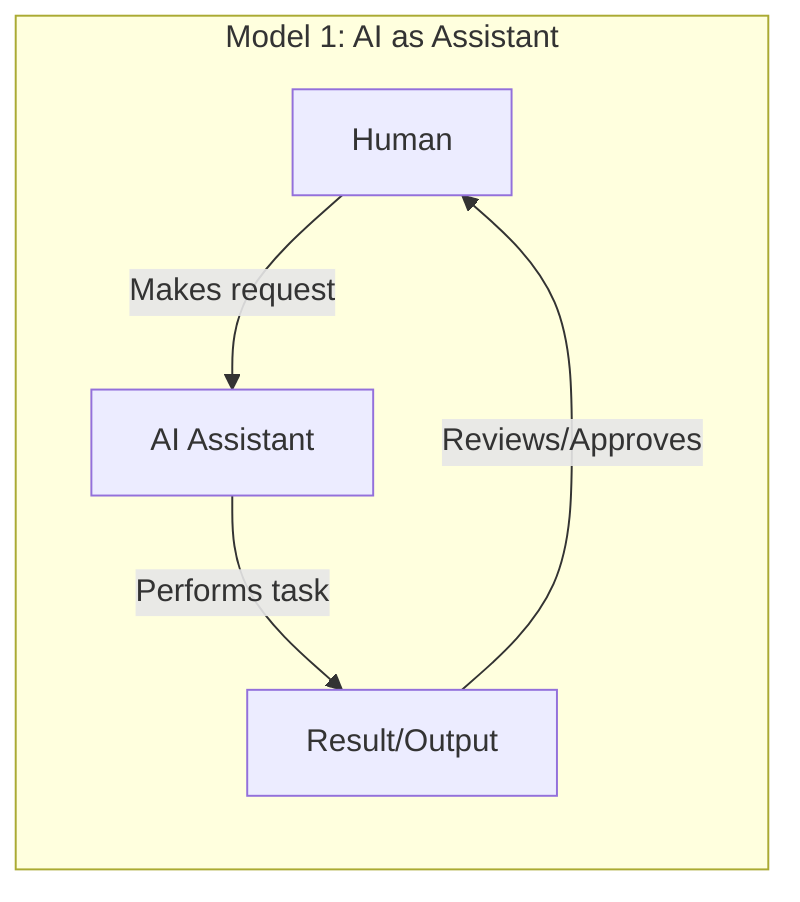
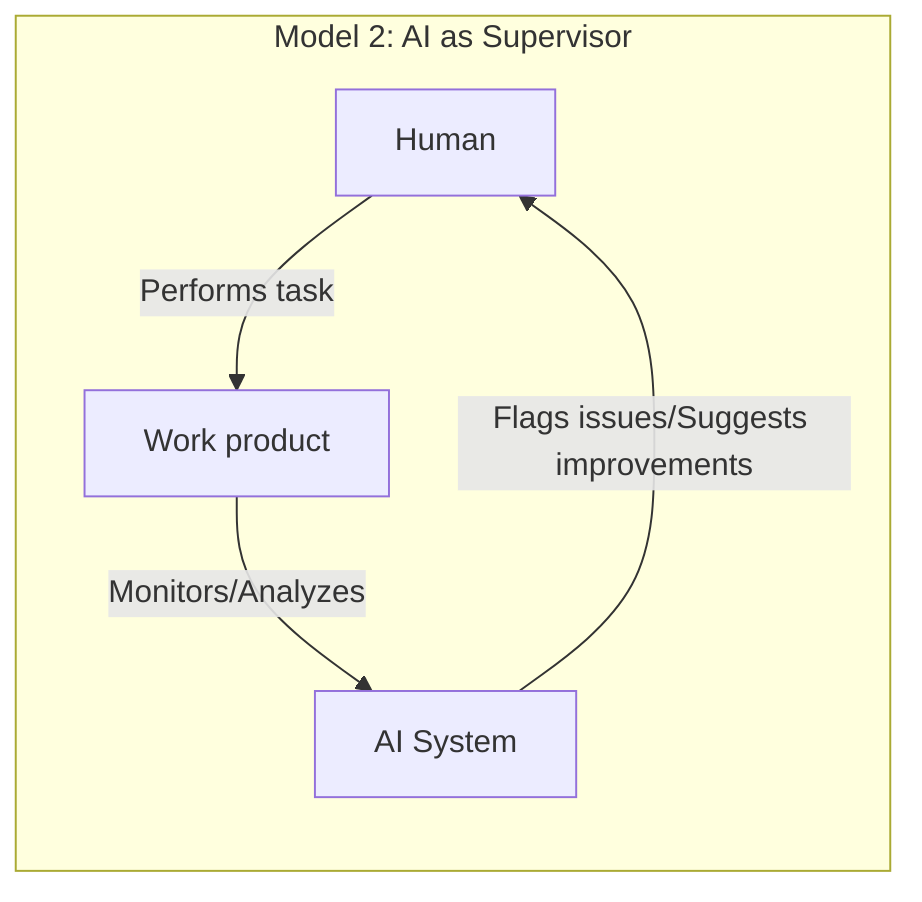
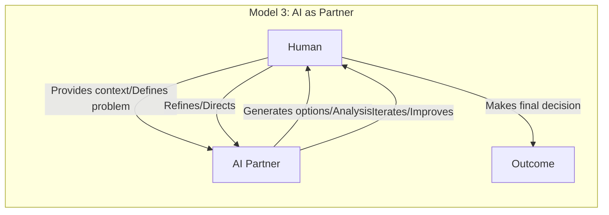

# 9. Adapting to AI: People, Theories, and Practice

## 9.1 Introduction

Having examined AI's direct impact on organizational models, structures, communication, and estimation in the previous chapter, this chapter shifts focus to the human, theoretical, and practical dimensions of adapting to AI integration. We will explore the evolving skill requirements and roles within AI-augmented organizations, the dynamics among stakeholders, relevant theoretical frameworks for understanding these shifts, and insights gleaned from real-world case studies of AI adoption.

## 9.2 The Evolution of Skills, Roles, and Stakeholder Dynamics

### 9.2.1 Shifting Skill Requirements

The integration of AI into organizational processes is catalyzing a substantial shift in the skills demanded of professionals at all levels. We are witnessing not merely an evolution but a fundamental reconfiguration of the skill landscape, with certain capabilities becoming exponentially more valuable while others face automation.

As AI takes over more routine tasks, the demand for skills often considered uniquely human, such as emotional intelligence, creativity, critical thinking, and adaptability, may grow. Roles requiring analytical thinking, creative problem-solving, and interpretation of complex information could become more prominent. 

**Creative Thinking and Problem-Solving**  
As AI increasingly handles routine analytical tasks, uniquely human creative thinking becomes more valuable. The ability to generate truly novel ideas, approach problems from unconventional angles, and connect disparate concepts in innovative ways represents a distinctly human advantage. AI may augment creative processes, but the initial spark of truly innovative thinking remains a human domain.

Furthermore, effective collaboration with AI tools may necessitate a certain level of AI literacy for many employees. Organizations might need to invest in training and development to help their workforce acquire these skills and adapt to AI-augmented workplaces.

### 9.2.2 Transformation of Traditional Roles

AI integration can enable a redefinition of traditional roles, potentially making them more dynamic. By automating routine tasks, AI may allow employees to shift focus towards more strategic or creative work aspects. For instance, customer service representatives might transition from handling basic inquiries (potentially handled by chatbots) to resolving more complex issues requiring empathy and problem-solving. Similarly, in fields like finance or marketing, AI might take over some data analysis and reporting, allowing professionals to concentrate more on strategic decision-making or campaign development. Alongside the evolution of existing roles, AI integration is leading to the creation of new roles (e.g., data scientists, machine learning engineers, AI ethicists, AI trainers) reflecting specialized skills needed to develop, implement, and govern AI technologies.

Recent research on human-AI teaming has highlighted the need to view AI not merely as tools but as potential team members that collaborate with humans to accomplish shared goals (Berretta et al., 2023). This human-centered perspective recognizes that effective integration requires understanding both human factors (trust, cognitive load, attitudes) and technological capabilities in designing collaborative work systems. Rather than simply substituting human labor, the most effective AI implementations complement human capabilities and create synergies that transform the nature of roles.

The following diagrams illustrate three common models of human-AI collaboration emerging in organizations, which align with patterns identified in recent research on human-AI teaming (Berretta et al., 2023):

These models represent a spectrum of integration approaches, from AI serving as a tool directed by humans to more collaborative partnerships where humans and AI systems iteratively work together to solve complex problems. The "AI as Partner" model in particular illustrates the concept of human-AI teaming where complementary capabilities are leveraged to achieve outcomes neither could accomplish alone. Research suggests that these different models may be appropriate for different contexts depending on task characteristics, human factors, and required levels of AI explainability (Berretta et al., 2023).

### 9.2.3 Evolving Stakeholder Dynamics

AI integration impacts preferences and potential tensions among stakeholders. Management may prioritize efficiency gains and cost savings from AI, while technical staff might focus on implementation challenges and opportunities. Employees may have concerns about job displacement or the need for new skills. Customers could benefit from personalized or efficient AI-powered services but might have concerns about data privacy or impersonal interactions. The introduction of AI as an influencing factor in organizational processes adds complexity to stakeholder dynamics. Navigating these dynamics may require proactive stakeholder engagement, transparent communication about AI integration goals and implications, and addressing concerns related to job security, ethics, and overall impact.

## 9.3 Theoretical Frameworks for Understanding AI's Role

Building upon the theoretical frameworks for AI-augmented organizations introduced in Section 3.6.4, this section expands our conceptual toolkit with additional perspectives particularly relevant to the human and practical dimensions of AI integration.

### 9.3.1 New Institutional Theory

New institutional theory offers a framework for understanding AI's role, viewing AI not just as technology but also as a product of and force within institutional environments. This perspective allows analysis of how societal norms, cultural values, and assumptions influence AI adoption and implementation. Concepts like algorithmic isomorphism (increasing similarity across fields due to AI algorithm adoption) and algorithmic legitimacy (social acceptance of AI in organizational practices) become relevant. Applying this theory helps explore how organizations respond to institutional pressures to adopt AI, how AI shapes structures and practices towards emerging norms, and how AI gains legitimacy as an organizational tool.

This institutional perspective complements the Sociotechnical AI Integration Model introduced in Section 3.6.4 by examining the broader social forces that shape how organizations implement the technical-social boundaries discussed in that framework.

### 9.3.2 Cybernetics and Systems Thinking

Cybernetics and systems thinking provide lenses for analyzing AI integration. Cybernetics, focusing on communication and control, emphasizes feedback loops, adaptation, and regulation. AI integration can enhance organizational cybernetic aspects by providing potentially more sophisticated feedback mechanisms. AI systems can monitor processes, analyze data, and provide insights, potentially enabling faster adaptation. Systems thinking, focusing on interconnectedness, is useful for comprehending interactions in human-AI hybrid organizations. Viewing organizations as complex adaptive systems helps understand how AI acts as a component influencing feedback loops, communication pathways, and overall organizational behavior and evolution.

The socio-technical perspective identified in research on human-AI teaming (Berretta et al., 2023) strongly aligns with these cybernetic principles. This approach views AI not in isolation but as part of an integrated socio-technical system where human and technological elements must be jointly optimized. Research has identified five distinct clusters of factors influencing human-AI teaming effectiveness, including human variables, task characteristics, AI explainability, AI embodiment, and how AI performance affects human perception (Berretta et al., 2023). These clusters demonstrate the multidimensional nature of human-AI systems and the need to consider both technical and social dimensions in system design.

This sociotechnical systems approach has been further developed into practical frameworks for AI implementation. Salwei and Carayon (2023) propose a comprehensive sociotechnical systems framework for AI integration in healthcare that addresses common implementation challenges. Their research demonstrates how workflow integration failures often result from narrow technical focus rather than holistic system design. Through a case study of clinical decision support implementation, they show how considering the entire work system—including organizational elements (policies, culture), social factors (team dynamics, roles), environmental context, task requirements, and technology design—significantly improves AI adoption and effectiveness. Their framework highlights the critical importance of systematically analyzing all sociotechnical interactions throughout the AI design and implementation process, from needs assessment through continuous improvement. This research underscores that successful AI integration requires not just technical excellence but deliberate attention to how the technology will function within complex human and organizational systems.

While Section 3.6.4's Conway's Law Extension explored how communication patterns between humans and AI systems influence technical architectures, this cybernetic perspective broadens the analysis to examine how these communication patterns function as feedback loops that regulate organizational behavior and adaptation more generally. By understanding these feedback mechanisms, organizations can design AI systems that enhance regulatory capacity while maintaining human agency and system adaptability.

Effective human-AI teaming requires careful attention to the design of:

1. **Information flows** between human and AI components 
2. **Feedback mechanisms** that enable mutual adjustment
3. **Control structures** that maintain system stability while enabling adaptation
4. **Boundary interfaces** that define appropriate domains for human and AI decision-making

These cybernetic principles provide a theoretical foundation for understanding how AI integration affects organizational dynamics and offer practical guidance for designing human-AI systems that leverage the complementary strengths of both human and artificial intelligence.

### 9.3.3 AI Management Science

The prevalence of AI is contributing to an emerging field sometimes termed AI Management Science. This interdisciplinary area seeks theoretical frameworks for managing human-AI interactions. Drawing from Management Information Systems (MIS), AI Ethics, and Organizational Behavior, it addresses challenges and opportunities of integrating intelligent agents. This field suggests traditional management theories focused on human interactions might be insufficient for complexities introduced by AI's potential autonomy and decision-making capabilities. AI Management Science aims to provide theoretical grounding and practical guidance for optimizing AI use, addressing ethics, and fostering human-AI collaboration.

This emerging discipline provides practical applications for the Cognitive Load Distribution Framework outlined in Section 3.6.4, offering concrete approaches for allocating responsibilities between humans and AI based on their respective cognitive strengths while considering ethical and organizational implications.

## 9.4 Case Studies: Real-World AI Integration Examples

### 9.4.1 Industry-Specific Examples

Organizations across industries integrate AI assistants and agents, yielding diverse outcomes. Examples include:
*   **Manufacturing:** Companies like Toyota and Siemens have used AI platforms enabling workers to deploy ML models or for predictive maintenance and process optimization, reporting efficiency gains.
*   **Logistics:** UPS utilizes AI for route optimization and addressing issues like package theft, aiming for enhanced operational efficiency.
*   **Financial Services:** JPMorgan Chase has applied AI for document parsing and fraud detection, reporting time savings and improved accuracy.
*   **Talent Solutions:** Allegis Group uses AI models to automate aspects of recruitment like candidate profiling.
*   **Customer Service:** Urban Company employed AI chatbots to resolve customer queries, reporting increased satisfaction.
These examples illustrate AI's applicability in various organizational functions.

### 9.4.2 Lessons from Implementations

Analysis of AI integration case studies suggests common themes for success:
*   **Clear Objectives:** Aligning AI initiatives with strategic organizational goals.
*   **User-Centric Design:** Designing AI tools for end-users and smooth workflow integration.
*   **Data Quality & Governance:** Ensuring high-quality, relevant data and robust governance.
*   **Ethical Considerations:** Addressing privacy, bias, and transparency from the start.
*   **Agile & Iterative Approach:** Using iterative development and deployment for continuous improvement.
*   **Change Management:** Employing proactive communication and training to foster adoption.

### 9.4.3 Challenges and Failures in AI Integration

Despite successes, organizations encounter challenges and failures in AI integration. Reports indicate many AI projects may not deliver expected ROI, often due to insufficient organizational readiness or misalignment with business strategy. Poor data quality (insufficient, biased, inconsistent) is a common obstacle hindering successful integration. A lack of strategic vision, treating AI merely as a technology project without business ownership or cross-functional collaboration, can also lead to failure. Ethical concerns, such as algorithmic bias perpetuation (e.g., Amazon's reportedly biased recruiting tool), can have negative consequences and erode trust. These challenges highlight the need for a strategic approach addressing technical, organizational, ethical, and human factors.

## 9.5 Chapter Summary

This chapter explored the human, theoretical, and practical aspects of organizational adaptation to AI. We examined the significant shifts in required skills towards human-centric capabilities like critical thinking and emotional intelligence, alongside the transformation and emergence of new roles driven by AI integration. The evolving dynamics and potential tensions among stakeholders (management, technical staff, employees, customers) in AI-augmented environments were highlighted.

Theoretical frameworks, including New Institutional Theory, Cybernetics/Systems Thinking, and the emerging field of AI Management Science, were presented as lenses to understand the institutional pressures, systemic interactions, and management challenges associated with AI. Finally, real-world case studies provided concrete examples of AI applications across industries, illustrating both common factors in successful implementations (clear objectives, user focus, data governance, ethics, agility, change management) and frequent challenges leading to failure (poor data, lack of strategy, ethical issues). 