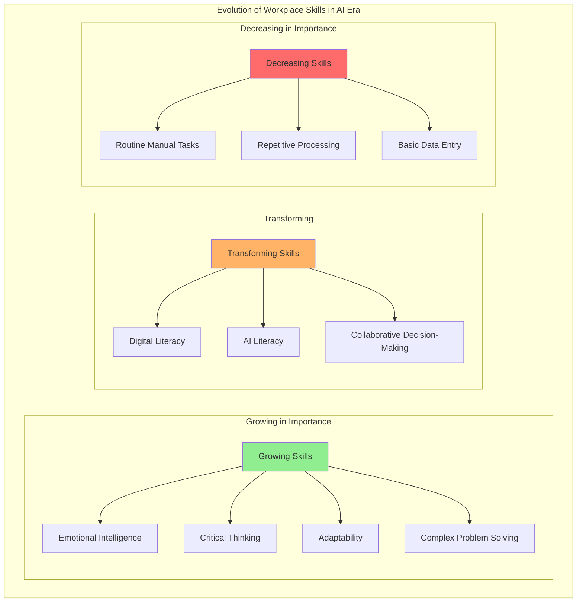
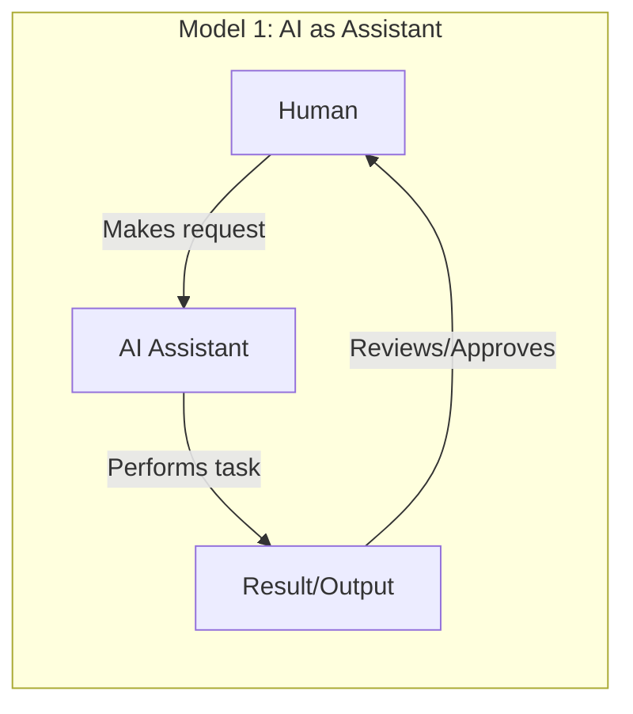
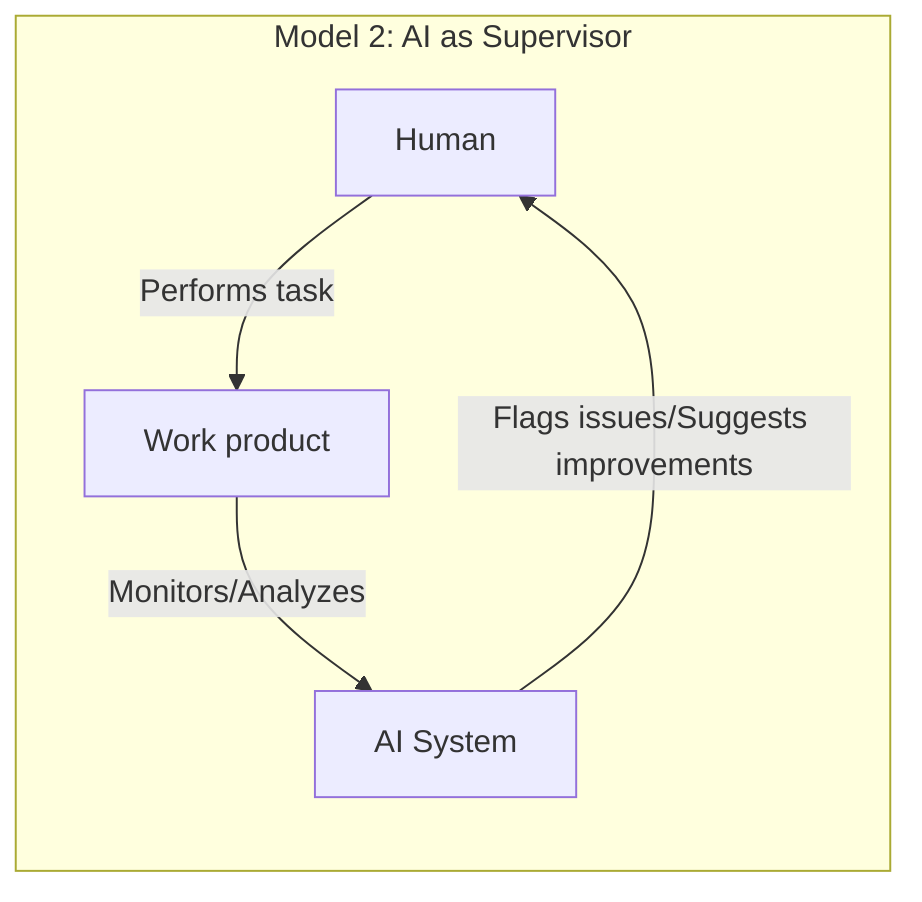
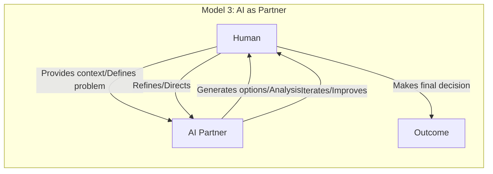
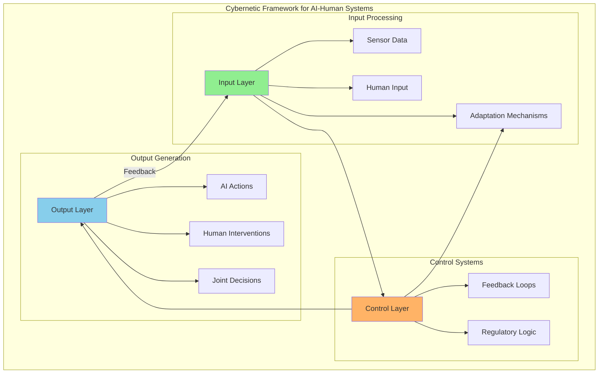
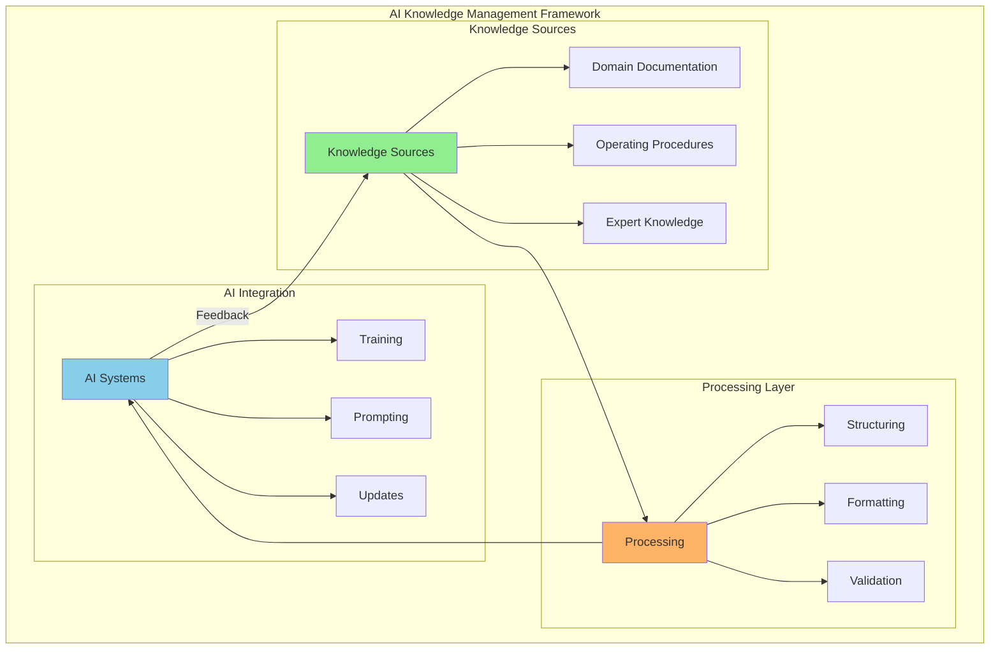
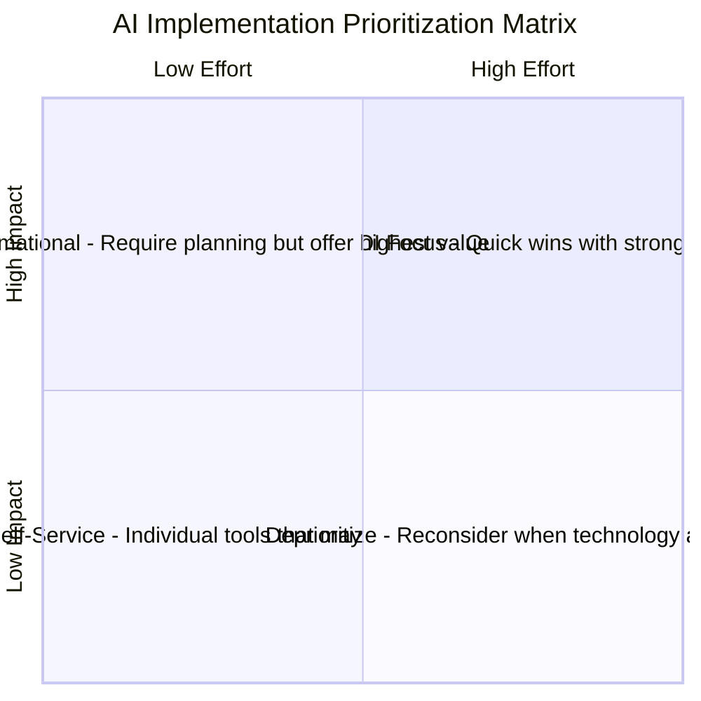
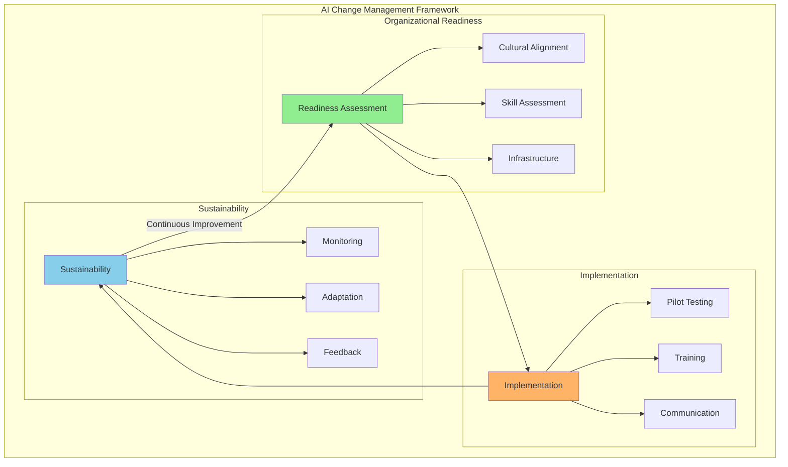
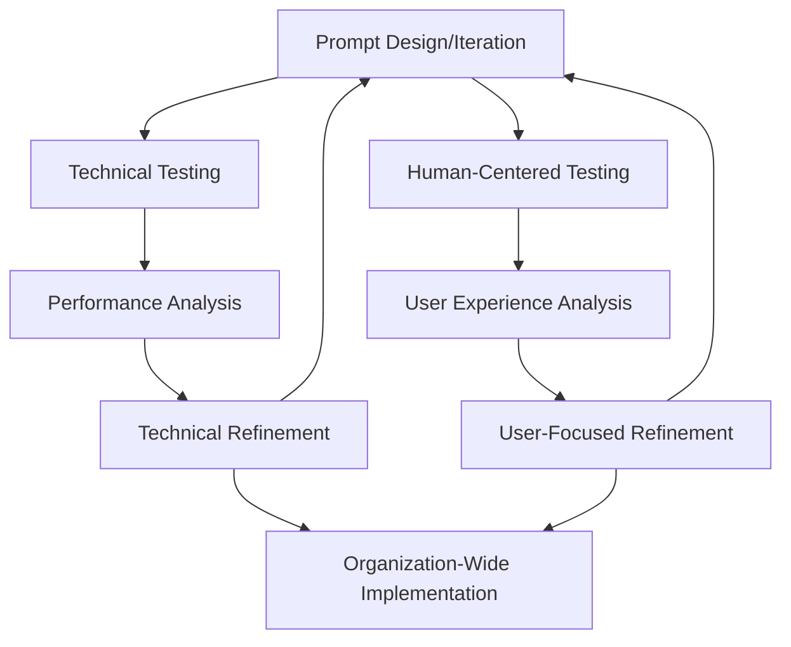

# 9. Adapting to AI: People, Theories, and Practice

// TODO: Ensure strong connection with Chapter 8's organizational foundations:
// - Reference relevant organizational structures and models from Chapter 8 when discussing human adaptation
// - Build on Chapter 8's multi-agent workflow patterns when discussing skill requirements
// - Connect stakeholder analysis to Chapter 8's discussion of organizational changes
// - Maintain consistent theoretical frameworks while expanding human dimensions

## 9.1 Introduction

Having examined AI's direct impact on organizational models, structures, communication, and estimation in the previous chapter, this chapter shifts focus to the human, theoretical, and practical dimensions of adapting to AI integration. We will explore the evolving skill requirements and roles within AI-augmented organizations, the dynamics among stakeholders, relevant theoretical frameworks for understanding these shifts, and insights gleaned from real-world case studies of AI adoption.

## 9.2 The Evolution of Skills, Roles, and Stakeholder Dynamics

// TODO: Expand this section to provide comprehensive coverage of topics only briefly touched in Chapter 8, including:
// - Detailed frameworks for evaluating and developing AI-relevant skills
// - Case studies of successful role transformations in AI-augmented organizations
// - Metrics and assessment tools for tracking skill evolution
// - Best practices for identifying and developing emerging roles

### 9.2.1 Shifting Skill Requirements

// TODO: Add detailed analysis of:
// - Specific technical and non-technical skills required for AI collaboration
// - Learning pathways and development programs
// - Impact of AI on different job functions and levels
// - Skills assessment and gap analysis methodologies

The integration of AI into organizational processes is catalyzing a substantial shift in the skills demanded of professionals at all levels. The following diagram illustrates the evolution of workplace skills in the AI era:

We are witnessing not merely an evolution but a fundamental reconfiguration of the skill landscape, with certain capabilities becoming exponentially more valuable while others face automation.

As AI takes over more routine tasks, the demand for skills often considered uniquely human, such as emotional intelligence, creativity, critical thinking, and adaptability, may grow. Roles requiring analytical thinking, creative problem-solving, and interpretation of complex information could become more prominent. 

**Creative Thinking and Problem-Solving**  
As AI increasingly handles routine analytical tasks, uniquely human creative thinking becomes more valuable. The ability to generate truly novel ideas, approach problems from unconventional angles, and connect disparate concepts in innovative ways represents a distinctly human advantage. AI may augment creative processes, but the initial spark of truly innovative thinking remains a human domain.

Furthermore, effective collaboration with AI tools may necessitate a certain level of AI literacy for many employees. Organizations might need to invest in training and development to help their workforce acquire these skills and adapt to AI-augmented workplaces.

### 9.2.2 Transformation of Traditional Roles

AI integration can enable a redefinition of traditional roles, potentially making them more dynamic. By automating routine tasks, AI may allow employees to shift focus towards more strategic or creative work aspects. For instance, customer service representatives might transition from handling basic inquiries (potentially handled by chatbots) to resolving more complex issues requiring empathy and problem-solving. Similarly, in fields like finance or marketing, AI might take over some data analysis and reporting, allowing professionals to concentrate more on strategic decision-making or campaign development. Alongside the evolution of existing roles, AI integration is leading to the creation of new roles (e.g., data scientists, machine learning engineers, AI ethicists, AI trainers) reflecting specialized skills needed to develop, implement, and govern AI technologies.

Recent research on human-AI teaming has highlighted the need to view AI not merely as tools but as potential team members that collaborate with humans to accomplish shared goals (Berretta et al., 2023). This human-centered perspective recognizes that effective integration requires understanding both human factors (trust, cognitive load, attitudes) and technological capabilities in designing collaborative work systems. Rather than simply substituting human labor, the most effective AI implementations complement human capabilities and create synergies that transform the nature of roles.

The following diagrams illustrate three common models of human-AI collaboration emerging in organizations, which align with patterns identified in recent research on human-AI teaming (Berretta et al., 2023):

These models represent a spectrum of integration approaches, from AI serving as a tool directed by humans to more collaborative partnerships where humans and AI systems iteratively work together to solve complex problems. The "AI as Partner" model in particular illustrates the concept of human-AI teaming where complementary capabilities are leveraged to achieve outcomes neither could accomplish alone. Research suggests that these different models may be appropriate for different contexts depending on task characteristics, human factors, and required levels of AI explainability (Berretta et al., 2023).

### 9.2.3 Evolving Stakeholder Dynamics

// TODO: Significantly expand stakeholder analysis to include:
// - Detailed stakeholder mapping frameworks for AI initiatives
// - Power/interest matrices for AI transformation
// - Communication strategies for different stakeholder groups
// - Change management approaches specific to AI adoption
// - Methods for measuring and monitoring stakeholder sentiment
// - Strategies for building trust and acceptance

AI integration impacts preferences and potential tensions among stakeholders. Management may prioritize efficiency gains and cost savings from AI, while technical staff might focus on implementation challenges and opportunities. Employees may have concerns about job displacement or the need for new skills. Customers could benefit from personalized or efficient AI-powered services but might have concerns about data privacy or impersonal interactions. The introduction of AI as an influencing factor in organizational processes adds complexity to stakeholder dynamics. Navigating these dynamics may require proactive stakeholder engagement, transparent communication about AI integration goals and implications, and addressing concerns related to job security, ethics, and overall impact.

**Key Stakeholder Perspectives and Priorities**

| Stakeholder | Primary Concerns | Potential Tensions | Success Indicators |
|-------------|------------------|---------------------|-------------------|
| **Executive Leadership** | ROI, competitive advantage, risk management | Balancing innovation pressure with implementation practicalities | Strategic alignment, measurable business impact |
| **Technical Staff** | Implementation feasibility, system integration, technical debt | Resource constraints, timeline pressure, quality vs. speed | Technical performance, maintainability, scalability |
| **Department Managers** | Operational efficiency, team productivity, budget constraints | Resistance to workflow disruption, authority redistribution | Process improvements, team adoption, cost reduction |
| **Frontline Employees** | Job security, skill relevance, workload impact | Fear of replacement, learning curve challenges | Enhanced capabilities, reduced tedium, career development |
| **Customers/Clients** | Service quality, personalization, privacy | Human vs. AI interaction preferences | Satisfaction scores, reduced friction, loyalty metrics |

This complex stakeholder landscape creates potential implementation challenges that can push organizations toward either underfitting (implementing overly cautious AI with limited capabilities) or overfitting (creating rigid systems that prioritize certain stakeholder concerns while neglecting others).

**Adaptive Stakeholder Engagement Approaches**

Organizations that successfully navigate these dynamics typically employ a structured approach to stakeholder engagement that evolves across the AI implementation lifecycle:

1. **Planning Phase**: Conduct comprehensive stakeholder mapping and needs assessment, with particular attention to potential resistance points and alignment opportunities
   
2. **Design Phase**: Implement co-creation methodologies that engage diverse stakeholders in system design, establishing shared ownership and addressing concerns proactively

3. **Implementation Phase**: Deploy transparent communication strategies that set realistic expectations, highlight early wins, and acknowledge limitations honestly

4. **Optimization Phase**: Establish feedback mechanisms that capture diverse stakeholder experiences and incorporate them into continuous improvement cycles

These engagement approaches directly impact how well organizations manage the underfitting/overfitting balance, as they determine whether an AI implementation appropriately addresses the full spectrum of stakeholder needs or disproportionately favors certain perspectives.

The stakeholder engagement practices established during initial AI implementation directly connect to the change management frameworks discussed in Section 9.4.7, creating a foundation for the organizational transformations required for successful AI integration.

## 9.3 Theoretical Frameworks for Understanding AI's Role

Building upon the theoretical frameworks for AI-augmented organizations introduced in Section 3.6.4, this section expands our conceptual toolkit with additional perspectives particularly relevant to the human and practical dimensions of AI integration.

### 9.3.1 New Institutional Theory

New institutional theory offers a framework for understanding AI's role, viewing AI not just as technology but also as a product of and force within institutional environments. This perspective allows analysis of how societal norms, cultural values, and assumptions influence AI adoption and implementation. Concepts like algorithmic isomorphism (increasing similarity across fields due to AI algorithm adoption) and algorithmic legitimacy (social acceptance of AI in organizational practices) become relevant. Applying this theory helps explore how organizations respond to institutional pressures to adopt AI, how AI shapes structures and practices towards emerging norms, and how AI gains legitimacy as an organizational tool.

This institutional perspective complements the Sociotechnical AI Integration Model introduced in Section 3.6.4 by examining the broader social forces that shape how organizations implement the technical-social boundaries discussed in that framework.

### 9.3.2 Cybernetics and Systems Thinking

Cybernetics and systems thinking provide lenses for analyzing AI integration. The following diagram illustrates a cybernetic framework for AI-human systems:

Cybernetics, focusing on communication and control, emphasizes feedback loops, adaptation, and regulation. AI integration can enhance organizational cybernetic aspects by providing potentially more sophisticated feedback mechanisms. AI systems can monitor processes, analyze data, and provide insights, potentially enabling faster adaptation. Systems thinking, focusing on interconnectedness, is useful for comprehending interactions in human-AI hybrid organizations. Viewing organizations as complex adaptive systems helps understand how AI acts as a component influencing feedback loops, communication pathways, and overall organizational behavior and evolution.

The socio-technical perspective identified in research on human-AI teaming (Berretta et al., 2023) strongly aligns with these cybernetic principles. This approach views AI not in isolation but as part of an integrated socio-technical system where human and technological elements must be jointly optimized. Research has identified five distinct clusters of factors influencing human-AI teaming effectiveness, including human variables, task characteristics, AI explainability, AI embodiment, and how AI performance affects human perception (Berretta et al., 2023). These clusters demonstrate the multidimensional nature of human-AI systems and the need to consider both technical and social dimensions in system design.

This sociotechnical systems approach has been further developed into practical frameworks for AI implementation. Salwei and Carayon (2023) propose a comprehensive sociotechnical systems framework for AI integration in healthcare that addresses common implementation challenges. Their research demonstrates how workflow integration failures often result from narrow technical focus rather than holistic system design. Through a case study of clinical decision support implementation, they show how considering the entire work system—including organizational elements (policies, culture), social factors (team dynamics, roles), environmental context, task requirements, and technology design—significantly improves AI adoption and effectiveness. Their framework highlights the critical importance of systematically analyzing all sociotechnical interactions throughout the AI design and implementation process, from needs assessment through continuous improvement. This research underscores that successful AI integration requires not just technical excellence but deliberate attention to how the technology will function within complex human and organizational systems.

While Section 3.6.4's Conway's Law Extension explored how communication patterns between humans and AI systems influence technical architectures, this cybernetic perspective broadens the analysis to examine how these communication patterns function as feedback loops that regulate organizational behavior and adaptation more generally. By understanding these feedback mechanisms, organizations can design AI systems that enhance regulatory capacity while maintaining human agency and system adaptability.

Effective human-AI teaming requires careful attention to the design of:

1. **Information flows** between human and AI components 
2. **Feedback mechanisms** that enable mutual adjustment
3. **Control structures** that maintain system stability while enabling adaptation
4. **Boundary interfaces** that define appropriate domains for human and AI decision-making

These cybernetic principles provide a theoretical foundation for understanding how AI integration affects organizational dynamics and offer practical guidance for designing human-AI systems that leverage the complementary strengths of both human and artificial intelligence.

### 9.3.3 AI Management Science

The prevalence of AI is contributing to an emerging field sometimes termed AI Management Science. This interdisciplinary area seeks theoretical frameworks for managing human-AI interactions. Drawing from Management Information Systems (MIS), AI Ethics, and Organizational Behavior, it addresses challenges and opportunities of integrating intelligent agents. This field suggests traditional management theories focused on human interactions might be insufficient for complexities introduced by AI's potential autonomy and decision-making capabilities. AI Management Science aims to provide theoretical grounding and practical guidance for optimizing AI use, addressing ethics, and fostering human-AI collaboration.

This emerging discipline provides practical applications for the Cognitive Load Distribution Framework outlined in Section 3.6.4, offering concrete approaches for allocating responsibilities between humans and AI based on their respective cognitive strengths while considering ethical and organizational implications.

### 9.3.4 Cognitive Load Theory in Human-AI Systems

Cognitive Load Theory, originally developed in educational psychology, has emerged as a crucial theoretical framework for understanding and designing effective human-AI collaborative systems. This theory examines how mental effort is distributed when humans interact with information systems and offers valuable insights for organizations implementing AI technologies.

**Theoretical Foundation**

Cognitive Load Theory posits that human working memory has finite capacity that can be easily overwhelmed when processing complex information. The theory distinguishes between three types of cognitive load:

1. **Intrinsic load** - The inherent complexity of the task itself
2. **Extraneous load** - Unnecessary cognitive burden created by poor design
3. **Germane load** - Productive mental effort that contributes to learning and skill development

In human-AI contexts, this framework provides a theoretical basis for understanding how AI systems can be designed to optimize cognitive load distribution, potentially reducing extraneous load while preserving or enhancing germane load that contributes to human development.

**Applications to Human-AI Collaboration**

Research on cognitive load in AI-augmented environments (Spamer, 2025) has identified several key principles that extend traditional organizational constraints:

1. **Context Switching Optimization**: Human teams face significant cognitive penalties when switching between tasks, while AI agents can potentially handle multiple parallel workstreams without performance degradation. This theoretical distinction suggests new team configurations where AI handles routine context switching while humans focus on sustained, creative problem-solving that benefits from uninterrupted attention.

2. **Social Cognition Boundaries**: Dunbar's Number—the cognitive limit of approximately 150 stable social relationships that humans can effectively maintain (Dunbar, 1992)—has traditionally influenced organizational structure and team size decisions. AI agents, unconstrained by these social limitations, could potentially enable larger or more interconnected team structures while reducing coordination overhead. 

3. **Cognitive Interface Design**: Creating explicit interfaces between human and AI components that optimize for appropriate cognitive load is a key theoretical challenge. These interfaces must balance:
   - Providing sufficient information for effective oversight
   - Filtering unnecessary details that create extraneous load
   - Maintaining appropriate human engagement to prevent skill atrophy

The theoretical implications of Cognitive Load Theory for AI-augmented organizations suggest a fundamental redesign of how work is allocated, how information flows are structured, and how human capacity is optimized. Rather than simply automating tasks, this framework encourages organizations to consider the cognitive implications of different human-AI task distributions.

**Research Directions**

Several critical questions emerge from applying Cognitive Load Theory to human-AI systems:

- How does long-term interaction with AI systems affect human cognitive capacity?
- What cognitive load measurement techniques are most appropriate for human-AI collaborative contexts?
- How can AI systems adapt their information presentation based on detected human cognitive load?
- What are the implications of reduced cognitive load for human skill development and expertise?

Organizations will need to strike a careful balance between leveraging AI's ability to transcend traditional cognitive constraints while preserving the human elements essential for innovation, ethical judgment, and empathic understanding of user needs. This balancing act represents one of the fundamental organizational design challenges of the AI era: creating structures that amplify human capabilities through AI augmentation without undermining the cognitive development that enables effective human contribution and oversight.

## 9.4 Customizing AI Integration: Bridging Theory and Practice

The theoretical frameworks discussed above provide conceptual foundations for AI integration, but translating theory into effective practice requires thoughtful customization approaches. Drawing on emerging implementation research (Cherny, 2025), organizations can develop structured methodologies that enhance AI adoption while maintaining alignment with organizational goals.

### 9.4.1 Knowledge Management for AI Systems

Successful AI integration depends on effectively capturing and communicating organizational knowledge. The following framework illustrates the key components of AI knowledge management:

Organizations showing the highest adoption rates often establish dedicated knowledge repositories that:

- Document domain-specific terminology and workflows
- Capture organizational norms and conventions
- Define common processes and procedures
- Record organizational structure and reporting relationships

These knowledge bases function as contextual foundations that enable AI systems to operate within appropriate organizational boundaries, reducing the need for repetitive knowledge transfer (Cherny, 2025). By reflecting the organization's unique characteristics, these repositories help address the underfitting risk of generic AI implementations that fail to align with specific organizational contexts.

Recent guidance from OpenAI (2024a) outlines a structured approach to creating effective instructions for AI systems, which represents a critical aspect of knowledge management:

1. **Leverage Existing Documents**: Convert established operating procedures, support scripts, or policy documents into LLM-friendly formats. In customer service scenarios, for example, this might involve transforming knowledge base articles into structured instructions.

2. **Break Down Complex Tasks**: Subdivide dense instructions into smaller, more manageable steps to minimize ambiguity and improve AI understanding and execution.

3. **Define Clear Actions**: Ensure each instruction step corresponds to a specific, actionable output, such as requesting particular information from users or calling specific APIs.

4. **Capture Edge Cases**: Anticipate variations in user interactions by including conditional logic for handling incomplete information or unexpected questions.

Organizations can further enhance this process by using advanced AI models to automatically generate structured instructions from existing documentation (OpenAI, 2024a). This approach maintains organizational knowledge continuity while adapting it to formats that optimize AI performance.

### 9.4.2 Capability Management and Governance

A second critical dimension involves deliberately defining boundaries for AI system capabilities. Effective approaches include:

- Creating tiered capability frameworks based on risk profiles
- Defining explicit permission structures for sensitive operations
- Implementing guardrails aligned with regulatory requirements

This approach directly addresses the fundamental tension between underfitting and overfitting in AI integration. Organizations that design these frameworks thoughtfully can achieve an effective balance that maximizes value while maintaining necessary controls (Cherny, 2025).

### 9.4.3 The Customization Spectrum and Feedback Cycles

Organizations must determine their position on the AI customization spectrum, ranging from minimal customization to deeply tailored systems. This positioning should consider:

- The criticality of AI applications to core operations
- Regulatory constraints specific to the industry
- Available resources for customization
- Expected integration timeframes

Regardless of position, successful organizations establish robust feedback mechanisms to continuously refine their approach, creating a dynamic process that evolves as both the organization and AI capabilities mature.

### 9.4.4 Planning for Human Intervention

A critical dimension of effective AI integration is establishing appropriate mechanisms for human intervention. While AI systems can handle many tasks autonomously, thoughtfully designed handoff points between AI and human experts represent a sophisticated approach to balancing automation with human judgment.

OpenAI (2024a) identifies human intervention as "a critical safeguard enabling you to improve an agent's real-world performance without compromising user experience." This is particularly important during initial deployment phases, when AI systems are still building reliability in real-world conditions.

**Primary Triggers for Human Intervention**

Organizations typically establish two categories of triggers for human involvement:

1. **Exceeding Failure Thresholds**: Setting specific limits on AI system retries or actions, after which human intervention is automatically initiated. Examples include:
   - Multiple failed attempts to understand user intent
   - Repeated inability to successfully execute a particular tool or function
   - Circular reasoning patterns that fail to progress toward resolution

2. **High-Risk Actions**: Identifying sensitive, irreversible, or high-impact actions that warrant human oversight. This could include:
   - Transactions above certain financial thresholds
   - Critical decision points in customer journeys (e.g., service cancellations)
   - Actions that might have significant compliance or regulatory implications

**Implementation Approaches**

Effective human intervention systems require both technical implementation and appropriate organizational design. Organizations must consider:

- Clear escalation pathways that define which human experts should be engaged for different scenarios
- Appropriate context transfer mechanisms that provide human interveners with the full background
- Feedback loops that use human interventions as training opportunities to improve AI system performance

This balance between automation and human oversight directly addresses the underfitting/overfitting tension. Over-reliance on human intervention (indicative of an underfit AI system) creates inefficiency, while insufficient human oversight (suggesting an overfit system with excessive autonomy) may introduce unacceptable risks (OpenAI, 2024a).

The appropriate balance evolves over time, with organizations typically reducing human intervention as AI systems demonstrate reliability in specific domains, while maintaining oversight for high-consequence actions. This graduated approach represents a sophisticated implementation of the underfitting/overfitting framework in practical organizational contexts.

OpenAI's (2024b) own internal approach to automation provides instructive principles for establishing this balance. Rather than accepting inefficient processes as inevitable, they recommend "setting bold automation goals from the start." Their internal automation platform processes hundreds of thousands of tasks monthly by embedding AI directly into existing workflows. This approach focuses on automating routine work while deliberately preserving human involvement for high-impact decisions.

Organizations establishing human intervention frameworks should consider:

1. **Bold Initial Vision**: Setting ambitious automation targets while identifying critical decision points requiring human judgment
2. **Continuous Calibration**: Regularly reviewing which tasks can be fully automated versus those requiring oversight
3. **Metrics-Driven Approach**: Tracking both automation rates and quality metrics to drive continuous improvement

This balanced approach recognizes that effective AI integration isn't about removing humans from processes entirely, but rather creating a symbiotic relationship where each contributes their unique strengths.

### 9.4.5 Model Customization and Fine-Tuning

A powerful approach to optimizing AI for organizational contexts involves customizing and fine-tuning models to specific domain requirements. OpenAI (2024b) describes this approach as moving from "a store-bought suit" to "the tailored option" - enhancing model performance by training on an organization's unique data and requirements.

The case of Lowe's, a Fortune 50 home improvement retailer, illustrates the significant impact of this approach. As described by OpenAI (2024b), Lowe's faced challenges with inconsistent product data across thousands of suppliers, creating difficulties in accurate ecommerce search functionality. By fine-tuning AI models on their specific product data, they achieved remarkable improvements:

- Product tagging accuracy improved by 20%
- Error detection improved by 60%

This customization effort had a substantial business impact given the scale of Lowe's operations and the critical importance of search functionality to their digital customer experience. As Nishant Gupta, their Senior Director of Data, Analytics and Computational Intelligence noted, "Excitement in the team was palpable when we saw results from fine-tuning... We knew we had a winner on our hands!" (OpenAI, 2024b).

**Implementation Approach**

Organizations considering model customization should evaluate several key dimensions:

1. **Improved Accuracy**: Fine-tuning on domain-specific data (product catalogs, internal knowledge bases, specialized terminology) can significantly enhance relevance and precision
2. **Domain Expertise**: Custom models better understand industry-specific terminology, standards, and context
3. **Consistent Style**: Ensuring outputs maintain appropriate tone, formatting, and organizational conventions
4. **Efficiency Gains**: Reducing the need for extensive prompting or output editing

The customization approach directly addresses the core underfitting/overfitting tension. Generic models (underfit to organizational contexts) may miss critical domain-specific nuances, while excessive customization could potentially create overfit models that perform poorly on edge cases or novel situations not represented in training data.

Organizations should approach customization as an iterative process, beginning with well-defined use cases where domain specificity is particularly valuable. The implementation should include:

- Clear definition of success metrics relevant to business objectives
- Selection of appropriate training data representative of actual usage scenarios
- Testing in controlled environments before broader deployment
- Ongoing evaluation to ensure performance improvements persist over time

This customization capability represents a significant evolution in how organizations can optimize AI systems for their specific needs, potentially creating substantial competitive advantages through more relevant, accurate, and context-aware AI applications.

### 9.4.6 Identifying and Prioritizing AI Use Cases

A key challenge for organizations implementing AI is determining where to focus their efforts among countless potential applications. Recent guidance from OpenAI (2024c) suggests a structured approach to identifying and prioritizing use cases, focused on addressing three common workplace challenges:

1. **Repetitive, Low-Value Tasks**: Activities that consume time but add minimal strategic value
2. **Skill Bottlenecks**: Areas where work slows due to limited expertise or resource constraints
3. **Navigating Ambiguity**: Situations where progress stalls due to uncertainty about next steps

These challenge areas provide a practical lens for identifying AI opportunities across all organizational functions, helping teams move beyond general use cases to specific applications that address their unique pain points.

**Teaching Teams to Identify Opportunities**

Organizations that successfully scale AI adoption often implement formal programs to teach teams how to identify and develop high-impact use cases. OpenAI (2024c) describes Estée Lauder's "GPT Lab" as an exemplar of this approach, using cross-disciplinary teams (including business users, subject matter experts, and technical leads) to identify, develop, and scale AI applications.

Their process follows a structured methodology:
1. **Design**: Defining purpose, scope, and audience in a concise brief
2. **Prepare**: Gathering relevant data to inform the AI implementation
3. **Build and Test**: Creating the AI application and validating its performance
4. **Launch**: Deploying the solution with appropriate user guidance
5. **Pivot and Scale**: Establishing feedback loops to iterate and improve

This methodology embodies the iterative, feedback-driven approach to AI integration discussed throughout this work, emphasizing the importance of continuous learning and adaptation.

**Prioritization Framework**

To prioritize among identified opportunities, OpenAI (2024c) recommends an Impact/Effort Framework that maps potential AI applications along two dimensions:

This framework encourages organizations to:
- Begin with "High ROI Focus" use cases to build momentum and demonstrate value
- Scale successful self-service applications across departments when value is proven
- Invest in transformational initiatives only after establishing foundational capabilities

By systematically evaluating potential AI applications through this framework, organizations can develop implementation roadmaps that balance quick wins with strategic, long-term transformation goals.

**Integrating with Existing Frameworks**

This prioritization approach complements the underfitting/overfitting framework by addressing a critical implementation question: how to sequence the development of AI capabilities to optimize organizational learning and value realization. Starting with high-impact, low-effort applications provides organizations with valuable experience and feedback before tackling more complex implementations that might require greater specialization (and risk overfitting).

Similarly, beginning with self-service applications allows individual teams to develop familiarity with AI capabilities before attempting to integrate them into critical organizational workflows, addressing a common adoption challenge where ambitious but poorly understood implementations lead to failure.

As organizations gain experience with AI implementation, they can gradually shift toward more sophisticated applications, using the lessons learned from earlier initiatives to inform the appropriate balance between generalization and specialization in more complex domains.

### 9.4.7 Change Management and Talent Implications for AI Agent Systems

As organizations progress from experimental AI implementations to more sophisticated agent-based systems, they face significant challenges beyond the technical aspects of deployment. The following framework illustrates the key components of AI change management:

McKinsey (2025) identifies change management as a critical success factor, noting that scaling AI agents is "much broader than simply rolling out a new set of tools" and requires organizations to "rewire how functions work" to realize the full value of these systems.

**Change Management Framework for AI Agent Deployment**

Successful AI agent implementations require a comprehensive change management approach that addresses several key dimensions:

1. **Building Trust**: McKinsey (2025) identifies trust-building as "a big hurdle in adopting AI agent technology," noting that even digitally native generations still prefer human interaction for certain high-value exchanges. Organizations must establish trust through:
   - Implementing error-checking architectures that validate agent outputs before sharing them
   - Creating transparency about agent capabilities and limitations
   - Establishing clear escalation paths for users who encounter agent limitations

2. **Operating Model Adjustments**: Organizations need to reconfigure how teams and departments function to incorporate AI agents effectively. This includes:
   - Redesigning workflows to leverage agent capabilities
   - Adjusting reporting structures to support small, iterative teams
   - Establishing new coordination mechanisms between human and AI contributors

3. **Technology Integration**: Existing systems may require modification to work effectively with AI tools based on machine learning and generative AI. This involves:
   - Creating appropriate APIs and data access mechanisms
   - Ensuring appropriate security controls
   - Developing monitoring systems to track agent performance

**Talent Strategy for the Age of AI Agents**

The widespread deployment of AI agents has profound implications for organizational talent strategies. McKinsey (2025) notes that organizations must "rethink their talent strategy and reskilling programs" as they scale agent-based approaches. This reconsideration should address several key areas:

**1. Skill Evolution and Reskilling**

Organizations need to develop comprehensive approaches to help employees build the skills needed to work effectively with AI agents:

- **AI Literacy**: Ensuring employees understand AI capabilities and limitations to form appropriate mental models of how agents function
- **Prompt Engineering**: Teaching employees to craft effective instructions for AI systems
- **Critical Evaluation**: Developing skills to assess AI outputs for quality, bias, and appropriateness
- **Collaborative Intelligence**: Building capabilities for human-AI teamwork and determining appropriate task allocation

**2. Role Transformation**

As AI agents take on specific activities, human roles will evolve in response:

- **Supervisory Roles**: Emergence of positions focused on monitoring and guiding AI systems
- **Exception Handling**: Greater emphasis on addressing complex edge cases that agents cannot resolve
- **Strategic Focus**: Shift toward higher-order tasks requiring uniquely human capabilities
- **Agent Development**: New roles centered on creating, refining, and maintaining AI agents

**3. Incentive Structures**

Traditional incentive models may not effectively promote the adoption of AI agent technologies. Organizations should consider:

- **Rewarding Collaboration**: Creating incentives for effective human-AI teamwork
- **Encouraging Experimentation**: Promoting exploration of new agent applications
- **Measuring New Outcomes**: Establishing metrics that capture the value of human-AI partnerships
- **Supporting Knowledge Sharing**: Incentivizing the documentation and sharing of effective agent interactions

**Implementation Considerations**

The transition to an organization populated by both human employees and AI agents requires thoughtful planning. McKinsey (2025) suggests several practical approaches for this journey:

1. **Start with Augmentation**: Focus initially on how agents can augment human capabilities rather than replace roles entirely
2. **Establish Clear Boundaries**: Define appropriate domains for agent autonomy versus human oversight
3. **Create Feedback Loops**: Develop mechanisms for continuous improvement based on human-agent interactions
4. **Build a Learning Culture**: Foster an environment where both humans and AI systems continuously improve through interaction

This human-centered approach to AI agent deployment directly addresses the underfitting/overfitting tension discussed throughout this work. By thoughtfully designing the human-AI boundary and creating appropriate mechanisms for collaboration, organizations can avoid both underutilizing AI capabilities (underfitting) and creating overly rigid or inappropriate automation (overfitting). The result is a more adaptive organization that effectively leverages both human judgment and AI capabilities.

### 9.4.8 Prompt Testing and Evaluation Frameworks

As organizations integrate AI systems across their operations, ensuring the quality and effectiveness of human-AI interactions becomes a critical concern. While Chapter 8 explores prompt engineering as an organizational capability and outlines foundational techniques, this section focuses on the human and practical dimensions of testing and evaluating prompts in operational contexts.

#### The Human Challenge of Prompt Quality Assurance

Organizations implementing AI systems face significant challenges related to ensuring consistent quality in human-AI interactions:

1. **Performance Variability** - Minor changes in how humans frame instructions can dramatically affect AI output quality
2. **User Experience Inconsistency** - Different stakeholders may receive varying quality of AI assistance based on their prompting skills
3. **Governance Risk** - Without proper evaluation, potentially problematic AI outputs may reach stakeholders

These challenges reflect the broader organizational tension between underfitting (too little governance of AI interactions) and overfitting (excessive constraints that limit AI utility). Finding the appropriate balance requires systematic approaches to prompt evaluation that address both technical and human dimensions.

#### Building Human-Centered Testing Practices

Effective prompt testing approaches must acknowledge the sociotechnical nature of AI systems, considering both technical performance and human interaction patterns. Organizations should develop testing methodologies that reflect this dual nature:

**Comprehensive Documentation**

Organizations should maintain structured records that capture both the technical and human dimensions of prompt development:

| Documentation Element | Description | Human-Centered Focus |
|----------------------|-------------|----------------------|
| Prompt Identifier | Unique ID and version | Enables communication across teams |
| User Context | Intended users and use cases | Clarifies human needs being addressed |
| Complete Prompt Text | Full instruction text | Preserves exact wording for analysis |
| User Experience Metrics | Satisfaction and usability measures | Assesses human perception of value |
| Iteration History | Evolution of the prompt over time | Shows responsiveness to user feedback |

This documentation serves several purposes beyond technical governance: it facilitates knowledge sharing across teams, enables continuous improvement, and helps build institutional understanding of effective human-AI interaction patterns.

**Human-Centered Testing Approaches**

Organizations should implement testing methodologies that acknowledge the collaborative nature of human-AI systems:

**Comparative User Testing**
- Having diverse users test alternative prompt formulations
- Observing how different stakeholders interpret and respond to AI outputs
- Identifying variations in effectiveness across user groups

**Contextual Testing**
- Evaluating prompts in realistic usage environments
- Assessing integration with established workflows
- Identifying potential barriers to adoption or usability

**Longitudinal Assessment**
- Tracking how prompt effectiveness evolves over time
- Assessing how user behaviors adapt to AI capabilities
- Identifying potential skill development needs

These methodologies extend beyond technical performance testing (detailed in Chapter 8) to address the human dimensions of AI integration, including user experience, adoption patterns, and skill development needs.

#### Evaluation Criteria Beyond Technical Performance

While technical criteria (see Section 8.8.6) remain important, organizations should establish additional evaluation criteria focused on the human dimensions of prompt performance:

**Human-Centered Criteria**
- **Learnability**: How easily users can develop effective prompting skills
- **Consistency**: Reliability of experience across different user groups
- **Transparency**: Clarity about AI capabilities and limitations
- **Trust**: User confidence in the AI's outputs over time

**Organizational Criteria**
- **Alignment**: Support for organizational culture and values
- **Accessibility**: Usability across diverse stakeholder groups
- **Adaptability**: Ability to evolve as organizational needs change
- **Scalability**: Effectiveness when deployed across the organization

These criteria reflect the sociotechnical nature of AI systems, acknowledging that technical performance alone is insufficient for successful organizational integration.

#### Practical Implementation Steps

Organizations implementing prompt testing frameworks should focus on integrating technical and human considerations through several practical steps:

1. **Collaborative Design** - Bringing together technical experts and end-users in prompt development
2. **Staged Deployment** - Testing prompts with progressively larger user groups before full-scale implementation
3. **Feedback Mechanisms** - Creating structured channels for users to report AI interaction challenges
4. **Continuous Education** - Developing resources to help users improve their prompting skills over time
5. **Community Building** - Fostering knowledge sharing about effective prompting practices across teams

These steps help organizations bridge the gap between technical capabilities and practical implementation, creating an environment where humans and AI systems can effectively collaborate to achieve organizational goals.

By developing robust testing and evaluation frameworks that address both technical and human dimensions, organizations can improve the consistency, quality, and value of AI interactions while managing the risks associated with AI deployment.

## 9.5 Case Studies: Real-World AI Integration Examples

The theoretical frameworks and practical approaches outlined in preceding sections come to life through real-world implementations across diverse industries. These case studies demonstrate how organizations are navigating the complexities of AI integration, balancing the technical capabilities of AI systems with the human, organizational, and ethical dimensions discussed throughout this chapter. By examining both successes and challenges, we can identify patterns that illustrate how the principles of effective AI integration manifest in practice and extract insights applicable to organizations at various stages of their AI journey.

### 9.5.1 Industry-Specific Examples

Organizations across industries integrate AI assistants and agents, yielding diverse outcomes. Examples include:
*   **Manufacturing:** Companies like Toyota and Siemens have used AI platforms enabling workers to deploy ML models or for predictive maintenance and process optimization, reporting efficiency gains.
*   **Logistics:** UPS utilizes AI for route optimization and addressing issues like package theft, aiming for enhanced operational efficiency.
*   **Financial Services:** JPMorgan Chase has applied AI for document parsing and fraud detection, reporting time savings and improved accuracy.
*   **Talent Solutions:** Allegis Group uses AI models to automate aspects of recruitment like candidate profiling.
*   **Customer Service:** Urban Company employed AI chatbots to resolve customer queries, reporting increased satisfaction.
These examples illustrate AI's applicability in various organizational functions.

### 9.5.2 Theoretical Analysis of Implementation Examples

**Manufacturing: Cybernetics and Systems Thinking in Action**

Toyota and Siemens exemplify the application of cybernetic principles (Section 9.3.2) in their AI implementations. Their predictive maintenance systems demonstrate the feedback loops central to systems thinking:

- Sensor data flows continuously through AI analysis systems
- Machine learning models adapt to emerging patterns in equipment performance
- Human experts receive alerts about potential failures before they occur
- System performance data informs ongoing model refinement

These implementations reflect the "AI as Partner" model described in Section 9.2.2, where human expertise and AI capabilities combine to achieve outcomes neither could accomplish alone. The balanced approach avoids both underfitting (insufficient predictive capabilities) and overfitting (excessive automation without human judgment).

**Logistics: Balancing Standardization and Adaptation**

UPS's implementation of AI for route optimization illustrates the practical application of the underfitting/overfitting framework:

- Standard algorithms provide baseline route recommendations (addressing underfitting)
- Driver expertise and local knowledge modify routes when necessary (preventing overfitting)
- Performance data feeds back into system refinement
- Gradual expansion of AI decision authority as reliability is demonstrated

This approach exemplifies the balanced capability governance framework described in Section 9.4.2, with tiered authority based on demonstrated reliability.

**Financial Services: Institutional Legitimacy and Trust-Building**

JPMorgan Chase's implementation of AI for document processing and fraud detection demonstrates key principles from New Institutional Theory (Section 9.3.1):

- Progressive implementation beginning with lower-risk applications
- Transparent AI decision processes to satisfy regulatory requirements
- Clear human oversight mechanisms for high-consequence decisions
- Formal validation procedures that align with industry compliance standards

Their approach illustrates how organizations in highly regulated industries must carefully navigate institutional pressures while introducing AI innovations—directly addressing the stakeholder dynamics outlined in Section 9.2.3.

**Talent Solutions: Human-AI Collaboration Models**

Allegis Group's use of AI in recruitment showcases the evolution of roles described in Section 9.2.2:

- AI systems automate initial candidate screening and matching
- Human recruiters focus on relationship building and candidate experience
- The distinction between automated and human-led processes is transparent to candidates
- Structured feedback mechanisms help refine AI recommendations over time

This implementation demonstrates the practical application of the human-centered testing frameworks discussed in Section 9.4.8, with particular attention to how different stakeholders experience and interact with AI systems.

**Customer Service: Change Management and Talent Implications**

Urban Company's implementation of AI chatbots exemplifies the change management framework outlined in Section 9.4.7:

- Phased deployment starting with simple queries before progressing to complex interactions
- Comprehensive agent training on when and how to collaborate with AI systems
- Clear escalation pathways from AI to human agents
- Incentive structures that reward effective human-AI collaboration

Their approach directly applies the trust-building principles discussed in Section 9.2.3, recognizing that successful AI integration requires attention to both technical capabilities and human acceptance factors.

### 9.5.3 Implementation Patterns and Best Practices

Analysis of successful AI integration cases reveals common patterns that align with the theoretical frameworks and practical approaches outlined in this chapter:

**Clear Objectives and Strategic Alignment**

Organizations achieving the greatest impact from AI implementation establish explicit connections between AI initiatives and strategic organizational goals—directly addressing the value alignment principle of the Sociotechnical AI Integration Model (Section 3.6.4).

Successful implementations consistently demonstrate:
- Specific business outcomes targeted by AI initiatives
- Clear metrics for measuring success beyond technical performance
- Executive sponsorship that positions AI as a strategic capability
- Integration with broader digital transformation efforts

**User-Centric Design: Applying Human-AI Teaming Principles**

The most effective implementations embody the human-centered design principles discussed in Section 9.2.2, recognizing AI systems as collaborative partners rather than simply tools or replacements. This approach manifests in:

- Extensive user research before AI deployment
- Iterative prototyping with continuous stakeholder feedback
- Thoughtful workflow integration that leverages complementary capabilities
- Attention to user experience and interaction patterns

These principles directly address the cognitive load distribution considerations outlined in Section 3.6.4, creating systems that optimize the allocation of tasks between humans and AI based on their respective strengths.

**Data Quality and Governance: Knowledge Management in Practice**

Successful implementations demonstrate the knowledge management principles outlined in Section 9.4.1, with particular attention to:

- Structured approaches to data curation and quality assurance
- Clear data governance frameworks that address ethical considerations
- Systematic documentation of domain knowledge and organizational context
- Regular auditing and validation of training data

These practices directly impact an organization's ability to find the appropriate balance between generic AI capabilities (potential underfitting) and overly specialized implementations (potential overfitting).

**Agile and Iterative Implementation: Feedback-Driven Adaptation**

The most effective AI integrations employ the cybernetic principles of feedback and adaptation described in Section 9.3.2:

- Starting with minimum viable implementations that can generate early feedback
- Establishing clear metrics for both technical performance and business impact
- Creating formal mechanisms for continuous learning and improvement
- Maintaining flexibility to pivot based on emergent insights and challenges

This approach reflects the fundamental principle that successful AI integration requires ongoing adaptation rather than rigid adherence to initial implementation plans—a direct application of complexity management principles introduced in Section 3.6.4.

### 9.5.4 Challenges and Failures in AI Integration: Theory-Based Analysis

Despite growing successes, organizations encounter significant challenges in AI integration. Examining these challenges through theoretical lenses provides valuable insights:

**Insufficient Organizational Readiness: Institutional Theory Perspective**

Many AI implementations struggle because organizations fail to establish the institutional foundations necessary for successful integration. Through the lens of New Institutional Theory (Section 9.3.1), these failures often involve:

- Misalignment with existing organizational norms and values
- Insufficient attention to cultural and structural readiness
- Inadequate development of supporting roles and capabilities
- Limited legitimacy-building efforts across stakeholder groups

Amazon's experience with an AI recruiting tool that demonstrated bias against female candidates exemplifies this challenge. The implementation failed in part because it did not adequately address the institutional expectations around fairness and equity in hiring processes—a clear case of technical capabilities outpacing institutional readiness.

**Poor Data Foundations: Knowledge Management Failures**

Inadequate data quality represents a common obstacle to successful AI integration, reflecting failures in the knowledge management approaches outlined in Section 9.4.1:

- Insufficient training data representing organizational contexts
- Inconsistent data structures that limit AI effectiveness
- Biased datasets that lead to flawed outputs
- Inadequate domain knowledge capture and integration

These knowledge management failures directly impact the underfitting/overfitting balance, often resulting in AI systems that either lack essential domain knowledge (underfitting) or perpetuate problematic patterns present in training data (overfitting).

**Strategic-Technical Disconnects: Systems Thinking Gaps**

Many AI initiatives fail due to disconnects between strategic vision and technical implementation—a challenge that cybernetic and systems thinking approaches (Section 9.3.2) are specifically designed to address.

Common manifestations include:
- AI projects initiated without clear business ownership or objectives
- Limited cross-functional collaboration during implementation
- Insufficient attention to system integration requirements
- Failure to consider second-order effects of AI deployment

These challenges highlight the importance of viewing AI implementation through a systems lens that considers the complex interactions between technical, organizational, and human factors—a perspective essential to achieving appropriate balance in AI integration.

**Ethical Blindspots: Sociotechnical Failures**

Ethics-related failures in AI implementation often stem from insufficient attention to the sociotechnical dimensions of AI systems described in Section 9.3.2:

- Inadequate consideration of potential biases in training data
- Limited transparency about AI capabilities and limitations
- Insufficient human oversight of critical AI decisions
- Failure to establish appropriate boundaries for AI autonomy

These failures reflect the particular challenges of managing the underfitting/overfitting balance in ethical dimensions of AI implementation—finding approaches that are neither too rigid (potentially limiting beneficial applications) nor too flexible (potentially enabling harmful outcomes).

The analysis of these challenges reinforces a central theme of this chapter: successful AI integration requires thoughtful attention to the full spectrum of human, theoretical, and practical dimensions. Organizations that approach AI integration solely as a technical challenge, without addressing the complex sociotechnical nature of these systems, are likely to encounter significant implementation obstacles.

## 9.6 Chapter Summary

This chapter explored the human, theoretical, and practical aspects of organizational adaptation to AI. We examined the significant shifts in required skills towards human-centric capabilities like critical thinking and emotional intelligence, alongside the transformation and emergence of new roles driven by AI integration. The evolving dynamics and potential tensions among stakeholders (management, technical staff, employees, customers) in AI-augmented environments were highlighted.

Theoretical frameworks, including New Institutional Theory, Cybernetics/Systems Thinking, and the emerging field of AI Management Science, were presented as lenses to understand the institutional pressures, systemic interactions, and management challenges associated with AI. We explored practical approaches for customizing AI integration through knowledge management and capability governance frameworks. Finally, real-world case studies provided concrete examples of AI applications across industries, illustrating both common factors in successful implementations and frequent challenges leading to failure.

## References

Cherny, B. (2025, April 18). Claude Code: Best practices for agentic coding. Anthropic. https://www.anthropic.com/engineering/claude-code-best-practices

Dunbar, R. I. M. (1992). Neocortex size as a constraint on group size in primates. Journal of Human Evolution, 22(6), 469-493. https://doi.org/10.1016/0047-2484(92)90081-J

OpenAI. (2024a). A practical guide to building agents. https://cdn.openai.com/business-guides-and-resources/a-practical-guide-to-building-agents.pdf

OpenAI. (2024b). AI in the enterprise: Lessons from seven frontier companies. https://cdn.openai.com/enterprise-docs/ai-in-the-enterprise.pdf

OpenAI. (2024c). Identifying and scaling AI use cases: How early adopters focus their AI efforts. https://cdn.openai.com/enterprise-docs/identifying-and-scaling-ai-use-cases.pdf

McKinsey. (2025, March 25). What is an AI agent? McKinsey & Company. https://www.mckinsey.com/featured-insights/mckinsey-explainers/what-is-an-ai-agent

Spamer, A. (2025, January 14). The future of team topologies: When AI agents dominate. Team Topologies. https://teamtopologies.com/news-blogs-newsletters/2025/1/14/the-future-of-team-topologies-when-ai-agents-dominate

Google. (2025). Prompt Engineering. https://cloud.google.com/vertex-ai/generative-ai/docs/learn/prompts 