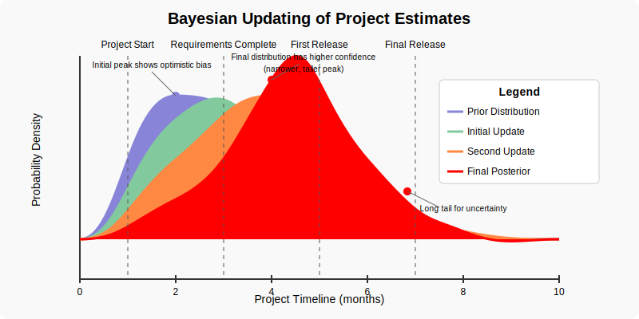

# Interactive Visualizations and Tools

This page provides easy access to all the interactive visualizations, calculators, and tools available in this publication. These tools are designed to help you explore concepts more deeply and apply them to your own scenarios.

## Estimation Tools

### [Three-Point Estimation Calculator](html/three_point_estimation_calculator.html)

This interactive calculator allows you to:
- Input optimistic, most likely, and pessimistic estimates
- See immediate calculations of expected duration and standard deviation
- Compare PERT vs. Triangular distribution methods
- Visualize confidence intervals for your estimates

    

### [Monte Carlo Project Simulation](html/monte_carlo_demo.html)

Explore how Monte Carlo simulation works in project estimation:
- See how task distributions combine to create project forecasts
- Understand how correlations between tasks affect outcomes
- Generate probability-based completion dates
- Visualize sensitivity analysis of project parameters

    

### [Bayesian Project Estimation](html/bayesian_estimation.html)

Watch how Bayesian estimation evolves through a project lifecycle:
- See probability distributions narrow as confidence increases
- Observe how new information updates prior estimates
- Compare initial distributions with posterior distributions
- Understand the mathematical basis for Bayesian updating

    

## Key Concept Visualizations

Throughout the publication, you'll find various visualizations that illustrate important concepts:

1. **[Estimation Biases](chapters/02-software-time-estimation.md#estimation-biases)** - Understanding factors that influence optimistic, most likely, and pessimistic estimates
2. **[Under vs. Over Estimation Tendencies](chapters/02-software-time-estimation.md#three-point-estimation-practical-uncertainty-modeling)** - Factors leading to different types of estimation errors
3. **[Estimation Spectrum](chapters/02-software-time-estimation.md#bridging-simple-and-complex-approaches)** - Progression from simplistic to sophisticated approaches
4. **[Long Tail of Project Risks](chapters/02-software-time-estimation.md#long-tail-of-software-project-risks)** - Distribution of risk frequency and impact
5. **[AI Productivity Variance](chapters/02-software-time-estimation.md#225-estimating-ai-assisted-development-new-uncertainties)** - Comparing development time across task types with AI assistance

## How to Use These Tools

Each tool opens in a new page and is fully interactive. They are designed to:
- Provide hands-on exploration of concepts discussed in the text
- Allow you to input your own parameters and see results
- Help visualize complex statistical concepts
- Serve as practical aids for your own estimation and planning

We recommend experimenting with different inputs to build intuition about how these models behave under various scenarios.

 